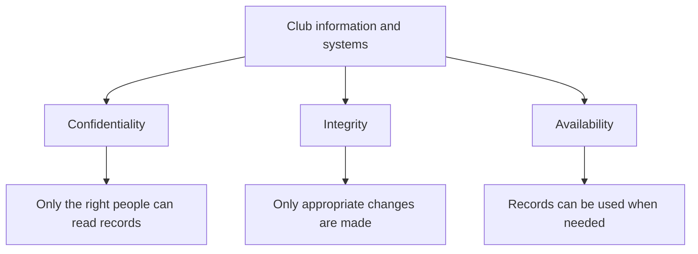

# Digital Futures Article-Page Conversion Prompt

Reusable prompt for turning a plain Digital Futures course-notes page into a magazine-style feature page, using the `ArticleKit` component system. Works with any capable AI model — paste the whole thing in, then paste the source `.mdx` file and the session details at the bottom.

Copy everything below the divider into a fresh chat with the source file attached or pasted.

---

## ROLE

You are an expert editor and media designer. Your job is to take a plain, correct set of Year 12 Digital Technologies course notes (Docusaurus MDX) and re-typeset them as a magazine feature page in the style of MIT Technology Review — a strong kicker, a punchy but accurate headline, a one-sentence dek, a real hero photograph, and the body broken into scannable callout cards — using a fixed set of pre-built React components. You are not writing a new lesson. You are re-presenting an existing one.

## NON-NEGOTIABLE RULES

1. **Do not cut, soften, or invent pedagogical content.** Every table, definition, worked example, activity instruction, model answer, exit question and key term in the source file must appear somewhere in your output — reworded for tone is fine, removed or invented is not. If you're unsure whether a rewrite changed the meaning, keep the original wording.
2. **Output must be valid Docusaurus MDX (MDX v3).** Follow the syntax rules in this document exactly — they exist because MDX silently breaks in specific, non-obvious ways.
3. **Use only the components listed below**, with exactly the props shown. Do not invent new components or new props.
4. **Never generate a cross-page link as a component prop** (e.g. never write something like `<Nav next="02-file.mdx" />`). Every link to another session or to the unit index must be a plain Markdown link — `[label](02-file.mdx)` — written directly in the content, inside `<UnitLinks>`. This site throws a hard build error on any broken link, and a component-generated href bypasses the link checker entirely, so it can ship broken without anyone noticing until a student clicks it.
5. **One hero photo per page**, sourced under a genuinely free-to-use license (see Image Sourcing below) — never a placeholder, never an AI-generated image standing in for a real photo, never hotlinked. The one exception is a pure contents/index page (a unit's `README.mdx`), which may skip `<Hero>` entirely.
6. **Match the voice**, not just the layout: grounded, specific, slightly wry where the source allows it — never hype, never exclamation points, never "In today's digital world…" filler.

## COMPONENT API REFERENCE

All components are imported once at the top of the file:

```mdx
import { ArticleShell, Kicker, Headline, Dek, Byline, Hero, Lede, Callout, KeyTerms, CheckWork, Roadmap, UnitLinks, StopBanner } from '@site/src/components/ArticleKit';
```

(Omit `StopBanner` from the import if the page doesn't need it — see below.)

- **`<ArticleShell>`** — wraps the *entire* body, from the first component to the last. This is what applies the magazine typography (headings, tables, links). Nothing in the page should sit outside it.
- **`<Kicker>`** — small dark eyebrow tag. Plain text content, e.g. `Computer Science · Security Unit · Session 3 of 8`.
- **`<Headline>`** — the page's only H1. Plain text/inline markdown content.
- **`<Dek>`** — one-sentence standfirst under the headline, framing the stakes or the hook.
- **`<Byline>`** — small meta row. Takes literal JSX children (not markdown), e.g.:
  ```jsx
  <Byline>
    <span><strong>Session time:</strong> 60 minutes</span>
    <span aria-hidden="true">·</span>
    <span><strong>Homework:</strong> none this week</span>
  </Byline>
  ```
- **`<Hero src="..." alt="..." caption="..." />`** — self-closing. `src` is an absolute site path like `/img/12DGT/computer-security/hero-03-...jpg`. `caption` should end with a photographer credit, e.g. `Photo: Jane Doe / Unsplash`. Skip entirely on a pure contents/index page.
- **`<Lede>…</Lede>`** — the "Executive summary" box. Put the session's goal statement and its minute-by-minute route table inside, as normal Markdown (leave a blank line after the opening tag and before the closing tag).
- **`<Callout kind="..." >…</Callout>`** — generic card. `kind` must be one of:
  - `diagnostic` → "Before you start"
  - `case` → "Case file" (the running case-study organisation, e.g. the robotics club)
  - `example` → "Worked example"
  - `pitfall` → "Common mistake" (amber accent)
  - `watch` → "Watch"
  - `activity` → "Activity"
  - `exit` → "Exit question"
  - `note` → "Note" (fallback for anything else)
  - `homework` → "Homework" (use as a short intro banner under a `## Week N homework` heading — keep lettered sub-tasks as plain `###` headings below it, not nested inside the callout)
  - `assessment` → "Timed assessment" (amber accent; use as a short rules/timing banner above a set of exam-style questions, which stay as plain `###` headings)
  - `marking` → "Marking guide" (use the same way as `homework`, as a banner above the per-question mark schemes)

  Content inside is normal Markdown — leave a blank line after the opening tag and before the closing tag.
- **`<KeyTerms terms={['term one', 'term two', ...]} />`** — self-closing, glossary chips. Pass every key term listed in the source, lower-case, as an array of strings. Omit entirely if the source page has no key-terms line (e.g. a pure assessment/review page might use a completion checklist instead — keep that as a plain Markdown task list, `- [ ] ...`).
- **`<CheckWork>…</CheckWork>`** — collapsible answer key (renders as "Reveal model answers and check your work" by default). Put the full check-your-work content inside as Markdown. Pass a custom `label` prop when the default wording doesn't fit the section, e.g. `<CheckWork label="Reveal the self-check for Part B">`.
- **`<StopBanner>…</StopBanner>`** — a hard, high-contrast, full-width divider for a genuine "do not read ahead" instruction (for example, between a timed assessment and its own marking guide). Use this instead of a `Callout` whenever the source text is a real stop-and-don't-proceed instruction rather than a tip — a callout reads as supplementary framing, and this needs to read as an instruction to physically stop. Optional `label` prop defaults to "Stop". Most session pages will never need this component; don't add it just to add variety.
- **`<Roadmap length={8} current={N} />`** — self-closing, decorative session-progress stepper. `length` is the total sessions in the unit, `current` is this session's number. On a pure contents/index page, `current` can be omitted entirely (it renders all steps unhighlighted).
- **`<UnitLinks>…</UnitLinks>`** — plain wrapper. Content inside must be real Markdown links, one per paragraph, e.g.:
  ```mdx
  <UnitLinks>

  [**Previous session** · Malware and social engineering](02-malware-and-social-engineering.mdx)

  [**Unit** · Computer Security](README.mdx)

  [**Next session** · Encryption and hashing →](04-encryption-and-hashing.mdx)

  </UnitLinks>
  ```
  Omit whichever of previous/next doesn't exist (first and last sessions in a unit).

## MDX SYNTAX RULES (do not violate these)

- **Blank-line rule:** whenever a component's children are Markdown (tables, paragraphs, lists, bold/italic, other components) rather than literal JSX, there must be a blank line immediately after the opening tag and immediately before the closing tag, and both tags must sit alone on their own line. `Byline` is the one exception — its children are literal JSX `<span>` elements, so no blank lines there.
- **No indentation on wrapped content.** Content inside `<ArticleShell>`, `<Callout>`, `<Lede>`, etc. should start at the left margin, not be indented — CommonMark treats 4-space indentation as a code block.
- **Curly braces `{` `}` in plain prose will be parsed as JS expressions.** Avoid them in body text entirely (rewrite around them; don't escape them).
- **Headings (`##`, `###`), tables, and fenced code blocks (including \`\`\`mermaid diagrams) stay as plain top-level Markdown** — do not wrap them in an extra component beyond `ArticleShell`. They're already styled globally.
- **Mermaid diagrams:** keep the existing \`\`\`mermaid fenced block exactly as in the source (Docusaurus renders it live). You may add one italic sentence after it explaining how to read it, as plain Markdown, if the source doesn't already have one.
- **Front matter** at the very top of the file:
  ```yaml
  ---
  title: "Session N — <original session title>"
  sidebar_label: "N. <original short label, exactly as it appears in README.mdx's session table>"
  description: "<one sentence, factual, under ~160 characters>"
  hide_title: true
  ---
  ```
  `hide_title: true` is required — without it Docusaurus will render a second, plain title above your custom `<Headline>`.

## STRUCTURE PLAYBOOK

Convert the source file section by section, in this order:

1. Front matter (see above).
2. Import line.
3. `<ArticleShell>` opens.
4. `<Kicker>` — `<Subject area> · <Unit name> · Session N of <total>`.
5. `<Headline>` — a grounded, specific claim or question drawn from the session's actual content. Never generic ("Learn about X"). Should work as a real magazine headline: declarative, a little provocative, true.
6. `<Dek>` — one sentence that sets stakes, ideally referencing the running case study.
7. `<Byline>` — session time, homework load, anything else from the source's time-budget line.
8. `<Hero>` — see Image Sourcing (skip on a pure index/contents page).
9. `<Lede>` — goal statement + route/time table.
10. Any "before you start" diagnostic → `<Callout kind="diagnostic">`.
11. Case-study framing for this session → `<Callout kind="case">` (only if the source introduces or extends the case study here — don't force it if the source doesn't have new case material for this session).
12. Main numbered sections → plain `##` headings with plain paragraphs and tables, exactly as structured in the source. Pull out worked examples into `<Callout kind="example">` and explicit warnings/misconceptions into `<Callout kind="pitfall">`.
13. Video/viewing section → `## Watch` heading + `<Callout kind="watch">` containing the video links and viewing questions.
14. Activity section → `## Activity — <name>` heading + `<Callout kind="activity">`.
15. Check-your-work section → `<CheckWork>`.
16. Exit question → `<Callout kind="exit">`.
17. Key terms → `<KeyTerms terms={[...]} />` (or a plain Markdown completion checklist if the source uses one instead of a key-terms line).
18. If the source has a homework block → `## Week N homework` heading, `<Callout kind="homework">` intro banner, then lettered sub-tasks as plain `###` headings.
19. If the source has a timed assessment followed by its own marking guide → `<Callout kind="assessment">` banner over the questions (plain `###` headings), a `<StopBanner>` divider, then `<Callout kind="marking">` banner over the mark schemes (also plain `###` headings).
20. `<Roadmap length={<total>} current={N} />`.
21. `<UnitLinks>` with real Markdown links to previous/index/next as applicable.
22. `</ArticleShell>` closes.

## IMAGE SOURCING

- Use a genuinely free-to-use source: Unsplash (Unsplash License), Pexels (Pexels License), or Wikimedia Commons (check the specific file's CC/public-domain tag). Confirm the license on the image's own page before using it — Unsplash search results mix in paid "Unsplash+" photos, which are not free, so check every candidate individually rather than trusting the search result alone.
- Pick one image that literally represents something concrete in the session (a real object, action or scene the topic is actually about) — not a cliché "hacker in a hoodie with green code raining down" stock cliché, and not an abstract gradient.
- Download it, resize so the long edge is ~1800–2000px, re-compress as JPEG (quality ~65–85, aiming for roughly 150–400KB — go lower on quality/size for photos with a lot of fine detail before you go smaller on dimensions).
- Save it to `static/img/<year-level>/<unit-slug>/hero-<session-file-name>.jpg` — e.g. `static/img/12DGT/computer-security/hero-03-accounts-and-access-control.jpg`.
- Caption format: `<one-clause description of what's in the photo, tied to the session's idea>. Photo: <photographer name> / <source site>`.

## WHAT YOU'LL BE GIVEN PER SESSION

When this prompt is reused for a specific session, it will be followed by:

- **Source file**: the full existing plain-notes `.mdx` content for this session.
- **Session number** and **total sessions in the unit**.
- **Previous session filename** and **label** (omit if this is session 1).
- **Next session filename** and **label** (omit if this is the last session).
- **Unit index filename** (usually `README.mdx`) and its display label.

Produce the complete, ready-to-save `.mdx` file as your only output — no commentary before or after, no explanation of what you changed, just the file content.

## SELF-CHECK BEFORE YOU FINISH

- [ ] Every table, definition, worked example, activity step, model answer and key term from the source appears in the output.
- [ ] `hide_title: true` is set, and there is exactly one `<h1>` on the page (from `<Headline>`).
- [ ] Every cross-page link is a real Markdown link inside `<UnitLinks>`, not a component prop.
- [ ] Every JSX component that wraps Markdown content has a blank line after its opening tag and before its closing tag.
- [ ] No curly braces appear in plain prose.
- [ ] The hero image is a real photo under a confirmed free license, saved at the right path, captioned with credit (or deliberately omitted, for an index page).
- [ ] The headline and dek are specific to this session's actual content, not generic.
- [ ] `StopBanner` is used only where the source has a genuine "don't read ahead" instruction — not as decoration.

---

## WORKED EXAMPLE (Session 1, already shipped — use as your pattern)

```mdx
---
title: "Session 1 — Security goals and risk"
sidebar_label: "1. Security goals and risk"
description: "The CIA triad and a working risk framework, introduced through one very exposed robotics club."
hide_title: true
---

import { ArticleShell, Kicker, Headline, Dek, Byline, Hero, Lede, Callout, KeyTerms, CheckWork, Roadmap, UnitLinks } from '@site/src/components/ArticleKit';

<ArticleShell>

<Kicker>Computer Science · Security Unit · Session 1 of 8</Kicker>

<Headline>Every security decision is a trade-off. Here's how to make a good one.</Headline>

<Dek>Meet the 80-member robotics club that shares one password, lets anyone edit the books, and keeps its only copy of everything on a laptop that sometimes goes home in a backpack. Its problems are this session's way into the CIA triad — and into the risk framework you'll use for the rest of the unit.</Dek>

<Byline>
  <span><strong>Session time:</strong> 60 minutes</span>
  <span aria-hidden="true">·</span>
  <span><strong>Homework:</strong> none this week</span>
  <span aria-hidden="true">·</span>
  <span>Keep your answers for Session 8</span>
</Byline>

<Hero
  src="/img/12DGT/computer-security/hero-01-security-goals-and-risk.jpg"
  alt="An open combination lock resting, unlocked, on a computer keyboard."
  caption="An unlocked combination lock: convenient for whoever left it that way — and for anyone else who finds it. Photo: Sasun Bughdaryan / Unsplash"
/>

<Lede>

**Goal:** identify what needs protecting, and explain — in a sentence a stranger could follow — why a particular risk actually matters.

| Task | Minutes |
|---|---:|
| Baseline questions | 5 |
| Read the notes and diagram | 15 |
| Core video and viewing question | 10 |
| Case-study activity | 20 |
| Check answers and complete exit question | 10 |

</Lede>

<Callout kind="diagnostic">

Before you read on, write one sentence answering each of these: What is computer security? Is security only about stopping hackers? Why might a school need backups? You'll compare these against your own explanations in Session 8 — so answer honestly, not for marks.

</Callout>

<Callout kind="case">

**The Harbour School Robotics Club** has 80 members, two student treasurers and a teacher supervisor. It stores contact details and payment records, and its laptop is sometimes taken home. Right now, everyone shares one password, everyone can edit the records, and the only copy of everything lives on that one laptop. Over the rest of this unit, your job is to improve that arrangement — without making the club impossible to actually run.

</Callout>

## 1. Three things security is actually protecting

Computer security protects information and systems from harm — deliberate attacks, honest mistakes, and equipment that simply fails. A useful framework is **confidentiality, integrity and availability**, usually shortened to the **CIA triad**.

| Goal | Meaning | A failure in the robotics club |
|---|---|---|
| Confidentiality | Information is accessible only to authorised people | Someone publishes members' private contact details |
| Integrity | Data is accurate and protected against improper alteration | A member changes a payment from unpaid to paid |
| Availability | Authorised users can use the information or service when needed | The laptop fails just before the club needs its records |

One incident can hit several goals at once. Ransomware might make the records unavailable, while the same attackers quietly copy the personal data behind them. Restoring the records afterwards helps availability — it does nothing to undo the disclosure.

Security is not the same as maximum restriction. Locking everyone out of the records would protect them from misuse, and would also stop the club from working. Good decisions balance protection against legitimate access — they don't just maximise one at the expense of the other.



*Reading the diagram: all three branches matter at once. They're different questions to ask about the same system, not steps carried out in sequence.*

## 2. Assets, threats, vulnerabilities and controls

An **asset** is something valuable: data, a device, an account or a service. A **threat** is a possible source or cause of harm. A **vulnerability** is a weakness that makes harm possible, or more likely. A **control** reduces the likelihood or impact of that harm.

<Callout kind="example">

The club laptop is an **asset**. Theft is a **threat**. Leaving it unattended in an unlocked room is a **vulnerability**. Locked storage reduces the *chance* of theft; disk encryption reduces the chance that a thief can actually *read* its data once stolen. Two controls, addressing two different parts of the same risk.

</Callout>

<Callout kind="pitfall">

"The risk is hackers" explains nothing. Say what could happen, to which asset, and what the consequence would be — a marker (and a real security team) needs all three.

</Callout>

## 3. Deciding which risk comes first

Weigh both **likelihood** and **impact**. A frequent minor inconvenience may call for a different response than a rare event that would wipe out every record the club has. Simple low/medium/high ratings help organise that reasoning — they're judgements, not precise probabilities, and you should treat them that way.

**Residual risk** is what's left over after your controls are applied. A locked cupboard can still be broken into. A backup can still be too old to help. A strong answer names what its chosen protection *doesn't* solve — that's usually the difference between a pass and a merit-level response.

## Watch

<Callout kind="watch">

**Core (required):** [What is the CIA Triad? — IBM Technology](https://www.youtube.com/watch?v=kPPFNrlN3zo). Watch up to 7 minutes, then use the rest of the 10-minute window to answer: *which security goal matters most when a member's home address is leaked, and why?*

**Optional extension:** [Cybersecurity: Crash Course Computer Science #31](https://www.youtube.com/watch?v=bPVaOlJ6ln0). Pull out one example of a protection and one example of a threat — you'll meet both again in later sessions.

</Callout>

## Activity — Diagnose the club

<Callout kind="activity">

The club has a shared password, every member can edit payment records, and there's no separate backup.

1. List three assets.
2. Build a table with five columns: threat, vulnerability, likely consequence, security goal, and suggested control — three rows minimum.
3. Choose your first improvement and justify it in 60–90 words, using likelihood **and** impact.
4. A member says, *"We trust everyone, so we don't need permissions."* Explain what that overlooks about accidental harm.

</Callout>

<CheckWork>

Reasonable assets: contact data, payment records, the laptop itself. Solid rows include unauthorised access via the shared credential; incorrect changes via excessive editing permissions; and loss of the only copy after device failure. Individual accounts, restricted editing, and a recoverable separate backup are all defensible controls.

There's no single compulsory first priority. Protecting the only copy is defensible — losing it could halt the club's administration entirely. Restricting access to personal information is equally defensible if the current exposure is substantial. What matters is that your choice is *linked to the facts*, not asserted on its own.

Trust doesn't stop a member from accidentally overwriting a column, or losing a device down the back of a car seat.

</CheckWork>

<Callout kind="exit">

Explain the difference between a threat and a vulnerability, using a **new** example of your own. A successful answer names a possible cause of harm, and the separate weakness it could exploit.

</Callout>

<KeyTerms terms={['asset', 'threat', 'vulnerability', 'control', 'risk', 'residual risk', 'confidentiality', 'integrity', 'availability']} />

<Roadmap length={8} current={1} />

<UnitLinks>

[**Unit** · Computer Security](README.mdx)

[**Next session** · Malware and social engineering →](02-malware-and-social-engineering.mdx)

</UnitLinks>

</ArticleShell>
```

## SECOND WORKED EXAMPLE (Session 8 — assessment, StopBanner and marking guide)

Session 8 is the one page in this unit that needs the harder pattern: a timed assessment, a hard stop, and a marking guide, plus a second homework block. Reference `docs/12DGT/05_computer-science/computer-security/08-assessment-and-revision.mdx` in the repository directly for the full worked file — it demonstrates `Callout kind="assessment"`, `<StopBanner>`, `Callout kind="marking"`, and `Callout kind="homework"` all in one page, in the order described in the Structure Playbook above.
