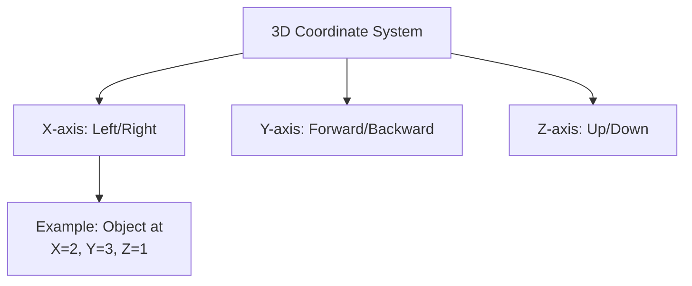
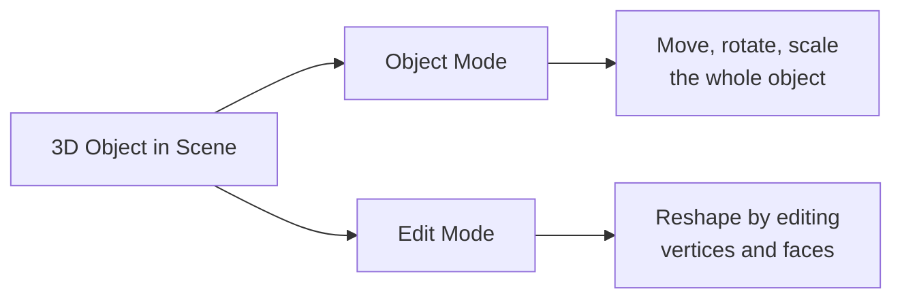

# 3D Space Fundamentals and Blender Basics

**Course:** 10DGTA  
**Unit:** 3D Modelling with Blender  
**Topic:** Introduction to 3D Space and Blender Interface  
**Duration:** 2 days (Days 1–2, Week 1)  
**Aligned Outcome:** Designing & Developing Digital Outcomes—students choose appropriate software and apply file management conventions; understanding of how digital devices represent data

---

## 1. Purpose of These Notes

These notes introduce the **foundational concepts** that everything else in 3D modelling builds on:
- How 3D space works (the coordinate system)
- How Blender represents 3D objects
- How to navigate 3D space
- Where the key tools and panels are in Blender

Without understanding these basics, you'll be confused by every tutorial and frustrated by the software. **Spend time here.** It's worth it.

---

## 2. Key Concepts

- **3D coordinates and axes:** Objects in 3D space are located using three values (X, Y, Z), just like latitude/longitude on Earth
- **Viewport:** The window where you see your 3D scene
- **Object mode vs. Edit mode:** Two different ways of interacting with 3D objects
- **The outliner:** A list of everything in your scene
- **Properties panel:** Where you configure objects, materials, and rendering

If you can't explain what 3D coordinates are and what X, Y, Z represent, reread this section.

---

## 3. Core Explanation

### 3D Coordinates: How Objects Live in Space

Imagine a room. You're standing at the corner where two walls meet the floor.

- **X-axis:** Points to your right (red line in Blender)
- **Y-axis:** Points forward, away from you (green line)
- **Z-axis:** Points upward (blue line)

Any object in the room can be described by three numbers:
- X: How far left or right (0 = on the wall to your left, 5 = 5 units to the right, -3 = 3 units to the left)
- Y: How far forward or backward (0 = on the wall at the back, 5 = 5 units toward you, -2 = 2 units away from you)
- Z: How far up or down (0 = on the floor, 5 = 5 units above the floor, -1 = 1 unit below the floor)

In Blender, a cube sitting on the floor at coordinate (0, 0, 0) has its bottom at ground level. If you move it to (0, 0, 1), it floats 1 unit above the ground.



### The Blender Viewport

When you open Blender and create a default scene, you see:
1. **The viewport** – the big central area where your 3D scene appears
2. **The outliner (top right)** – a list of everything in your scene (cameras, lights, objects)
3. **The properties panel (right side)** – panels where you configure properties of selected objects
4. **The timeline (bottom)** – used for animation (you'll use this in Unit 2)

### Navigating 3D Space

In the viewport, you need to move around without accidentally rotating or deleting things. These are your core navigation tools:

| Action | How | What It Does |
|--------|-----|--------|
| **Orbit** | Middle mouse button (or Shift+Right) + drag | Rotate around the center point to see your object from different angles |
| **Pan** | Shift + Middle mouse button + drag | Slide the view left, right, up, or down without rotating |
| **Zoom** | Scroll wheel | Zoom in and out |
| **Frame selected** | Press `0` or Numpad `.` | Jump the view to focus on the selected object |
| **Frame all** | Press `Home` or Numpad `Home` | Jump the view to show everything in the scene |

**Common mistake:** Students grab the middle mouse button and wonder why everything spins. This is **orbiting**—it's correct. You're rotating your viewpoint around the object, not the object rotating.

### Object Mode vs. Edit Mode

Blender has two main modes:

**Object Mode (Tab to toggle)**
- You select and move whole objects around the scene
- You apply materials and rendering settings
- You're not changing the shape—you're positioning and styling

**Edit Mode (Enter or Tab)**
- You select individual vertices (points) and reshape them
- You extrude faces to add geometry
- You're sculpting the actual 3D shape



When you start, Blender puts you in **Object Mode**. You'll switch to **Edit Mode** to model.

### The Outliner and Scene Organization

The outliner (top right) shows a hierarchy of everything in your scene:
- **Camera** – the "eye" that renders the scene
- **Light** – illuminates your objects
- **Cube** (or whatever objects you've created) – your 3D models

As you add more objects, they appear here. Later, you'll organize them into **collections** (folders) for clarity.

### Key Properties and Panels

On the right side of the screen, you'll see several panels. The main ones are:

| Panel | What It Shows | When You Use It |
|-------|-------|------|
| **Modifier Properties** | Non-destructive effects (Subdivision Surface, Boolean, etc.) | After you've created basic geometry |
| **Material Properties** | Color, roughness, metallic properties | When you're texturing |
| **Render Properties** | Render engine (Eevee vs. Cycles), resolution, samples | Before you render |
| **World Properties** | Background and lighting environment | For setting up HDRIs or background colour |

### A Note on Shortcuts

Blender has hundreds of keyboard shortcuts. You don't need to memorize them all. **Focus on these first:**

| Shortcut | What It Does | Used For |
|----------|-----------|------|
| `Tab` | Toggle Edit Mode | Switching between modeling and moving objects |
| `G` | Grab (move) | Moving objects in Object Mode |
| `S` | Scale | Making objects bigger or smaller |
| `R` | Rotate | Rotating objects |
| `X` | Delete | Removing objects or geometry |
| `Shift+A` | Add menu | Creating new objects or geometry |
| `E` | Extrude | Your main modeling tool in Edit Mode |
| `Middle mouse drag` | Orbit | Rotating the viewport |

As you work, you'll naturally learn more shortcuts. Type them as you go—don't memorize them first.

---

## 4. Diagrams

### The Blender Interface (Labeled)

```
┌──────────────────────────────────────────────────────┐
│                    Top Bar (Menus)                   │
├──────────────────┬──────────────┬────────────────────┤
│                  │              │   Properties Panel │
│                  │              │  (Modifiers,       │
│   Viewport       │   Outliner   │   Materials, etc.) │
│   (Your 3D       │   (List of   │                    │
│   scene)         │   objects)   │                    │
│                  │              │                    │
├──────────────────┴──────────────┴────────────────────┤
│                    Timeline                          │
└──────────────────────────────────────────────────────┘
```

### XYZ Axes in the Viewport

In the bottom-left corner of the viewport, you'll see a small **gizmo** showing the three axes:
- **Red arrow** = X-axis
- **Green arrow** = Y-axis
- **Blue arrow** = Z-axis

This gizmo helps you remember orientation even if your view is tilted.

---

## 5. Worked Example: Opening Blender and Navigating

**Scenario:** You open Blender and see a default scene with a cube. You need to:
1. Rotate the view to see the cube from a different angle
2. Zoom in to see it more clearly
3. Select the cube
4. Enter Edit Mode
5. Return to Object Mode

**Step-by-step:**

1. **Rotate the view:** Hold middle mouse button and drag your mouse. The viewport rotates. You're orbiting around the cube.

2. **Zoom in:** Scroll your mouse wheel. You zoom toward wherever your cursor is.

3. **Select the cube:** In Object Mode (the default), click on the cube in the viewport. It becomes highlighted (orange outline). You can also click its name in the outliner on the right.

4. **Enter Edit Mode:** Press `Tab`. The cube's vertices (the corners) now appear as orange dots. You're now in Edit Mode. The mode indicator at the top-left of the viewport changes to say "Edit Mode."

5. **Return to Object Mode:** Press `Tab` again. The vertices disappear. The whole cube is selected as one unit. You're back in Object Mode.

**Key learning:** Navigating and mode-switching are reflexive. You'll do them hundreds of times without thinking. Practice until it's automatic.

---

## 6. Common Misconceptions and Pitfalls

### ❌ "I moved my object and now it's off-screen. I broke it."

You didn't break anything. You just moved it. Press `Home` (or Numpad `Home`) to frame all objects. The view will jump to show everything. Or press `0` to focus on just the selected object.

### ❌ "The viewport is spinning and I can't control it."

You probably clicked and dragged with the middle mouse button without meaning to. This is **orbiting**—it's the correct behavior. To stop, release the mouse button. If you want to undo your view rotation, press `Ctrl+Z` while the cursor is in the viewport.

### ❌ "My object looks tiny/huge in the viewport."

Blender's scale is arbitrary. A cube could be 1 Blender unit (1 BU) or 100 BU. It doesn't matter for modeling—only for reference. If it bothers you, press `S` (scale), type a number, and press Enter to resize it.

### ❌ "I pressed a key and everything changed. I don't know what mode I'm in."

Check the top-left of the viewport. It says "Object Mode," "Edit Mode," or something else. If you're in the wrong mode, press `Tab` to toggle between Object and Edit.

### ❌ "I can't select anything. Nothing highlights."

You might be in a different view mode. Check that you're not in:
- **Rendered view mode** (keyboard shortcut `Z` then `3`, or the icon in the top-right of the viewport showing a sphere)
- **Wireframe mode** (keyboard shortcut `Z` then `1`, or the icon showing crossed lines)

Switch back to **Solid view mode** (keyboard shortcut `Z` then `3`, or the circle icon). In Solid mode, you can see and select objects normally.

### ❌ "The outliner is empty. Where are my objects?"

The outliner is just a view. Click on objects in the viewport instead, or scroll up in the outliner. Sometimes objects are on a hidden layer (an eye icon next to their name). Click the eye icon to show them.

---

## 7. Assessment Relevance

In your **3D Modelling Project**, you'll be assessed on:
- ✅ Whether you can navigate to your object efficiently (doesn't take 30 seconds to frame it)
- ✅ Whether you organize your work (named objects, collections, multiple versions)
- ✅ Whether your final model uses realistic scale and proportions

Skipping this foundational work often means you're slow and disorganized later. **Invest time now.**

---

## 8. External Resources

### Video Tutorials
- **Blender 3.x Interface Tour** – YouTube (Blender Official) – [https://www.youtube.com/watch?v=hWYL3qB7EFw](https://www.youtube.com/watch?v=hWYL3qB7EFw) – Official, ~15 min, covers everything in this topic
- **Understanding 3D Space in Blender** – YouTube (Blender Beginner) – [https://www.youtube.com/watch?v=l8d1HsvB0mE](https://www.youtube.com/watch?v=l8d1HsvB0mE) – Clear explanation of coordinates and axes

### Documentation
- **Blender Manual: Navigation** – [https://docs.blender.org/manual/en/latest/editors/3dview/navigate/index.html](https://docs.blender.org/manual/en/latest/editors/3dview/navigate/index.html) – Official reference for all navigation shortcuts
- **Blender Manual: Object Mode** – [https://docs.blender.org/manual/en/latest/editors/3dview/modes.html](https://docs.blender.org/manual/en/latest/editors/3dview/modes.html) – Explains modes in detail

---

## 9. Key Vocabulary

- **Viewport:** The main window where you see your 3D scene
- **Outliner:** A tree view of all objects, lights, cameras, etc. in your scene
- **Properties panel:** Configuration panels on the right side of the screen
- **Object Mode:** The mode where you move, rotate, and scale whole objects
- **Edit Mode:** The mode where you edit individual vertices, edges, and faces of an object
- **Vertex (vertices):** Points in 3D space; the corners and points of a mesh
- **Mesh:** A 3D object made of vertices, edges, and faces
- **Coordinate system / Axes:** X, Y, Z system for locating objects in 3D space
- **Orbit:** Rotate the viewport around a central point by holding middle mouse button
- **Pan:** Slide the viewport (Shift + middle mouse button)
- **Z-fighting:** Visual artifact where two surfaces at the same depth flicker. Advanced topic—don't worry about it yet.

---

## Next Steps

Once you're comfortable with these basics:
1. Open Blender and create 5 different objects (box, sphere, cylinder, cone, torus)
2. Orbit around each one
3. Move them to different positions
4. Enter Edit Mode and select individual vertices
5. Return to Object Mode

Then move on to [Box Modelling and Basic Shapes](02_box-modelling.mdx). 🎨

