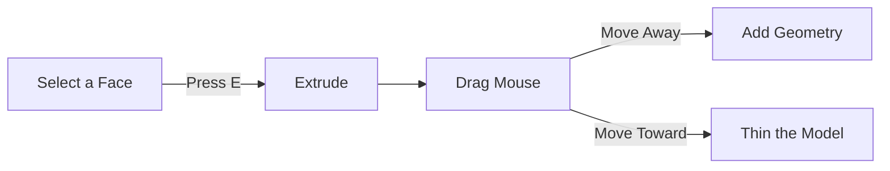
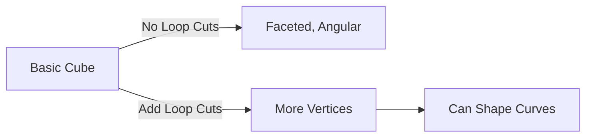
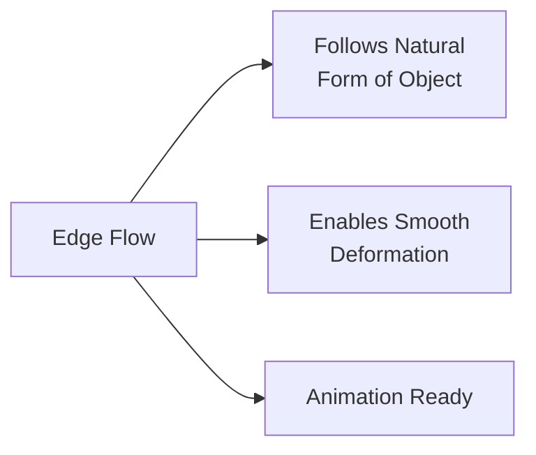

# Box Modelling and Basic Shapes

**Course:** 10DGTA  
**Unit:** 3D Modelling with Blender  
**Topic:** Box Modelling and Basic Shapes  
**Duration:** 3 days (Days 3–5, Week 1)  
**Aligned Outcome:** Designing & Developing Digital Outcomes—students develop digital content using appropriate techniques and tools

---

## 1. Purpose of These Notes

Box modelling is the **bread-and-butter technique** of 3D modelling. If you learn one modelling workflow, this is it.

The process is simple:
1. Start with a basic shape (usually a box/cube)
2. Add detail by **extruding** faces outward
3. Refine proportions by **scaling** and **rotating** geometry
4. Loop-cut and subdivide to add more geometry where you need it
5. Iterate until you have the shape you want

These notes teach you **why** box modelling works, **how** to do it, and **what goes wrong** when people skip steps.

---

## 2. Key Concepts

- **Extrude:** Pulling a face outward to add geometry. This is your main tool.
- **Scale:** Making a face, edge, or vertex bigger or smaller
- **Loop cut:** Adding an edge loop (a ring of edges) across a model for refined shape control
- **Subdivision:** Increasing geometry density to allow smoother shapes
- **Topology:** The flow of edges across a model; good topology means easier modeling and animation

If you can't demonstrate extrusion and explain when to use loop cuts, reread this section.

---

## 3. Core Explanation

### The Basic Box Modelling Workflow

Imagine modeling a **coffee mug**. Here's how box modelling works:

**Step 1: Start with a cylinder** (not a box—it depends on what you're making)
- In Blender: `Shift+A` (Add) → Mesh → Cylinder
- A cylinder is the right starting shape for a mug

**Step 2: Extrude to define the basic structure**
- Enter Edit Mode (`Tab`)
- Select the top face of the cylinder (click it, or press `Alt+A` to select all, then deselect what you don't want)
- Press `E` (extrude)
- Drag the mouse upward to create height
- Press Enter to confirm

This creates a hollow space inside the mug.

**Step 3: Refine with loop cuts**
- Press `Ctrl+R` to add a loop cut (a horizontal ring around the cylinder)
- Move the mouse to position the loop where you want more shape control
- Click to place it
- Click again to confirm
- Now you have more edges to work with for refined shaping

**Step 4: Scale faces to refine the shape**
- Press `S` (scale)
- Move the mouse to scale the selected face bigger or smaller
- Press Enter to confirm

**Step 5: Repeat until you're happy**
- Add more loop cuts where needed
- Extrude the top inward to create a rim
- Scale faces to add a handle (or model a handle separately and join it later)

This process is the same whether you're modeling a mug, a car, or a chair. **Always start with a rough shape, then add detail.**

### Extrude in Detail

Extrude is the most-used tool in box modelling. Here's what it does:



When you extrude:
- A new face is created at the end of your drag
- New edges connect the old face to the new face
- You can extrude inward (to create hollows) or outward (to add bulk)

**Common use:** Extruding window holes, door frames, arms, legs, handle attachments.

### Loop Cut and Why You Need It

Without loop cuts, your model looks faceted and angular. With loop cuts in the right places, you can smoothly shape curves.



**Rule of thumb:** Add a loop cut before you try to scale or shape a feature.

### Subdivision Surface (Smooth Modifier)

In Blender, you can apply a **Subdivision Surface modifier** to make a model look smooth without adding tons of geometry manually.

1. Select your object (Object Mode)
2. Right side panel → Modifier Properties (wrench icon)
3. Click "Add Modifier" → Subdivision Surface
4. Set the viewport subdivision to `2` and render to `3`

This smooths your model. Now, if you enter Edit Mode and scale faces, the smoothed version updates automatically. **This is non-destructive editing**—you can remove the modifier anytime.

### Topology: Why It Matters

Good topology means edges flow naturally across a model. Bad topology has jagged, overlapping edges that make the model hard to refine and impossible to animate.



**Early tip:** Don't worry about perfect topology yet. Focus on getting the shape right. You'll naturally develop good topology habits as you practice.

---

## 4. Diagrams

### The Extrude Process

```
Step 1: Start with a cube
  □

Step 2: Select top face
  □  (top face highlighted)

Step 3: Extrude upward
  ▭  (new face created above old face)

Step 4: Scale inward to refine
  ▬  (top face smaller than base)
```

### Loop Cut Positioning

```
Without Loop Cuts (6 edges):
  ___
  |  |  Hard to curve smoothly
  |  |
  
With Loop Cuts (12+ edges):
  _ _ _
  |   |  Can create smooth curves
  |   |
```

---

## 5. Worked Example: Modelling a Simple Chair

**Goal:** Create a basic chair (seat, back, four legs) using box modelling.

**Starting point:** A cube in Object Mode

**Process:**

1. **Scale the cube into a seat:**
   - Press `S` (scale)
   - Type `2` and Enter to make it 2x bigger
   - Press `S` then `Z` (scale on Z-axis only) then `0.1` and Enter to flatten it into a pancake
   - This is your seat

2. **Extrude four legs:**
   - Enter Edit Mode (`Tab`)
   - Press `Alt+A` to select all faces
   - Press `Alt+A` again to deselect all
   - Click on the bottom face of the cube
   - Press `E` (extrude) and move downward to create legs as one mesh

   Alternatively:
   - Scale the bottom face smaller: `S` then `0.5` to make it half the size
   - Extrude downward to create the leg structure
   - Use loop cuts and scaling to refine

3. **Extrude the back:**
   - Select the back face (press Alt+A to deselect, then click the back)
   - Press `E` (extrude) and move backward and upward

4. **Add detail with loop cuts:**
   - Press `Ctrl+R` and add horizontal loop cuts across the seat and back
   - This allows you to curve and refine the shape

5. **Render to see the result:**
   - Press `F12` to render
   - Your chair appears as a realistic image
   - Press `Escape` to return to the viewport

**Key learning:** Start with one shape, extrude to add parts, refine with loop cuts. Repeat.

---

## 6. Common Misconceptions and Pitfalls

### ❌ "I extruded a face but now I have a weird spike sticking out."

You probably extruded with the wrong face selected. Press `Ctrl+Z` (undo), make sure you have the right face selected, and extrude again.

### ❌ "My model looks like a blocky mess. How do I make it smooth?"

Two options:
1. Add a **Subdivision Surface modifier** (easiest, non-destructive)
2. Manually add more geometry with **loop cuts** and refine the shape

Option 1 is faster to start. Option 2 gives you more control. Usually, you do both.

### ❌ "I keep accidentally deselecting things and have to reselect everything."

You probably have Alt-click turned on by accident. In Edit Mode, use:
- `Alt+A` to toggle select all / deselect all
- Click with Alt held to add to selection (not deselect)

Or just press `A` to select all (not Alt+A in all versions).

### ❌ "I extruded 50 times and now my model has way too many vertices. It's slow."

You've added too much geometry. This is why we use **Subdivision Surface**—you add the minimum geometry needed, and let the modifier smooth it out. If you've already added too much, you can't easily undo individual extrusions. Next time, use fewer, larger extrusions and refine with scaling.

### ❌ "I want to model a curved surface but the edges are all jagged and wrong."

This is a **topology problem**. Your edge loops aren't aligned with the surface. Solution:
- Add a loop cut perpendicular to your jagged edge
- Use `G` (grab) to move the loop to a smoother position
- Repeat until the curve looks smooth

This is an advanced technique. Don't worry about perfection yet.

---

## 7. Assessment Relevance

In your **3D Modelling Project**, you'll demonstrate:
- ✅ **Extrusion skill:** Can model basic forms by extruding
- ✅ **Loop cut placement:** Uses loop cuts to add shape detail without excessive geometry
- ✅ **Iteration:** Shows multiple versions proving you refined the shape, not just built it once

Teachers can usually tell if you understand modelling by looking at:
1. Your topology (does the edge flow make sense?)
2. Your geometry density (is it optimized or bloated?)
3. Your willingness to iterate (can you show a v1, v2, v3 progression?)

---

## 8. External Resources

### Video Tutorials
- **Box Modelling Fundamentals** – YouTube (Blender Beginner) – [https://www.youtube.com/watch?v=vVqnl5OC2K8](https://www.youtube.com/watch?v=vVqnl5OC2K8) – ~30 min, covers extrude and loop cuts with real examples
- **Modeling a Chair from Start to Finish** – YouTube (CG Cookie) – [https://www.youtube.com/watch?v=TjBBAHW_OBE](https://www.youtube.com/watch?v=TjBBAHW_OBE) – ~1 hour, similar to your project
- **Loop Cut Explained** – YouTube (Blender Beginner) – [https://www.youtube.com/watch?v=aDWvjfBAEfg](https://www.youtube.com/watch?v=aDWvjfBAEfg) – Focused, short, clear

### Documentation
- **Blender Manual: Extrude** – [https://docs.blender.org/manual/en/latest/modeling/meshes/editing/face/extrude.html](https://docs.blender.org/manual/en/latest/modeling/meshes/editing/face/extrude.html)
- **Blender Manual: Loop Cut and Slide** – [https://docs.blender.org/manual/en/latest/modeling/meshes/editing/edge/subdivide.html](https://docs.blender.org/manual/en/latest/modeling/meshes/editing/edge/subdivide.html)

### Practice Models
- **Poly Haven (Free Models)** – [https://polyhaven.com/models](https://polyhaven.com/models) – Download simple models and study their topology

---

## 9. Key Vocabulary

- **Extrude:** Pull a face outward (or inward) to add geometry
- **Face:** A flat surface made of edges and vertices (what you see on the outside)
- **Loop cut (or edge loop):** A ring of edges running around a model
- **Subdivision Surface:** A modifier that smooths a model by calculating intermediate geometry
- **Scale:** Change the size of a selected element (face, edge, vertex) in a specific direction
- **Topology:** The arrangement and flow of edges across a model
- **Vertex (vertices):** Individual points in 3D space
- **Non-destructive editing:** Using modifiers instead of permanently changing geometry (you can remove the modifier later)
- **Render:** Calculate the final image of your 3D scene

---

## Ready to Model

Start with a simple object you see every day—a mug, a bottle, a book. Model it using extrude and loop cuts. Then move on to [Materials, Textures, and Lighting](03_materials-textures-lighting.mdx). 🪑

