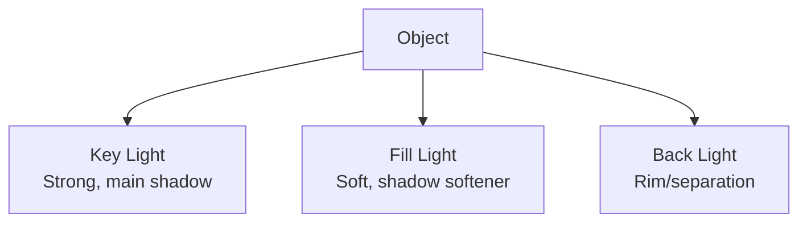

# Materials, Textures, and Lighting

**Course:** 10DGTA  
**Unit:** 3D Modelling with Blender  
**Topic:** Materials, Textures, and Lighting  
**Duration:** 5 days (Days 1–5, Week 2)  
**Aligned Outcome:** Designing & Developing Digital Outcomes—students develop digital content using appropriate techniques; students understand aesthetics and visual principles

---

## 1. Purpose of These Notes

A poorly textured and lit model looks flat and unconvincing. A simple model with great lighting and materials looks professional.

These notes teach you:
- How materials work (color, roughness, metallic properties)
- How the Principled BSDF shader (Blender's main material tool) gives you control
- How lighting principles make models look believable
- How to render your work for final presentation

---

## 2. Key Concepts

- **Albedo (or Base Color):** The pure colour of a surface with no lighting
- **Roughness:** How shiny or matte a surface is (0 = mirror, 1 = completely dull)
- **Metallic:** Whether a surface is metal (1) or not (0)
- **Normal map:** A texture that makes flat geometry look detailed without adding more polygons
- **Three-point lighting:** A professional lighting setup using three lights to make objects look 3D
- **Render engine:** The algorithm that calculates how light bounces (Eevee = fast preview, Cycles = high quality)

If you can't explain roughness vs. metallic, or describe what three-point lighting is, reread this section.

---

## 3. Core Explanation

### Materials vs. Textures

**Material:** A collection of properties that define how a surface looks and behaves (color, roughness, shininess, etc.)

**Texture:** A 2D image that adds detail to a surface (wood grain, brick, fabric weave, etc.)

In Blender:
- You create a **material** and assign it to an object
- Within that material, you can add a **texture map** to the albedo/color channel (or any other channel)

**Example:** A wooden table
- The **material** includes: slightly rough (roughness = 0.3), not metallic, has some shine
- The **texture** is a wood grain image that makes it look like real wood

### The Principled BSDF Shader

The Principled BSDF (Bidirectional Scattering Distribution Function) is the standard shader in Blender. It has many inputs, but you only need a few:

| Input | Range | What It Does | Example |
|-------|-------|--------|---------|
| **Base Color (Albedo)** | Color picker | The pure color with no light information | Red plastic = red RGB(1, 0, 0) |
| **Roughness** | 0–1 | 0 = mirror-smooth, 1 = completely matte | Polished metal = 0.1, rough wood = 0.8 |
| **Metallic** | 0–1 | 0 = non-metal, 1 = full metal | Plastic = 0, steel = 1 |
| **Specular** | 0–1 | How much reflective highlight | Default = 0.5, usually leave it |
| **Subsurface** | 0–1 | For translucent materials like skin, wax, leaves | Human skin = 0.01, candle wax = 0.5 |
| **Normal Map** | Image texture | Fake surface detail without adding geometry | Brick wall texture = normal map |

**Most common use:** Adjust Base Color and Roughness. That's 80% of what professionals do.

### Three-Point Lighting Setup

Professional photographers and 3D artists use three lights to make objects look good:

1. **Key Light:** The main light source (usually off to the side and above). Creates shadows and definition.
2. **Fill Light:** Softer, opposite the key light. Brightens the shadows so they're not pure black.
3. **Back Light:** Behind the object. Separates it from the background and adds rim lighting.



**In Blender:**
1. Delete the default light (`X` to delete)
2. Add three area lights (`Shift+A` → Light → Area)
3. Position key light at 45° angle, above object
4. Position fill light opposite, lower power (30–50% of key)
5. Position back light behind, below, to separate from background
6. Adjust power in the light properties until it looks good

### Rendering: Eevee vs. Cycles

**Eevee (fast):**
- Real-time preview renderer
- Renders in seconds
- Less physically accurate but good for games and quick previews
- Use this while you're working

**Cycles (slow but beautiful):**
- Physically accurate renderer
- Can take minutes per frame
- Produces photorealistic results
- Use this for final renders

**In practice:**
- Work in **Eevee** while modeling and texturing (fast feedback)
- Switch to **Cycles** for final renders
- Increase "samples" in Render Properties for less noise (but slower render)

### Lighting and Mood

Lighting isn't just technical—it's emotional. The same object looks completely different with different lighting:

- **Hard, single light** = dramatic, moody, ominous
- **Soft, diffuse light** = friendly, calm, approachable
- **Cool blue + warm amber** = dynamic, interesting, cinematic
- **High contrast** = professional, bold
- **Low contrast, flat** = commercial, safe, readable

Choose lighting that matches the *feeling* you want, not just what's technically correct.

---

## 4. Diagrams

### The Principled BSDF in Blender

```
Base Color (Albedo) ──────┐
Roughness ────────────────┤
Metallic ─────────────────┤
Subsurface ───────────────├──> Principled BSDF ──> Final Look
Normal Map ───────────────┤     (+ Lighting)
Specular ─────────────────┤
...other inputs...────────┘
```

### Three-Point Lighting Overhead View

```
              Back Light
                   ↓
        KEY LIGHT   O   Object
             ↓     / \       FILL LIGHT
             O────O───────O
            /      |
          /        |
       (45°)    (front)    (soft)
```

### Roughness Examples

```
Roughness = 0.0 (mirror):  Shiny Reflections
Roughness = 0.3 (polished): Subtle Highlights
Roughness = 0.7 (worn):    Diffuse Shine
Roughness = 1.0 (matte):   No Shine
```

---

## 5. Worked Example: Texturing a Wooden Table

**Goal:** Create a material for a wooden table that looks realistic.

**Steps:**

1. **Create a material:**
   - Select your table model (Object Mode)
   - Right panel → Material Properties (sphere icon)
   - Click "+ New" to create a new material

2. **Set the base color:**
   - In the Shader Editor (bottom panel), connect the Base Color input to a Principled BSDF
   - Click the color swatch and choose a medium brown (RGB: 0.6, 0.4, 0.2)

3. **Adjust roughness:**
   - Set Roughness to `0.5` (wood is moderately rough, not shiny)

4. **Leave Metallic at 0** (wood is not metal)

5. **Add a wood texture (optional but recommended):**
   - In the Shader Editor, add an Image Texture node (`Shift+A` → Texture → Image Texture)
   - Click "Open" and load a wood grain image (or use a procedural texture)
   - Connect the Color output to the Base Color input of Principled BSDF
   - Now the table has wood grain texture

6. **Set up lighting:**
   - Delete the default light (if you want to start fresh)
   - Add a key light (Area Light) at 45° angle
   - Add a fill light at 50% power opposite the key
   - Add a back light for separation

7. **Render to see the result:**
   - Top-right, change Render Engine to "Cycles" (for quality)
   - Viewport shading → rendered view (or press `Z` then `3`)
   - Press `F12` to render a final image
   - Adjust lighting and materials until you're happy

**Key learning:** Start simple (just base color and roughness), then add complexity (textures, subsurface). Iterate based on renders.

---

## 6. Common Misconceptions and Pitfalls

### ❌ "I set the base color but the object is completely black. Did I break it?"

You probably have no lights in the scene. Add a light:
- `Shift+A` → Light → Area Light
- Position it so it's not directly in front of the object

### ❌ "My material looks gray, not the color I chose."

Gray usually means roughness is very high. Lower the roughness value (try 0.3–0.5 for most materials).

### ❌ "I added a texture but I can't see it in the viewport."

You might be in Solid view mode. Switch to **Rendered view** mode (press `Z` then `3`, or click the render sphere icon in the top-right). Textures are invisible in Solid mode.

### ❌ "The render looks dark and noisy. It took 5 minutes to render."

Noise = too few samples. Darkness = lights are too dim or positioned badly.
- Increase samples in Render Properties (try 128–256)
- Add more lights or increase their power
- Position key light more directly at the object

### ❌ "My model looks flat even with lighting."

This is often a Normal Map issue. Without normal maps, geometry that's flat stays flat. Solution:
- Make sure your model has enough geometry (add loop cuts)
- Or add a normal map texture to the Normal Map input of Principled BSDF

### ❌ "I can't find the Shader Editor to edit materials."

By default, it's hidden. To open it:
- Drag the edge between panels to make space
- At the top of the new area, click the icon selector and choose "Shader Editor"
- Or press the tilde key `~` to open it temporarily

---

## 7. Assessment Relevance

In your **3D Modelling Project**, you'll be assessed on:
- ✅ **Material realism:** Does your material look like the real-world equivalent? (Wood looks like wood, metal looks like metal, etc.)
- ✅ **Lighting setup:** Is the object well-lit and visible from multiple angles?
- ✅ **Render quality:** Is your final render clear, well-exposed, and ready to present?

Teachers can usually tell if you understand materials by looking at:
1. Does the roughness value match the surface? (Mirror metal should be ~0.0, rough concrete ~0.9)
2. Are there obvious errors? (Metallic = 1 for non-metallic objects, or vice versa)
3. Is the lighting thoughtful or just default? (Did you position lights intentionally?)

---

## 8. External Resources

### Video Tutorials
- **Principled BSDF Shader Explained** – YouTube (Blender Beginner) – [https://www.youtube.com/watch?v=bv_CpKJJiG0](https://www.youtube.com/watch?v=bv_CpKJJiG0) – ~30 min, covers all the main inputs
- **Three-Point Lighting Setup** – YouTube (CG Cookie) – [https://www.youtube.com/watch?v=KX8Tr3wSFmE](https://www.youtube.com/watch?v=KX8Tr3wSFmE) – Professional lighting from the start
- **Texture Painting in Blender** – YouTube (Blender Beginner) – [https://www.youtube.com/watch?v=CkJfqT6aaYI](https://www.youtube.com/watch?v=CkJfqT6aaYI) – Paint textures directly onto your model

### Documentation & Resources
- **Blender Manual: Principled BSDF** – [https://docs.blender.org/manual/en/latest/render/shader_nodes/shader/principled.html](https://docs.blender.org/manual/en/latest/render/shader_nodes/shader/principled.html)
- **Poly Haven (Free Textures)** – [https://polyhaven.com/textures](https://polyhaven.com/textures) – High-quality, free PBR textures
- **Ambientcg (Free Textures)** – [https://ambientcg.com/](https://ambientcg.com/) – Another source for realistic textures

---

## 9. Key Vocabulary

- **Material:** A set of properties that define how a surface looks (color, roughness, shininess, etc.)
- **Texture:** A 2D image applied to a surface for detail and variety
- **Principled BSDF:** Blender's standard physically-based shader for realistic materials
- **Albedo / Base Color:** The pure color of a surface with no lighting information
- **Roughness:** How shiny (0) or matte (1) a surface is
- **Metallic:** Whether a surface is metal (1) or non-metal (0)
- **Normal Map:** A special texture that fakes surface detail without adding geometry
- **Subsurface scattering:** Light bouncing inside semi-transparent materials (skin, wax, leaves)
- **Key Light:** The main light source in a scene
- **Fill Light:** A secondary light that softens shadows
- **Back Light (Rim Light):** A light behind the object for separation and depth
- **Eevee:** Fast, real-time render engine (good for preview)
- **Cycles:** Slow, physically accurate render engine (good for final renders)
- **Render:** Calculate the final image of your 3D scene
- **Samples:** Number of times the renderer calculates light rays (more samples = less noise but slower)

---

## Next Step

Once you've textured and lit your model, move on to [Blender Workflow and File Organization](04_workflow-organization.mdx) to learn how to save and organize your work professionally. 💾

