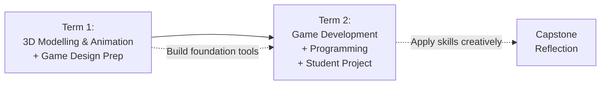

# Year 10 Digital Technologies (10DGTA) – Course Notes

These course notes explain the **key concepts, tools, and processes** used throughout Year 10 Digital Technologies.

They are designed to:
- support lesson learning and practical lab work
- provide a reference for independent revision and skill review
- help you explain *what you built and why*
- support peer discussion and peer review
- build your confidence explaining technical decisions

These notes do **not** replace lessons, hands-on practice, or teacher feedback.

---

## Programme Overview

Year 10 Digital Technologies (Rotation A) is structured around **four core topics**, each combining learning new tools with applying those tools to real projects. You'll work on both **individual projects and collaborative team work** to develop skills in design, problem-solving, and digital creation.

The programme emphasizes:
- **Learning by doing:** Each tool (Blender, GDevelop, JavaScript) is taught through hands-on projects, not just lectures
- **Iterative thinking:** You'll sketch ideas, test them, get feedback, and improve them
- **Explaining your thinking:** You must be able to discuss and defend your technical choices, not just show finished work
- **Collaboration:** You'll work in teams to develop communication skills and shared problem-solving
- **Evidence of progress:** You'll submit sketches, versions, and process notes alongside final work

---

## Four Core Units

### Unit 1: 3D Modelling with Blender – Term 1 (~2 weeks foundations + 1 week project)

**Focus:** Spatial thinking, 3D geometry, digital object creation  
**Tool:** Blender (free, industry-standard 3D software)  
**Project:** Model a 3D object for a small creative brief

**What you will learn:**
- how 3D coordinates and geometry work
- how to navigate and manipulate 3D space in Blender
- how to model objects using core techniques (box modelling, sculpting basics)
- how to texture and light objects to make them visually interesting
- how to organize your work (layers, collections, naming conventions)

**Key concepts:**
- 3D coordinates, vertices, edges, and faces
- Modelling workflows (reference images, blocking, detail)
- Materials and textures
- Lighting and rendering
- Iteration and refinement

### Unit 2: 3D Animation with Blender – Term 1 (~2 weeks foundations + 1 week project)

**Focus:** Movement, narrative, and timing in 3D space  
**Tool:** Blender (building on modelling skills)  
**Project:** Animate a character or object to tell a short story

**What you will learn:**
- how animation principles (timing, spacing, easing) make movement convincing
- how to use Blender's keyframe system to create movement
- how to design and execute a short animation sequence with narrative intent
- how to troubleshoot common animation problems
- how to iterate animation based on playback feedback

**Key concepts:**
- 12 Principles of Animation (appeal, anticipation, follow-through, etc.)
- Keyframing and the timeline
- Graph Editor and easing curves
- Character rigging basics
- Iteration loops (blocking → spline → polish)

### Unit 3: Game Design with GDevelop – Term 1 (~2 weeks)

**Focus:** Game mechanics, systems thinking, visual programming  
**Tool:** GDevelop (event-based game engine, no traditional coding required)  
**Project:** Build a playable game prototype

**What you will learn:**
- how games are composed of mechanics, rules, and feedback loops
- how to use GDevelop's event system to build interactivity
- how to design a game brief and scope it realistically
- how to test your game with peers and iterate based on feedback
- how systems thinking applies to game design and digital creation more broadly

**Key concepts:**
- Game mechanics and win/loss conditions
- Player feedback (visual, audio, score systems)
- Events and conditions in GDevelop
- Collision detection and physics
- User interface (UI) and menus
- Iteration and balancing

### Unit 4: Programming Foundations with JavaScript – Term 2 (~2 weeks foundations + 1 week project)

**Focus:** Logic, control flow, problem-solving with text-based code  
**Language:** JavaScript (web-based, widely used)  
**Project:** Build an interactive web application (calculator, quiz, data display, etc.)

**What you will learn:**
- how to break problems into algorithms (sequences of steps)
- how to use variables, data types, and operators to store and manipulate information
- how to use conditionals (if/else) and loops (for, while) to control program flow
- how to write functions to organize and reuse code
- how to test your code and debug when things go wrong
- how to link JavaScript to HTML/CSS to create interactive web pages

**Key concepts:**
- Variables and data types (strings, numbers, booleans, arrays)
- Operators (arithmetic, comparison, logical)
- Control structures (if/else, switch, for loops, while loops)
- Functions and scope
- Arrays and object basics
- Debugging and the browser console
- DOM manipulation (changing HTML/CSS from JavaScript)

---

## How to Use These Notes

**During lessons:** These notes provide the *why* behind what your teacher shows you. Read the relevant section before class or immediately after to reinforce what you learned.

**During lab time:** When you're stuck on a project, check:
1. The "Key Concepts" to remind yourself what you're trying to do
2. The "Worked Examples" to see how someone else approached a similar problem
3. The "Common Misconceptions" to spot if you've made an easy mistake
4. External resources (videos, tutorials) if you need a different explanation

**During revision:** Re-read the "Core Explanation" and work through the "Key Vocabulary" to make sure you can explain ideas in your own words.

**When giving feedback to peers:** Use the "Key Concepts" and "Assessment Relevance" sections to help your classmates understand what they need to demonstrate in their work.

---

## Big Ideas Across All Units

### 1. Iteration is Normal, Not Failure

In every unit—whether you're modelling, animating, designing a game, or writing code—you will:
- **sketch or prototype** a first version quickly (spend 20–30 minutes, not weeks)
- **test or play-test** with someone else (a peer, a teacher, or yourself)
- **collect feedback** (what works? what's confusing? what's missing?)
- **improve and repeat**

This is how professionals work. Your first idea is almost never your best. **Evidence of iteration (your sketches, version control, playtest notes) is part of what you'll submit.**

### 2. Explain Your Thinking

In any project, you might be asked to:
- **narrate your code** (talk through what you wrote and why)
- **justify your design** (explain why you chose certain colours, shapes, mechanics, or algorithms)
- **describe your process** (show your sketches, your failed attempts, your feedback and improvements)

This is **not** about being perfect. It's about showing that **you understand what you did**. Students who use AI tools to do the work *cannot* explain it. Teachers will spot this immediately through these conversations.

### 3. Copy-Paste Code / Models / Designs Without Understanding Is Not Okay

If you find code online, a Blender model to copy, a GDevelop template, or a JavaScript tutorial and you submit it without being able to explain it line-by-line (or brick-by-brick in Blender):
- your teacher will ask you to explain it live
- you'll struggle to do so
- this counts as academic integrity issues and will affect your grade

**Instead:**
- Read the example, understand it, then close it and write it yourself
- Use it as inspiration but build something new
- Always reference where ideas came from in your comments or process notes

### 4. Mistakes Are Data

When your code doesn't run, your model looks weird, your animation is janky, or your game is unplayable:
- **don't panic—this is the point**
- read error messages (they tell you what's wrong)
- check the "Common Misconceptions" section in these notes
- ask peers or your teacher
- try fixing it
- learn why it broke

This **problem-solving process is what your teacher is assessing**, not whether you never made a mistake.

---

## Academic Integrity & AI Tools

### What's Allowed

✅ **Use AI tools to:**
- explain concepts (ask ChatGPT to explain what a loop is)
- debug errors (paste an error message and ask what it means)
- brainstorm ideas (ask for game mechanic ideas, animation concepts, feature lists)
- understand documentation (ask it to simplify technical writing)
- look up syntax (ask what the JavaScript for-loop syntax is)

### What's Not Allowed

❌ **Do not use AI to:**
- write your code for you (you must write every line)
- generate your 3D models (you must model in Blender)
- design your animation keyframes (you must animate)
- create game logic event sheets (you must build mechanics in GDevelop)

### How Teachers Verify Compliance

Your teacher will:
1. **Ask you to explain your work live** – narrate your code, show your Blender file, play your game, walk through your animation
2. **Check your version history** (if using Git or Blender version snapshots) to see progress, not just the final result
3. **Spot-check code/models for AI patterns** (very consistent style, overly complex solutions, comments that don't match the code)

**If you can't explain what you submitted, it will be treated as academic misconduct, regardless of whether you used AI.**

---

## How to Get Help

### In Class
- Raise your hand or speak to your teacher during lab time
- Ask a peer to review your work
- Use the rubber duck method (explain your code to a rubber duck; you'll often spot the bug)

### Outside Class
- Re-read the relevant section of these notes
- Watch a recommended video (see the "External Resources" section in each topic)
- Post to the class discussion forum or Slack channel (teacher or peer can help)
- Email your teacher with a specific question and a screenshot of what's not working

### When You're Stuck for More Than 10 Minutes
- Switch to a different part of the project
- Pair up with a peer
- Take a break (seriously—your brain works better after a rest)
- Ask your teacher

---

## Vocabulary and Key Terms

### General Digital Design Terms

- **Iteration:** The process of making a version, getting feedback, and improving it. Repeat as needed.
- **User feedback / playtesting:** Testing your work with someone else (not yourself) to find problems and opportunities.
- **Prototype:** A quick, rough version of an idea made to test it before investing time in polish.
- **Asset:** Any creative file—models, textures, sounds, images, code libraries—used in a project.
- **Version control / Git:** A system for tracking changes to files over time, so you can revert to earlier versions or collaborate safely.

### 3D and Animation Terms

- **3D coordinates:** A system to locate objects in 3D space using X (left-right), Y (up-down), and Z (front-back) axes.
- **Mesh:** A 3D object made of vertices (points), edges (lines), and faces (surfaces).
- **Texture / Material:** The appearance of a surface (colour, roughness, shininess, patterns).
- **Rig:** A digital skeleton inside a 3D model, used to animate it realistically.
- **Keyframe:** A snapshot of an object's position, rotation, or properties at a specific point in time. Animation is created by keyframing objects at different times.
- **Rendering:** The process of calculating how light hits surfaces to create a final image or video.

### Game Design Terms

- **Mechanic:** A rule or system in a game (e.g., "jump," "collect coins," "solve puzzles").
- **Win/Loss condition:** How a player wins or loses the game.
- **Feedback loop:** How the game responds to player actions (visual effects, sounds, score changes, etc.).
- **Difficulty curve:** How a game gradually gets harder to keep players engaged.
- **Collision detection:** The game engine's ability to detect when objects touch.

### Programming Terms

- **Algorithm:** A sequence of steps to solve a problem.
- **Variable:** A named container that stores a value (a number, text, true/false, etc.).
- **Data type:** The kind of value a variable holds (number, text string, true/false, list, etc.).
- **Operator:** A symbol that performs an operation (+ for addition, > for greater-than, && for logical AND, etc.).
- **Conditional:** An if/else statement that runs different code depending on a condition.
- **Loop:** Code that repeats until a condition is met (for loop, while loop).
- **Function:** A reusable block of code that does one job.
- **Scope:** Where a variable can be used (global scope = everywhere; local scope = only inside a function).
- **Debug / Debugging:** Finding and fixing errors in code.
- **DOM:** The Document Object Model—the structure of an HTML page that JavaScript can interact with.

---

## Structure of Each Topic's Notes

Each topic in this course has the same structure:

1. **Purpose** – Why you need to know this
2. **Key Concepts** – The non-negotiable ideas (if you don't understand these, you haven't learned the topic)
3. **Core Explanation** – The main ideas explained clearly
4. **Diagrams** – Visual models to make structure and flow visible
5. **Worked Examples** – Examples that show correct reasoning and decision-making
6. **Common Misconceptions** – Mistakes students often make and how to avoid them
7. **Assessment Relevance** – How this topic connects to what you'll be assessed on
8. **External Resources** – Videos, tutorials, and tools to reinforce learning
9. **Key Vocabulary** – Important terms defined

---

## Navigation

### Unit 1: 3D Modelling with Blender
1. [Introduction to 3D Space and Blender Basics](01_3d-modelling/01_3d-fundamentals.mdx)
2. [Box Modelling and Basic Shapes](01_3d-modelling/02_box-modelling.mdx)
3. [Materials, Textures, and Lighting](01_3d-modelling/03_materials-textures-lighting.mdx)
4. [Blender Workflow and File Organization](01_3d-modelling/04_workflow-organization.mdx)
5. [3D Modelling Project Guide](01_3d-modelling/05_project-guide.mdx)

### Unit 2: 3D Animation with Blender
1. [Animation Principles and Timing](02_3d-animation/01_animation-principles.mdx)
2. [Keyframing and the Timeline](02_3d-animation/02_keyframing-timeline.mdx)
3. [Character Rigging Basics](02_3d-animation/03_rigging-basics.mdx)
4. [Polishing Animation: Easing and Curves](02_3d-animation/04_easing-curves.mdx)
5. [3D Animation Project Guide](02_3d-animation/05_project-guide.mdx)

### Unit 3: Game Design with GDevelop
1. [Game Mechanics and Systems Thinking](03_game-design/01_mechanics-systems.mdx)
2. [Introduction to GDevelop Events and Logic](03_game-design/02_gdevelop-basics.mdx)
3. [Player Feedback: Score, Sounds, and Visuals](03_game-design/03_player-feedback.mdx)
4. [Game Design Brief and Scope](03_game-design/04_design-brief-scope.mdx)
5. [Playtesting and Balancing Your Game](03_game-design/05_playtesting-balancing.mdx)
6. [Game Development Project Guide](03_game-design/06_project-guide.mdx)

### Unit 4: Programming Foundations with JavaScript
1. [Variables, Data Types, and Operators](04_programming/01_variables-datatypes.mdx)
2. [Control Flow: Conditionals and Loops](04_programming/02_control-flow.mdx)
3. [Functions and Code Organization](04_programming/03_functions.mdx)
4. [Arrays and Introduction to Objects](04_programming/04_arrays-objects.mdx)
5. [DOM Manipulation and Interactivity](04_programming/05_dom-manipulation.mdx)
6. [Debugging and Problem-Solving](04_programming/06_debugging.mdx)
7. [JavaScript Project Guide](04_programming/07_project-guide.mdx)

---

## Recommended External Resources

### General Learning and Debugging
- **MDN Web Docs** – The standard reference for web technologies (HTML, CSS, JavaScript). Clear, detailed, always reliable. [https://developer.mozilla.org/](https://developer.mozilla.org/)
- **Stack Overflow** – When you Google an error message, this is usually where the answer is. [https://stackoverflow.com/](https://stackoverflow.com/)

### Blender (3D Modelling and Animation)
- **Blender Official Documentation** – The comprehensive, free reference. [https://docs.blender.org/](https://docs.blender.org/)
- **Blender Beginner Tutorial Series** – YouTube channel with step-by-step guides. [https://www.youtube.com/c/BlenderBeginner](https://www.youtube.com/c/BlenderBeginner)
- **CG Cookie** – High-quality, structured courses (some free, some paid). [https://cgcookie.com/](https://cgcookie.com/)

### GDevelop (Game Engine)
- **GDevelop Official Wiki** – Event-by-event documentation. [https://wiki.gdevelop.io/](https://wiki.gdevelop.io/)
- **GDevelop YouTube Channel** – Official tutorials, project walkthroughs. [https://www.youtube.com/c/GDevelopApp](https://www.youtube.com/c/GDevelopApp)

### JavaScript
- **JavaScript.info** – Excellent, free JavaScript tutorial from basics to advanced. [https://javascript.info/](https://javascript.info/)
- **freeCodeCamp JavaScript Course** – YouTube, ~4 hours, covers fundamentals. [https://www.youtube.com/watch?v=PkZNo7MFNFg](https://www.youtube.com/watch?v=PkZNo7MFNFg)
- **Codecademy JavaScript Course** – Interactive, hands-on learning (free and paid options). [https://www.codecademy.com/learn/learn-javascript](https://www.codecademy.com/learn/learn-javascript)

---

## Last Note

These notes are **yours to use throughout the course and beyond**. Bookmark them, print them, share them with classmates, refer to them constantly. Your goal by the end of the year is to understand these concepts so deeply that you could teach them to someone else.

Let's build something amazing. 🚀

