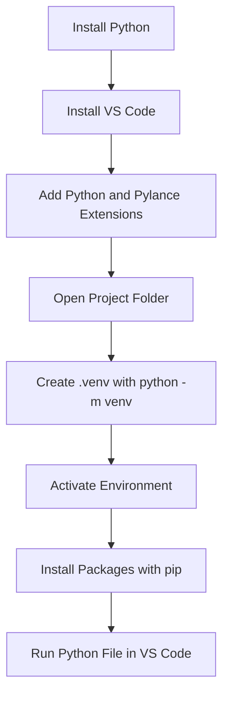
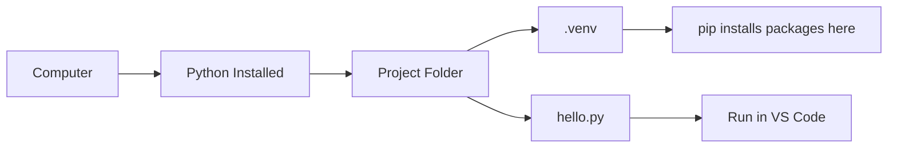

# Python Development Setup with pip

**Course:** Year 11 Digital Technologies  
**Year Level:** Level 6 / Year 11  
**Unit / Module:** 01 Programming Foundations  
**Aligned Standard(s):** AS92004  
**Lesson Context:** introduction / course setup  
**Estimated Time:** 20-30 minutes  

---

## 1. Purpose of These Notes

These notes exist to:
- explain how to set up Visual Studio Code for Python development
- show which extensions are recommended and why they matter
- explain how `pip` and virtual environments fit into Python work
- help you create a clean starting point for class programming tasks

These notes are **not** a substitute for teacher checking. Your setup still needs to work on your own device.

---

## 2. Key Concepts (Overview)

This section lists the **non-negotiable ideas** students must understand by the end of this topic.

- VS Code is the editor where you write and run Python code.
- Python must be installed before VS Code can run Python programs.
- A virtual environment keeps one project separate from another.
- `pip` installs Python packages into the environment you are currently using.
- If you cannot explain which interpreter or environment your code is using, your setup is not yet secure.

> If students cannot explain these ideas in their own words, they have not mastered the topic.

---

## 3. Core Explanation

To write Python code effectively, you need three things working together:
- the **Python interpreter**
- the **VS Code editor**
- a **virtual environment** for the project

VS Code is where you write code, but VS Code does not contain Python by itself. Python must be installed on the computer first. Once that is done, VS Code can connect to that Python installation and help you run code, check for errors, and manage files.

You also need the right extensions. The Microsoft **Python** extension adds Python support to VS Code. **Pylance** improves error checking and code completion. These tools do not replace understanding, but they make mistakes more visible earlier.

For Year 11 work, it is better to use the simpler built-in approach:
- create a virtual environment with `python -m venv .venv`
- install packages with `python -m pip install ...`

This works because the environment is easy to explain. A virtual environment is just a project-specific Python space. When that environment is active, installed packages go into that project instead of mixing with every other Python project on the computer.

If students misunderstand this, two common problems appear:
- packages install into the wrong place, so code works on one machine but not another
- VS Code selects the wrong interpreter, so the terminal and editor disagree about what is installed

### Recommended Setup Sequence

1. Install Python from the official Python website.
1. Install VS Code from the official VS Code website.
1. Install the Microsoft Python and Pylance extensions.
1. Open a project folder in VS Code.
1. Create a virtual environment with `python -m venv .venv`.
1. Activate the environment.
1. Upgrade `pip` inside the environment.
1. Install any project packages with `python -m pip install ...`.

---

## 4. Diagrams and Visual Models

Use diagrams to make structure and flow visible.

### Example Diagram



### Environment Relationship Model



---

## 5. Worked Examples (Conceptual, Not Procedural)

Include at least one worked example that:
- demonstrates correct reasoning
- makes thinking explicit
- explains *why* each step happens

Worked examples should focus on:
- cause and effect
- decision points
- common points of failure

Avoid examples students can reproduce verbatim in assessment.

### Worked Example: Setting Up a New Python Project

You create a folder called `my-python-project` and open it in VS Code.

First, you create a virtual environment:

```powershell
python -m venv .venv
```

This creates a `.venv` folder inside the project. That folder contains a separate Python environment for this project.

Next, you activate it.

On Windows PowerShell:

```powershell
.venv\Scripts\Activate.ps1
```

If the prompt changes to include `(.venv)`, that is evidence that the environment is active.

Then you upgrade `pip`:

```powershell
python -m pip install --upgrade pip
```

This matters because `pip` is the tool that installs Python packages. Using `python -m pip` is clearer than just typing `pip`, because it makes sure the package installer belongs to the currently selected Python interpreter.

If the project later needs a package such as `requests`, you would install it like this:

```powershell
python -m pip install requests
```

The reasoning is:
- the environment is active
- the active interpreter is the project interpreter
- the installed package goes into the project environment
- VS Code can now run code that depends on that package

That chain of reasoning matters more than memorising the command.

### Recommended Extensions

- **Python** (Microsoft): enables Python support in VS Code
- **Pylance** (Microsoft): provides code completion and error checking
- **Jupyter** (Microsoft, optional): useful only if your class is using notebooks
- **Pylint** (Microsoft, optional): helps identify likely mistakes in code

---

## 6. Common Misconceptions and Pitfalls

Explicitly identify mistakes students commonly make.

For each misconception:
- describe the incorrect thinking
- explain why it is wrong
- state the correct understanding

This section exists to **prevent predictable errors**, not react to them later.

### Misconception 1: "VS Code comes with Python already installed"

This is incorrect because VS Code is an editor, not the Python language itself.

The correct understanding is that Python must be installed separately, then VS Code uses that installation.

### Misconception 2: "pip creates the virtual environment"

This is incorrect because the environment is created by `venv`, not by `pip`.

The correct understanding is:
- `python -m venv .venv` creates the environment
- `python -m pip install ...` installs packages into the active environment

### Misconception 3: "If I installed a package once, every project can use it safely"

This is incorrect because different projects may need different packages or versions.

The correct understanding is that each project should usually use its own virtual environment.

### Misconception 4: "If the code runs in the terminal, VS Code must be using the same interpreter"

This is not always true. VS Code can point to one interpreter while the terminal is using another.

The correct understanding is that you should check both:
- the selected Python interpreter in VS Code
- the active environment shown in the terminal prompt

---

## 7. Assessment Relevance

Explain how this content connects to assessment.

Students should understand:
- where this concept will be used
- what they may be asked to explain
- what evidence they will need to produce

This reduces “I didn’t know we needed to know this” issues.

In AS92004, your setup does not earn marks by itself, but it affects whether you can work efficiently and explain your development process clearly.

Students may need to explain:
- how they created and managed their programming environment
- what a virtual environment is for
- why they installed packages in a project environment instead of globally
- how they know the correct interpreter is being used

A tidy setup also supports authenticity. If you can explain your files, environment, and installed packages, it is easier to show that the work is genuinely yours.

---

## 8. External Resources (Optional but Recommended)

External resources should:
- reinforce explanations
- offer alternative perspectives
- support revision

### Video Resources
- **Python Tutorial for Beginners** - Programming with Mosh - https://www.youtube.com/watch?v=_uQrJ0TkZlc
- **VS Code Python Tutorial** - Corey Schafer - https://www.youtube.com/watch?v=-nh9rCzPJ20

### Additional Reading / Tools
- **Visual Studio Code** - https://code.visualstudio.com/
- **Python Downloads** - https://www.python.org/downloads/
- **Python Packaging User Guide: Installing Packages** - https://packaging.python.org/en/latest/tutorials/installing-packages/

Only include resources you would genuinely recommend students use.

---

## 9. Key Vocabulary

List and define essential terms using clear, student-friendly language.

- **Python interpreter:** the program that runs Python code
- **VS Code:** the editor used to write and run code
- **Extension:** an add-on that gives VS Code more features
- **Virtual environment:** a project-specific Python space that keeps packages separate
- **venv:** the built-in Python tool used to create a virtual environment
- **pip:** the Python package installer
- **Interpreter selection:** choosing which Python installation VS Code should use

Students are expected to use this vocabulary