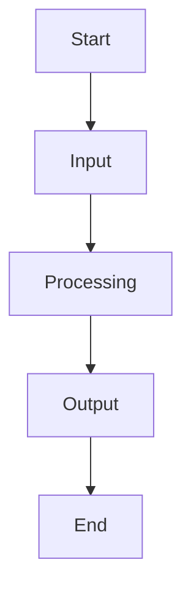

# Program Structure

Program structure refers to **how instructions are organised** in a computer program.

Good structure makes a program:
- easier to read
- easier to test
- easier to explain
- easier to fix

In assessment, structure is evidence of **clear thinking**.

---

## Sequencing

Sequencing means instructions are executed **in order**, from top to bottom.

The computer:
- starts at the first instruction
- runs each line one at a time
- stops only when told to stop

If instructions are in the wrong order, the program may still run — but behave incorrectly.

---

## Variables

Variables are used to **store data**.

They allow a program to:
- remember values
- use input later
- change behaviour over time

Examples of what variables might store:
- a score
- a player position
- a number entered by the user
- the number of lives remaining

Clear variable names improve readability and understanding.

---

## Instructions and Actions

Instructions tell the computer to **do something**.

Examples include:
- calculating a value
- displaying output
- updating a variable
- calling a function

Each instruction should have a **clear purpose**.

---

## Decisions and Flow

Programs often need to choose between different paths.

This is done using **conditions**.

A condition checks whether something is:
- true or false
- equal or not equal
- greater or less than

**Figure 3 — Program flow with a decision point**  

Decisions control how the program responds to different situations.

---

## Readability and Clarity

A program should be readable by:
- you
- your teacher
- someone else learning from your work

Good readability includes:
- clear variable names
- consistent formatting
- logical ordering of instructions

Messy code is harder to verify and harder to assess.

---

## Structure and Assessment

In AS92004, you are assessed on:
- whether your program works
- whether the logic is correct
- whether you can explain how it works

Clear structure helps with **all three**.

---

## Looking Ahead

Program structure is reused when:
- building game mechanics
- handling player input
- managing game states
- debugging unexpected behaviour

Structure learned here will appear again in game development.

---

*End of Program Structure*
