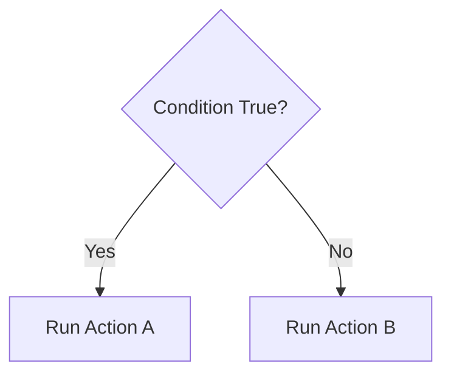
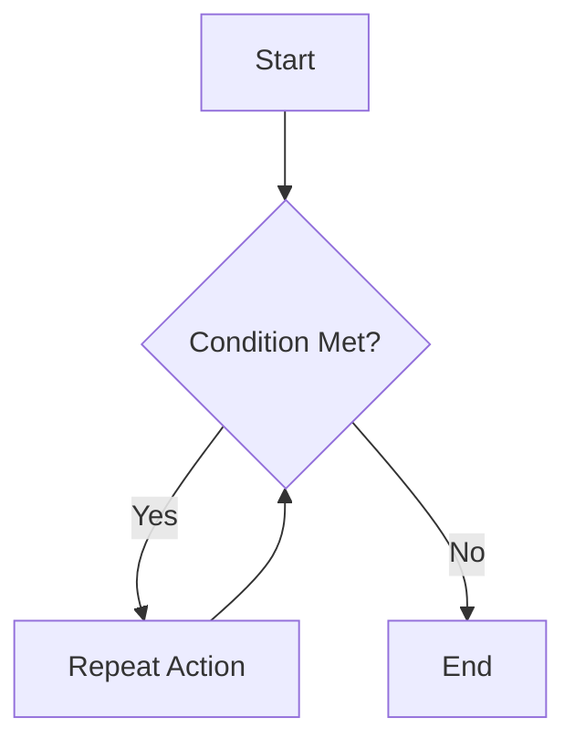

# Control Structures

Control structures determine **how a program flows**.

They decide:
- which instructions run
- when they run
- how often they run

Every non-trivial program uses control structures.

---

## Sequencing

Sequencing is the **default behaviour** of a program.

Instructions run:
1. from top to bottom
2. one at a time
3. in the order written

If no decisions or loops are used, a program relies entirely on sequencing.

Sequencing is simple but limited.

---

## Selection (Decision-Making)

Selection allows a program to **choose between paths**.

A condition is checked, and one of two (or more) actions occurs.

Common uses:
- checking user input
- responding to player actions
- enforcing rules

**Figure 4 — Selection using a decision condition**  

Without selection, programs cannot respond intelligently to input.

---

## Iteration (Repetition)

Iteration allows a program to **repeat actions**.

This is done using loops.

Common uses:
- repeating game updates
- counting down values
- checking conditions repeatedly

**Figure 5 — Iteration using a loop condition**  

Iteration continues until a condition is no longer met.

---

## Combining Control Structures

Most programs combine:
- sequencing
- selection
- iteration

For example:
- a loop repeats
- a condition is checked inside the loop
- different actions occur based on the result

This combination creates complex behaviour from simple rules.

---

## Control Structures and Bugs

Many bugs are caused by:
- incorrect conditions
- loops that never stop
- logic that never runs

Understanding control structures makes bugs easier to identify and fix.

---

## Control Structures in Assessment

In AS92004, you must:
- use control structures correctly
- explain why they are needed
- show how they affect program behaviour

Using a control structure without understanding it is risky.

---

## Looking Ahead

Control structures are essential for:
- player movement
- collision handling
- scoring systems
- win/lose conditions

They are used constantly in game development.

---

*End of Control Structures*
