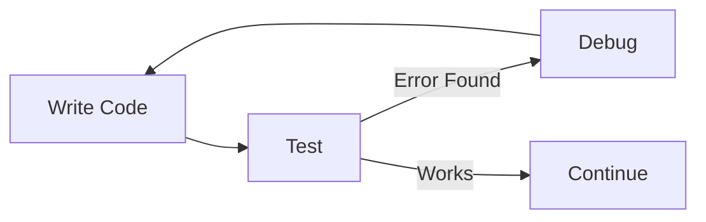

# Testing and Debugging

Testing and debugging are essential parts of programming.

They show:
- whether a program behaves as expected
- whether the logic is correct
- whether the programmer understands their own code

A program that “runs” is not automatically correct.

---

## What Is Testing?

Testing is the process of **checking program behaviour**.

Testing asks questions such as:
- Does the program give the correct output?
- Does it handle unexpected input?
- Does it behave correctly in all cases?

Testing should happen:
- while the program is being built
- after changes are made
- before submission

---

## Types of Testing

Common types of testing include:
- normal case testing (expected input)
- edge case testing (unusual but valid input)
- error testing (invalid input)

Good testing shows **intentional thinking**, not guesswork.

---

## What Is Debugging?

Debugging is the process of **finding and fixing errors**.

Errors may include:
- syntax errors (the program won’t run)
- logic errors (the program runs but behaves incorrectly)
- runtime errors (the program crashes while running)

Debugging requires patience and careful reasoning.

---

## The Debugging Process

Debugging usually involves:
1. identifying what is wrong
2. locating where the problem occurs
3. checking assumptions
4. making a small change
5. testing again

**Figure 6 — Testing and debugging cycle**  

Debugging is rarely solved in one step.

---

## Why Errors Are Useful

Errors:
- reveal misunderstandings
- highlight gaps in logic
- help improve program structure

Making mistakes is normal.  
Ignoring them is risky.

---

## Testing and Debugging in Assessment

In AS92004:
- testing evidence shows understanding
- debugging shows problem-solving
- unexplained fixes are a red flag

You may be asked to:
- explain what went wrong
- explain how you fixed it
- justify your changes

---

## Looking Ahead

Testing and debugging are reused constantly in:
- game development
- handling player input
- fixing game bugs
- improving usability

Strong programmers test continuously.

---

*End of Testing and Debugging*
