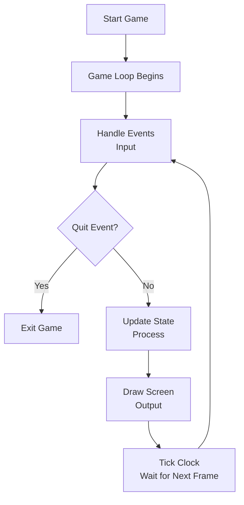
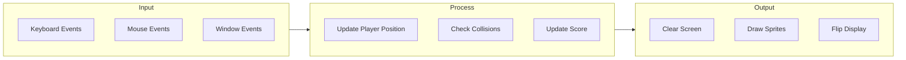
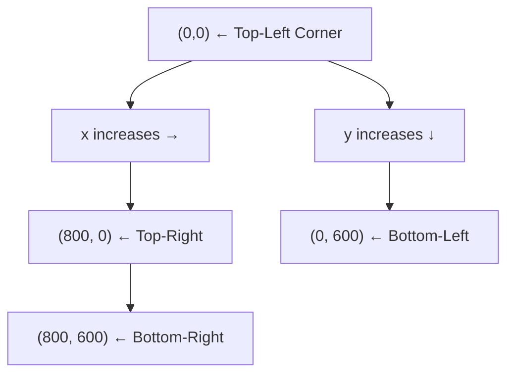
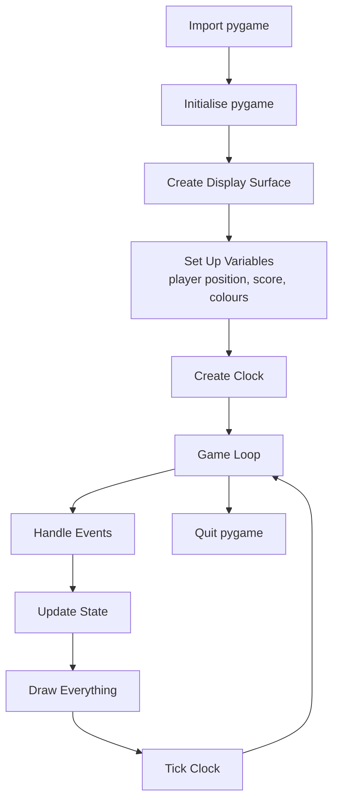

# Introduction to Pygame

**Course:** Year 11 Digital Technologies  
**Year Level:** Level 6 / Year 11  
**Unit / Module:** 01 Programming Foundations  
**Aligned Standard(s):** AS92004  
**Lesson Context:** core concept / application  
**Estimated Time:** 50 minutes  

---

## 1. Purpose of These Notes

These notes exist to:
- explain what Pygame is and how it connects to the Python you already know
- show how the programming fundamentals (IPO, variables, selection, iteration) appear inside a game
- give you the vocabulary to describe what your game code is doing and why
- prepare you to build and explain a Pygame project for AS92004

These notes are **not** a tutorial you copy line by line. They explain the *ideas* behind Pygame so you can make and justify your own decisions.

---

## 2. Key Concepts (Overview)

- A Pygame program is still a Python program — variables, selection, iteration, and functions all apply.
- Every Pygame program follows a **game loop**: handle events → update state → draw the screen.
- **Events** are how the program receives input (keyboard, mouse, window close).
- **Surfaces** are where things are drawn; the display surface is what the player sees.
- The game loop is an example of **iteration** running continuously until the player quits.
- Game state is stored in **variables** and changed using **selection** and **assignment**.

> If you cannot explain the game loop and how your code handles input, updates state, and draws output, you have not understood the topic.

### Key Video: The Ultimate Introduction to Pygame
This video provides a comprehensive overview of how video games work conceptually and how Pygame facilitates the game loop and event handling.
[The ultimate introduction to Pygame](http://www.youtube.com/watch?v=AY9MnQ4x3zk)
<iframe width="560" height="315" src="https://www.youtube.com/embed/AY9MnQ4x3zk" title="YouTube video player" frameborder="0" allow="accelerometer; autoplay; clipboard-write; encrypted-media; gyroscope; picture-in-picture; web-share" referrerpolicy="strict-origin-when-cross-origin" allowfullscreen></iframe>

---

## 3. Core Explanation

### What Is Pygame?

Pygame is a Python library for making 2D games and interactive programs. It handles drawing to the screen, reading keyboard and mouse input, and keeping time — things that plain Python cannot do by itself.

Pygame does **not** change how Python works. You still use variables, functions, conditions, and loops. Pygame just gives you new tools to work with.

### Why Use Pygame for AS92004?

AS92004 assesses whether you can develop a computer program and explain *how* and *why* it works. A Pygame project lets you demonstrate:

- **variables** (player position, score, health, speed)
- **selection** (checking collisions, choosing what happens when a key is pressed)
- **iteration** (the game loop itself, and any repeating game logic)
- **testing and debugging** (does the player move correctly? do edge cases break anything?)

The game is the *context*. The programming fundamentals are the *evidence*.

### The Game Loop

The most important idea in Pygame is the **game loop**. Every game runs a loop that repeats many times per second. Each time through the loop, three things happen:

1. **Handle events** — check what the player did (pressed a key, clicked, closed the window)
2. **Update state** — change variables based on what happened (move the player, add to score, reduce health)
3. **Draw** — clear the screen and redraw everything in its new position

This is the Input–Process–Output (IPO) model applied continuously:

| IPO Stage   | Game Loop Step | Example                              |
|-------------|----------------|--------------------------------------|
| **Input** | Handle events  | Player presses the right arrow key   |
| **Process** | Update state   | Player x-position increases by 5     |
| **Output** | Draw           | Player rectangle drawn at new position|

The loop repeats until a quit event is detected.

### Key Video: Pygame in 90 Minutes
This video walks through the implementation of a basic game loop, handling the `QUIT` event, and the fundamentals of drawing to the screen.
[Pygame in 90 Minutes - For Beginners](http://www.youtube.com/watch?v=jO6qQDNa2UY)
<iframe width="560" height="315" src="https://www.youtube.com/embed/jO6qQDNa2UY" title="YouTube video player" frameborder="0" allow="accelerometer; autoplay; clipboard-write; encrypted-media; gyroscope; picture-in-picture; web-share" referrerpolicy="strict-origin-when-cross-origin" allowfullscreen></iframe>

### Events

An event is something that happens — a key press, a mouse click, or the player closing the window. Pygame collects events into a queue. Each time through the loop, you check the queue and decide what to do.

This is **selection**: *if* the event is a quit event, stop the loop. *If* the event is a key press, change a variable.

### Surfaces and Drawing

A **surface** is a rectangular area of pixels. The display surface is the game window. You draw shapes, images, and text onto surfaces.

Drawing in Pygame works like a flipbook:
1. Clear the screen (fill it with a background colour)
2. Draw everything in its current position
3. Flip the display (show the new frame)

If you skip the clear step, old drawings stay on the screen and the game looks broken. This is a common mistake.

### Coordinates and Positioning

Pygame uses a coordinate system where:
- **(0, 0)** is the **top-left** corner of the window
- **x** increases to the right
- **y** increases **downward** (not upward like in maths)

This catches many students. If you increase a y-value, the object moves *down*.

### Controlling Speed

Pygame uses a **clock** to control how fast the game loop runs. Setting the clock to 60 frames per second means the loop runs 60 times each second. This keeps the game smooth and consistent.

Without a clock, the loop runs as fast as the computer allows, which makes the game behave differently on different machines.

---

## 4. Diagrams and Visual Models

### The Game Loop

### IPO Model in Pygame

### Pygame Tutorial for Beginners: Space Invaders Project
This video applies the IPO model and coordinates to build a classic Space Invaders game, focusing on player positioning and movement logic.
[Pygame Tutorial for Beginners - Python Game Development Course](http://www.youtube.com/watch?v=FfWpgLFMI7w)
<iframe width="560" height="315" src="https://www.youtube.com/embed/FfWpgLFMI7w" title="YouTube video player" frameborder="0" allow="accelerometer; autoplay; clipboard-write; encrypted-media; gyroscope; picture-in-picture; web-share" referrerpolicy="strict-origin-when-cross-origin" allowfullscreen></iframe>

### Pygame Coordinate System

### Pygame Program Structure

---

## 5. Worked Examples (Conceptual, Not Procedural)

### Worked Example 1: Understanding the Game Loop

Consider a game where a square moves right when the player presses the right arrow key.

**What variables are needed?**
- `player_x` — the x-position of the square
- `player_y` — the y-position of the square
- `speed` — how many pixels to move per frame

**What happens in the loop?**
1. **Handle events:** Selection checks the event queue for `pygame.KEYDOWN`. If the key is the right arrow, set a movement flag to True.
2. **Update state:** Selection checks the movement flag. If True, `player_x` increases by `speed`.
3. **Draw:** Clear the screen. Draw the square at `(player_x, player_y)`. Flip the display.

---

## 6. Glossary of Terms

- **Event:** anything that happens during the game (key press, mouse click, window close)
- **Event queue:** the list of events Pygame has collected since the last check
- **Surface:** a rectangular area of pixels; the display surface is the game window
- **Blit:** drawing one surface onto another
- **Flip / Update:** showing the newly drawn frame on screen
- **Frame:** one complete cycle of the game loop; one image shown to the player
- **FPS (frames per second):** how many frames are drawn each second; controls game speed
- **Clock:** a Pygame object that controls the frame rate
- **Rect:** a rectangle object used for positioning and collision detection
- **Sprite:** a game object (player, enemy, item) represented visually on screen
- **Collision detection:** checking whether two game objects overlap
- **Game state:** the current values of all variables that describe what is happening in the game

Students are expected to use this vocabulary accurately when explaining their work.

---

## Looking Ahead

The concepts in this topic connect directly to your AS92004 project:
- the game loop gives you the structure for your program
- events give you input handling
- variables and selection give you game logic
- testing and debugging ensure your game works as intended

You will spend the next several lessons building a Pygame project. The programming fundamentals you learned earlier — IPO, variables, selection, iteration, testing — are the tools you will use every day.