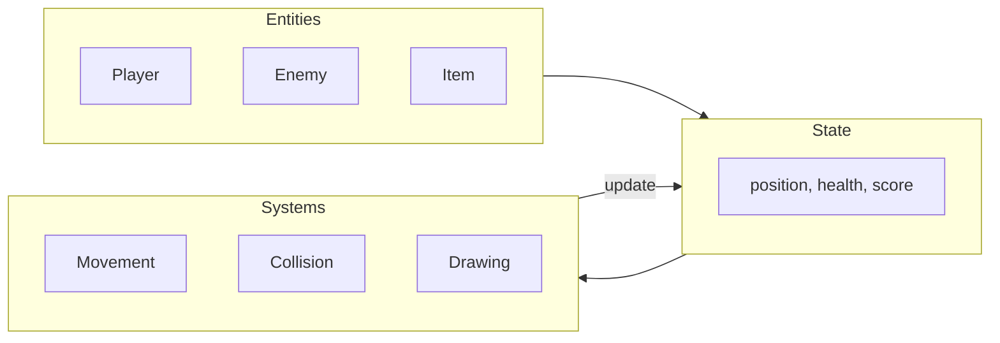

# Decomposition in Game Development

**Course:** Year 11 Digital Technologies  
**Year Level:** Level 6 / Year 11  
**Unit / Module:** 01 Programming Foundations  
**Aligned Standard(s):** AS92004  
**Lesson Context:** core concept / application  
**Estimated Time:** 50 minutes  

---

## 1. Purpose of These Notes

These notes exist to:
- explain what decomposition means and why it matters in game development
- show how to break a game into logical, manageable pieces before writing code
- give you a process for identifying entities, state, and systems in any game
- prepare you to plan and explain your Pygame project for AS92004

These notes are **not** a step-by-step build guide. They explain the *thinking* behind planning a game so you can make and justify your own design decisions.

---

## 2. Key Concepts (Overview)

- **Decomposition** means breaking a complex problem into smaller, manageable parts.
- In game development, the three main categories are **entities**, **state**, and **systems**.
- **Entities** are the things in your game (player, enemies, items, obstacles).
- **State** is the data that describes what is happening (position, score, health, game phase).
- **Systems** are the processes that make things happen (movement, collision, scoring, drawing).
- Planning your decomposition **before** coding prevents tangled, buggy code.

> If you cannot describe the entities, state, and systems in your game before you start coding, you are not ready to code.

---

## 3. Core Explanation

### What Is Decomposition?

Decomposition is the process of breaking a large, complex problem into **smaller parts** that are easier to understand, build, and test individually.

In everyday life, you decompose without thinking about it. Cooking a meal is not one step — it is shopping, preparing ingredients, cooking, and serving. Each part can be done independently.

In programming, decomposition means identifying the **separate pieces** your program needs and building each one before connecting them together.

### Why Decompose a Game?

A game like Snake involves movement, food, collisions, scoring, screen drawing, game-over detection, and restart logic. If you try to write all of this at once, you will:

- lose track of what each part of the code does
- introduce bugs that are hard to find because everything is tangled together
- struggle to explain your code in a walkthrough

Decomposition prevents these problems. Each piece is **small enough to understand, build, and test on its own**.

---

### The Three Categories

When decomposing a game, organise your thinking into three categories:

#### Entities — *What things exist in the game?*

Entities are the objects the player can see or interact with.

| Game | Entities |
|------|----------|
| Snake | Snake body, food, game boundary |
| Platformer | Player, platforms, enemies, coins, exit |
| Space Shooter | Ship, bullets, enemies, power-ups |
| Pong | Paddle (×2), ball, score display |

#### State — *What data describes each entity and the game overall?*

State is the **variables** that track what is happening at any moment.

| Entity | State Variables |
|--------|----------------|
| Player | `x`, `y`, `speed`, `health`, `direction` |
| Enemy | `x`, `y`, `speed`, `is_alive` |
| Ball | `x`, `y`, `dx`, `dy` |
| Game | `score`, `level`, `is_running`, `game_phase` |

#### Systems — *What processes make the game work?*

Systems are the **functions or blocks of logic** that read and change state.

| System | What It Does |
|--------|-------------|
| Movement | Updates entity positions based on input or AI |
| Collision | Checks if entities overlap and responds |
| Scoring | Adds or removes points based on events |
| Drawing | Renders all entities to the screen |
| Input | Reads keyboard/mouse events and sets flags |
| Game Phase | Manages transitions (menu → play → game over) |

---

### How Entities, State, and Systems Connect



- Entities **have** state (a player has a position and health)
- Systems **read and change** state (the movement system updates the player's position)
- The game loop **runs all systems** every frame

---

## 4. Worked Examples

### Worked Example 1: Decomposing Snake

**Step 1 — Identify entities:**
- Snake (head + body segments)
- Food
- Game boundary (the window edges)

**Step 2 — Identify state:**

| Variable | Type | Purpose |
|----------|------|---------|
| `snake_segments` | list of (x, y) | Body positions; first element is the head |
| `direction` | string | Current movement direction ("up", "down", "left", "right") |
| `food_x`, `food_y` | int | Position of the food |
| `score` | int | Number of food items eaten |
| `is_running` | bool | Whether the game loop continues |

**Step 3 — Identify systems:**

| System | Logic |
|--------|-------|
| **Input** | If arrow key pressed, change `direction` (but not to opposite) |
| **Movement** | Move head one step in `direction`; add new head position to front of list; remove tail (unless food was eaten) |
| **Food collision** | If head position equals food position: increase `score`, place new food randomly, do not remove tail this frame |
| **Wall collision** | If head x or y is outside boundary: set `is_running` to False |
| **Self collision** | If head position matches any other segment: set `is_running` to False |
| **Drawing** | Clear screen → draw each segment → draw food → draw score → flip display |

**Step 4 — Plan the build order:**

1. Window setup and game loop (empty)
2. Draw a single square that moves in one direction
3. Add keyboard input to change direction
4. Grow the snake (list of segments)
5. Add food and collision detection
6. Add scoring
7. Add game-over detection (wall and self collision)
8. Add restart functionality

Each step is **testable on its own**. You can verify step 2 works before moving to step 3.

---

### Worked Example 2: Decomposing Pong

**Entities:** Paddle (left), Paddle (right), Ball, Score display

**State:**

| Variable | Purpose |
|----------|---------|
| `paddle_left_y` | Left paddle vertical position |
| `paddle_right_y` | Right paddle vertical position |
| `ball_x`, `ball_y` | Ball position |
| `ball_dx`, `ball_dy` | Ball velocity (direction and speed) |
| `score_left`, `score_right` | Player scores |

**Systems:**

| System | Logic |
|--------|-------|
| **Input** | W/S keys move left paddle; Up/Down keys move right paddle |
| **Ball movement** | Each frame: `ball_x += ball_dx`, `ball_y += ball_dy` |
| **Wall bounce** | If ball hits top or bottom edge: `ball_dy = -ball_dy` |
| **Paddle bounce** | If ball overlaps a paddle: `ball_dx = -ball_dx` |
| **Scoring** | If ball passes left edge: right player scores. If ball passes right edge: left player scores. Reset ball to centre. |
| **Drawing** | Clear → draw paddles → draw ball → draw scores → flip |

**Build order:**
1. Draw two paddles and a ball (no movement)
2. Ball moves automatically
3. Ball bounces off top and bottom walls
4. Paddles move with keyboard input
5. Ball bounces off paddles
6. Scoring when ball passes an edge
7. Ball reset after scoring

---

### Worked Example 3: Decomposing a Platformer

**Entities:** Player, Platforms, Coins, Enemies, Exit

**State:**

| Variable | Purpose |
|----------|---------|
| `player_x`, `player_y` | Player position |
| `player_vy` | Vertical velocity (for gravity/jumping) |
| `is_jumping` | Whether the player is in the air |
| `coins_collected` | Number of coins picked up |
| `platforms` | List of (x, y, width, height) rectangles |
| `enemies` | List of enemy positions and directions |

**Key systems:**
- **Gravity:** Each frame, `player_vy` increases (pulls player down). If player is on a platform, `player_vy = 0`.
- **Jumping:** If player presses space and is not already jumping, set `player_vy` to a negative value (moves up).
- **Platform collision:** If player overlaps a platform from above, place player on top of it.
- **Coin collection:** If player overlaps a coin, remove the coin and increase `coins_collected`.

---

## 5. Common Misconceptions

| Misconception | Reality |
|---------------|---------|
| "I'll figure out the structure as I code" | You'll end up with tangled code that's hard to debug and explain. Plan first. |
| "Decomposition is extra work" | It **saves** time. Fixing a planned system is easier than untangling spaghetti code. |
| "I need to code everything before I can test" | Each system can be tested independently. Test movement before collision. |
| "More entities means harder code" | More entities with **clear state and systems** is manageable. Fewer entities with no structure is chaos. |
| "Decomposition means I need classes and OOP" | Not at Year 11. Variables, lists, and functions are sufficient. |

---

## 6. Applying This to Your Project

Before you write any code for your AS92004 game project:

1. **List your entities** — what things exist in the game?
2. **List the state** for each entity — what variables describe it?
3. **List the systems** — what processes make the game work?
4. **Plan your build order** — what do you build first, second, third?
5. **Identify what you can test** at each step

Write this plan down. It becomes part of your assessment evidence and helps you explain your design decisions during a walkthrough.

### Template

```markdown
## Game Decomposition Plan

### Entities
- [Entity 1]
- [Entity 2]
- ...

### State
| Variable | Type | Purpose |
|----------|------|---------|
| | | |

### Systems
| System | What It Does |
|--------|-------------|
| | |

### Build Order
1. [First thing to build and test]
2. [Second thing to build and test]
3. ...
```

---

## 7. Glossary of Terms

- **Decomposition:** breaking a complex problem into smaller, manageable parts
- **Entity:** a distinct object in the game (player, enemy, item)
- **State:** the variables that describe what is happening at a given moment
- **System:** a process or function that reads and changes state (movement, collision, scoring)
- **Game loop:** the repeating cycle of input → update → draw that runs every frame
- **Build order:** the sequence in which you implement and test features
- **Spaghetti code:** tangled, unstructured code where everything depends on everything else

Students are expected to use this vocabulary accurately when explaining their work.

---

## Looking Ahead

Now that you understand how to decompose a game, you are ready to:
- plan the structure of your own Pygame project
- implement each system one at a time, testing as you go
- explain your design decisions clearly for AS92004

Decomposition is not a one-time activity. As your game grows, you will revisit and refine your plan. That is normal and expected.

---

*End of Decomposition in Game Development*
