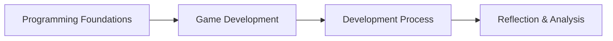
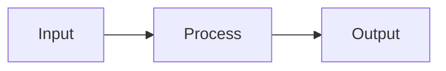

# Programming Foundations

This unit introduces how **computer programs work** and how **logic is structured**.

The ideas in this unit support:
- **AS92004 – Programming**
- all later work in game development (AS92005)

Programming is not about memorising code.  
It is about **thinking clearly and logically**.

---

## What Is a Computer Program?

A computer program is a **set of instructions** that tells a computer:
- what to do
- when to do it
- how to respond to input

Computers do not “understand intent”.  
They follow instructions **exactly as written**.

---

## The Input–Process–Output Model

Most programs can be described using three stages:

- **Input** – data the program receives
- **Process** – logic that works on the data
- **Output** – the result produced

**Figure 1 — Input–Process–Output model**  

This model applies to:
- calculators
- games
- websites
- apps
- simulations

---

## Program Structure

Programs are written as a **sequence of instructions**.

Common structural elements include:
- variables (to store data)
- instructions (to perform actions)
- decisions (to choose between paths)
- repetition (to repeat actions)

**Figure 2 — Basic program structure**  

Good structure makes programs:
- easier to understand
- easier to test
- easier to fix

---

## Why Structure Matters

Poorly structured programs:
- are hard to debug
- behave unpredictably
- are difficult to explain

Well-structured programs:
- show clear thinking
- make logic visible
- are easier to verify in assessment

In assessment, **clarity beats cleverness**.

---

## Key Expectations for This Unit

By the end of this unit, you should be able to:
- explain how a program works
- describe the logic used in your code
- identify where decisions and repetition occur
- test your program and explain fixes

These expectations are **explicitly assessed** in AS92004.

---

## Looking Ahead

The ideas in this unit will be reused when you:
- control player movement in a game
- manage game states (start, play, end)
- handle scoring and conditions
- debug game behaviour

Programming foundations are not optional — they are reused all year.

---

*End of Programming Foundations overview*
