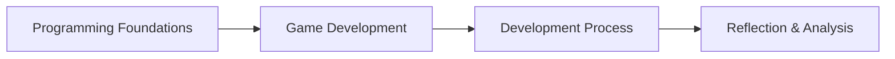
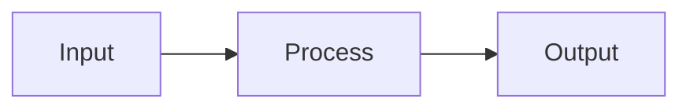

# Programming Foundations

This unit introduces how **computer programs work** and how **logic is structured**.

The ideas in this unit support:
- **AS92004 – Programming**
- all later work in game development (AS92005)

Programming is not about memorising code.  
It is about **thinking clearly and logically**.

---

## Start Here: Python Setup

Before you begin regular Python programming tasks, set up your editor and project environment.

- [Python Development Setup with pip](1.%20python-development-setup-with-pip.mdx)

This note explains:
- how to install Python and VS Code
- which VS Code extensions are recommended
- how to create a virtual environment using `python -m venv`
- how to install packages using `pip`

---

## What Is a Computer Program?

A computer program is a **set of instructions** that tells a computer:
- what to do
- when to do it
- how to respond to input

Computers do not "understand intent".  
They follow instructions **exactly as written**.

### Recommended Video Resource

**Introduction to Programming and Computer Science - Full Course** (freeCodeCamp.org)  
https://www.youtube.com/watch?v=zOjov-2OZ0E

<iframe width="560" height="315" src="https://www.youtube.com/embed/zOjov-2OZ0E" title="YouTube video player" frameborder="0" allow="accelerometer; autoplay; clipboard-write; encrypted-media; gyroscope; picture-in-picture; web-share" referrerpolicy="strict-origin-when-cross-origin" allowfullscreen></iframe>

---

## The Input–Process–Output Model

Most programs can be described using three stages:

- **Input** – data the program receives
- **Process** – logic that works on the data
- **Output** – the result produced

**Figure 1 – Input–Process–Output model**  

This model applies to:
- calculators
- games
- websites
- apps
- simulations

---

## Program Structure

Programs are written as a **sequence of instructions**.

Common structural elements include:
- variables (to store data)
- instructions (to perform actions)
- decisions (to choose between paths)
- repetition (to repeat actions)

**Figure 2 – Basic program structure**  

Good structure makes programs:
- easier to understand
- easier to test
- easier to fix

### Recommended Video Resource

**Learn to Program with Python - Problem Solving Approach** (Derek Banas)  
https://www.youtube.com/watch?v=nwjAoZNE56Q

<iframe width="560" height="315" src="https://www.youtube.com/embed/nwjAoZNE56Q" title="YouTube video player" frameborder="0" allow="accelerometer; autoplay; clipboard-write; encrypted-media; gyroscope; picture-in-picture; web-share" referrerpolicy="strict-origin-when-cross-origin" allowfullscreen></iframe>

---

## Why Structure Matters

Poorly structured programs:
- are hard to debug
- behave unpredictably
- are difficult to explain

Well-structured programs:
- show clear thinking
- make logic visible
- are easier to verify in assessment

In assessment, **clarity beats cleverness**.

---

## Key Expectations for This Unit

By the end of this unit, you should be able to:
- explain how a program works
- describe the logic used in your code
- identify where decisions and repetition occur
- test your program and explain fixes

These expectations are **explicitly assessed** in AS92004.

### Recommended Video Resource

**Comprehensive Java Programming Tutorial** (Derek Banas)  
https://www.youtube.com/watch?v=eIrMbAQSU34

<iframe width="560" height="315" src="https://www.youtube.com/embed/eIrMbAQSU34" title="YouTube video player" frameborder="0" allow="accelerometer; autoplay; clipboard-write; encrypted-media; gyroscope; picture-in-picture; web-share" referrerpolicy="strict-origin-when-cross-origin" allowfullscreen></iframe>

---

## Introduction to Pygame

Pygame is a Python library for building 2D games. It connects all of the programming fundamentals — IPO, variables, selection, iteration, and testing — into a single, ongoing project.

- [Introduction to Pygame — Course Notes](5.%20introduction-to-pygame.mdx)

This note explains:
- the game loop and why it matters
- how events, state, and drawing relate to IPO
- how Pygame maps to AS92004 assessment requirements
- common misconceptions when starting game programming

---

## Decomposition in Game Development

Building a complex game can feel overwhelming without a clear plan. Decomposition breaks a game into logical, manageable pieces that are easier to build and test.

- Decomposition in Game Development — Course Notes (coming soon)

This note explains:
- how to break a game into entities, state, and systems
- why decomposition makes code easi