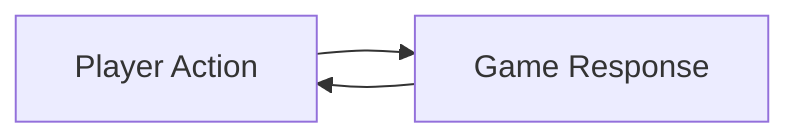

# What Is a Game?

Before building a game, it is important to understand **what makes something a game**.

A game is not just software that looks interactive.  
A game is a **designed system** with purpose.

---

## Core Elements of a Game

Most games include:

- **Player input**  
  The player can take actions that affect the system.

- **Rules**  
  The game limits what actions are possible and what outcomes can occur.

- **Feedback**  
  The game responds to player actions (movement, sound, score, change of state).

- **Outcomes**  
  The game reaches a result such as winning, losing, or restarting.

If one of these elements is missing, the experience is usually weak.

---

## Interaction and Feedback

Games rely on a continuous loop:

- the player acts  
- the game responds  
- the player reacts to that response  

**Figure 8 — Player–game feedback loop**  

This loop is what makes games engaging.

---

## Games vs Other Digital Outcomes

Not all digital outcomes are games.

Examples:
- A calculator responds to input but has no challenge.
- A slideshow presents information but has no rules.
- A simulation may look like a game but may not include goals or outcomes.

In this course, your digital outcome **must behave like a game**.

---

## Purpose and Player Experience

Every game should have a clear purpose, such as:
- challenging the player
- entertaining the player
- testing skill or timing

Design decisions should support the **player experience**, not just technical features.

---

## Games and Assessment

In AS92005, you are assessed on:
- how well your game functions
- how clearly the mechanics support the purpose
- how your design decisions affect the player experience

A visually impressive game with poor interaction is risky.

---

## Looking Ahead

Next, you will explore:
- how games are built using a game engine
- how structure and organisation support development
- how mechanics are implemented using code

Understanding what a game is helps guide better design choices.

---

*End of What Is a Game?*
