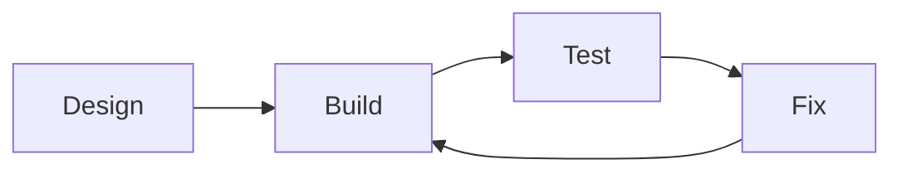

# Godot Basics

Godot is the **game engine** used in this course.

A game engine provides tools that handle common tasks so you can focus on:
- gameplay
- interaction
- logic
- design decisions

Using the correct engine is a **requirement** for assessment.

---

## What Is a Game Engine?

A game engine provides:
- graphics rendering
- input handling (keyboard, mouse, controller)
- physics and collisions
- scene and object management

Without a game engine, building a game would require much more work.

---

## Why Godot?

Godot is used in this course because:
- it is free and open source
- it supports both 2D and 3D games
- it uses a readable scripting language
- it encourages good structure

Godot is powerful enough for complex games, but accessible for beginners.

---

## Projects and Files

A Godot project contains:
- scenes (game objects and layouts)
- scripts (behaviour and logic)
- assets (images, sounds, fonts)

Keeping your project organised is important for:
- debugging
- assessment verification
- explaining your work

---

## GDScript

GDScript is the programming language used in Godot.

It is similar to Python and focuses on:
- readability
- simplicity
- clear structure

You will use GDScript to:
- control player movement
- respond to input
- manage game states
- handle collisions and events

---

## Working in Godot

When developing in Godot, you should:
- build features one at a time
- test frequently
- save versions regularly
- document changes

**Figure 9 — Typical Godot development workflow**  

Rushing leads to bugs and missing evidence.

---

## Godot and Assessment

In AS92005:
- your game must be built in Godot
- you must be able to explain how scenes and scripts work
- your development process must be visible

Copying tutorials without understanding is risky.

---

## Looking Ahead

Next, you will learn:
- how Godot organises games using scenes and nodes
- how scripts are attached to objects
- how mechanics are implemented

Understanding the basics makes later development smoother.

---

*End of Godot Basics*
