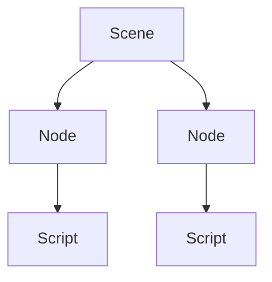

# Scenes, Nodes, and Scripts

Godot games are built using **scenes**, **nodes**, and **scripts**.

Understanding how these fit together is essential for:
- building mechanics
- organising projects
- explaining how your game works

---

## Nodes

A node is a **single object** in a game.

Examples of nodes include:
- a player
- an enemy
- a platform
- a button
- a sound effect

Each node has a specific role.

---

## Scenes

A scene is a **collection of nodes** arranged together.

Scenes are used to:
- build levels
- group related objects
- reuse parts of your game

A scene might represent:
- a level
- a menu
- a player character
- an enemy type

---

## Scripts

Scripts define **behaviour**.

A script:
- is attached to a node
- controls how that node behaves
- responds to input and events

Scripts are written in **GDScript**.

---

## How They Work Together

Scenes, nodes, and scripts work as a system:

- nodes represent objects  
- scripts define behaviour  
- scenes organise objects  

**Figure 10 — Relationship between scenes, nodes, and scripts**  

This structure helps keep games manageable as they grow.

---

## Why This Structure Matters

Using scenes and nodes correctly:
- reduces complexity
- avoids duplicated code
- makes testing easier
- improves readability

Poor organisation leads to confusion and bugs.

---

## Explaining Your Work

In assessment, you may be asked to:
- explain how a scene is structured
- describe what a script does
- justify why objects are organised a certain way

Clear structure makes explanations easier.

---

## Looking Ahead

Next, you will learn:
- what game mechanics are
- how mechanics affect player experience
- how to design mechanics intentionally

Scenes and scripts are the foundation for mechanics.

---

*End of Scenes, Nodes, and Scripts*
