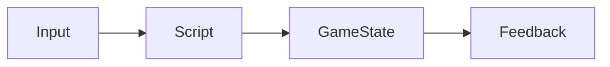

# Game Mechanics

Game mechanics define **how a game works**.

They describe:
- what actions the player can take
- how the game responds
- how progress is made or lost

Mechanics are the core of gameplay.

---

## What Is a Game Mechanic?

A game mechanic is a **rule-based interaction** between the player and the game.

Examples include:
- movement and jumping
- scoring points
- losing health
- collecting items
- triggering events

A game usually has several mechanics working together.

---

## Mechanics and Player Experience

Good mechanics:
- feel responsive
- are easy to understand
- support the purpose of the game

Poor mechanics:
- confuse players
- feel unfair or unpredictable
- weaken engagement

Design decisions should focus on **player experience**, not complexity.

---

## Implementing Mechanics

Mechanics are implemented using:
- variables (to track state)
- control structures (to handle decisions and repetition)
- scripts (to define behaviour)

**Figure 11 — From player input to game response**  

Each mechanic should have a clear cause and effect.

---

## Testing Mechanics

Testing mechanics involves checking:
- does the mechanic work every time?
- does it respond correctly to input?
- does it behave as expected in edge cases?

Testing often reveals:
- logic errors
- balance issues
- usability problems

---

## Iterating on Mechanics

Rarely does a mechanic work perfectly the first time.

Iteration may involve:
- adjusting values
- changing conditions
- simplifying interactions
- removing unnecessary features

Iteration should improve **clarity and playability**.

---

## Mechanics and Assessment

In AS92005, you are assessed on:
- whether mechanics function correctly
- whether mechanics support the game’s purpose
- how mechanics changed during development

A game with many mechanics is not automatically better.

---

## Looking Ahead

Next, you will learn:
- how to improve games through iteration
- how testing and feedback guide changes
- how to manage scope effectively

Strong mechanics make iteration meaningful.

---

*End of Game Mechanics*
