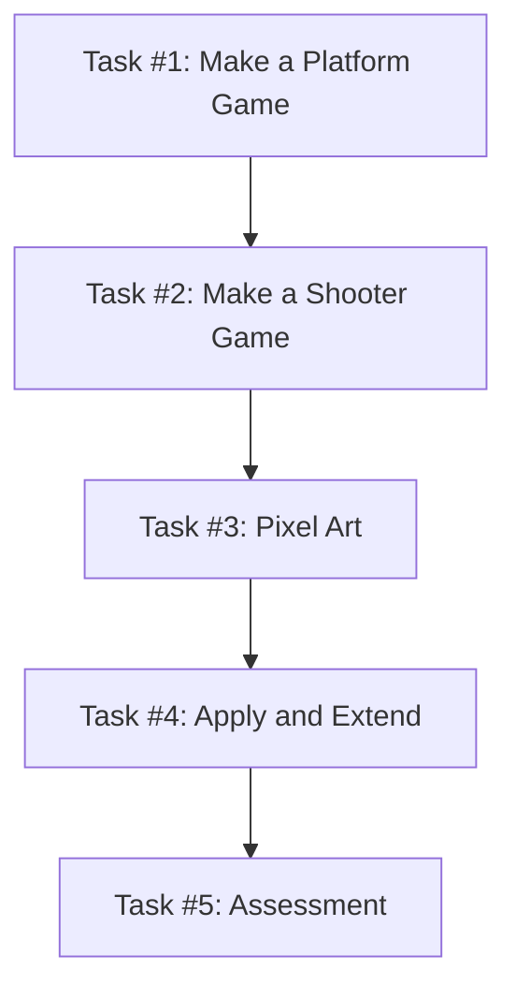

# Basic Video Game Skills

## Why Godot?

Welcome to the exciting world of game development with Godot Engine! If you've ever dreamt of creating your own captivating video games, this comprehensive course is your gateway to turning imagination into interactive reality.

Godot Engine has garnered immense popularity for its user-friendly interface, powerful capabilities, and remarkable flexibility. Whether you're a seasoned programmer or a complete beginner, this course will take you on an immersive journey through the art and science of crafting video games.

[Godot Engine – 2025 Showreel - YouTube](https://www.youtube.com/watch?v=7ZwEmxihlw4)

<iframe width="800" height="450" src="https://www.youtube.com/embed/7ZwEmxihlw4?si=izfSmhjSP99BKsOy" title="YouTube video player" frameborder="0" allow="accelerometer; autoplay; clipboard-write; encrypted-media; gyroscope; picture-in-picture; web-share" referrerpolicy="strict-origin-when-cross-origin" allowfullscreen></iframe>

By the end of this course, you'll not only possess a solid grasp of Godot's features but also have a portfolio of 2D game projects that showcase your newfound skills.

### Using AI in Godot

AI tools can be a useful learning aid when you are developing games in Godot. They are best used to:
- Help explain error messages or unfamiliar concepts
- Suggest ways to approach a problem when you are stuck
- Generate temporary placeholder art so you can focus on gameplay and mechanics first

However, AI should be used with caution, especially for programming.

Important limitations to be aware of:
- Godot has major differences between version 3.5 and 4.x, particularly in GDScript syntax and node systems. AI tools often mix these up, which can lead to broken or confusing code.
- AI tends to focus on small code snippets, not the overall structure of your project. This means it may suggest solutions that don't fit well with how your game is organised.
- Code generated by AI may look correct but still contain logical errors or poor practices that make your game harder to maintain.

Best practice:

Use AI as a support tool, not a replacement for understanding your own code. Always test, read, and adapt anything it suggests so it works correctly in your project and your version of Godot.

### Important Software Notes!

- All the tutorials below use Godot 4+. If you are using 3.5 then please utilise other resources.

- This course utilities itch.io for playtesting purposes which may be blocked in class.

- Using Godot 4, in order to export it in a HTML playable state you must make your game in compatibility mode at the moment. It will also not work on macOS computers. Godot 3.5 currently has better HTML support but is missing a lot of the other features.. For a full explanation check out the [current docs](https://docs.godotengine.org/en/stable/tutorials/export/exporting_for_web.html) or list of [current HTML 5 issues on Github](https://github.com/godotengine/godot/issues?q=is:open+is:issue+label:platform:web).

# Part 1: Develop Understanding

You are going to start off learning Godot by making two simple 2D games. Then there is a Quickfire Introduction to some of the art tools you could use. You will do a simple learning reflection at the end of each episode to help consolidate your learning.

**Figure 1 — Building Basic Video Game Skills**  
