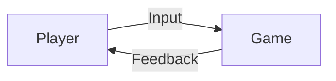

# Game Development

This unit focuses on applying programming skills to create an **interactive digital game**.

The emphasis is not just on building a game, but on:
- planning
- developing
- testing
- improving

These ideas directly support **AS92005 – Game Development**.

---

## What Is a Game?

A game is an interactive system that includes:
- rules
- player input
- feedback
- outcomes

Games respond to player actions in real time.

**Figure 7 — Basic game interaction loop**  

If there is no meaningful interaction, it is not a game.

---

## Key Components of a Game

Most games include:
- a player or controllable object
- one or more mechanics
- a game state
- a way to win, lose, or restart

Each component must work together.

---

## Games as Systems

Games are systems where:
- input affects behaviour
- behaviour affects outcomes
- outcomes affect player decisions

Understanding games as systems helps with:
- debugging
- improving gameplay
- explaining design choices

---

## Tools Used in This Course

In this course, you will use:
- **Godot** as the game engine
- **GDScript** for programming behaviour

These tools are required for assessment.

---

## Expectations for This Unit

By the end of this unit, you should be able to:
- explain how your game works
- describe the mechanics you implemented
- show how your game changed over time
- justify your design decisions

These expectations are assessed in AS92005.

---

## Looking Ahead

Next, you will learn:
- how Godot organises games
- how mechanics are implemented
- how iteration improves quality

Game development builds directly on programming foundations.

---

*End of Game Development overview*
