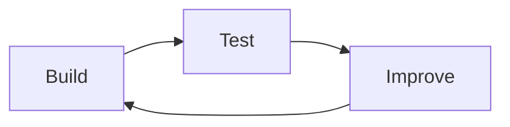

# Iteration

Iteration means **improving your work over time**.

In game development, iteration is expected.  
Very few ideas work perfectly the first time.

---

## What Iteration Is (and Is Not)

Iteration **is**:
- making changes based on testing
- improving how something works
- refining mechanics or interactions
- responding to feedback

Iteration **is not**:
- adding random features
- changing things without a reason
- polishing visuals only
- restarting from scratch repeatedly

---

## The Iteration Cycle

Iteration usually follows this pattern:
1. build a feature
2. test how it works
3. identify problems or weaknesses
4. make targeted improvements
5. test again

**Figure 13 — Build–Test–Improve cycle**  

Each cycle should improve clarity or playability.

---

## What Counts as Meaningful Iteration

Meaningful iteration:
- fixes a problem
- improves usability
- strengthens the game’s purpose
- simplifies confusing behaviour

Examples:
- adjusting player speed because movement felt too fast
- changing collision logic to prevent unfair deaths
- simplifying controls after player feedback

---

## Documenting Iteration

You are expected to keep evidence of iteration, such as:
- saved versions showing changes
- notes explaining why changes were made
- screenshots before and after changes
- short reflections on what improved

Without documentation, iteration cannot be verified.

---

## Iteration and Assessment

In AS92005:
- iteration supports higher grades
- changes must be justified
- improvements must be visible

Claiming iteration without evidence is risky.

---

## Looking Ahead

Next, you will learn:
- how playtesting helps guide iteration
- how feedback improves design decisions
- how to avoid unnecessary changes

Iteration is strongest when guided by evidence.

---

*End of Iteration*
