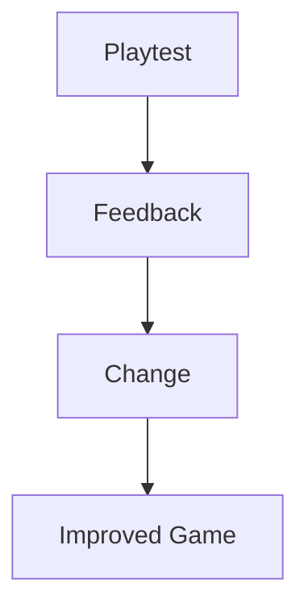

# Playtesting

Playtesting is the process of **watching other people play your game**.

It helps you understand:
- how players actually interact with your game
- what confuses or frustrates them
- what works well and should be kept

Playtesting is about learning, not judging.

---

## What Playtesting Is (and Is Not)

Playtesting **is**:
- observing player behaviour
- collecting feedback
- identifying problems
- improving design decisions

Playtesting **is not**:
- watching someone once and making no changes
- asking “do you like it?” only
- defending your design instead of listening
- ignoring feedback because it disagrees with your plan

---

## How to Run a Playtest

A simple playtest involves:
1. letting someone play your game
2. watching without giving instructions
3. noting where they struggle or succeed
4. asking focused questions afterwards

Examples of useful questions:
- What was confusing?
- What felt too easy or too hard?
- What did you expect to happen?

---

## Using Feedback Effectively

Good feedback leads to:
- clearer controls
- fairer mechanics
- improved pacing
- fewer bugs

You do not need to follow all feedback, but you must:
- consider it
- decide what is useful
- justify the changes you make

---

## Evidence of Playtesting

Evidence may include:
- short notes from testers
- screenshots of issues found
- lists of changes made as a result
- brief reflections on what improved

**Figure 14 — Feedback leading to iteration**  

Feedback without changes is weak evidence.

---

## Playtesting and Assessment

In AS92005, playtesting supports:
- evidence of iteration
- justification of design decisions
- higher-quality outcomes

Games that are never tested often fail in predictable ways.

---

## Looking Ahead

Next, you will learn:
- how to manage scope effectively
- how to avoid overcomplicating your game
- how to finish strong without rushing

Playtesting helps you focus on what matters.

---

*End of Playtesting*
