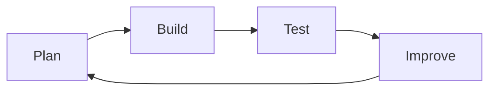

# Development Process

Developing a digital game is not a straight line from idea to finished product.  
It is a **process of planning, building, testing, and improving**.

This unit focuses on **how** you develop your game, not just what you build.

---

## Development Is Iterative

Game development follows a repeating cycle:

- plan what to build
- build a small part
- test how it works
- improve based on what you learn

**Figure 12 — Iterative development cycle**  

This cycle repeats many times during development.

---

## Why Process Matters

A strong development process:
- reduces bugs
- improves game quality
- makes progress visible
- provides evidence for assessment

A weak process often leads to:
- rushed work
- last-minute fixes
- missing evidence
- unclear explanations

---

## Evidence of Process

Throughout development, you are expected to keep evidence such as:
- early versions of your game
- notes on changes made
- testing feedback
- short reflections

This evidence shows **how your thinking developed over time**.

---

## Development and Assessment

In AS92005, assessment is based on:
- the quality of the final game
- the quality of the development process
- evidence of iteration and improvement

A polished game without process evidence is risky.

---

## Looking Ahead

Next, you will learn:
- what iteration looks like in practice
- how playtesting improves games
- how to manage scope and complexity

Understanding the process helps you work smarter, not harder.

---

*End of Development Process overview*
