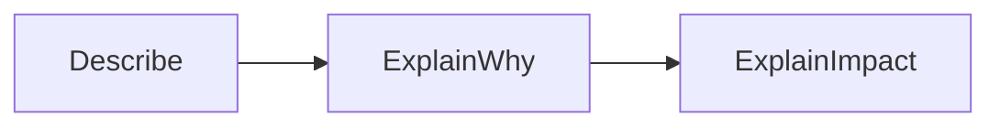

# Analysis vs Description

Understanding the difference between **description** and **analysis** is critical for success in reflective assessment.

Many students lose marks by describing what they did instead of analysing why it mattered.

---

## What Is Description?

Description tells the reader **what happened**.

Examples:
- “I added a scoring system.”
- “I changed the player speed.”
- “I fixed a bug.”

Description answers:
- What did you do?
- What feature exists?

Description alone is **not sufficient** for higher grades.

---

## What Is Analysis?

Analysis explains **why decisions were made** and **what effect they had**.

Examples:
- “I increased the player speed because testing showed movement felt slow.”
- “I changed the scoring system to reward skill rather than time.”
- “Fixing the collision bug reduced unfair player deaths.”

Analysis answers:
- Why did you do it?
- What problem were you solving?
- What changed as a result?

---

## Moving from Description to Analysis

A useful approach is:

1. Describe the change briefly  
2. Explain the reason for the change  
3. Explain the impact on the game  

**Figure 15 — Moving from description to analysis**  

This structure keeps responses focused and clear.

---

## Analysis and Evidence

Strong analysis refers to:
- specific mechanics
- testing or feedback
- visible changes in behaviour
- outcomes for the player

Claims without evidence are weak.

---

## Analysis in AS92007

For AS92007:
- description supports Achieved
- analysis supports Merit
- evaluation supports Excellence

You are expected to go beyond “what I did”.

---

## Looking Ahead

Next, you will learn:
- how to link design decisions to outcomes
- how to evaluate success and limitations
- how to structure strong reflective responses

Analysis is the bridge between doing and understanding.

---

*End of Analysis vs Description*
