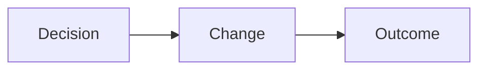

# Linking Decisions to Outcomes

Strong reflection explains the **connection between decisions and results**.

It is not enough to say what you changed.  
You must explain **how that change affected the outcome**.

This skill is central to success in **AS92007**.

---

## What Is a Design Decision?

A design decision is a **deliberate choice** made during development.

Examples include:
- choosing one mechanic over another
- adjusting values (speed, difficulty, timing)
- removing a feature
- changing how the player interacts with the game

Every meaningful change is a decision.

---

## Outcomes in Game Development

An outcome is the **result of a decision**.

Outcomes might include:
- improved player control
- clearer goals
- reduced frustration
- better balance
- improved stability

Outcomes should be described from the **player’s perspective**, not just the developer’s.

---

## Making the Link Clear

Strong reflection follows this pattern:

1. Describe the decision briefly  
2. Explain why the decision was made  
3. Explain the outcome of that decision  

**Figure 16 — Decision → Change → Outcome**  

This structure makes your reasoning clear and easy to follow.

---

## Evaluating Outcomes

Evaluation goes one step further by asking:
- Did the change actually improve the game?
- What evidence supports this?
- What limitations still remain?

Evaluation may include:
- playtesting feedback
- observed behaviour changes
- remaining issues or trade-offs

Acknowledging limitations shows understanding, not failure.

---

## Weak vs Strong Links

Weak link:
- “I changed the mechanic and it was better.”

Strong link:
- “I simplified the jumping mechanic because playtesting showed players mistimed jumps. This reduced frustration and made the game more accessible.”

Specific links are always stronger than general claims.

---

## Linking Decisions in AS92007

In AS92007:
- links between decisions and outcomes support Merit
- evaluation of impact supports Excellence
- unsupported claims are risky

You must refer to **your own game and your own evidence**.

---

## Final Advice

When reflecting:
- be specific
- be honest
- use evidence
- focus on reasoning, not praise

Good reflection explains your thinking clearly and confidently.

---

*End of Linking Decisions to Outcomes*
