# Year 11 Digital Technologies – Course Notes

These course notes explain the **key concepts, skills, and processes** used throughout the Year 11 Digital Technologies programme.

They are designed to:
- support lesson learning
- support independent revision
- align directly with assessment requirements
- help you explain *what you did and why*

These notes do **not** replace lessons or checkpoints.

---

## Programme Overview

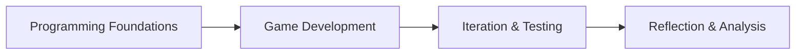

You will:

1. Learn how programs work
1. Apply those skills to game development
1. Improve your work through testing and iteration
1. Analyse and reflect on your design process

# Unit 1: Programming Foundations (AS92004)
## 1.1 What Is a Computer Program?

A computer program is a set of instructions that tells a computer:

- what to do
- when to do it
- how to respond to input

Programs follow *logic*, not intention.

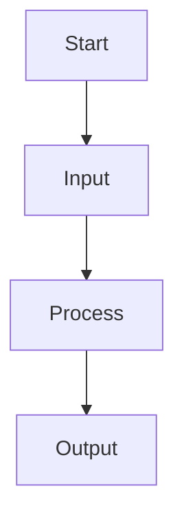

## 1.2 Program Structure

Most programs follow a predictable structure:

- input
- processing
- output

In Python, this often includes:

- variables
- conditionals
- loops
- functions

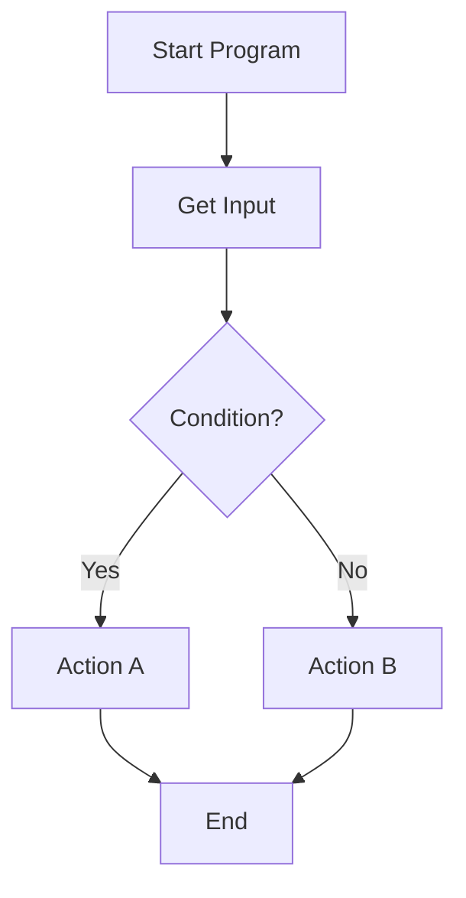

## 1.3 Control Structures
### Sequencing

Instructions run top to bottom, one at a time.

### Selection

Programs make decisions using conditions (if, else).

### Iteration

Programs repeat actions using loops.

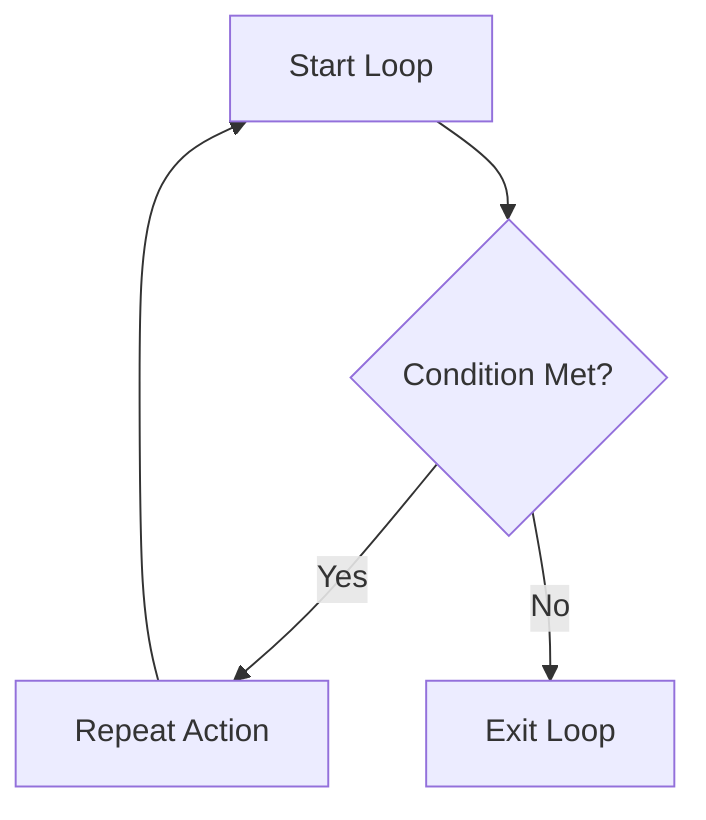

## 1.4 Testing and Debugging

Testing checks whether a program:

- behaves as expected
- handles incorrect input
- produces correct output

Debugging is the process of:

- identifying errors
- fixing logic
- improving clarity

Testing is evidence of *thinking*, not failure.

# Unit 2: Introduction to Game Development (AS92005)
## 2.1 What Is a Game?

A game is an interactive digital system with:

- rules
- player input
- feedback
- outcomes

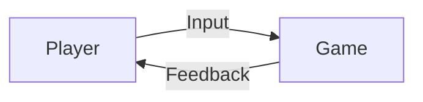
## 2.2 Core Game Components

Every game includes:
- player control
- game mechanics
- game state
- win/lose conditions

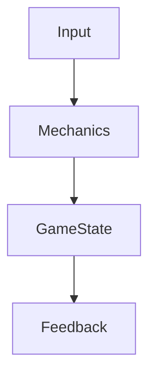

## 2.3 Game Engines and Godot

A game engine provides:

- rendering
- input handling
- physics
- scene management

In this course:

- Godot is the required engine
- GDScript is the scripting language

## 2.4 Scenes, Nodes, and Scripts

Godot games are built from:

- scenes (collections of objects)
- nodes (individual components)
- scripts (behaviour)

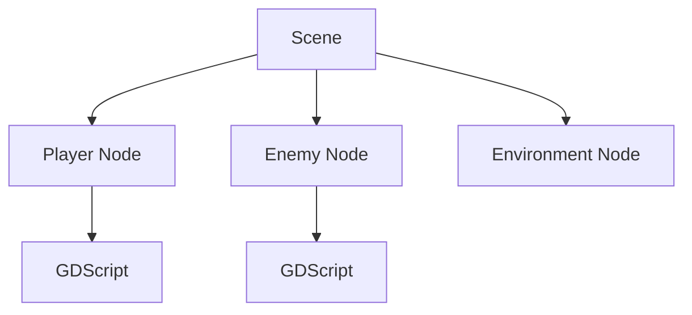

## 2.5 Game Mechanics

Game mechanics define:

- how the player interacts
- how the game responds
- what actions are possible

Examples:

- movement
- scoring
- collisions
- health systems

Mechanics should support the *purpose of the game*.

# Unit 3: Development Process & Iteration (AS92005)
## 3.1 The Game Development Process

Game development is iterative, not linear.

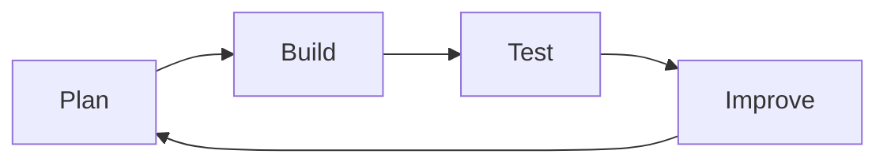

## 3.2 Iteration

Iteration means:

- testing your game
- identifying problems
- making improvements
- repeating the cycle

Iteration must be:

- visible
- documented
- purposeful

## 3.3 Playtesting

Playtesting involves:

- observing how others play your game
- collecting feedback
- identifying usability issues

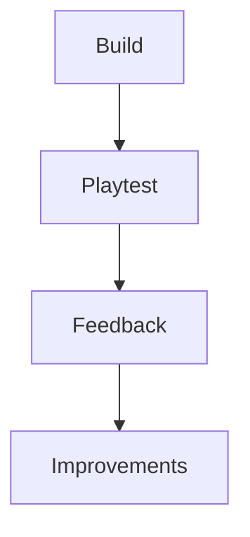

## 3.4 Managing Scope

Good games are:

- achievable
- stable
- focused

Adding too many features often:

- introduces bugs
- reduces quality
- weakens assessment outcomes

# Unit 4: Reflection and Analysis (AS92007)
## 4.1 What Is Reflection?

Reflection explains:

- what you did
- why you did it
- what changed
- what you learned

Reflection is *analysis*, not storytelling.

## 4.2 Describing vs Analysing

| Describing | Analysing |
| ---------- | --------- |
| What happened	| Why it happened |
| What I did | Why I chose it |
| What changed | Whether it improved the outcome |

Excellence requires *analysis*, not just description.

## 4.3 Linking Decisions to Outcomes

Strong reflection:

- links design decisions to player experience
- explains the impact of changes
- acknowledges limitations

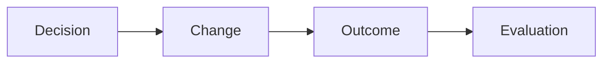

## 4.4 Using Evidence in Reflection

Good reflection refers to:

- specific mechanics
- specific changes
- specific testing outcomes

Generic reflections are weak and risky.

# How These Units Fit Together

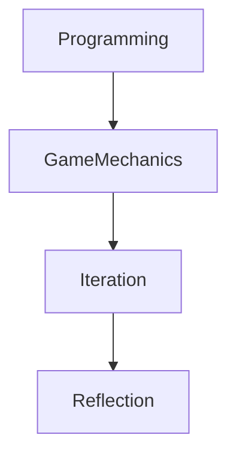

Each unit builds on the previous one.

# Final Notes

- These notes support learning — they are not assessment answers
- You are expected to apply these ideas in your own work
- Being able to explain concepts matters as much as building outcomes

*End of Course Notes*

