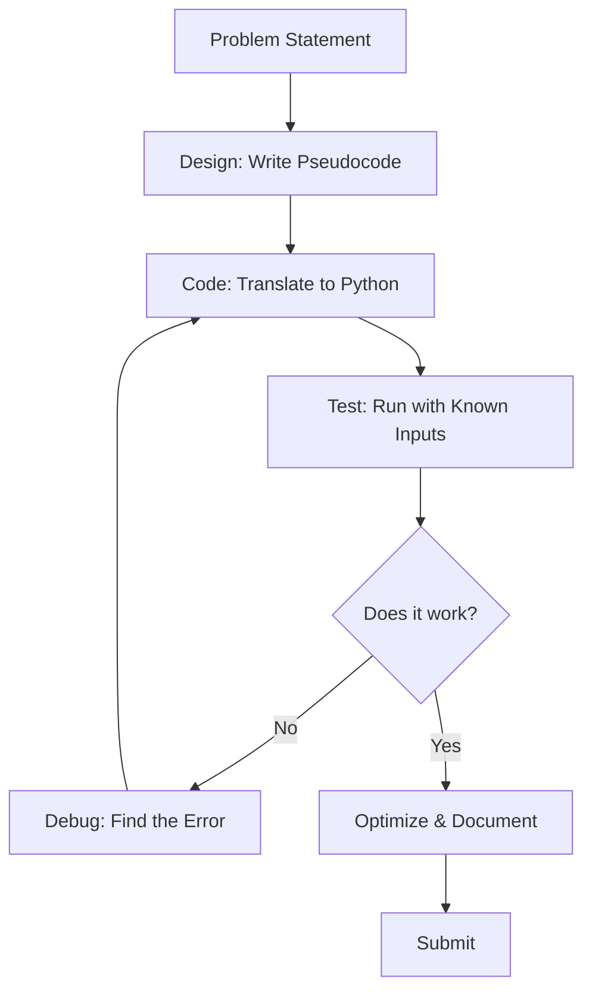
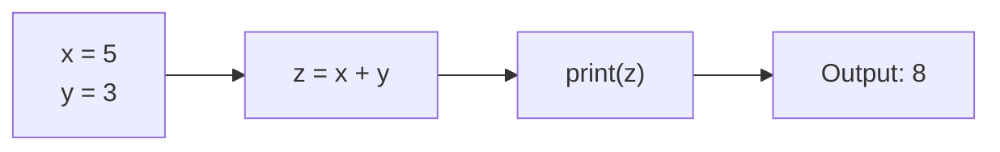
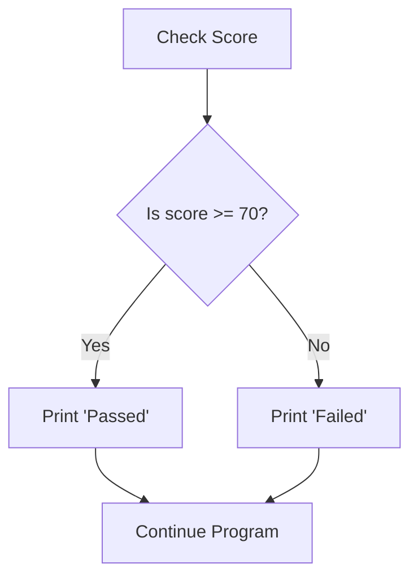
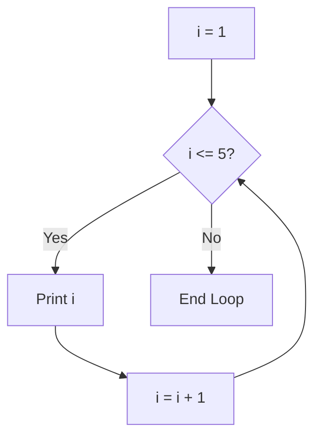

# Programming with Python – Unit Course Notes

**Course:** 12DGT  
**Year Level:** Year 12 (Level 7 – NCEA Level 2)  
**Unit / Module:** 01_Programming  
**Aligned Standard(s):** AS91896 – Programming with Python  
**Lesson Context:** Core skill development leading to summative assessment  
**Estimated Time:** ~12 weeks (5 weeks prep + 7 weeks assessment)

---

## 1. Purpose of These Notes

These notes exist to:
- explain programming concepts clearly and precisely
- support teacher-led instruction and independent practice
- provide a reference students can revisit
- reinforce correct terminology and thinking about code

These notes are **not** a substitute for writing code or debugging practice.

---

## 2. Key Concepts (Overview)

This section lists the **non-negotiable ideas** students must understand by the end of this unit:

- **Variables store data.** A variable is a container with a name that holds a value. The value can change.
- **Control structures (loops and conditionals) direct program flow.** Code does not always run top-to-bottom; decisions and repetition allow programs to adapt.
- **Functions break problems into smaller, reusable pieces.** A function packages code so it can be called multiple times without repetition.
- **Algorithms are step-by-step solutions to problems.** Before writing code, you plan the logic.
- **Testing and debugging verify correctness.** Programs must be tested systematically; errors are normal and expected.
- **Data structures organize information.** Lists and dictionaries store collections of related data efficiently.
- **Iteration (loops) and conditionals enable user input and decision-making.** Programs that respond to input are more useful than hard-coded solutions.

> If students cannot explain these ideas in their own words AND show them in working code, they have not mastered the topic.

---

## 3. Core Explanation

### Variables and Data Types

A **variable** is a named storage location that holds a value. Think of it as a labeled box: the label is the variable name, and the value inside is what we store.

```python
# Example: storing student data
student_name = "Alice"
student_age = 16
test_score = 87.5
passed = True
```

**Why variables matter:** Without variables, you would need to repeat values throughout your code. Variables let you:
- Use meaningful names (e.g., `student_age` instead of just `16`)
- Change values without rewriting the entire program
- Work with user input dynamically

**What goes wrong:** Students sometimes treat variables as "locks" that can't change. Actually, variables can be reassigned:
```python
# This is valid and normal
count = 0
count = count + 1  # count now equals 1
count = 10         # count now equals 10
```

---

### Control Structures: Conditionals

A **conditional** (if/elif/else) allows your program to make decisions based on data.

```python
# Example: checking if a student passed
test_score = 75
if test_score >= 70:
    print("You passed!")
else:
    print("You need to study more.")
```

**Why conditionals matter:** Real programs must adapt to different inputs. Without conditionals, your program behaves the same way every time, regardless of circumstances.

**What goes wrong:** Students often forget the colon (`:`) after the condition, or use `=` (assignment) instead of `==` (comparison):
```python
# WRONG: if test_score = 70:  ❌ This assigns instead of comparing
# RIGHT: if test_score == 70: ✓ This compares
```

---

### Control Structures: Loops

A **loop** repeats a block of code multiple times. There are two main types:

**For loops** repeat a known number of times:
```python
# Print numbers 1 to 5
for i in range(1, 6):
    print(i)
```

**While loops** repeat until a condition is false:
```python
# Keep asking for input until the user enters 'quit'
response = ""
while response != "quit":
    response = input("Enter 'quit' to exit: ")
```

**Why loops matter:** Without loops, you would need to write the same code over and over. Loops make programs flexible and concise.

**What goes wrong:** Students create **infinite loops** by accidentally making a condition that never becomes false:
```python
# WRONG: This loop never ends
while True:
    print("Help, I'm stuck!")
```

---

### Functions

A **function** is reusable code packaged with a name. Instead of writing the same logic multiple times, you define it once and call it whenever needed.

```python
# Define a function
def greet(name):
    print(f"Hello, {name}!")

# Call the function multiple times
greet("Alice")
greet("Bob")
greet("Charlie")
```

**Why functions matter:** They reduce repetition, make code easier to test, and organize large programs into understandable pieces.

**What goes wrong:** Students sometimes forget to call the function, or misunderstand parameters:
```python
# WRONG: This defines the function but never calls it
def add(a, b):
    return a + b

# RIGHT: This defines AND calls it
def add(a, b):
    return a + b

result = add(3, 5)  # result now equals 8
```

---

### Algorithms and Pseudocode

An **algorithm** is a step-by-step procedure to solve a problem. **Pseudocode** is a human-readable way to write an algorithm before coding it in Python.

**Example:** Algorithm to find the maximum value in a list.

**Pseudocode:**
```
1. Set max_value to the first item in the list
2. For each remaining item in the list:
   a. If the item is larger than max_value, update max_value
3. Return max_value
```

**Python code:**
```python
def find_max(numbers):
    max_value = numbers[0]
    for num in numbers[1:]:
        if num > max_value:
            max_value = num
    return max_value
```

**Why algorithms matter:** They separate *thinking* from *coding*. When you plan in pseudocode first, your code is clearer and bugs are fewer.

**What goes wrong:** Students jump straight to code without planning, leading to muddled logic and repeated rewrites.

---

### Testing and Debugging

**Testing** means running your code with known inputs and checking the outputs. **Debugging** means finding and fixing errors.

**Good testing practice:**
```python
def multiply(a, b):
    return a * b

# Test cases
print(multiply(3, 4))      # Expected: 12 ✓
print(multiply(0, 100))    # Expected: 0 ✓
print(multiply(-2, 5))     # Expected: -10 ✓
```

**Debugging approach:**
- Use `print()` statements to see what values your variables hold
- Read error messages carefully; they tell you what went wrong and where
- Trace through your code mentally or on paper before running it

**What goes wrong:** Students submit code that "works" for one case but fails for others (e.g., works for positive numbers but breaks with negative numbers).

---

### Data Structures: Lists and Dictionaries

A **list** stores multiple values in order:
```python
scores = [85, 92, 78, 88, 91]
print(scores[0])  # First item: 85
```

A **dictionary** stores key-value pairs, where you look up values by a meaningful key:
```python
student = {
    "name": "Alice",
    "age": 16,
    "grade": "A"
}
print(student["name"])  # Outputs: Alice
```

**Why data structures matter:** They let you organize related information efficiently. Lists are good for sequences; dictionaries are good for labeled data.

**What goes wrong:** Students confuse list indexing (which starts at 0) with human counting (which starts at 1):
```python
numbers = [10, 20, 30]
# numbers[0] is 10 (first item)
# numbers[1] is 20 (second item)
# numbers[2] is 30 (third item)
# numbers[3] does not exist ❌
```

---

## 4. Diagrams and Visual Models

### The Programming Workflow



### How Variables Flow Through a Program



### Conditional Logic Decision Tree



### Loop Iteration



---

## 5. Worked Examples (Conceptual, Not Procedural)

### Example 1: Calculating Student Grade

**Problem:** Write a program that asks for a test score and tells the student their grade (A, B, C, D, or F).

**Pseudocode (the thinking):**
```
1. Ask the user for their test score
2. If score >= 90, grade is A
3. Else if score >= 80, grade is B
4. Else if score >= 70, grade is C
5. Else if score >= 60, grade is D
6. Else, grade is F
7. Tell the user their grade
```

**Python code:**
```python
score = int(input("Enter your test score: "))

if score >= 90:
    grade = "A"
elif score >= 80:
    grade = "B"
elif score >= 70:
    grade = "C"
elif score >= 60:
    grade = "D"
else:
    grade = "F"

print(f"Your grade is: {grade}")
```

**Why this works:**
- The pseudocode breaks the problem into clear steps
- Each `elif` is checked only if the previous condition was false
- The final `else` catches all remaining cases (scores below 60)
- Using a variable `grade` instead of repeating the print logic is cleaner

**What students often get wrong:**
- Using `if` repeatedly instead of `elif`, which tests all conditions even after one matches (wastes time)
- Forgetting the colon after each condition
- Using `=` instead of `==` when comparing values

---

### Example 2: Finding the Sum of Numbers in a List

**Problem:** Write a function that takes a list of numbers and returns their sum.

**Pseudocode:**
```
1. Create a variable to hold the sum, starting at 0
2. For each number in the list:
   a. Add the number to the sum
3. Return the sum
```

**Python code:**
```python
def calculate_sum(numbers):
    total = 0
    for num in numbers:
        total = total + num
    return total

# Test cases
print(calculate_sum([1, 2, 3, 4, 5]))      # Expected: 15 ✓
print(calculate_sum([10, 20, 30]))         # Expected: 60 ✓
print(calculate_sum([]))                   # Expected: 0 ✓ (edge case)
print(calculate_sum([-5, 5]))              # Expected: 0 ✓ (negative numbers)
```

**Why this works:**
- The variable `total` starts at 0 (the identity for addition)
- The loop processes each number exactly once
- We test edge cases (empty list, negative numbers) to ensure robustness
- Returning a value instead of printing makes the function reusable

**What students often get wrong:**
- Starting `total` at the first number instead of 0, which loses the first value
- Resetting `total = 0` inside the loop, which wipes out previous additions
- Not testing edge cases like empty lists

---

### Example 3: Avoiding an Infinite Loop

**Problem:** Ask the user for a password until they enter the correct one.

**Pseudocode:**
```
1. Set the correct password
2. Set attempts to 0
3. While the user has not entered the correct password:
   a. Ask the user for their password
   b. Increment attempts
   c. If they entered correctly, break out of the loop
   d. Else, tell them it's wrong
4. Tell them they succeeded
```

**Python code:**
```python
correct_password = "secret123"
attempts = 0

while True:
    password = input("Enter password: ")
    attempts = attempts + 1
    
    if password == correct_password:
        print(f"Correct! It took {attempts} attempts.")
        break  # Exit the loop
    else:
        print("Wrong password. Try again.")
```

**Why this works:**
- The `while True` loop runs indefinitely
- The `break` statement provides an exit condition when the password is correct
- The `attempts` counter tracks how many tries it took
- String comparison `==` checks if two passwords are identical

**What students often get wrong:**
- Forgetting the `break` statement, creating an infinite loop that never exits
- Using assignment `=` instead of comparison `==` when checking the password
- Not incrementing `attempts`, so the count stays at 0

---

## 6. Common Misconceptions and Pitfalls

### Misconception 1: "Code runs top-to-bottom, always in the same order"

**Incorrect thinking:** Every line of code runs in sequence, no matter what.

**Why it's wrong:** Conditionals and loops change the order of execution. Code inside an `if` block might not run at all. Code inside a loop might run many times.

**Correct understanding:** Code follows the logic you define. A conditional decides whether to run a block. A loop repeats a block. Functions can be called from anywhere.

---

### Misconception 2: "Once I assign a value to a variable, it never changes"

**Incorrect thinking:** Variables are "set" like constants.

**Why it's wrong:** Variables are mutable; their values can be reassigned as many times as needed.

**Correct understanding:** A variable holds whatever value you last assigned to it. You can reassign it:
```python
x = 5
x = 10  # x is now 10, no longer 5
```

---

### Misconception 3: "The `=` symbol is the same as the `==` symbol"

**Incorrect thinking:** They both mean "equals."

**Why it's wrong:** `=` is assignment (store a value), while `==` is comparison (check if two values are equal).

**Correct understanding:**
```python
x = 5        # Assign 5 to x
if x == 5:   # Check if x equals 5
    print("Yes")
```

---

### Misconception 4: "If my code runs without errors, it's correct"

**Incorrect thinking:** No error message = the code is right.

**Why it's wrong:** Code can run successfully but produce wrong answers. Syntax errors are caught; logic errors are not.

**Correct understanding:** You must test your code with multiple inputs and verify the outputs are correct.

---

### Misconception 5: "Loops make my code slower; I should avoid them"

**Incorrect thinking:** More code execution time = bad.

**Why it's wrong:** Loops are essential for handling variable-sized data. Without loops, you'd need separate code for every possible list size.

**Correct understanding:** Loops are efficient and necessary. Optimize *logic*, not by avoiding loops.

---

### Misconception 6: "I should write lots of code at once before testing"

**Incorrect thinking:** Write everything, then test everything.

**Why it's wrong:** If you write 100 lines of code without testing, you'll have many bugs to find at once. Debugging becomes very difficult.

**Correct understanding:** Write small chunks, test frequently, and fix bugs as you go. This is called **incremental development**.

---

## 7. Assessment Relevance

This unit directly prepares you for **AS91896 – Programming with Python**, which requires:

- **Source code** that uses appropriate variables, control structures, and functions
- **Test evidence** showing your code works correctly for multiple inputs
- **Debugging evidence** showing how you found and fixed errors
- **Design documentation** (pseudocode or flowchart) showing you planned before coding
- **Reflection** on what you learned and what was difficult

**What you'll be asked to do:**
- Write a program that solves a real-world problem (e.g., process student data, manage a simple game)
- Show your thinking with pseudocode or comments
- Test your code systematically and document the results
- Explain any errors you found and how you fixed them
- Write clear comments so your code is readable

**Why this matters in industry:**
- Programmers spend more time debugging than writing new code
- Professional code includes comments and documentation
- Testing catches errors before they reach users
- Planning (pseudocode) saves time and reduces mistakes

---

## 8. External Resources (Optional but Recommended)

### Video Resources

These videos reinforce key concepts and show real Python coding in action:

- **Python Basics for Beginners** – Corey Schafer – [YouTube Playlist](https://www.youtube.com/playlist?list=PL-osiE80TeTskrapNbzXhwoFUiLCjGgY7) – Excellent breakdown of variables, functions, and control flow
- **Control Flow in Python (If, Else, Elif)** – Programming with Mosh – [YouTube](https://www.youtube.com/watch?v=sxTmJE4k0Dc) – Clear explanation of conditionals with examples
- **Python Loops (For and While)** – Corey Schafer – [YouTube](https://www.youtube.com/watch?v=beA8P1qAJK4) – Visual walkthrough of how loops work
- **Debugging Python Code** – Real Python – [YouTube](https://www.youtube.com/watch?v=1QByIOWWsnA) – How to use print statements and debuggers effectively
- **Functions in Python** – Corey Schafer – [YouTube](https://www.youtube.com/watch?v=9Os0o12WeWo) – Parameters, return values, and reusable code

### Interactive Practice Tools

- **Replit** – https://replit.com – Write and run Python code directly in your browser; great for experimenting
- **Python Tutor** – https://pythontutor.com – Visualize how your code executes step-by-step
- **LeetCode / HackerRank** – Free coding challenges to practice algorithms

### Textbooks and Guides

- **Automate the Boring Stuff with Python** (free online) – https://automatetheboringstuff.com – Beginner-friendly, practical examples
- **Real Python Tutorials** – https://realpython.com – In-depth articles on Python concepts

---

## 9. Key Vocabulary

Students are expected to understand and use this terminology accurately:

- **Algorithm:** A step-by-step procedure to solve a problem.
- **Variable:** A named storage location that holds a value; the value can change.
- **Assignment:** Storing a value in a variable using `=`.
- **Comparison:** Checking if two values are equal using `==`, or comparing with `>`, `<`, etc.
- **Conditional:** An `if`, `elif`, or `else` statement that makes a decision based on a condition.
- **Loop:** A block of code that repeats; either `for` (fixed number) or `while` (until a condition is false).
- **Function:** Reusable code packaged with a name; takes parameters and may return a value.
- **Parameter:** A variable that a function accepts as input.
- **Return value:** The value a function sends back after it finishes.
- **List:** An ordered collection of values stored in a single variable.
- **Dictionary:** A collection of key-value pairs where you look up values by a meaningful key.
- **Index:** The position of an item in a list (starting at 0).
- **Pseudocode:** Human-readable text describing an algorithm before coding it.
- **Syntax:** The rules and format of a programming language (e.g., Python requires colons after conditionals).
- **Bug:** An error in code that causes it to behave incorrectly.
- **Debugging:** The process of finding and fixing bugs.
- **Testing:** Running code with known inputs and verifying the outputs.
- **Edge case:** An unusual or extreme input (e.g., negative numbers, empty lists) that tests robustness.
- **Iteration:** Repeating a process; often refers to loops or gradual refinement.
- **Documentation:** Written explanation of what code does and how to use it; includes comments and README files.

---

*End of Programming with Python – Unit Course Notes*
