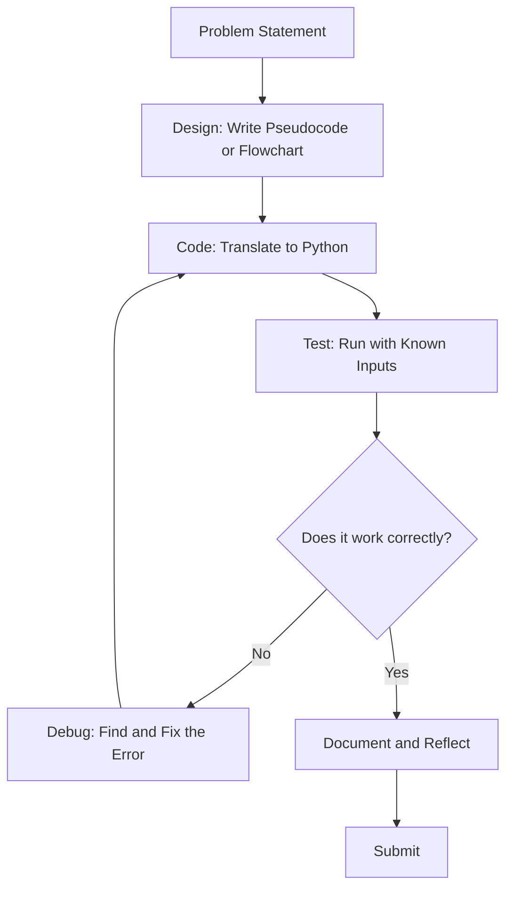

# Programming with Python – Unit Overview

**Course:** 12DGT  
**Year Level:** Year 12 (Level 7 – NCEA Level 2)  
**Unit / Module:** 01_Programming  
**Aligned Standard(s):** AS91896 – Programming with Python  
**Lesson Context:** Unit overview — links to individual topic notes  
**Estimated Time:** ~12 weeks (5 weeks prep + 7 weeks assessment)

---

## 1. Purpose of These Notes

These notes exist to:
- explain programming concepts clearly and precisely
- support teacher-led instruction and independent practice
- provide a reference students can revisit
- reinforce correct terminology and thinking about code

These notes are **not** a substitute for writing code or debugging practice.

---

## 2. Key Concepts (Overview)

This section lists the **non-negotiable ideas** students must understand by the end of this unit:

- **Variables store data.** A variable is a container with a name that holds a value. The value can change.

[Video: Python Variables and Data Types](https://www.youtube.com/watch?v=khKv-8q7YmY)
<iframe width="560" height="315" src="https://www.youtube.com/embed/khKv-8q7YmY" title="YouTube video player" frameborder="0" allow="accelerometer; autoplay; clipboard-write; encrypted-media; gyroscope; picture-in-picture; web-share" referrerpolicy="strict-origin-when-cross-origin" allowfullscreen></iframe>

- **Control structures (loops and conditionals) direct program flow.** Code does not always run top-to-bottom; decisions and repetition allow programs to adapt.

[Video: Python If Statements and Loops](https://www.youtube.com/watch?v=6iF8Xb7Z3wQ)
<iframe width="560" height="315" src="https://www.youtube.com/embed/6iF8Xb7Z3wQ" title="YouTube video player" frameborder="0" allow="accelerometer; autoplay; clipboard-write; encrypted-media; gyroscope; picture-in-picture; web-share" referrerpolicy="strict-origin-when-cross-origin" allowfullscreen></iframe>

- **Functions break problems into smaller, reusable pieces.** A function packages code so it can be called multiple times without repetition.
- **Algorithms are step-by-step solutions to problems.** Before writing code, you plan the logic.
- **Testing and debugging verify correctness.** Programs must be tested systematically; errors are normal and expected.
- **Data structures organize information.** Lists and dictionaries store collections of related data efficiently.

[Video: Python Lists and Dictionaries Explained](https://www.youtube.com/watch?v=daefaLgNkw0)
<iframe width="560" height="315" src="https://www.youtube.com/embed/daefaLgNkw0" title="YouTube video player" frameborder="0" allow="accelerometer; autoplay; clipboard-write; encrypted-media; gyroscope; picture-in-picture; web-share" referrerpolicy="strict-origin-when-cross-origin" allowfullscreen></iframe>

- **Iteration (loops) and conditionals enable user input and decision-making.** Programs that respond to input are more useful than hard-coded solutions.

> If students cannot explain these ideas in their own words AND show them in working code, they have not mastered the topic.

---

## 3. Topic Notes

This unit is split across individual topic notes. Read each topic in order — each one builds on the previous.

| # | Topic | File |
|---|-------|------|
| 1 | Variables and Data Types | [2_variables_and_data_types.mdx](2_variables_and_data_types.mdx) |
| 2 | Control Flow: Conditionals | [3_control_flow_conditionals.mdx](3_control_flow_conditionals.mdx) |
| 3 | Control Flow: Loops | [4_control_flow_loops.mdx](4_control_flow_loops.mdx) |
| 4 | Functions | [5_functions.mdx](5_functions.mdx) |
| 5 | Algorithms and Pseudocode | [6_algorithms_and_pseudocode.mdx](6_algorithms_and_pseudocode.mdx) |
| 6 | Data Structures: Lists and Dictionaries | [7_data_structures.mdx](7_data_structures.mdx) |
| 7 | Testing and Debugging | [8_testing_and_debugging.mdx](8_testing_and_debugging.mdx) |

> Work through these in order during the prep phase. Return to specific topics when preparing for the assessment.

---

## 4. Assessment Overview (AS91896)

This unit leads to an **internal assessment worth 4 credits** at NCEA Level 2.

### What you will produce

| Evidence item | Description |
|---|---|
| Source code | A Python program solving a real-world problem |
| Test evidence | At least 3 test cases per major function |
| Debugging evidence | Comments identifying errors and how they were fixed |
| Design documentation | Pseudocode or flowchart showing pre-code planning |
| Reflection | Written statement covering what worked, what was difficult, and what you'd improve |

### Grade expectations at a glance

| Grade | What it looks like |
|---|---|
| **Achieved** | Basic program works; some control structures used; minimal testing and documentation |
| **Merit** | Functional program; appropriate use of structures with justification; testing and iteration evident |
| **Excellence** | Well-structured, efficient code; design decisions explained; systematic testing; insightful reflection |

> Missing evidence items are the most common reason for not achieving. Complete all five items.

---

## 5. Programming Workflow

Before writing a single line of code, plan. After writing code, test and debug. This cycle repeats until the program is correct.

> The loop between Code → Test → Debug is normal. Professional programmers spend more time in this loop than anywhere else.

---

## 6. External Resources

A full list of recommended resources is in each topic note. Key tools used throughout this unit:

- **Replit** – https://replit.com – Write and run Python in your browser without installing anything
- **Python Tutor** – https://pythontutor.com – Step through code line-by-line to see exactly what is happening
- **Automate the Boring Stuff with Python** – https://automatetheboringstuff.com – Free textbook; chapters 1–6 match this unit
- **Real Python** – https://realpython.com – In-depth guides on every topic in this unit

---

## 7. Key Vocabulary

Students are expected to understand and use this terminology accurately:

- **Algorithm:** A step-by-step procedure to solve a problem.
- **Variable:** A named storage location that holds a value; the value can change.
- **Assignment:** Storing a value in a variable using `=`.
- **Comparison:** Checking if two values are equal using `==`, or comparing with `>`, `<`, etc.
- **Conditional:** An `if`, `elif`, or `else` statement that makes a decision based on a condition.
- **Loop:** A block of code that repeats; either `for` (fixed number) or `while` (until a condition is false).
- **Function:** Reusable code packaged with a name; takes parameters and may return a value.
- **Parameter:** A variable that a function accepts as input.
- **Return value:** The value a function sends back after it finishes.
- **List:** An ordered collection of values stored in a single variable.
- **Dictionary:** A collection of key-value pairs where you look up values by a meaningful key.
- **Index:** The position of an item in a list (starting at 0).
- **Pseudocode:** Human-readable text describing an algorithm before coding it.
- **Syntax:** The rules and format of a programming language (e.g., Python requires colons after conditionals).
- **Bug:** An error in code that causes it to behave incorrectly.
- **Debugging:** The process of finding and fixing bugs.
- **Testing:** Running code with known inputs and verifying the outputs.
- **Edge case:** An unusual or extreme input (e.g., negative numbers, empty lists) that tests robustness.
- **Iteration:** Repeating a process; often refers to loops or gradual refinement.
- **Documentation:** Written explanation of what code does and how to use it; includes comments and README files.

---

*End of Programming with Python – Unit Overview*