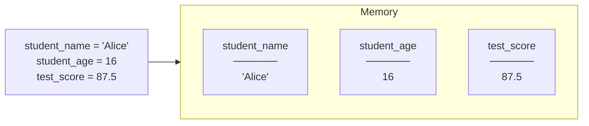
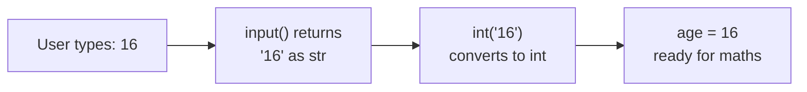
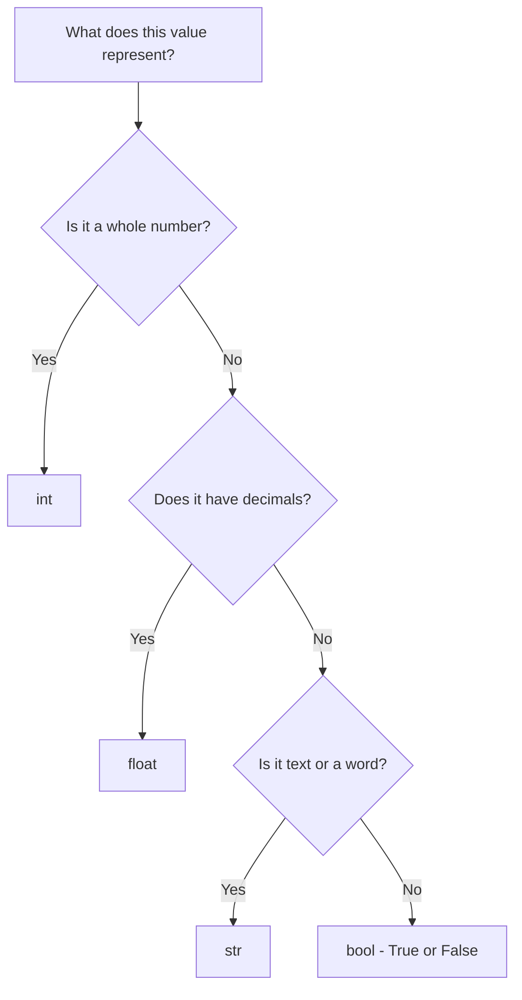

# Variables and Data Types
**Course:** 12DGT  
**Year Level:** Year 12 (Level 7 – NCEA Level 2)  
**Aligned Standard:** AS91896 – Programming with Python  
**Previous topic:** [Unit Overview](1_programming_fundamentals.md)  
**Next topic:** [Control Flow: Conditionals](3_control_flow_conditionals.md)

---

## 1. Purpose of These Notes

These notes exist to:
- explain what variables are and why programs need them
- describe Python's four core data types (int, float, str, bool)
- explain how to convert between data types safely
- establish naming conventions that will matter for assessment

These notes are **not** a substitute for practice. You must write code to understand this.

---

## 2. Key Concepts (Overview)

Non-negotiable ideas you must understand by the end of this topic:

- A **variable** is a named container that holds a value. The name and value are separate things.
- Every value in Python has a **data type**. The type determines what operations are valid.
- Variables can be **reassigned**; the name stays, but the stored value can change.
- **User input** from `input()` always returns a string. You must convert it to int or float before doing maths.
- **Meaningful variable names** are required for Merit and Excellence — a name like `x` tells the reader nothing.

> If you cannot identify the data type of a value and explain why it matters, you have not mastered this topic.

---

## 3. Core Explanation

### What is a Variable?

A variable is a named location in memory where your program stores a piece of data. Think of it as a labelled box:
- The **label** is the variable name
- The **contents** of the box are the stored value
- You can take the old contents out and put something new in (reassignment)

```python
# Creating variables
student_name = "Alice"   # label: student_name, contents: "Alice"
age = 16                 # label: age, contents: 16
score = 87.5             # label: score, contents: 87.5
passed = True            # label: passed, contents: True
```

Variables make programs flexible: instead of hard-coding a specific value, you use a name that can hold different values each time the program runs.

---

### The Four Core Data Types

Python has four types you will use constantly:

| Type | Keyword | Example values | Use for |
|------|---------|----------------|---------|
| Integer | `int` | `0`, `16`, `-5`, `100` | Whole numbers — counts, ages, scores |
| Float | `float` | `87.5`, `3.14`, `-0.1` | Decimal numbers — averages, measurements |
| String | `str` | `"Alice"`, `"pass"`, `"Y"` | Text — names, messages, user input |
| Boolean | `bool` | `True`, `False` | Yes/no states — flags, conditions |

```python
# Examples of each type
student_name = "Alice"       # str
student_age = 16             # int
average_score = 87.5         # float
has_submitted = False        # bool
```

**Why types matter:** Different types support different operations. You can add two integers, but adding a string and an integer causes an error:

```python
# This works fine
total = 80 + 90              # int + int = int (170)

# This fails
bad_total = "80" + 90        # str + int = TypeError ❌
```

---

### Checking the Type of a Value

Use `type()` to see what type a variable holds:

```python
score = 87.5
print(type(score))           # <class 'float'>

name = "Alice"
print(type(name))            # <class 'str'>

count = 0
print(type(count))           # <class 'int'>
```

This is useful when debugging — if an operation fails, checking the type of a variable often reveals why.

---

### Converting Between Types

Python will not automatically convert between types when you do operations on them. You must do it explicitly:

```python
# Converting string to integer
age_string = "16"           # This is a string
age_number = int(age_string)  # Now it's an integer: 16

# Converting string to float
score_string = "87.5"
score_number = float(score_string)  # Now it's a float: 87.5

# Converting number to string (for display)
result = 95
message = "Your score is: " + str(result)   # "Your score is: 95"
```

**Why this matters with `input()`:** The built-in `input()` function always returns a string, no matter what the user types:

```python
# This looks like it gets a number — but it gets a string "16"
age = input("Enter your age: ")
print(type(age))             # <class 'str'> — NOT int!

# Correct approach: convert immediately
age = int(input("Enter your age: "))
print(type(age))             # <class 'int'> ✓
```

---

### Reassigning Variables

A variable holds **whatever value you last assigned to it**. You can change the value at any time:

```python
score = 50
print(score)         # 50

score = 80           # Reassigned — old value is gone
print(score)         # 80

score = score + 10   # Calculate new value from old, then reassign
print(score)         # 90
```

This is normal and expected. Programs update variables as they process data (e.g., adding to a running total, incrementing a counter).

---

### Naming Conventions

Python variable names must follow these rules:
- Start with a letter or underscore (`_`), not a number
- Contain only letters, numbers, and underscores
- No spaces or special characters

Beyond the rules, good names are **meaningful and readable**. This matters for your AS91896 grade:

```python
# Poor names — valid Python but unreadable
x = "Alice"
y = 16
z = 87.5

# Good names — clear, readable, self-documenting
student_name = "Alice"
student_age = 16
test_score = 87.5
```

Python convention is **snake_case**: all lowercase, with underscores between words.

---

## 4. Diagrams and Visual Models

### Variables as Labeled Boxes



### Type Conversion Flow for User Input



### Data Type Decision



---

## 5. Worked Examples (Conceptual, Not Procedural)

### Example 1: Collecting and Using Student Data

**Problem:** Write a program that asks a student for their name and test score, then prints a formatted result.

**Thinking through the types:**
- Name is text → `str` (no conversion needed; `input()` already returns str)
- Score is a number with possible decimals → `float` (convert from input)

```python
# Get inputs and convert to the right types
student_name = input("Enter your name: ")           # str — no conversion needed
test_score = float(input("Enter your score: "))     # float — convert from str

# Calculate a grade (more on conditionals in the next topic)
if test_score >= 80:
    grade = "Merit"
elif test_score >= 50:
    grade = "Achieved"
else:
    grade = "Not Achieved"

# Display result — convert score back to str for concatenation
print(student_name + " scored " + str(test_score) + " — " + grade)
```

**Why this works:**
- `float()` converts the input string to a decimal number, enabling mathematical comparison
- `str(test_score)` converts the number back to text so it can be joined to the output message
- Variable names (`student_name`, `test_score`, `grade`) are self-documenting — any reader understands what each one holds

---

### Example 2: Detecting a Type Error Before It Happens

**Problem:** A student writes this code and gets an error. Why?

```python
score = input("Enter score: ")   # User types: 75
bonus = 5
total = score + bonus            # TypeError!
```

**Diagnosis:**
- `input()` always returns a string
- `score` holds `"75"` (a string), not `75` (an integer)
- Python cannot add a string and an integer — they are incompatible types

**Fix:**
```python
score = int(input("Enter score: "))  # Convert immediately
bonus = 5
total = score + bonus                # Now int + int = 80 ✓
```

**Key insight:** Type errors are one of the most common bugs in beginner Python. Always convert `input()` values before using them in calculations.

---

## 6. Common Misconceptions and Pitfalls

### Misconception 1: "Variables are permanent once set"

**Incorrect thinking:** Once you write `name = "Alice"`, `name` always equals `"Alice"`.

**Why it's wrong:** Variables can be reassigned at any time. Each new assignment replaces the old value.

**Correct understanding:** A variable holds its **most recent** value. This is what makes loops and interactive programs work.

---

### Misconception 2: "`input()` gives me the right type automatically"

**Incorrect thinking:** If the user types `16`, Python stores it as the integer `16`.

**Why it's wrong:** `input()` always returns a string. `"16"` and `16` are completely different — one is text, the other is a number.

**Correct understanding:** Identify what type you need, then convert: `int(input(...))` or `float(input(...))`.

---

### Misconception 3: "Variable names don't matter as long as the code runs"

**Incorrect thinking:** Short names like `x`, `y`, `n` are fine because the computer understands them.

**Why it's wrong:** Your AS91896 submission is read by a teacher, not just a computer. Unreadable names suggest you don't understand your own code. Merit and Excellence require names that communicate intent.

**Correct understanding:** Names like `student_count`, `total_score`, `is_valid` explain what data the variable holds — this is required for better grades.

---

### Misconception 4: "You can add numbers and strings if they look the same"

**Incorrect thinking:** `"5" + 5` should work because they're both "5".

**Why it's wrong:** Python is strict about types. `"5"` is text; `5` is a number. `+` with a string means concatenation; `+` with numbers means addition. These are different operations.

**Correct understanding:** Convert first. `int("5") + 5` gives `10`. `"5" + str(5)` gives `"55"`.

---

## 7. Assessment Relevance (AS91896)

### Where variables appear in your assessment

Every part of your AS91896 program uses variables:
- Storing user input before processing it
- Accumulating results (running totals, counters)
- Passing data between functions via parameters

### What each grade level expects

| Grade | Variable standard |
|---|---|
| **Achieved** | Variables used and program runs; names may be unclear |
| **Merit** | Meaningful names; correct types used consistently; input converted correctly |
| **Excellence** | Variables clearly reflect the problem domain; types managed carefully with evidence of design thinking |

### Evidence checklist

- [ ] All variables have meaningful, descriptive names (snake_case)
- [ ] Input from `input()` is converted to the correct type before use
- [ ] Comments explain what each variable holds and why
- [ ] No variables are left unused or holding incorrect types

---

## 8. External Resources

### Video
- **Python Variables and Data Types** – Corey Schafer – [YouTube](https://www.youtube.com/watch?v=YYXdXT2l-Gg) – Clear, practical walkthrough of variable assignment and types
- **Python Type Conversion** – Programming with Mosh – [YouTube](https://www.youtube.com/watch?v=khKv-8q7YmY) – Common type errors and how to fix them

### Practice Tools
- **Python Tutor** – https://pythontutor.com – Visualise exactly when a variable is created and what it holds at each step
- **Replit** – https://replit.com – Write and test variable code directly in your browser

### Reading
- **Automate the Boring Stuff, Chapter 1** – https://automatetheboringstuff.com/2e/chapter1/ – Variables and data types with practical examples

---

## 9. Key Vocabulary

- **Variable:** A named location in memory that stores a value which can change.
- **Data type:** The category of a value — determines what operations are valid on it.
- **int:** Integer data type; whole numbers with no decimal point.
- **float:** Floating-point data type; numbers with a decimal component.
- **str:** String data type; a sequence of text characters.
- **bool:** Boolean data type; either `True` or `False`.
- **Assignment:** Storing a value in a variable using the `=` operator.
- **Reassignment:** Changing the value stored in an existing variable.
- **Type conversion:** Explicitly changing a value from one data type to another (e.g., `int("5")`).
- **`input()`:** A Python function that pauses the program and waits for the user to type something; always returns a string.
- **snake_case:** Python naming convention — all lowercase with underscores separating words (e.g., `student_name`).
- **`type()`:** A Python function that returns the data type of a value.

---

*End of Variables and Data Types*
