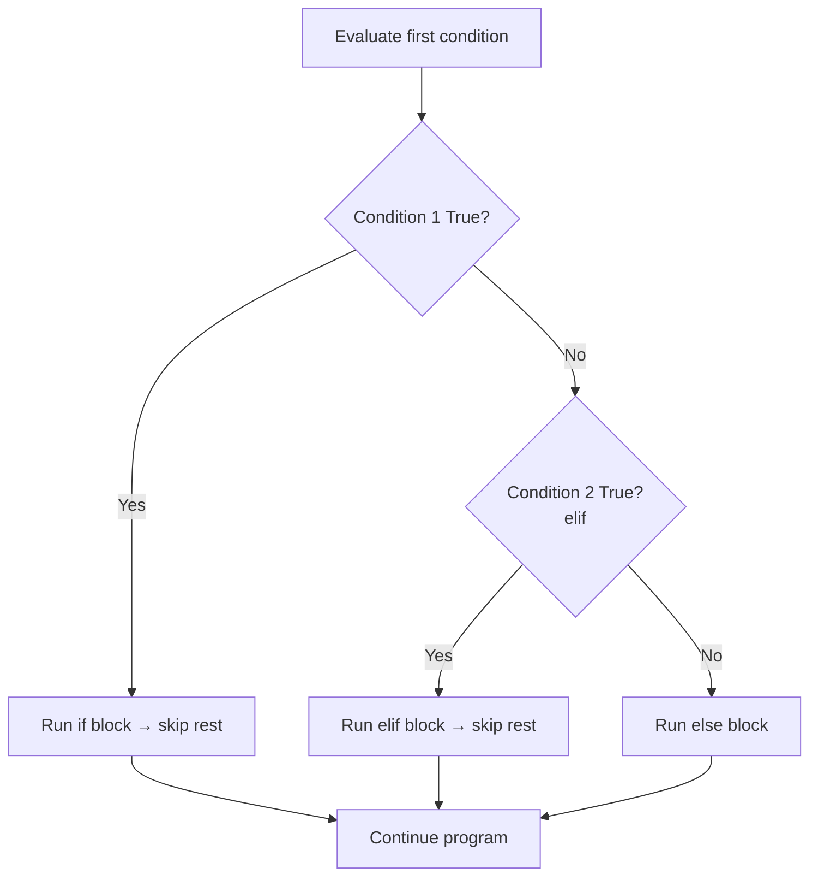
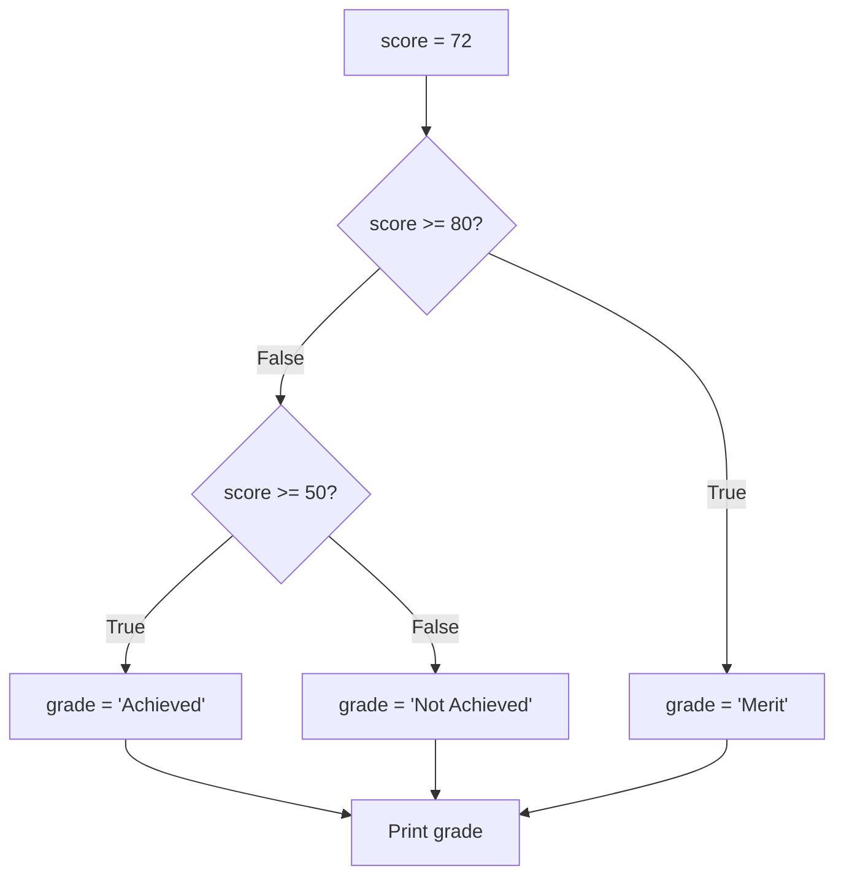

# Control Flow: Conditionals
**Course:** 12DGT  
**Year Level:** Year 12 (Level 7 – NCEA Level 2)  
**Aligned Standard:** AS91896 – Programming with Python  
**Previous topic:** [Variables and Data Types](2_variables_and_data_types.mdx)  
**Next topic:** [Control Flow: Loops](4_control_flow_loops.mdx)

---

## 1. Purpose of These Notes

These notes exist to:
- explain how conditionals change the flow of a program
- clarify the difference between `if`, `elif`, and `else`
- describe comparison and Boolean operators
- address the most common conditional errors before they occur in assessments

These notes are **not** a substitute for writing and testing your own conditional code.

---

## 2. Key Concepts (Overview)

Non-negotiable ideas you must understand by the end of this topic:

- A **conditional** lets a program make a decision — it runs some code *only if* a condition is true.
- `if`, `elif`, and `else` are distinct: `if` starts the chain; `elif` handles additional cases; `else` catches everything else.
- **Comparison operators** (`==`, `!=`, `>`, `<`, `>=`, `<=`) produce `True` or `False` — they do not store a value.
- **`=` is assignment; `==` is comparison.** These are completely different operations.
- **Indentation** is not optional in Python — it defines what code belongs inside a conditional block.

> If you cannot trace through a set of conditionals by hand and correctly predict which branch executes, you have not mastered this topic.

---

## 3. Core Explanation

### What is a Conditional?

A conditional checks a condition (an expression that evaluates to `True` or `False`) and runs a specific block of code depending on the result.

Without conditionals, a program would do the same thing regardless of the input. Conditionals are what make programs adaptable.

---

### The `if` Statement

The simplest form: run a block of code only when a condition is true.

```python
score = 75

if score >= 50:
    print("You passed!")   # Only runs if score >= 50
```

If `score` were `40`, nothing would print — the `if` block is skipped entirely.

---

### The `if / else` Structure

Add `else` to handle the case when the condition is false:

```python
score = 40

if score >= 50:
    print("You passed!")
else:
    print("You did not pass.")
```

Exactly one of these two `print()` calls will run. `if` and `else` are mutually exclusive.

---

### The `if / elif / else` Chain

Use `elif` (short for "else if") to check additional conditions after the first `if` fails:

```python
score = 72

if score >= 80:
    grade = "Merit"
elif score >= 50:
    grade = "Achieved"
else:
    grade = "Not Achieved"

print(f"Grade: {grade}")
```

**How Python reads this chain:**
1. Check `score >= 80` → False (72 is not ≥ 80)
2. Check `score >= 50` → True (72 is ≥ 50) → set `grade = "Achieved"`, skip remaining branches
3. `else` is skipped because a branch already matched

**Critical rule:** Once one branch matches, all remaining branches are skipped. Python does not continue checking.

---

### Comparison Operators

These operators compare two values and return `True` or `False`:

| Operator | Meaning | Example | Result |
|----------|---------|---------|--------|
| `==` | Equal to | `5 == 5` | `True` |
| `!=` | Not equal to | `5 != 3` | `True` |
| `>` | Greater than | `10 > 7` | `True` |
| `<` | Less than | `3 < 1` | `False` |
| `>=` | Greater than or equal | `5 >= 5` | `True` |
| `<=` | Less than or equal | `4 <= 3` | `False` |

---

### Boolean Operators: `and`, `or`, `not`

Combine multiple conditions:

```python
age = 17
has_id = True

# and: BOTH conditions must be True
if age >= 16 and has_id:
    print("Entry allowed")

# or: AT LEAST ONE condition must be True
score = 45
if score >= 50 or score == 45:
    print("Special case handled")

# not: reverses True/False
if not has_id:
    print("No ID — entry denied")
```

**Reading `and` and `or`:**
- `A and B` → True only if both A and B are True
- `A or B` → True if at least one of A, B is True
- `not A` → True if A is False; False if A is True

---

### Nested Conditionals

You can place a conditional inside another conditional:

```python
score = 88
attendance = 75

if score >= 80:
    if attendance >= 80:
        result = "Merit with full attendance"
    else:
        result = "Merit — but attendance is low"
else:
    result = "Below Merit threshold"

print(result)
```

**Use nested conditionals carefully.** More than two levels of nesting usually signals that the logic should be restructured using `and`/`or` or broken into a function.

---

## 4. Diagrams and Visual Models

### The `if / elif / else` Decision Flow



### Grade Classifier — Example Trace



---

## 5. Worked Examples (Conceptual, Not Procedural)

### Example 1: Student Grade Classifier

**Problem:** Classify a student's performance based on their score.

**Design thinking:**
- Four possible outcomes need four distinct conditions
- Using `elif` avoids rechecking conditions that already failed
- The `else` catches any score below the lowest threshold

```python
score = int(input("Enter score (0–100): "))

if score >= 80:
    grade = "Merit"
    feedback = "Strong performance — review for Excellence criteria."
elif score >= 50:
    grade = "Achieved"
    feedback = "You met the standard — push for Merit next time."
elif score >= 0:
    grade = "Not Achieved"
    feedback = "Below standard — review foundational concepts."
else:
    grade = "Invalid"
    feedback = "Score must be between 0 and 100."

print(f"Grade: {grade}")
print(f"Feedback: {feedback}")
```

**Why `elif` and not separate `if` statements?**  
If we used separate `if` statements, a score of 85 would trigger BOTH the `>= 80` and `>= 50` blocks — printing two conflicting messages. `elif` ensures only the first matching branch runs.

---

### Example 2: Access Control with Multiple Conditions

**Problem:** A system grants access only to students aged 16 or over who have a verified account.

```python
age = int(input("Enter your age: "))
account_verified = input("Account verified? (yes/no): ").lower() == "yes"

if age >= 16 and account_verified:
    print("Access granted.")
elif age >= 16 and not account_verified:
    print("Age OK — please verify your account first.")
elif age < 16 and account_verified:
    print("Account verified — but you must be 16 or older.")
else:
    print("Access denied — age not met and account not verified.")
```

**Why this works well:**
- `and` combines two related conditions cleanly
- Each `elif` handles a specific combination, making the logic explicit
- The `else` catches the only remaining case (both conditions false)
- Using `.lower() == "yes"` avoids case-sensitivity issues with user input

---

## 6. Common Misconceptions and Pitfalls

### Misconception 1: "`=` and `==` do the same thing in a condition"

**Incorrect thinking:** You can write `if score = 50:` to check if score equals 50.

**Why it's wrong:** `=` is assignment (it stores a value). `==` is comparison (it checks equality and returns True/False). Python will raise a `SyntaxError` if you use `=` in a condition.

**Correct understanding:**
```python
score = 50        # Assignment: puts 50 into score
if score == 50:   # Comparison: checks if score equals 50
    print("Yes")
```

---

### Misconception 2: "Python checks all `elif` branches even after one matches"

**Incorrect thinking:** All `elif` conditions are evaluated in order, and multiple can run.

**Why it's wrong:** As soon as one branch matches, Python skips all remaining `elif` and `else` blocks.

**Correct understanding:**
```python
score = 90
if score >= 50:
    print("Achieved")    # This runs
elif score >= 80:
    print("Merit")       # This is NEVER reached for score=90
```
If you want multiple things to run, use separate `if` statements — not `elif`.

---

### Misconception 3: "Indentation doesn't matter — Python figures it out"

**Incorrect thinking:** Python is flexible about spacing inside a block.

**Why it's wrong:** Python uses indentation to define blocks. A misindented line is either an IndentationError or, worse, code that runs in the wrong place silently.

**Correct understanding:**
```python
if score >= 50:
    print("Passed")      # Inside the if block — 4 spaces
    print("Well done")   # Also inside — correct

print("This always runs")  # Outside the if block — no indent
```

---

### Misconception 4: "`else` is always required"

**Incorrect thinking:** Every `if` needs an `else`.

**Why it's wrong:** `else` is optional. If no branch matches and there is no `else`, Python simply continues to the next statement.

**Correct understanding:** Use `else` when there is a default action for unmatched cases. Omit it when no action is needed for the unmatched case.

---

## 7. Assessment Relevance (AS91896)

Conditionals appear in nearly every Python program you will submit. They are one of the required control structures.

### What each grade level expects

| Grade | Conditional standard |
|---|---|
| **Achieved** | Basic `if/else` used; program produces correct output for typical inputs |
| **Merit** | `if/elif/else` used appropriately; conditions reflect the problem's logic; some justification in comments |
| **Excellence** | Conditions are well-designed (e.g., handling edge cases like negative input); logic is justified in design documentation; no redundant checks |

### Evidence checklist for conditionals

- [ ] Used `elif` where multiple cases need checking (not repeated `if` statements)
- [ ] Used `else` to handle unexpected or default inputs
- [ ] Comments explain what each branch is for (`# If the score is below passing threshold...`)
- [ ] Tested with inputs that trigger each branch at least once
- [ ] Edge cases tested: boundary values (e.g., exactly 50, exactly 80)

---

## 8. External Resources

### Video
- **Python if/elif/else** – Corey Schafer – [YouTube](https://www.youtube.com/watch?v=f4KOjWS_KZs) – Comprehensive walkthrough of conditional logic
- **Python Comparison and Boolean Operators** – Programming with Mosh – [YouTube](https://www.youtube.com/watch?v=sxTmJE4k0Dc) – Focuses on `and`, `or`, `not`

### Practice Tools
- **Python Tutor** – https://pythontutor.com – Step through conditional code to see which branch executes and why
- **Replit** – https://replit.com – Test conditionals with different inputs live

### Reading
- **Automate the Boring Stuff, Chapter 2** – https://automatetheboringstuff.com/2e/chapter2/ – Flow control including if/elif/else

---

## 9. Key Vocabulary

- **Conditional:** A statement (`if`, `elif`, `else`) that executes a block of code only when a specified condition is true.
- **Condition:** An expression that evaluates to `True` or `False`.
- **`if`:** Starts a conditional chain; the block runs only if the condition is true.
- **`elif`:** "Else if" — checks a new condition when the previous `if`/`elif` was false.
- **`else`:** Runs when no previous condition in the chain was true; catches unmatched cases.
- **Comparison operator:** A symbol that compares two values and returns a Boolean: `==`, `!=`, `>`, `<`, `>=`, `<=`.
- **Boolean operator:** `and`, `or`, `not` — combine or reverse Boolean expressions.
- **Block:** A group of statements that belong together, defined by consistent indentation in Python.
- **Indentation:** Whitespace at the start of a line that tells Python which block the line belongs to.
- **Branch:** One possible execution path within a conditional structure.
- **Edge case:** An input at the boundary of expected values (e.g., exactly 0, exactly 100) that tests whether conditions are correct.

---

*End of Control Flow: Conditionals*
