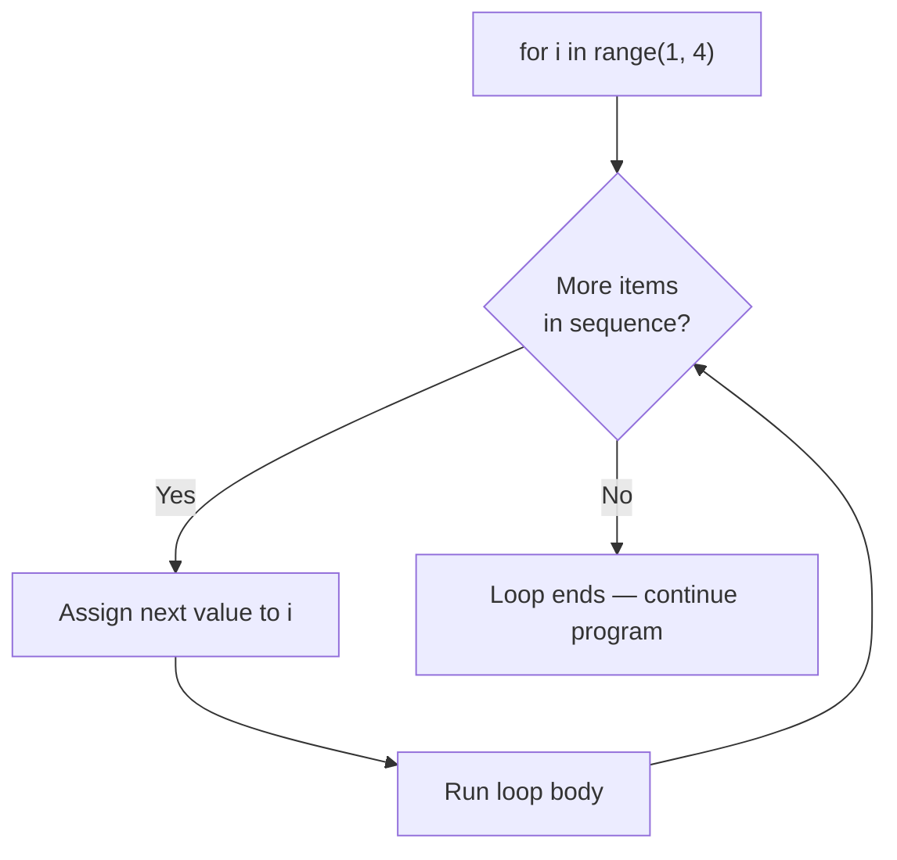
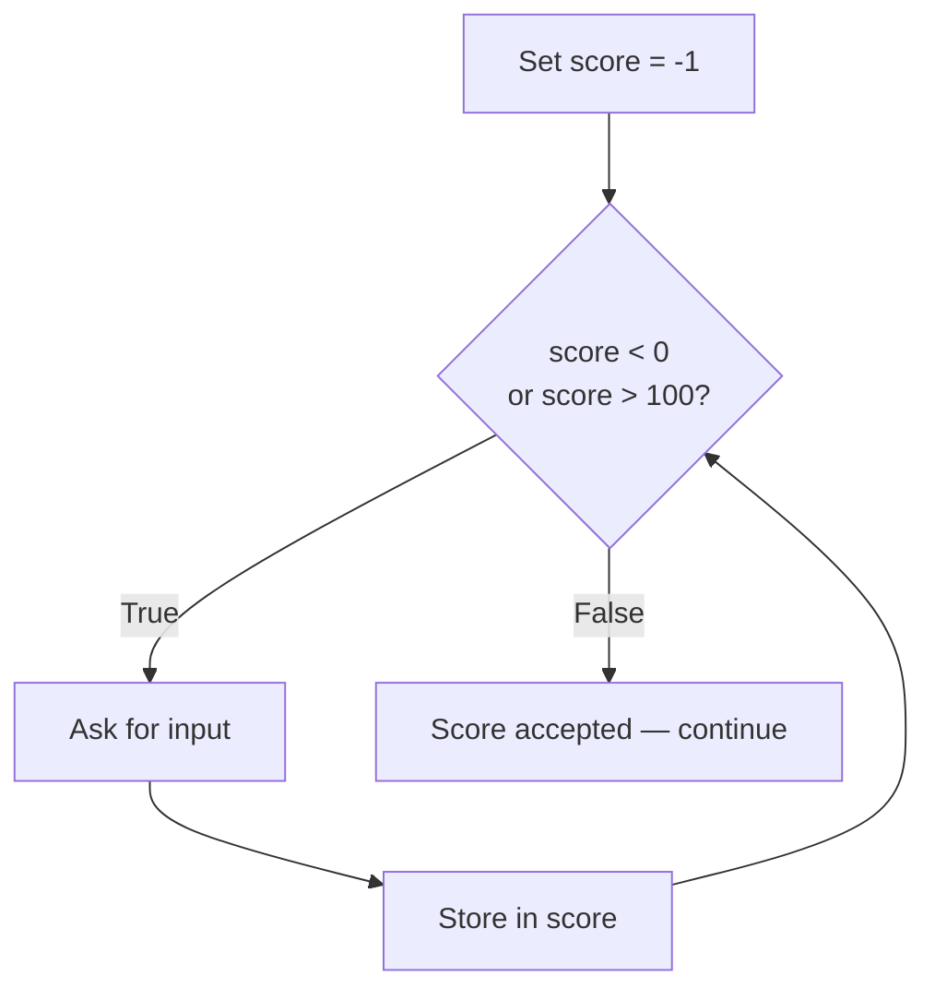
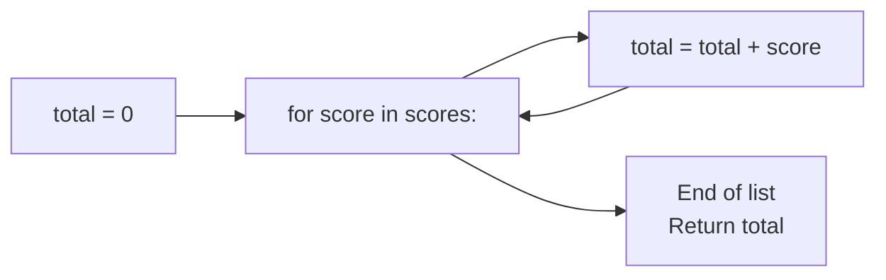

# Control Flow: Loops
**Course:** 12DGT  
**Year Level:** Year 12 (Level 7 – NCEA Level 2)  
**Aligned Standard:** AS91896 – Programming with Python  
**Previous topic:** [Control Flow: Conditionals](3_control_flow_conditionals.md)  
**Next topic:** [Functions](5_functions.md)

---

## 1. Purpose of These Notes

These notes exist to:
- explain why programs need loops and when to use them
- describe `for` loops and `while` loops — their differences and appropriate uses
- introduce loop control statements (`break`, `continue`)
- explain the accumulator pattern — a building block used throughout programming
- prevent the most common loop errors before they appear in assessments

These notes are **not** a substitute for writing loops yourself. You must write, run, and trace your own loops to understand them.

---

## 2. Key Concepts (Overview)

Non-negotiable ideas you must understand by the end of this topic:

- A **loop** repeats a block of code — either a fixed number of times (`for`), or until a condition changes (`while`).
- **`for` loops** are used when the number of repetitions is known or determined by a sequence.
- **`while` loops** are used when the number of repetitions is unknown and depends on a condition.
- An **accumulator** is a variable updated inside a loop to build up a result (e.g., a running total).
- An **infinite loop** runs forever because the exit condition is never met — it is a bug, not a feature.

> If you cannot trace through a loop by hand — tracking the variable values after each iteration — you have not mastered this topic.

---

## 3. Core Explanation

### Why Programs Need Loops

Without loops, you would write one instruction per action. To process 30 student scores, you'd write 30 nearly identical lines of code. With a loop, you write the logic once and repeat it.

Loops are what make programs scale: the same code handles 1 item or 10,000 items.

---

### `for` Loops — Fixed Repetitions

A `for` loop repeats a set number of times, working through a sequence (a range of numbers, items in a list, etc.).

**Using `range()`:**
```python
# Print numbers 1 to 5
for i in range(1, 6):      # range(1, 6) produces: 1, 2, 3, 4, 5
    print(i)
```

`range(start, stop)` generates numbers from `start` up to (but **not including**) `stop`. This is a common source of off-by-one errors.

| `range()` call | Numbers produced |
|---|---|
| `range(5)` | 0, 1, 2, 3, 4 |
| `range(1, 6)` | 1, 2, 3, 4, 5 |
| `range(0, 10, 2)` | 0, 2, 4, 6, 8 (step of 2) |

**Iterating over a list:**
```python
scores = [85, 72, 91, 64, 88]

for score in scores:
    print(score)           # Prints each score in order
```

When iterating a list, the loop variable (`score`) takes the value of each item in turn — you don't need index numbers.

---

### `while` Loops — Condition-Based Repetition

A `while` loop repeats as long as a condition remains true. It is used when you do not know in advance how many times the loop will run.

```python
# Keep asking until the user enters a valid score
score = -1

while score < 0 or score > 100:
    score = int(input("Enter a score between 0 and 100: "))

print(f"Score accepted: {score}")
```

**How Python reads this:**
1. Check `score < 0 or score > 100` → True (score is -1) → enter loop
2. Get input, store in `score`
3. Go back to the top, check condition again
4. Repeat until the condition is False

---

### The Accumulator Pattern

The accumulator pattern uses a variable that starts at zero (or an empty list) and is updated inside the loop:

```python
# Calculate the total of a list of scores
scores = [85, 72, 91, 64, 88]
total = 0                    # Accumulator starts at 0

for score in scores:
    total = total + score    # Add each score to the running total

print(f"Total: {total}")     # 400
print(f"Average: {total / len(scores)}")  # 80.0
```

This is one of the most important patterns in programming. Variations include:
- **Counter:** `count = count + 1` (increment by 1 each time)
- **Maximum tracker:** Compare each item to the current maximum
- **List builder:** Append items that meet a condition to an empty list

---

### Loop Control: `break` and `continue`

**`break`** exits the loop immediately, regardless of the condition:

```python
# Stop processing when we find a failing score
scores = [85, 72, 45, 91, 88]

for score in scores:
    if score < 50:
        print(f"Failing score found: {score} — stopping.")
        break              # Exit the loop immediately
    print(f"Score OK: {score}")
```

**`continue`** skips the rest of the current iteration and jumps to the next one:

```python
# Print only passing scores, skip failing ones
scores = [85, 72, 45, 91, 88]

for score in scores:
    if score < 50:
        continue           # Skip this iteration
    print(f"Passing score: {score}")
```

Use `break` and `continue` sparingly. Overuse can make loops harder to read.

---

### Choosing Between `for` and `while`

| Situation | Use |
|---|---|
| You know exactly how many times to repeat | `for` |
| You are processing every item in a list | `for` |
| You repeat until the user gives valid input | `while` |
| You repeat until a game state changes | `while` |
| You repeat until a calculation converges | `while` |

A useful rule: if you can express the repetition as "for each item in X" or "do this N times", use `for`. If you must express it as "keep doing this until Y happens", use `while`.

---

## 4. Diagrams and Visual Models

### `for` Loop Execution Flow



### `while` Loop Execution Flow



### Accumulator Pattern



---

## 5. Worked Examples (Conceptual, Not Procedural)

### Example 1: Calculating Class Average

**Problem:** Calculate the average score for a class of students.

**Design thinking:**
- Use a `for` loop — the list contains a fixed set of scores
- Use an accumulator to build the total
- Divide total by the number of items to get the average

```python
scores = [85, 72, 91, 64, 88, 76, 95, 53]

total = 0

for score in scores:
    total = total + score

average = total / len(scores)
print(f"Class average: {average:.1f}")   # :.1f rounds to 1 decimal place
```

**Why `len(scores)` instead of a hard-coded number?**  
Hard-coding `8` makes the code fragile — if you add or remove a score, the average calculation breaks. `len(scores)` always gives the correct count, regardless of how many items are in the list.

---

### Example 2: Input Validation with `while`

**Problem:** Ask the user for a score repeatedly until they enter a valid number between 0 and 100.

**Design thinking:**
- We do not know how many attempts the user will need → `while` is correct
- The loop needs a condition that is true while the input is invalid
- Once the condition becomes false, the loop exits naturally

```python
score = -1     # Start with a value that guarantees the loop runs

while not (0 <= score <= 100):
    try:
        score = int(input("Enter score (0–100): "))
    except ValueError:
        print("Please enter a whole number.")

print(f"Valid score entered: {score}")
```

**Note on `0 <= score <= 100`:** Python allows chained comparisons like this — it reads naturally as "score is between 0 and 100 inclusive."

---

### Example 3: Finding the Maximum Without Built-in Functions

**Problem:** Find the highest score in a list without using Python's `max()` function.

```python
scores = [85, 72, 91, 64, 88]
highest = scores[0]               # Assume the first score is highest to start

for score in scores[1:]:          # Check the remaining scores
    if score > highest:
        highest = score           # Update if we find something bigger

print(f"Highest score: {highest}")
```

**Why start `highest` at `scores[0]`?** We need a starting point to compare against. Starting at 0 would fail if all scores were negative. Starting at the first item guarantees we're always comparing actual data.

---

## 6. Common Misconceptions and Pitfalls

### Misconception 1: "Infinite loops are impossible if I write good code"

**Incorrect thinking:** My while loop will always end eventually.

**Why it's wrong:** If the variable inside the condition never changes, the condition never becomes false, and the loop runs forever.

**Common example:**
```python
count = 0
while count < 5:
    print(count)
    # Missing: count = count + 1 ← this is the bug
```

**Correct understanding:** Every `while` loop needs something inside it that changes the condition toward eventually being false.

---

### Misconception 2: "`range(5)` gives me the numbers 1 to 5"

**Incorrect thinking:** `range(n)` starts at 1.

**Why it's wrong:** `range(n)` starts at 0 and produces 0, 1, 2, ... n–1. This is an off-by-one error.

**Correct understanding:**
- `range(5)` → 0, 1, 2, 3, 4
- `range(1, 6)` → 1, 2, 3, 4, 5 (if you want 1-based counting)

---

### Misconception 3: "The accumulator variable resets each time through the loop"

**Incorrect thinking:** `total = 0` inside the loop helpfully resets the running total each iteration.

**Why it's wrong:** Placing the accumulator initialisation inside the loop destroys the accumulated value on every iteration. The final total will only reflect the last item.

**Correct understanding:**
```python
scores = [10, 20, 30]

# WRONG — resets total on each iteration
for score in scores:
    total = 0              # ← moves inside: breaks accumulation
    total = total + score
print(total)               # Prints 30, not 60

# RIGHT — total persists across iterations
total = 0                  # ← outside the loop
for score in scores:
    total = total + score
print(total)               # Prints 60 ✓
```

---

### Misconception 4: "I need the index number to loop over a list"

**Incorrect thinking:** You need `for i in range(len(scores)):` to iterate a list.

**Why it's wrong:** Python's `for ... in` loop handles iteration directly — no index needed unless you specifically need the index value.

**Correct understanding:**
```python
scores = [85, 72, 91]

# Unnecessarily complex
for i in range(len(scores)):
    print(scores[i])

# Cleaner — Python recommended style
for score in scores:
    print(score)
```
Use index-based loops only when you need the index itself (e.g., to compare adjacent items or update in place).

---

## 7. Assessment Relevance (AS91896)

Loops are required in any non-trivial AS91896 program. They demonstrate that your program can handle collections of data and repeat logic — both of which appear in every assessment scenario.

### What each grade level expects

| Grade | Loop standard |
|---|---|
| **Achieved** | At least one loop used correctly; program processes data or repeats tasks |
| **Merit** | Appropriate loop type chosen (`for` vs `while`) with some justification; accumulator or similar pattern used correctly |
| **Excellence** | Loop design is intentional and explained in design documentation; edge cases handled (empty list, only one item, invalid input treated with `while` loop) |

### Evidence checklist for loops

- [ ] Used `for` where iterating a known sequence; `while` where condition-based
- [ ] Accumulator initialised outside the loop
- [ ] `range()` arguments verified with a manual trace
- [ ] Tested with: normal input, empty list, single item, maximum/minimum values
- [ ] Comments explain what the loop does and why this loop type was chosen

---

## 8. External Resources

### Video
- **Python `for` Loops** – Corey Schafer – [YouTube](https://www.youtube.com/watch?v=beA8P1qAJK4) – Covers `range()`, list iteration, and common patterns
- **Python `while` Loops** – Corey Schafer – [YouTube](https://www.youtube.com/watch?v=94UHCEmprCY) – Input validation and loop control

### Practice Tools
- **Python Tutor** – https://pythontutor.com – Visualise the accumulator changing with each loop iteration
- **Replit** – https://replit.com – Test loops interactively

### Reading
- **Automate the Boring Stuff, Chapter 2** – https://automatetheboringstuff.com/2e/chapter2/ – Loop behaviour and flow control

---

## 9. Key Vocabulary

- **Loop:** A control structure that repeats a block of code multiple times.
- **`for` loop:** Repeats for each item in a sequence (list, range, string, etc.).
- **`while` loop:** Repeats as long as a condition remains true.
- **`range()`:** A Python function that generates a sequence of integers; used with `for` loops.
- **Iteration:** One complete execution of the loop body; each "pass" through the loop is one iteration.
- **Accumulator:** A variable initialised before a loop and updated inside it to build up a result.
- **Infinite loop:** A loop whose condition never becomes false; a common bug.
- **`break`:** Exits the loop immediately, skipping any remaining iterations.
- **`continue`:** Skips the rest of the current iteration and jumps to the next one.
- **Off-by-one error:** A bug where a loop runs one iteration too many or too few, often caused by incorrect `range()` arguments.
- **Loop body:** The indented block of code that runs on each iteration.
- **Loop variable:** The variable that takes a new value on each iteration (e.g., `i` in `for i in range(5)`).

---

*End of Control Flow: Loops*
