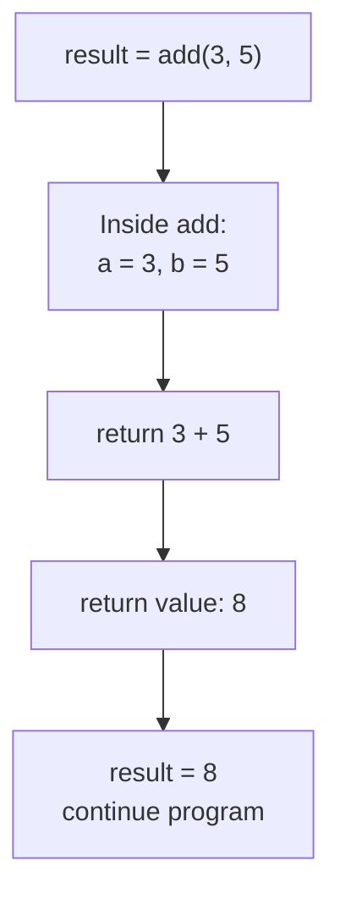
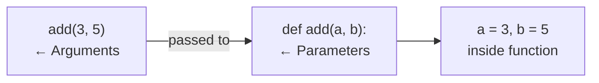
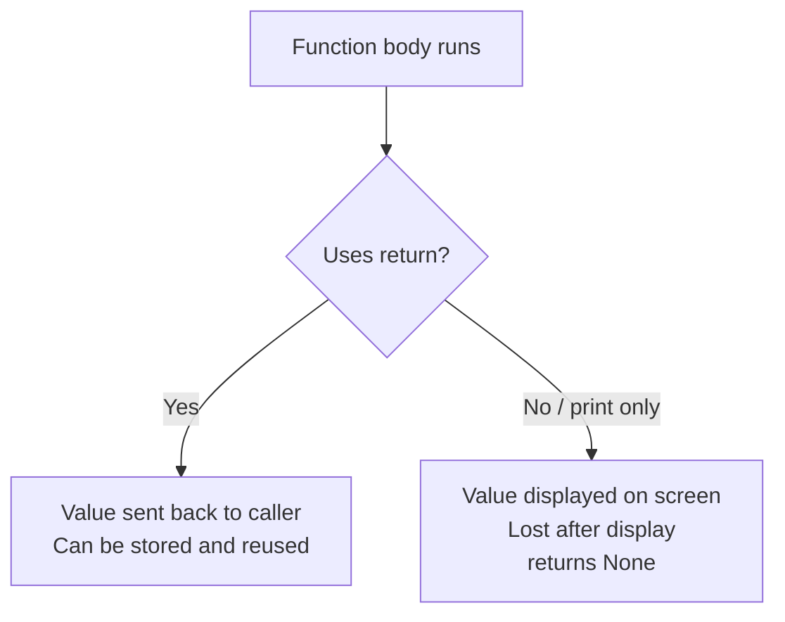

# Functions
**Course:** 12DGT  
**Year Level:** Year 12 (Level 7 – NCEA Level 2)  
**Aligned Standard:** AS91896 – Programming with Python  
**Previous topic:** [Control Flow: Loops](4_control_flow_loops.mdx)  
**Next topic:** [Algorithms and Pseudocode](6_algorithms_and_pseudocode.mdx)

---

## 1. Purpose of These Notes

These notes exist to:
- explain what functions are and why programs need them
- clarify the difference between parameters, arguments, and return values
- explain local scope and why it matters
- show how to write functions that are genuinely reusable

These notes are **not** a substitute for writing your own functions. You must define, call, and test functions yourself to understand how they work.

---

## 2. Key Concepts (Overview)

Non-negotiable ideas you must understand by the end of this topic:

- A **function** groups reusable code under a name. You define it once and call it as many times as needed.
- **Parameters** are the inputs a function expects. **Arguments** are the actual values you pass when calling it.
- A **return value** sends a result back to the caller. Returning and printing are completely different things.
- **Local scope** means variables inside a function are private to that function — they do not exist outside it.
- A function that is defined but never called does nothing. **You must call it.**

> If you cannot trace a function call — including what value is passed in, what happens inside, and what comes back — you have not mastered this topic.

---

## 3. Core Explanation

### What is a Function?

A function is a named block of code that performs a specific task. Once defined, it can be called from anywhere in the program.

Without functions, you repeat the same logic every time you need it. With functions, you write the logic once, name it, and call it whenever needed.

```python
# Without a function — logic repeated 3 times
print("Welcome, Alice! You have 5 messages.")
print("Welcome, Bob! You have 2 messages.")
print("Welcome, Charlie! You have 0 messages.")

# With a function — logic written once
def welcome(name, message_count):
    print(f"Welcome, {name}! You have {message_count} messages.")

welcome("Alice", 5)
welcome("Bob", 2)
welcome("Charlie", 0)
```

---

### Defining a Function

```python
def function_name(parameter1, parameter2):
    # Body of the function — indented
    # ...
    return result          # Optional: send a value back
```

- `def` tells Python you are defining a function
- The name follows Python naming rules (snake_case)
- Parameters are variables that accept input values
- The body is indented — indentation defines what belongs inside the function
- `return` sends a value back to the caller (optional — not all functions return a value)

---

### Parameters and Arguments

**Parameters** are the variable names listed in the function definition.  
**Arguments** are the actual values passed when calling the function.

```python
# Definition: 'a' and 'b' are parameters
def add(a, b):
    return a + b

# Call: 3 and 5 are arguments — they are assigned to a and b
result = add(3, 5)   # result = 8
```

The number of arguments must match the number of parameters exactly:

```python
def greet(name, age):
    print(f"Hello, {name}. You are {age} years old.")

greet("Alice", 16)      # Correct — 2 args for 2 params ✓
greet("Bob")            # TypeError — missing argument for 'age' ❌
greet("Charlie", 17, "NZ")  # TypeError — too many arguments ❌
```

---

### Return Values

`return` sends a value from the function back to the caller. This value can be stored, printed, or used in further calculations.

```python
def calculate_average(total, count):
    average = total / count
    return average              # Send the result back

result = calculate_average(400, 5)    # result = 80.0
print(result)                         # 80.0
```

**Returning is different from printing:**

```python
# Function A: only prints — the result disappears after display
def show_average(total, count):
    print(total / count)        # Printed, but not returned

# Function B: returns — the result can be used elsewhere
def get_average(total, count):
    return total / count        # Returned, can be stored and reused

# You CANNOT do this with Function A:
avg = show_average(400, 5)     # avg = None (print returns nothing)
doubled = avg * 2              # TypeError — avg is None

# But you CAN do this with Function B:
avg = get_average(400, 5)      # avg = 80.0
doubled = avg * 2              # doubled = 160.0 ✓
```

**Rule of thumb:** If you want to use the result of a function in further calculations, it must `return`, not `print`.

---

### Local Scope

Variables created inside a function only exist inside that function. They are destroyed when the function finishes. This is called **local scope**.

```python
def calculate_bonus(score):
    bonus = score * 0.1         # 'bonus' is local to this function
    return bonus

result = calculate_bonus(80)
print(result)                   # 8.0 — fine, we used return

print(bonus)                    # NameError — 'bonus' doesn't exist here ❌
```

**Why scope matters:**
- Functions can use the same variable names without interfering with each other
- It makes functions self-contained and predictable
- It prevents accidental changes to variables in other parts of the program

---

### Functions That Call Other Functions

Functions can call other functions. This is how you build larger programs from small, well-tested pieces:

```python
def get_grade(score):
    if score >= 80:
        return "Merit"
    elif score >= 50:
        return "Achieved"
    else:
        return "Not Achieved"

def print_report(name, score):
    grade = get_grade(score)      # Call another function
    print(f"{name}: {score} — {grade}")

print_report("Alice", 85)        # Alice: 85 — Merit
print_report("Bob", 63)          # Bob: 63 — Achieved
```

---

## 4. Diagrams and Visual Models

### Function Call Flow



### Parameter vs. Argument



### Return vs. Print



---

## 5. Worked Examples (Conceptual, Not Procedural)

### Example 1: Calculating Grade with a Reusable Function

**Problem:** Build a function that determines a grade, then use it in a report for multiple students.

```python
def classify_grade(score):
    """
    Returns a grade string based on a numeric score.
    
    Parameters:
        score (float): The student's score, 0–100.
    
    Returns:
        str: "Excellence", "Merit", "Achieved", or "Not Achieved"
    """
    if score >= 85:
        return "Excellence"
    elif score >= 65:
        return "Merit"
    elif score >= 50:
        return "Achieved"
    else:
        return "Not Achieved"


def generate_report(students):
    """
    Prints a grade report for a list of student (name, score) tuples.
    """
    print("=== Grade Report ===")
    for name, score in students:
        grade = classify_grade(score)          # Reuse the grade function
        print(f"  {name}: {score:.1f} — {grade}")


# Test data
class_results = [("Alice", 88), ("Bob", 62), ("Charlie", 49), ("Dana", 71)]
generate_report(class_results)
```

**Why this structure works well:**
- `classify_grade` does one thing — converting a number to a grade — and does it well
- `generate_report` handles display without duplicating the grading logic
- Both functions can be tested independently: test `classify_grade` first, then `generate_report`
- Adding a new grade boundary only requires changing `classify_grade`, not every print statement

---

### Example 2: Designing a Function Before Writing It

**Problem:** Write a function that checks if a password meets requirements (at least 8 characters, contains a digit).

**Design first:**
- What inputs? One: the password string
- What output? True if valid, False if not
- What does it check? Length ≥ 8, and at least one digit present

```python
def is_valid_password(password):
    """
    Returns True if the password is at least 8 characters
    and contains at least one digit.
    
    Parameters:
        password (str): The password to check.
    
    Returns:
        bool: True if valid, False otherwise.
    """
    if len(password) < 8:
        return False
    
    has_digit = False
    for character in password:
        if character.isdigit():
            has_digit = True
            break
    
    return has_digit


# Test cases
print(is_valid_password("abc123"))       # False — too short
print(is_valid_password("password1"))    # True — long enough + has digit
print(is_valid_password("longpassword")) # False — no digit
```

**Why returning `bool` is better than printing:**  
The caller can then use the result in a conditional:
```python
password = input("Create password: ")
if is_valid_password(password):
    print("Password accepted.")
else:
    print("Invalid — use 8+ characters and include a number.")
```

---

## 6. Common Misconceptions and Pitfalls

### Misconception 1: "Defining a function runs its code"

**Incorrect thinking:** The code inside a function executes as soon as Python reads the `def` block.

**Why it's wrong:** Defining a function only tells Python the function exists. The code runs only when the function is **called**.

**Correct understanding:**
```python
def greet():
    print("Hello!")        # This does NOT run yet

greet()                    # This runs it
```

---

### Misconception 2: "`print()` inside a function gives me the result"

**Incorrect thinking:** If a function prints a result, I can use that result in the next line.

**Why it's wrong:** `print()` displays text and returns `None`. If you store the "result" of a print call, you get `None`.

**Correct understanding:**
```python
def add(a, b):
    print(a + b)           # Prints to screen, returns None

result = add(3, 5)         # result = None (not 8!)
print(result * 2)          # TypeError: NoneType × int ❌

# Fix: use return
def add(a, b):
    return a + b           # Returns 8

result = add(3, 5)         # result = 8 ✓
```

---

### Misconception 3: "Variables inside functions can be used outside"

**Incorrect thinking:** If I create a variable inside a function, I can access it after the function finishes.

**Why it's wrong:** Local scope means those variables are destroyed when the function ends.

**Correct understanding:** Use `return` to send values out of a function. Don't try to access internal variables directly.

---

### Misconception 4: "Using `global` variables in functions is normal and acceptable"

**Incorrect thinking:** I'll just use global variables instead of parameters so I don't have to think about passing values.

**Why it's wrong:** Functions that depend on global variables are hard to test, hard to reuse, and hide their dependencies. They can also cause hard-to-trace bugs.

**Correct understanding:** Pass data in via parameters and pass data out via `return`. Functions should be self-contained.

---

## 7. Assessment Relevance (AS91896)

Functions are explicitly required for Merit and Excellence in AS91896. A submission without functions will be capped at Achieved at best — and may not reach Achieved if the program is too simple.

### What each grade level expects

| Grade | Function standard |
|---|---|
| **Achieved** | At least one function defined and called; program is structured |
| **Merit** | Multiple functions used appropriately; parameters and return values used correctly; functions do one clear job each |
| **Excellence** | Functions designed intentionally (design documentation shows pre-coding decisions); functions are independently testable; docstrings or comments describe purpose and parameters |

### Evidence checklist for functions

- [ ] At least 2–3 functions defined and called in the program
- [ ] Parameters used to pass data in; return values used to pass data out
- [ ] Each function does one specific thing (not a large "do everything" function)
- [ ] Comments or docstrings describe what each function does, its parameters, and its return value
- [ ] Each function tested independently with at least 2–3 test cases

---

## 8. External Resources

### Video
- **Python Functions** – Corey Schafer – [YouTube](https://www.youtube.com/watch?v=9Os0o12WeWo) – Parameters, return values, local scope
- **Python Scope** – Corey Schafer – [YouTube](https://www.youtube.com/watch?v=QVdf0LgmICw) – Local and global scope explained clearly

### Practice Tools
- **Python Tutor** – https://pythontutor.com – Visualise the call stack: see exactly where a function starts, what variables are local, and what gets returned
- **Replit** – https://replit.com – Define and test functions interactively

### Reading
- **Automate the Boring Stuff, Chapter 3** – https://automatetheboringstuff.com/2e/chapter3/ – Functions, scope, and return values

---

## 9. Key Vocabulary

- **Function:** A named, reusable block of code that performs a specific task.
- **`def`:** The Python keyword that begins a function definition.
- **Parameter:** A variable listed in a function's definition that accepts input values when the function is called.
- **Argument:** The actual value passed to a function when it is called. Arguments are assigned to parameters.
- **Return value:** The value sent back from a function to the caller using the `return` keyword.
- **`return`:** Exits the function and sends a value back to the caller.
- **Local scope:** The region of code where a variable exists — variables defined inside a function exist only inside that function.
- **Global scope:** Variables defined at the top level of a program, outside any function.
- **Call:** Executing a function by writing its name followed by parentheses and any required arguments.
- **Docstring:** A string placed immediately after `def function_name():` that documents the function's purpose, parameters, and return value.
- **`None`:** Python's value for "nothing" — what a function returns if it has no `return` statement.
- **Modular code:** Code organised into small, self-contained functions that each do one clear job.

---

*End of Functions*
