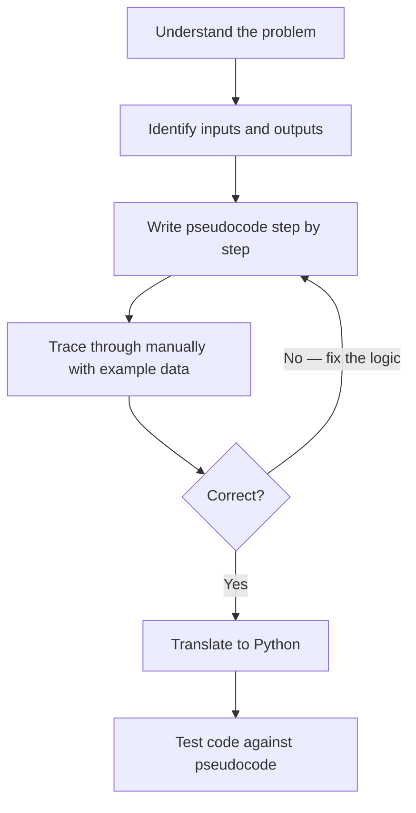
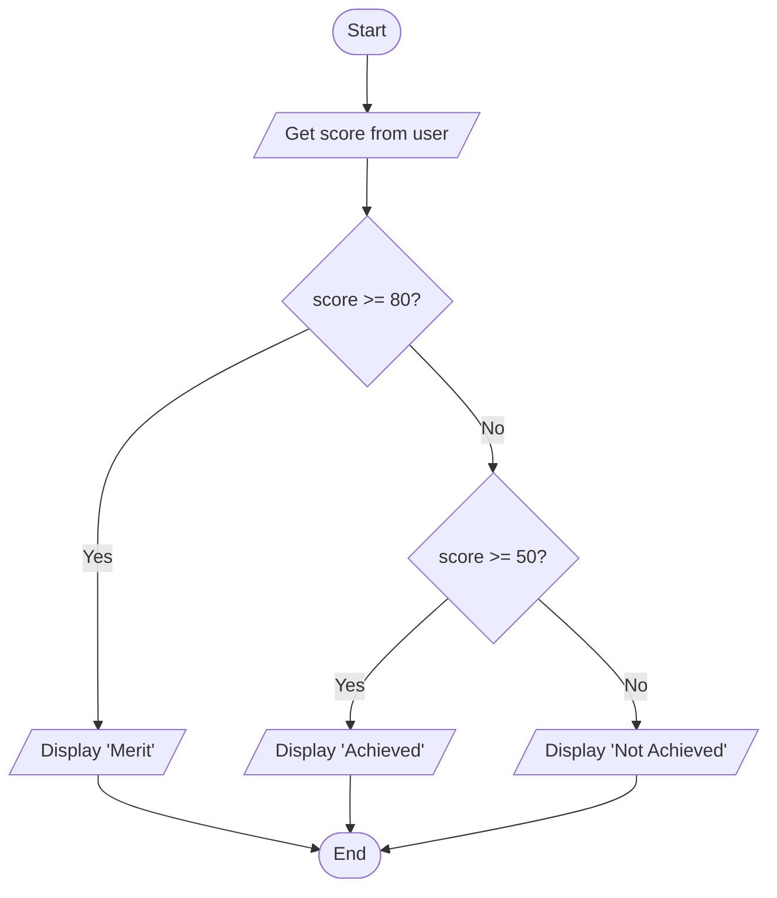

# Algorithms and Pseudocode
**Course:** 12DGT  
**Year Level:** Year 12 (Level 7 – NCEA Level 2)  
**Aligned Standard:** AS91896 – Programming with Python  
**Previous topic:** [Functions](5_functions.mdx)  
**Next topic:** [Data Structures: Lists and Dictionaries](7_data_structures.mdx)

---

## 1. Purpose of These Notes

These notes exist to:
- explain what an algorithm is and why it comes before code
- teach a consistent pseudocode style suitable for AS91896 submissions
- show how to translate pseudocode into Python
- establish why planning reduces bugs and improves assessment evidence

These notes are **not** about a specific programming language — pseudocode is language-neutral.

---

## 2. Key Concepts (Overview)

Non-negotiable ideas you must understand by the end of this topic:

- An **algorithm** is a precise, step-by-step procedure that solves a problem. It must be unambiguous and produce a correct result.
- **Pseudocode** describes an algorithm in plain English using structured notation — not Python syntax, not free-form prose.
- Algorithms exist before code. You write the algorithm first, then translate it to Python.
- A correct algorithm produces the right output for every valid input, including edge cases.
- Your AS91896 submission **requires** design documentation — pseudocode or a flowchart. Submitting code without a design is incomplete evidence.

> If you cannot write pseudocode for a problem and then translate it to Python step by step, you have not separated your thinking from your typing.

---

## 3. Core Explanation

### What Makes Something an Algorithm?

An algorithm must be:
- **Precise** — each step is unambiguous; there is no room for guessing
- **Finite** — it terminates (reaches an end) after a fixed number of steps
- **Correct** — it produces the right output for every valid input
- **General** — it works for all inputs in its problem domain, not just specific ones

A recipe that says "cook until done" is not an algorithm — "done" is ambiguous. A recipe that says "bake at 180°C for 25 minutes" is algorithmic.

---

### Pseudocode Conventions

Pseudocode is not Python. It is structured English that describes logic clearly without worrying about exact syntax. Use this format consistently in your AS91896 design documentation:

| Construct | Pseudocode style |
|---|---|
| Input | `GET name FROM user` or `SET score = user input` |
| Output | `DISPLAY result` or `PRINT "message"` |
| Assignment | `SET total = 0` |
| Conditional | `IF condition THEN ... ELSE ... END IF` |
| For loop | `FOR each item IN collection ... END FOR` |
| While loop | `WHILE condition ... END WHILE` |
| Function | `FUNCTION name(parameter) ... RETURN value END FUNCTION` |

**Example — calculating a class average:**

```
FUNCTION calculate_average(scores)
    SET total = 0
    FOR each score IN scores
        SET total = total + score
    END FOR
    RETURN total / length of scores
END FUNCTION

SET scores = GET from user (list of results)
SET average = calculate_average(scores)
DISPLAY "Class average: " + average
```

---

### From Pseudocode to Python

The translation from pseudocode to Python should be mechanical once the design is correct:

| Pseudocode | Python |
|---|---|
| `SET total = 0` | `total = 0` |
| `FOR each score IN scores` | `for score in scores:` |
| `SET total = total + score` | `total = total + score` |
| `RETURN total / length of scores` | `return total / len(scores)` |
| `IF score >= 50 THEN` | `if score >= 50:` |
| `DISPLAY result` | `print(result)` |

When your pseudocode is clear, writing Python becomes fast. When your Python is written first without a plan, it tends to be muddled.

---

### Flowcharts

A flowchart is a visual representation of an algorithm using standardised shapes:

| Shape | Meaning |
|---|---|
| Oval / Rounded rectangle | Start / End |
| Rectangle | Process (e.g., assignment, calculation) |
| Diamond | Decision (yes/no question) |
| Parallelogram | Input or Output |
| Arrow | Direction of flow |

Flowcharts are particularly good for showing conditional branches and loops visually. They are an acceptable substitute for pseudocode as design documentation in AS91896.

---

### Evaluating Algorithms

A correct algorithm is not necessarily a good algorithm. When reviewing your design, consider:

1. **Correctness:** Does it produce the right result for all valid inputs?
2. **Completeness:** Does it handle edge cases (empty list, negative numbers, boundary values)?
3. **Clarity:** Can someone else read the pseudocode and understand what the program does?
4. **Efficiency:** Is there unnecessary repetition or redundant steps?

At NCEA Level 2, efficiency is mainly about avoiding obviously wasteful approaches (e.g., sorting a list every time you need to find one item). Full algorithm complexity analysis is covered at Level 3.

---

## 4. Diagrams and Visual Models

### Algorithm Design Process



### Flowchart: Classifying a Score



---

## 5. Worked Examples (Conceptual, Not Procedural)

### Example 1: Finding the Highest Score

**Problem:** Given a list of student scores, find the highest one.

**Step 1 — Understand the problem:**
- Input: a list of scores (numbers)
- Output: the single highest value
- Constraint: do not use Python's built-in `max()` function (show the logic)

**Step 2 — Pseudocode:**

```
FUNCTION find_highest(scores)
    IF scores is empty THEN
        RETURN "No scores provided"
    END IF
    
    SET highest = first item in scores
    
    FOR each score IN scores
        IF score > highest THEN
            SET highest = score
        END IF
    END FOR
    
    RETURN highest
END FUNCTION
```

**Step 3 — Manual trace (scores = [85, 72, 91, 64]):**

| Iteration | Current score | highest before | highest after |
|---|---|---|---|
| 1 | 85 | 85 (initialised) | 85 |
| 2 | 72 | 85 | 85 (72 is not > 85) |
| 3 | 91 | 85 | 91 (91 > 85 ✓) |
| 4 | 64 | 91 | 91 (64 is not > 91) |

Result: 91 — correct.

**Step 4 — Python translation:**
```python
def find_highest(scores):
    if len(scores) == 0:
        return "No scores provided"
    
    highest = scores[0]
    
    for score in scores:
        if score > highest:
            highest = score
    
    return highest
```

---

### Example 2: Writing Pseudocode for a Login System

**Problem:** Ask the user for a username and password. Give them 3 attempts before locking them out.

```
SET correct_username = "admin"
SET correct_password = "pass123"
SET attempts = 0
SET max_attempts = 3
SET access_granted = false

WHILE attempts < max_attempts AND access_granted is false
    GET username FROM user
    GET password FROM user
    SET attempts = attempts + 1
    
    IF username == correct_username AND password == correct_password THEN
        SET access_granted = true
        DISPLAY "Welcome!"
    ELSE
        SET remaining = max_attempts - attempts
        DISPLAY "Incorrect. " + remaining + " attempts remaining."
    END IF
END WHILE

IF access_granted is false THEN
    DISPLAY "Account locked."
END IF
```

This pseudocode makes the Python much easier to write because all the logic decisions are already made.

---

## 6. Common Misconceptions and Pitfalls

### Misconception 1: "I can write pseudocode after I write the Python"

**Incorrect thinking:** Pseudocode is just documentation — write it last to match whatever code ended up working.

**Why it's wrong:** Post-hoc pseudocode does not demonstrate design thinking. Teachers can identify when pseudocode was written to match existing code rather than guide it. More practically, it misses the point — the purpose of pseudocode is to clarify your thinking *before* you code.

**Correct understanding:** Write pseudocode before writing a single line of Python. This is what will be checked in the AS91896 checkpoint at Week 1–2.

---

### Misconception 2: "Pseudocode should look like Python with some words changed"

**Incorrect thinking:** Write Python, then replace some symbols with English words.

**Why it's wrong:** Good pseudocode describes *what* the program does, not the exact Python implementation. It should be understandable by someone who does not know Python.

**Correct understanding:** Pseudocode describes logic, not syntax. `FOR each student IN class` is better than `for student in students_list:`.

---

### Misconception 3: "My algorithm is correct because my code runs"

**Incorrect thinking:** If the program produces output without errors, the algorithm is right.

**Why it's wrong:** A program can run without errors and still produce wrong results. The algorithm is correct only if the output is correct for all inputs — including edge cases.

**Correct understanding:** Verify the algorithm by tracing through it manually before and after coding.

---

## 7. Assessment Relevance (AS91896)

Design documentation is **required evidence** for AS91896. A submission without pseudocode or a flowchart is missing an evidence item and will struggle to reach Merit.

### What each grade level expects

| Grade | Algorithm/pseudocode standard |
|---|---|
| **Achieved** | Some evidence of planning; pseudocode or flowchart present but may be incomplete |
| **Merit** | Clear pseudocode or flowchart that matches the coded solution; logic is traceable |
| **Excellence** | Pseudocode shows design decisions, including alternatives considered; algorithm handles edge cases; reflection explains choices made during design |

### Evidence checklist for algorithms

- [ ] Pseudocode or flowchart submitted for each major function
- [ ] Pseudocode was written *before* the Python code (evident from checkpoint timestamps)
- [ ] Manual trace included (for at least one algorithm) to verify correctness
- [ ] Edge cases identified in the design (e.g., empty input, out-of-range values)
- [ ] Python code matches the final version of the pseudocode

---

## 8. External Resources

### Video
- **Introduction to Algorithms** – CS50 (Harvard) – [YouTube](https://www.youtube.com/watch?v=jFxsKzi3_mc) – Conceptual overview of algorithms and efficiency
- **How to Write Pseudocode** – Simple Snippets – [YouTube](https://www.youtube.com/watch?v=PwGA4Lm8zuE) – Practical pseudocode writing for beginners

### Reading
- **Khan Academy: Algorithms** – https://www.khanacademy.org/computing/computer-science/algorithms – Visual, interactive explanations of common algorithms
- **Real Python: Understanding Algorithms** – https://realpython.com/sorting-algorithms-python/ – Practical Python algorithm examples

---

## 9. Key Vocabulary

- **Algorithm:** A precise, step-by-step procedure that solves a problem and terminates with a correct result.
- **Pseudocode:** A structured, language-neutral description of an algorithm using plain English and logical constructs.
- **Flowchart:** A visual representation of an algorithm using standardised shapes (ovals, rectangles, diamonds, arrows).
- **Design documentation:** Written evidence of planning before coding — includes pseudocode, flowcharts, or written descriptions of algorithmic choices.
- **Trace:** Manually following an algorithm step by step with example data to verify it produces the correct result.
- **Edge case:** An input at the extreme boundary of the problem domain (e.g., empty list, score exactly at a threshold).
- **Correctness:** An algorithm is correct if it produces the right result for all valid inputs, including edge cases.
- **Efficiency:** How much time or memory an algorithm uses relative to the size of its input. Less important at NCEA Level 2 than correctness.
- **Iteration (algorithm design):** Refining an algorithm by tracing, identifying errors, and improving the design before or during coding.

---

*End of Algorithms and Pseudocode*
