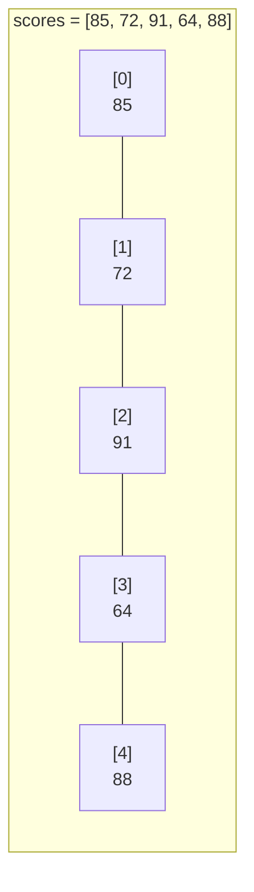
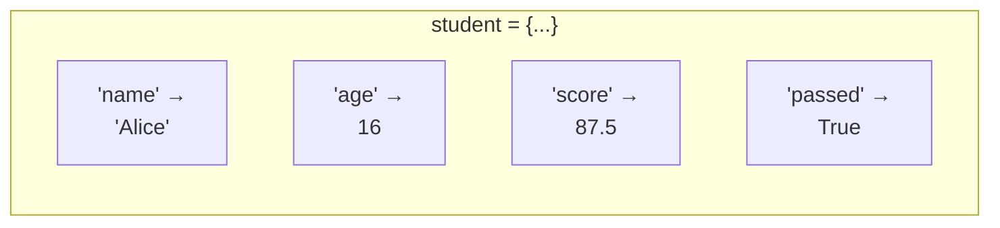
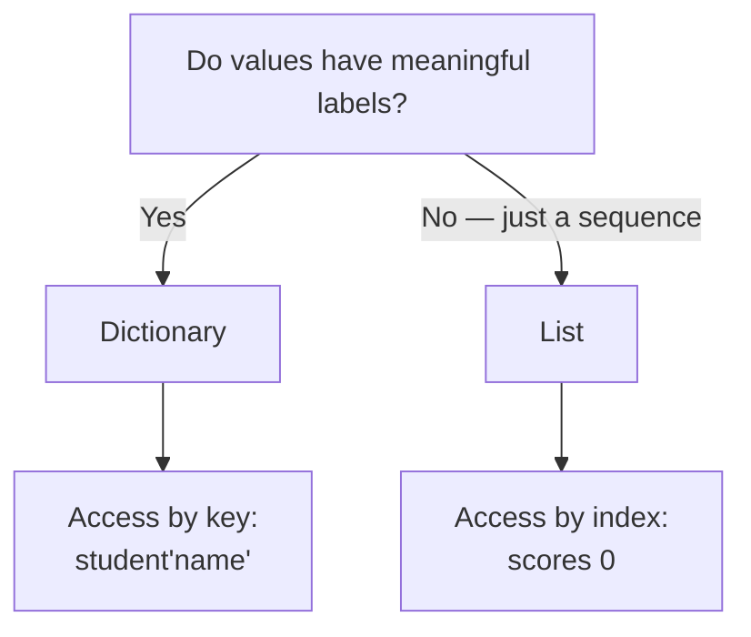

# Data Structures: Lists and Dictionaries
**Course:** 12DGT  
**Year Level:** Year 12 (Level 7 – NCEA Level 2)  
**Aligned Standard:** AS91896 – Programming with Python  
**Previous topic:** [Algorithms and Pseudocode](6_algorithms_and_pseudocode.mdx)  
**Next topic:** [Testing and Debugging](8_testing_and_debugging.mdx)

---

## 1. Purpose of These Notes

These notes exist to:
- explain when and why programs need to store multiple related values
- describe Python lists: creation, indexing, and common operations
- describe Python dictionaries: key-value storage and access
- show how to choose between a list and a dictionary for a given problem

These notes are **not** a substitute for practice. You must write code that creates, modifies, and reads both lists and dictionaries.

---

## 2. Key Concepts (Overview)

Non-negotiable ideas you must understand by the end of this topic:

- A **list** stores multiple values in a specific order. Each value is accessed by its **index** (position), starting at 0.
- A **dictionary** stores values paired with meaningful **keys**. Each value is accessed by its key, not a number.
- Lists are used for **ordered sequences** — e.g., a list of scores, names in a queue.
- Dictionaries are used for **labeled data** — e.g., a student record where each field has a name.
- Accessing an index that does not exist causes an `IndexError`. Accessing a key that does not exist causes a `KeyError`.

> If you cannot predict what `my_list[2]` or `my_dict["score"]` returns given a specific list/dict, you have not mastered this topic.

---

## 3. Core Explanation

### Why Data Structures?

A program that processes one student's data uses simple variables. A program that processes thirty students needs a way to store thirty related values without writing thirty separate variable names. Data structures solve this.

---

### Lists

A **list** stores multiple values in order. It is defined with square brackets, items separated by commas:

```python
scores = [85, 72, 91, 64, 88]
names = ["Alice", "Bob", "Charlie"]
mixed = [16, "Alice", True, 87.5]   # Lists can mix types (unusual but allowed)
```

#### Accessing Items — Indexing

Each item has an index: **position counts start at 0**:

```python
scores = [85, 72, 91, 64, 88]
#          0   1   2   3   4   ← indices

print(scores[0])    # 85  (first item)
print(scores[2])    # 91  (third item)
print(scores[-1])   # 88  (last item — negative indexing counts from the end)
```

Accessing an index that doesn't exist causes `IndexError`:
```python
print(scores[10])   # IndexError: list index out of range ❌
```

#### Modifying Lists

```python
scores = [85, 72, 91]

scores[1] = 80      # Change item at index 1  → [85, 80, 91]
scores.append(77)   # Add to end              → [85, 80, 91, 77]
scores.remove(80)   # Remove first 80         → [85, 91, 77]
```

#### Common List Operations

| Operation | Code | Result |
|---|---|---|
| Number of items | `len(scores)` | Integer count |
| Largest value | `max(scores)` | Highest value |
| Smallest value | `min(scores)` | Lowest value |
| Sort ascending | `scores.sort()` | Modifies list in place |
| Check if item exists | `85 in scores` | True or False |
| Append item | `scores.append(99)` | Adds 99 to end |
| Remove item by value | `scores.remove(72)` | Removes first 72 |
| Remove item by index | `scores.pop(0)` | Removes and returns item at index 0 |

#### Iterating a List

```python
scores = [85, 72, 91, 64, 88]

# Method 1: value-based (most common, most readable)
for score in scores:
    print(score)

# Method 2: index-based (use when you need the index)
for i in range(len(scores)):
    print(f"Score {i + 1}: {scores[i]}")
```

---

### Dictionaries

A **dictionary** stores key-value pairs. Instead of accessing items by position, you access them by a meaningful key:

```python
student = {
    "name": "Alice",
    "age": 16,
    "score": 87.5,
    "passed": True
}
```

The left side of each pair (before `:`) is the key; the right side is the value.

#### Accessing Values

```python
print(student["name"])    # Alice
print(student["score"])   # 87.5
```

Accessing a key that doesn't exist causes `KeyError`:
```python
print(student["grade"])   # KeyError: 'grade' ❌
```

Use `.get()` to avoid errors when you are unsure if a key exists:
```python
grade = student.get("grade", "Not assigned")   # Returns "Not assigned" if not found
```

#### Modifying Dictionaries

```python
student = {"name": "Alice", "score": 87.5}

student["score"] = 90           # Change existing value
student["grade"] = "Merit"      # Add a new key-value pair
del student["score"]            # Delete an entry
```

#### Common Dictionary Operations

| Operation | Code | Result |
|---|---|---|
| Get all keys | `student.keys()` | A view of all keys |
| Get all values | `student.values()` | A view of all values |
| Check if key exists | `"name" in student` | True or False |
| Safe access | `student.get("key", default)` | Value or default if missing |
| Number of pairs | `len(student)` | Integer count |

#### Iterating a Dictionary

```python
student = {"name": "Alice", "age": 16, "score": 87.5}

# Iterate over key-value pairs (most common)
for key, value in student.items():
    print(f"{key}: {value}")

# Iterate over keys only
for key in student:
    print(key)
```

---

### Lists vs Dictionaries — Choosing the Right One

| Situation | Use | Why |
|---|---|---|
| A sequence of similar values | List | Items accessed by position (first, second, last) |
| Multiple fields describing one thing | Dictionary | Items accessed by name (age, score, name) |
| A collection you will loop through in order | List | Natural sequence access |
| Lookup by label | Dictionary | Keys describe what each value means |

```python
# List: a sequence of similar items
test_scores = [85, 72, 91, 64, 88]   # All are scores — list is right

# Dictionary: one entity with multiple named attributes
student = {                           # One student, multiple named fields
    "name": "Alice",
    "age": 16,
    "test_score": 85
}
```

---

### Lists of Dictionaries

Real programs often combine both: a list of dictionaries lets you store multiple records, each with labeled fields:

```python
class_records = [
    {"name": "Alice",   "score": 85, "grade": "Merit"},
    {"name": "Bob",     "score": 62, "grade": "Achieved"},
    {"name": "Charlie", "score": 91, "grade": "Excellence"}
]

# Access a specific student's score
print(class_records[0]["score"])   # 85 — Alice's score

# Loop through all records
for student in class_records:
    print(f"{student['name']}: {student['grade']}")
```

---

## 4. Diagrams and Visual Models

### List — Indexed Storage



### Dictionary — Key-Value Storage



### Choosing a Data Structure



---

## 5. Worked Examples (Conceptual, Not Procedural)

### Example 1: Processing a Class List

**Problem:** Store 5 students' names and scores. Calculate the average and print a report.

```python
# Store data as a list of dictionaries
students = [
    {"name": "Alice",   "score": 88},
    {"name": "Bob",     "score": 62},
    {"name": "Charlie", "score": 75},
    {"name": "Dana",    "score": 91},
    {"name": "Ethan",   "score": 54}
]

# Calculate total and average
total = 0
for student in students:
    total = total + student["score"]

average = total / len(students)

# Print report
print(f"Class average: {average:.1f}")
print()
for student in students:
    status = "Above average" if student["score"] >= average else "Below average"
    print(f"  {student['name']}: {student['score']} — {status}")
```

**Why a list of dictionaries?**
- A list lets us loop through all students in sequence
- A dictionary lets us access `student["name"]` and `student["score"]` by meaningful labels
- No hard-coded student names or indexes — the program adapts to any number of entries

---

### Example 2: Frequency Counter with a Dictionary

**Problem:** Count how many times each grade appears in a list.

```python
grades = ["Merit", "Achieved", "Merit", "Excellence", "Not Achieved",
          "Merit", "Achieved", "Excellence", "Merit"]

# Count each grade
grade_counts = {}

for grade in grades:
    if grade in grade_counts:
        grade_counts[grade] = grade_counts[grade] + 1  # Increment existing
    else:
        grade_counts[grade] = 1                         # Create new entry

# Display results
for grade, count in grade_counts.items():
    print(f"{grade}: {count}")
```

**Why a dictionary here?** The grades are the keys ("Merit", "Achieved", etc.) and the counts are the values. A list could not store this cleanly — there's no natural index for "Merit".

---

## 6. Common Misconceptions and Pitfalls

### Misconception 1: "Lists start at index 1"

**Incorrect thinking:** The first item is at position 1, like counting in everyday life.

**Why it's wrong:** Python lists use zero-based indexing. The first item is at index 0, the second at index 1, and so on.

**Correct understanding:**
```python
names = ["Alice", "Bob", "Charlie"]
print(names[0])   # Alice — first item ✓
print(names[1])   # Bob — second item
print(names[3])   # IndexError — only 3 items (indices 0, 1, 2) ❌
```

---

### Misconception 2: "I can access a dictionary key that doesn't exist"

**Incorrect thinking:** If a key is missing, Python returns `None` or empty string automatically.

**Why it's wrong:** Accessing a missing key raises a `KeyError` exception, which will crash the program.

**Correct understanding:**
```python
student = {"name": "Alice", "score": 85}
print(student["grade"])           # KeyError ❌

# Fix: use .get() with a default value
print(student.get("grade", "N/A"))  # N/A — no crash ✓
```

---

### Misconception 3: "`.append()` and assignment do the same thing"

**Incorrect thinking:** `scores[5] = 99` and `scores.append(99)` both add a new item.

**Why it's wrong:** `scores[5] = 99` changes the item at index 5 (and causes `IndexError` if index 5 doesn't exist). `.append(99)` always adds to the end.

**Correct understanding:**
- Use `scores.append(value)` to add a new item
- Use `scores[index] = value` to replace an existing item at a known position

---

### Misconception 4: "A dictionary preserves the order I added items — but I can't count on that"

**Correct understanding (updated):** In Python 3.7+, dictionaries do preserve insertion order. You can rely on this in modern Python. However, the primary purpose of a dictionary is key-based access, not ordered sequence — use a list if order is what matters most.

---

## 7. Assessment Relevance (AS91896)

Data structures are necessary for any non-trivial AS91896 program. A program that only uses simple variables is unlikely to show the depth required for Merit or Excellence.

### What each grade level expects

| Grade | Data structure standard |
|---|---|
| **Achieved** | At least one list or dictionary used; basic reading and writing of values |
| **Merit** | Lists and/or dictionaries used appropriately for the problem; iteration over collections; data structures chosen with some justification |
| **Excellence** | Data structure choice justified in design documentation; edge cases handled (empty list, missing key); nested structures used where appropriate |

### Evidence checklist for data structures

- [ ] At least one list or dictionary used in the program
- [ ] Values accessed correctly (by index for lists, by key for dictionaries)
- [ ] Iteration over a list or dictionary used somewhere in the program
- [ ] Comments explain what the data structure holds and why that structure was chosen
- [ ] Tested with edge cases: empty collection, single item, missing key

---

## 8. External Resources

### Video
- **Python Lists** – Corey Schafer – [YouTube](https://www.youtube.com/watch?v=W8KRzm-HUcc) – Creation, indexing, methods
- **Python Dictionaries** – Corey Schafer – [YouTube](https://www.youtube.com/watch?v=daefaLgNkw0) – Key-value pairs, iteration, common operations

### Practice Tools
- **Python Tutor** – https://pythontutor.com – Visualise a list or dictionary in memory as your code modifies it
- **Replit** – https://replit.com – Experiment with list and dictionary operations

### Reading
- **Automate the Boring Stuff, Chapter 4 (Lists)** – https://automatetheboringstuff.com/2e/chapter4/
- **Automate the Boring Stuff, Chapter 5 (Dictionaries)** – https://automatetheboringstuff.com/2e/chapter5/

---

## 9. Key Vocabulary

- **List:** An ordered, mutable collection of values in Python, defined with square brackets `[]`.
- **Dictionary:** An unordered (but insertion-ordered in Python 3.7+) collection of key-value pairs, defined with curly braces `{}`.
- **Index:** An integer representing the position of an item in a list; starts at 0.
- **Key:** The label used to access a value in a dictionary. Keys must be unique within a dictionary.
- **Value:** The data stored in a list at a specific index, or in a dictionary at a specific key.
- **`IndexError`:** Raised when you try to access a list index that does not exist.
- **`KeyError`:** Raised when you try to access a dictionary key that does not exist.
- **`.append()`:** List method that adds an item to the end of the list.
- **`.get()`:** Dictionary method that returns a value for a key, or a default value if the key is missing.
- **Iteration:** Looping through every item in a list or every key-value pair in a dictionary.
- **Zero-based indexing:** The convention where the first item in a sequence is at index 0.
- **List of dictionaries:** A common pattern for storing multiple records — each dictionary is one record, with named fields.

---

*End of Data Structures: Lists and Dictionaries*
