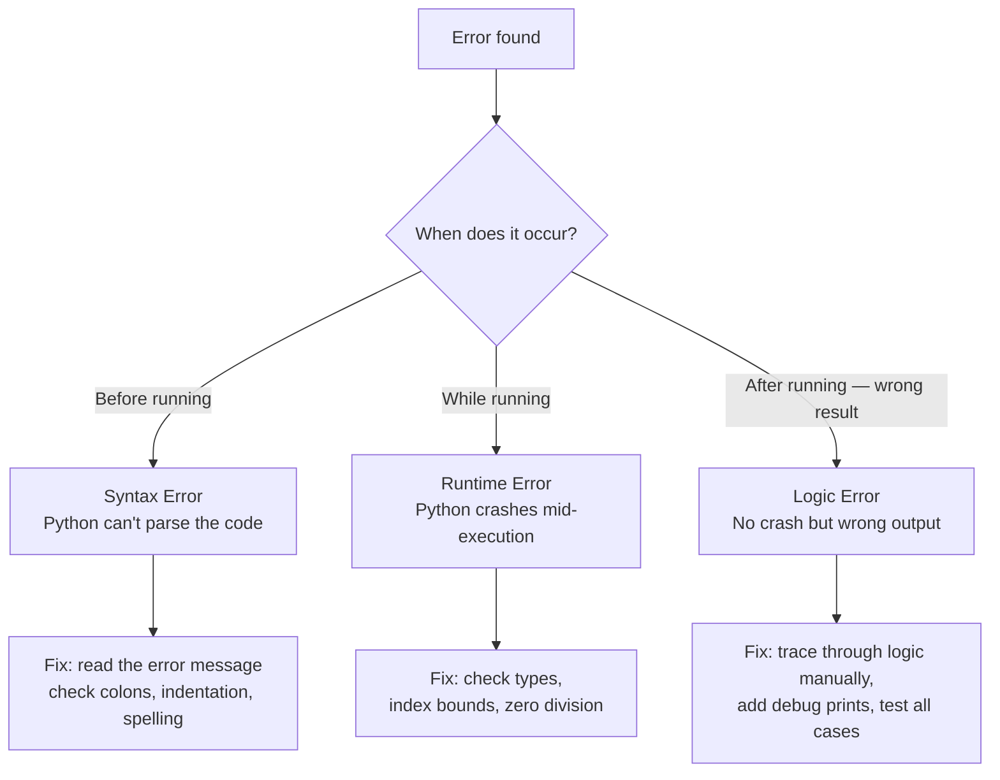
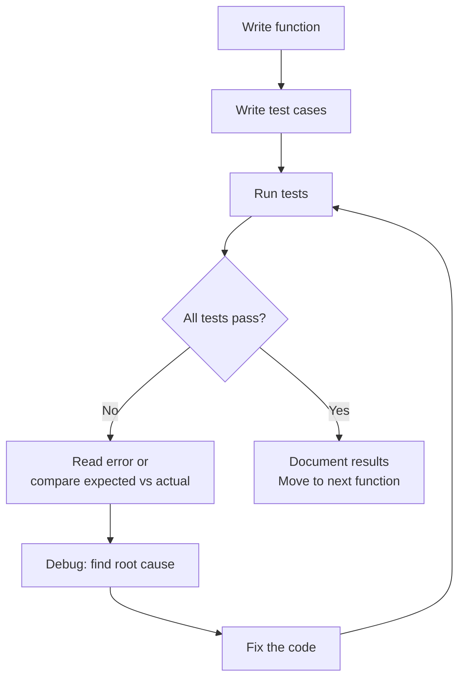

# Testing and Debugging
**Course:** 12DGT  
**Year Level:** Year 12 (Level 7 – NCEA Level 2)  
**Aligned Standard:** AS91896 – Programming with Python  
**Previous topic:** [Data Structures: Lists and Dictionaries](7_data_structures.mdx)  
**Next topic:** [Unit Overview](1_programming_fundamentals.mdx)

---

## 1. Purpose of These Notes

These notes exist to:
- explain the difference between the three types of programming errors
- teach how to design test cases that actually find bugs
- describe practical debugging techniques
- explain what testing and debugging evidence you must submit for AS91896

These notes are **not** a substitute for actively testing your own programs. Testing is a habit, not a single step at the end.

---

## 2. Key Concepts (Overview)

Non-negotiable ideas you must understand by the end of this topic:

- There are three types of errors: **syntax** (code won't run), **runtime** (code crashes while running), and **logic** (code runs but gives wrong results).
- **Testing** means running your program with specific, planned inputs and checking whether the outputs are correct.
- A **test case** specifies: what input is given, what output is expected, and what output actually occurred.
- Testing with only "normal" inputs is not enough — you must test **boundary** and **edge cases** too.
- **Debugging** is systematic: read the error message, locate the problem, understand why it happens, fix it, and test again.

> If your AS91896 submission contains no test evidence or debugging evidence, it is incomplete — regardless of whether your code works.

---

## 3. Core Explanation

### The Three Types of Errors

#### 1. Syntax Errors — "Code Won't Run"

Syntax errors occur when you break Python's grammar rules. Python detects these before running any code.

```python
# SYNTAX ERROR: missing colon
if score >= 50
    print("Passed")

# SYNTAX ERROR: misspelled keyword
whille True:
    pass
```

Python will point to the line with the error and describe what it expected. Syntax errors are the easiest to fix — read the error message.

---

#### 2. Runtime Errors — "Code Crashes While Running"

Runtime errors occur while the program is running. Python can detect them mid-execution:

```python
scores = [85, 72, 91]
print(scores[10])           # IndexError: list index out of range

name = "Alice"
total = name + 100          # TypeError: can only concatenate str to str

result = 10 / 0             # ZeroDivisionError: division by zero
```

Common runtime errors:

| Error type | Cause |
|---|---|
| `IndexError` | List index does not exist |
| `KeyError` | Dictionary key does not exist |
| `TypeError` | Operation on wrong type (e.g., int + str) |
| `ValueError` | Correct type, wrong value (e.g., `int("hello")`) |
| `ZeroDivisionError` | Dividing by zero |
| `NameError` | Variable used before it was defined |

---

#### 3. Logic Errors — "Code Runs, But Wrong Results"

Logic errors are the hardest to detect because Python does not report them. The code runs, but produces incorrect results.

```python
# Logic error: supposed to calculate average, but divides by wrong number
scores = [85, 72, 91]
total = sum(scores)
average = total / 2         # Bug: should be len(scores) = 3, not 2
print(average)              # 124.0 — runs without error, but wrong!
```

Logic errors require careful testing and manual tracing to find.

---

### Designing Test Cases

A test case is a planned check: you specify an input, predict the expected output, run the program with that input, and record the actual output.

**Test case format (use this in your AS91896 evidence):**

| Test # | Input | Expected output | Actual output | Pass/Fail |
|---|---|---|---|---|
| 1 | score = 85 | "Merit" | "Merit" | ✓ |
| 2 | score = 50 | "Achieved" | "Achieved" | ✓ |
| 3 | score = 49 | "Not Achieved" | "Not Achieved" | ✓ |
| 4 | score = -5 | "Invalid input" | Program crashes | ✗ |

---

### What to Test: Normal, Boundary, and Edge Cases

**Normal cases:** Typical inputs that the program should handle correctly.
```
score = 75  → "Achieved"
score = 85  → "Merit"
```

**Boundary cases:** Values exactly at the thresholds in your logic. These are where off-by-one errors hide.
```
score = 50   → exactly the Achieved threshold (test both 50 and 49)
score = 80   → exactly the Merit threshold (test both 80 and 79)
score = 100  → maximum valid score
score = 0    → minimum valid score
```

**Edge cases:** Unusual, extreme, or invalid inputs.
```
score = -1         → invalid (below minimum)
score = 101        → invalid (above maximum)
score = "hello"    → wrong type
(empty input)      → no score entered
```

Testing only normal cases is the most common reason AS91896 submissions are capped at Achieved.

---

### Testing Functions Independently

Test each function separately before testing the whole program together. This is called **unit testing**:

```python
def classify_grade(score):
    if score >= 80:
        return "Merit"
    elif score >= 50:
        return "Achieved"
    else:
        return "Not Achieved"

# Test the function in isolation
print(classify_grade(85))    # Expected: "Merit"          ✓
print(classify_grade(80))    # Expected: "Merit"          ✓ (boundary)
print(classify_grade(79))    # Expected: "Achieved"       ✓ (boundary)
print(classify_grade(50))    # Expected: "Achieved"       ✓ (boundary)
print(classify_grade(49))    # Expected: "Not Achieved"   ✓ (boundary)
print(classify_grade(0))     # Expected: "Not Achieved"   ✓ (edge case)
```

---

### Debugging Techniques

When a bug is found, use this systematic approach:

#### 1. Read the Error Message

Python's error messages tell you exactly what went wrong and on which line. Do not ignore them.

```
Traceback (most recent call last):
  File "program.py", line 7, in <module>
    print(scores[10])
IndexError: list index out of range
```

Read: "On line 7, I tried to access `scores[10]`, but the list doesn't have 11 items."

#### 2. Print Debugging

Add `print()` statements to inspect variable values at key points:

```python
def calculate_average(scores):
    total = 0
    for score in scores:
        total = total + score
        print(f"After adding {score}, total = {total}")   # Debug print
    
    avg = total / len(scores)
    print(f"Final total: {total}, count: {len(scores)}, avg: {avg}")  # Debug
    return avg
```

Remove debug prints before final submission, or replace them with comments.

#### 3. Trace Manually

If the error is in complex logic, trace through it by hand on paper:
- Write the initial variable values
- Follow each line of code step by step
- Update values as you go
- Compare with what you expected

#### 4. Isolate the Problem

If the program is large, narrow down where the bug is:
- Comment out sections temporarily to find which part causes the issue
- Test individual functions in isolation

#### 5. Fix, Then Test Again

After fixing a bug, run all your test cases again — not just the one that failed. Fixes sometimes introduce new bugs.

---

### Error Handling with `try/except`

For predictable errors (e.g., user entering non-numeric input), you can handle them gracefully:

```python
while True:
    try:
        score = int(input("Enter score: "))
        if 0 <= score <= 100:
            break
        else:
            print("Score must be between 0 and 100.")
    except ValueError:
        print("Please enter a whole number.")

print(f"Score recorded: {score}")
```

`try` attempts the risky operation. `except ValueError` runs only if the conversion fails. This prevents the program from crashing on bad input.

---

## 4. Diagrams and Visual Models

### Types of Errors



### The Test-Debug Cycle



---

## 5. Worked Examples (Conceptual, Not Procedural)

### Example 1: A Systematic Test Table

**Program:** A function `calculate_discount(price, member)` that returns a discounted price. Members get 20% off; non-members get 10% off. Prices below 0 are invalid.

**Test table:**

| Test # | Input | Expected | Actual | Pass/Fail | Notes |
|---|---|---|---|---|---|
| 1 | price=100, member=True | 80.0 | 80.0 | ✓ | Normal — member |
| 2 | price=100, member=False | 90.0 | 90.0 | ✓ | Normal — non-member |
| 3 | price=0, member=True | 0.0 | 0.0 | ✓ | Boundary — zero price |
| 4 | price=-10, member=True | "Invalid" | Crashes | ✗ | Edge — negative price |
| 5 | price=50.50, member=False | 45.45 | 45.45 | ✓ | Normal — float price |

**Result:** Test 4 fails. The function does not handle negative prices. This needs a fix (add a check for `price < 0`) and then Test 4 must be re-run.

---

### Example 2: Finding and Fixing a Logic Error

**Problem:** This function is supposed to find the average of a list, but it returns the wrong value.

```python
def find_average(numbers):
    total = 0
    for num in numbers:
        total = total + num
    return total / 2          # Bug is here
```

**Testing reveals the bug:**
```python
print(find_average([10, 20, 30]))  # Expected: 20.0, Actual: 30.0
```

**Debugging steps:**
1. Read: no error message — this is a logic error
2. Trace: total = 10 + 20 + 30 = 60. Function returns 60 / 2 = 30. But there are 3 numbers, not 2.
3. Fix: change `/ 2` to `/ len(numbers)`
4. Re-test: `find_average([10, 20, 30])` → 20.0 ✓

**Post-fix, run all test cases again**, not just the one that was failing.

---

## 6. Common Misconceptions and Pitfalls

### Misconception 1: "My code works, so no testing is needed"

**Incorrect thinking:** If the program runs for the normal case, it is finished.

**Why it's wrong:** The normal case is easy. Bugs hide in boundary and edge cases — the places you probably did not think about when writing the code.

**Correct understanding:** Deliberate testing with boundary and edge cases is what separates Achieved from Merit. Document each test case — it is required evidence.

---

### Misconception 2: "I'll test at the end when the whole program is done"

**Incorrect thinking:** Write everything first, then test.

**Why it's wrong:** When you write 100+ lines without testing, you may have accumulated many bugs that interact with each other. Tracing the problem becomes much harder.

**Correct understanding:** Test each function as you write it. This approach — called **incremental development** — dramatically reduces debugging time.

---

### Misconception 3: "Debugging means trying random changes until it works"

**Incorrect thinking:** Change something, run it, see if it helps. Repeat.

**Why it's wrong:** Random changes may fix the visible symptom while hiding the root cause. You end up with fragile, confusing code.

**Correct understanding:** Debugging is systematic. Read the error message, understand what it means, form a hypothesis about the cause, test the hypothesis, then fix.

---

### Misconception 4: "Error messages are useless — I just skip them"

**Incorrect thinking:** Error messages are confusing; it's faster to just change things.

**Why it's wrong:** Python's error messages tell you exactly which line caused the problem and the type of error. They are the single most useful debugging tool available.

**Correct understanding:** Read the entire error message, including the line number and error type. Look up the error type if you don't know what it means.

---

## 7. Assessment Relevance (AS91896)

**Testing evidence and debugging evidence are both required submission items.** Missing either one means incomplete evidence.

### What AS91896 expects for each grade

| Grade | Testing and debugging standard |
|---|---|
| **Achieved** | Some test cases present; at least one bug identified and fixed (even if informally) |
| **Merit** | A test table with expected vs actual outcomes; boundary cases included; debugging process documented |
| **Excellence** | Systematic testing including edge cases; debugging evidence shows clear identification of root cause, fix applied, and re-testing confirmed the fix; reflection discusses what was difficult and how it was resolved |

### What to submit as testing evidence

1. **Test table** (formatted as a table in your submitted document):
   - Function name
   - Test inputs
   - Expected output
   - Actual output
   - Pass/Fail
   - Notes (especially for failures)

2. **Debugging evidence** (inline code comments or a separate section):
   - Describe the error that occurred
   - Explain what you identified as the cause
   - Show the fix you applied
   - Show the test result after the fix

**Example debugging comment in code:**
```python
# BUG FIX (Week 4): Function was dividing total by 2 instead of len(scores).
# Root cause: copy-paste error from an earlier example.
# Fix: changed `/ 2` to `/ len(scores)`.
# Re-tested: calculate_average([10, 20, 30]) now returns 20.0 ✓
```

### Evidence checklist for testing and debugging

- [ ] Test table present with at least 3 test cases per major function (required minimum)
- [ ] Test table includes at least one boundary case per conditional threshold
- [ ] Test table includes at least one edge case (invalid input or empty collection)
- [ ] At least one bug documented with: description, cause, fix, and re-test result
- [ ] Test results match the actual program output (not made up)
- [ ] Debug prints removed from final submission (or commented out)

---

## 8. External Resources

### Video
- **Python Debugging Techniques** – Real Python – [YouTube](https://www.youtube.com/watch?v=1QByIOWWsnA) – print debugging and reading error messages
- **Python Error Types Explained** – Programming with Mosh – [YouTube](https://www.youtube.com/watch?v=NIWwJbo-9_8) – syntax, runtime, and logic errors

### Practice Tools
- **Python Tutor** – https://pythontutor.com – Step through code line by line to find exactly where values go wrong
- **Replit** – https://replit.com – Run and modify test cases quickly

### Reading
- **Automate the Boring Stuff, Appendix B** – https://automatetheboringstuff.com – Running programs with assertions for automated testing

---

## 9. Key Vocabulary

- **Testing:** Running a program with planned inputs and verifying that the outputs match expectations.
- **Test case:** A single check: an input, an expected output, and the actual output — used to verify a specific aspect of program behaviour.
- **Debugging:** The process of finding the cause of a bug and fixing it.
- **Bug:** An error in a program that causes it to behave incorrectly.
- **Syntax error:** An error caused by violating Python's grammar rules — the program cannot run at all.
- **Runtime error:** An error that occurs while the program is running — the program crashes with an exception message.
- **Logic error:** An error where the program runs without crashing but produces incorrect output.
- **Normal case:** A typical, expected input that the program should handle correctly.
- **Boundary case:** An input at the exact threshold of a conditional (e.g., exactly 50 when the threshold is ≥ 50).
- **Edge case:** An unusual, extreme, or invalid input (e.g., empty list, negative number, wrong type).
- **`try/except`:** A Python construct that allows you to handle runtime errors gracefully without crashing.
- **`ValueError`:** A runtime error raised when a function receives an argument of the correct type but an inappropriate value (e.g., `int("hello")`).
- **`IndexError`:** A runtime error raised when accessing a list index that does not exist.
- **Incremental development:** Writing and testing code in small steps, rather than writing everything at once before testing.
- **Unit testing:** Testing a single function in isolation, independent of the rest of the program.

---

*End of Testing and Debugging*
