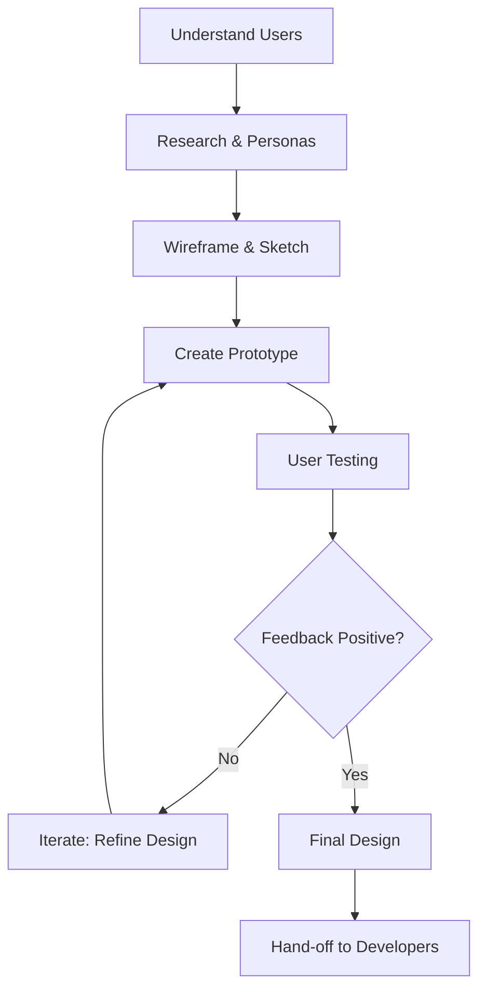
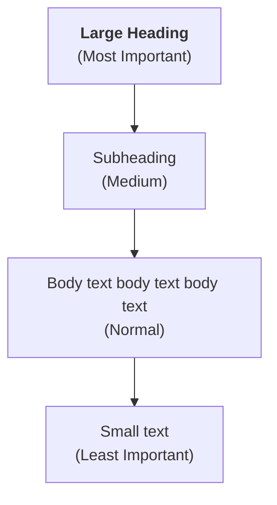
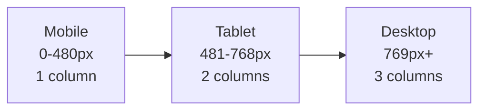
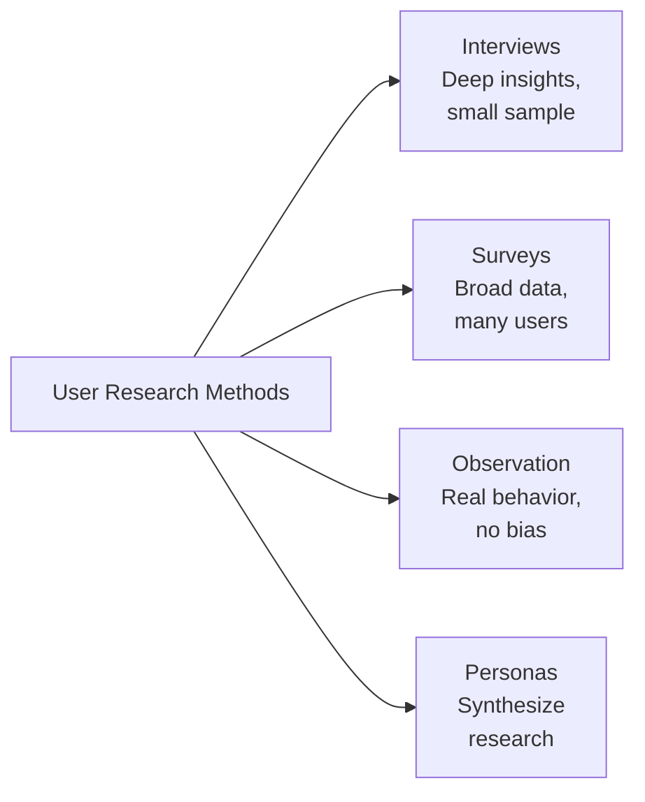

# Web Design & UX Principles – Unit Course Notes

**Course:** 12DGT  
**Year Level:** Year 12 (Level 7 – NCEA Level 2)  
**Unit / Module:** 02_Web_Design (UX/UI Foundations)  
**Aligned Standard(s):** AS91892 – Web Design  
**Lesson Context:** Design thinking and user-centered approach leading to summative assessment  
**Estimated Time:** ~6 weeks (2 weeks prep + 4 weeks assessment)

---

## 1. Purpose of These Notes

These notes exist to:
- explain UX design principles clearly and grounded in user needs
- support user research and design thinking
- provide a reference students can revisit
- reinforce the connection between design decisions and user behavior

These notes are **not** a substitute for real user testing or iterative design practice.

---

## 2. Key Concepts (Overview)

This section lists the **non-negotiable ideas** students must understand by the end of this unit:

- **Design begins with understanding users, not aesthetics.** Before making anything look good, understand who will use it and why.
- **User research is grounded in real data.** You discover user needs through interviews, surveys, or observation—not assumptions.
- **Accessibility is not optional; it is ethical and required.** Design must work for all users, including those with disabilities.
- **Visual hierarchy guides attention.** Size, color, and spacing signal what is important; users see them in order.
- **Consistency reduces cognitive load.** Users learn patterns (button placement, color use, navigation structure). Inconsistency is frustrating.
- **Usability is measurable.** You test designs with real users and iterate based on feedback, not personal preference.
- **Responsive design adapts to different devices.** The same design works on mobile, tablet, and desktop.
- **Color, typography, and whitespace have psychological effects.** These choices communicate tone and influence emotion.

> If students cannot explain these ideas in their own words AND apply them in their designs, they have not mastered the topic.

---

## 3. Core Explanation

### User-Centered Design vs. Designer-Centered Design

**Designer-centered design:** "I think this looks good, so I'll make it this way."

**User-centered design:** "Who will use this? What problem does it solve for them? How will they use it?"

The difference is fundamental. User-centered design asks questions *before* designing:

- Who are the users?
- What is their goal?
- What devices do they use?
- What frustrates them?
- What are they familiar with?

**Why this matters:** A beautiful website that users can't navigate is a failed design. A plain website that solves a user problem is a success.

**What goes wrong:** Students design for themselves or assume they understand users without asking. This leads to designs that are hard to use or miss real user needs.

---

### User Research: Learning About Your Audience

**User research** is the process of understanding who will use your product and what they need.

**Methods:**

1. **Interviews** – Ask real people questions about their needs and frustrations.
   - "What problems do you face when trying to [task]?"
   - "How do you currently solve this problem?"
   - Listen more than you talk.

2. **Surveys** – Ask many people structured questions.
   - Useful for gathering data from a larger group
   - Less useful for understanding deep user motivations

3. **Observation** – Watch people use similar products.
   - "What do they click on first?"
   - "Where do they look for navigation?"
   - "What confuses them?"

4. **Personas** – Create fictional but realistic user profiles based on research.
   - Example: "Sarah is a 45-year-old teacher who rarely uses tech. She needs to submit grades online but finds most education software confusing."
   - Personas help you design for *someone*, not *everyone*.

**Why research matters:** It prevents the trap of designing for yourself. Real users have different needs, devices, and technical skills.

**What goes wrong:** Students create personas from imagination instead of research. This leads to designs that don't solve real problems.

---

### Visual Hierarchy

**Visual hierarchy** is the arrangement of elements so that the most important elements are noticed first.

**Tools for creating hierarchy:**

| Tool | Effect | Example |
|------|--------|---------|
| **Size** | Large elements attract attention first | Heading is large, body text is small |
| **Color** | Bright or contrasting colors stand out | Call-to-action button is red; background is neutral |
| **Position** | Top-left and center are noticed first | Logo is top-left; important message is center |
| **Whitespace** | Elements surrounded by space feel important | Important text has space around it |
| **Weight** | Bold text is noticed before thin text | Section titles are bold |

**Example of poor hierarchy:** All text is the same size, color, and weight. Users don't know what to read first.

**Example of good hierarchy:** Heading is large and bold. Subheadings are medium. Body text is smaller. Users naturally scan in order of importance.

**What goes wrong:** Students make everything big and colorful, trying to make it all important. This creates noise, not clarity.

---

### Consistency and Pattern Recognition

Humans learn patterns. When patterns are consistent, we feel confident. When they break, we feel confused.

**Examples of consistency:**
- Buttons always have the same color and shape
- Navigation is always in the same location
- Font sizes follow a predictable scale
- Link colors are always the same

**Why consistency matters:** After the first interaction, users predict what will happen next. Consistency rewards that prediction. Breaking it—even for aesthetic reasons—breaks user confidence.

**Common inconsistency mistakes:**
- Navigation menu is on the left on page 1, the right on page 2
- Some buttons are rounded, some are square, with no reason
- Link colors change arbitrarily
- Spacing between sections varies with no logic

**What goes wrong:** Students make each page different to show creativity. Consistency is boring to them, but predictable to users.

---

### Accessibility (WCAG AA Standards)

**Accessibility** means designing so that all users can access your website, including those with:
- Vision impairments (low vision, color blindness, blindness)
- Hearing impairments
- Motor impairments (difficulty with fine mouse control)
- Cognitive impairments (difficulty processing complex layouts)

**Key accessibility rules (WCAG AA):**

1. **Color Contrast:** Text must have sufficient contrast against its background.
   - Minimum ratio is 4.5:1 for normal text
   - Check contrast at https://www.tpgi.com/color-contrast-checker/
   - **Why:** Users with low vision or color blindness can't read low-contrast text.

2. **Text Size:** Body text should be at least 14-16px.
   - **Why:** Large text is easier to read, especially for aging eyes.

3. **Alt Text:** Every image must have a text description (alt text).
   - ``
   - **Why:** Screen readers (used by blind users) read alt text aloud.

4. **Readable Fonts:** Use fonts designed for screen reading (sans-serif fonts like Arial, Verdana).
   - Avoid script or decorative fonts for body text
   - **Why:** These fonts are harder to read, especially on screens.

5. **Logical Navigation:** Headings and links should be meaningful and in order.
   - Don't skip heading levels (e.g., h1 → h2 is fine; h1 → h3 skips h2 and confuses screen readers)
   - Link text should describe the destination ("Learn More" is vague; "Read Our Privacy Policy" is clear)
   - **Why:** Screen reader users navigate by headings and links; meaningful text helps them understand structure.

6. **Keyboard Navigation:** All interactive elements must be reachable via keyboard.
   - Users who can't use a mouse rely on Tab key to navigate
   - **Why:** Some users have motor impairments and can't manipulate a mouse.

**What goes wrong:** Students design only for vision and don't consider other disabilities. They use inaccessible colors or fonts because they "look cool."

---

### Responsive Design

**Responsive design** means a website adapts its layout to different screen sizes (mobile, tablet, desktop).

**Key principles:**
- Layouts stack vertically on small screens (mobile)
- Layouts expand horizontally on large screens (desktop)
- Text and images scale proportionally
- Navigation simplifies on small screens (hamburger menu instead of full navigation bar)

**Example:** A three-column layout on desktop becomes one column on mobile.

```
Desktop (3 columns):                      Mobile (1 column):

[Sidebar] [Main] [Sidebar]                [Sidebar]
                                          [Main]
                                          [Sidebar]
```

**Why responsive design matters:** More than 60% of users access websites on mobile. Ignoring mobile is ignoring your audience.

**What goes wrong:** Students design for desktop only. Mobile users see a tiny, unreadable website or have to scroll horizontally (frustrating).

---

### Color Psychology and Tone

Colors communicate emotion and influence user behavior.

| Color | Feeling | Common Use |
|-------|---------|------------|
| **Red** | Urgent, energetic, stop | Call-to-action buttons, alerts, warnings |
| **Blue** | Calm, trustworthy, professional | Corporate sites, banking, tech |
| **Green** | Growth, health, go | Success messages, health/wellness sites |
| **Yellow** | Happy, optimistic, caution | Call-to-action, warnings |
| **Purple** | Creative, premium, mysterious | Creative industries, luxury brands |
| **Black/Gray** | Professional, sophisticated | Neutral backgrounds, tech |

**Example:** A health and wellness app uses greens and light blues (calm, healthy). A fast-food site uses reds and yellows (energetic, urgent—buy now).

**Tone matching:** Your color choices should match your audience and purpose.
- Professional B2B site: Blues, grays, professional
- Youth-oriented site: Bright colors, creative combinations
- Medical site: Trust-inspiring blues and greens

**What goes wrong:** Students pick colors they like personally without considering tone or accessibility.

---

### Typography: Font Choices Matter

**Serif fonts** (Georgia, Times New Roman) have small decorative lines at letter ends. Historically used for printed books.

**Sans-serif fonts** (Arial, Verdana, Helvetica) are clean without decorations. Better for screen reading.

**For web:**
- **Body text:** Use sans-serif (easier to read on screens)
- **Headings:** Can use serif or sans-serif, but keep consistent
- **Avoid:** Script, decorative, or handwriting fonts for body text (too hard to read)

**Font sizes:**
- **Headings:** 24px–48px (depending on hierarchy)
- **Body text:** 14px–16px minimum
- **Small text:** Not below 12px

**Line spacing (line-height):** More space between lines makes text easier to read.
- Normal is about 1.5x the font size
- Example: 16px font → 24px line height

**What goes wrong:** Students use fancy fonts that look cool but are hard to read. Or mix too many fonts (more than 2 is usually too many).

---

### Whitespace (The Power of Negative Space)

**Whitespace** is empty space on a page. It's not "wasted" space; it's a design element.

**Benefits of whitespace:**
- **Clarity:** Separates elements so you know what goes together
- **Breathing room:** Makes the page feel less cramped
- **Focus:** Elements surrounded by space feel important

**Example of poor whitespace:** Everything is crammed together. The page feels overwhelming.

**Example of good whitespace:** Elements have space around them. The page feels organized and calm.

**What goes wrong:** Students feel whitespace is "wasted" and fill it with content. This makes pages overwhelming.

---

### Iteration and User Testing

**Iteration** is the process of making a design, testing it, and refining it based on feedback.

**Cycle:**
1. **Design** – Create wireframes or a prototype
2. **Test** – Show it to users and ask for feedback
3. **Iterate** – Refine based on feedback
4. **Repeat** – Test again

**Testing questions:**
- "What is the main purpose of this page?"
- "How would you [task]?" (e.g., "How would you find our phone number?")
- "What is confusing?"
- "What would you improve?"

**Why iteration matters:** Your first design won't be perfect. Real feedback reveals problems you missed.

**What goes wrong:** Students design once and submit. They don't test or iterate. The result lacks user validation.

---

## 4. Diagrams and Visual Models

### The Design Process (Iterative)



### Visual Hierarchy Example



### Responsive Breakpoints



### User Research Methods Comparison



---

## 5. Worked Examples (Conceptual, Not Procedural)

### Example 1: Analyzing an Accessibility Problem

**Scenario:** A student designs a website with a red button on a dark red background. The button has white text.

**Accessibility problem:** The red-on-dark-red has poor color contrast. Users with low vision or color blindness can't see where the button is.

**How to fix it:**
1. Use a contrasting background (light gray, white)
2. Or use a different button color (green, blue, yellow)
3. Check contrast ratio (should be 4.5:1 or higher)

**What was learned:** Color choice affects not just aesthetics but user access.

---

### Example 2: Designing for Multiple Users

**Research findings:**
- User A (tech-savvy, 25 years old): Wants advanced features, fast interface
- User B (beginner, 60 years old): Wants simple, large text, clear instructions

**Design solution:**
- Make the interface simple by default
- Offer "Advanced" mode for power users
- Use large fonts and clear navigation for all

**Why this works:** You're not designing for one user; you're designing for a range. The solution accommodates both.

---

### Example 3: Iterating a Navigation Menu

**Version 1 (designed by student, not tested):**
- Navigation text is small (12px)
- Items are close together
- Hover effects are subtle

**User testing feedback:**
- "I can't read the menu"
- "I keep clicking on the wrong item"
- "I don't know when I'm hovering over something"

**Version 2 (after iteration):**
- Navigation text is larger (16px)
- Items are spaced farther apart
- Hover effects are obvious (background color changes)

**What was learned:** Testing reveals problems that designers miss. Iteration improves usability.

---

## 6. Common Misconceptions and Pitfalls

### Misconception 1: "Good design = pretty design"

**Incorrect thinking:** If it looks nice, it's good design.

**Why it's wrong:** A beautiful website that's hard to use is bad design. An ugly website that users love is good design.

**Correct understanding:** Good design is invisible. Users accomplish their goal without thinking about the interface.

---

### Misconception 2: "I should design for myself, not users"

**Incorrect thinking:** If I like it, users will too.

**Why it's wrong:** You are not typical. Different users have different needs, devices, and abilities.

**Correct understanding:** Design for users, not yourself. User research reveals what matters to them.

---

### Misconception 3: "Accessibility is hard and optional"

**Incorrect thinking:** Accessible design is complicated and can be skipped.

**Why it's wrong:** Basic accessibility (contrast, readable fonts, alt text) is simple. And it's required by law (in many countries) and ethics.

**Correct understanding:** Accessibility benefits everyone. Large fonts help those with and without vision impairments. Clear navigation helps all users.

---

### Misconception 4: "Whitespace is wasted space"

**Incorrect thinking:** I should fill all empty space with content.

**Why it's wrong:** Whitespace organizes and clarifies. Too much content with no spacing overwhelms users.

**Correct understanding:** Whitespace is a design tool. Use it to separate sections and guide attention.

---

### Misconception 5: "I should use many colors and fonts to make it interesting"

**Incorrect thinking:** More variety = more creative.

**Why it's wrong:** Too many colors or fonts create visual noise. Users feel confused, not delighted.

**Correct understanding:** Consistency with restraint (2–3 fonts, a limited color palette) feels sophisticated and professional.

---

### Misconception 6: "Mobile is optional; most users are on desktop"

**Incorrect thinking:** I can design for desktop and ignore mobile.

**Why it's wrong:** Over 60% of web traffic is mobile. Ignoring mobile means ignoring the majority of your users.

**Correct understanding:** Design mobile-first. Start with mobile layouts, then expand to tablet and desktop.

---

## 7. Assessment Relevance

This unit directly prepares you for **AS91892 – Web Design**, which requires:

- **User research** showing you understand your audience (interviews, surveys, or personas)
- **Wireframes** showing page structure and layout
- **Prototype or mockup** showing visual design (colors, fonts, spacing)
- **Design rationale** explaining why you made specific choices
- **Iteration evidence** showing you refined the design based on feedback
- **Accessibility audit** showing your design meets WCAG AA standards

**What you'll be asked to do:**
- Research real users and create personas
- Sketch wireframes (low-fidelity designs showing structure only)
- Create a digital prototype in Figma or similar tool
- Write explanations for design choices
- Test your design with users and iterate
- Verify your design is accessible

**Why this matters in industry:**
- Professional designers spend 50% of time on research and 50% on design
- Accessibility is both legal requirement and ethical obligation
- Iteration based on user feedback produces better outcomes than guessing
- Designers must justify their choices; "I like it" is not a reason

---

## 8. External Resources (Optional but Recommended)

### Video Resources

- **What is UX Design?** – The Interaction Design Foundation – [YouTube](https://www.youtube.com/watch?v=teJ_GxuJrqo) – Clear overview of UX vs UI and the design process
- **User Research 101** – Nielsen Norman Group – [YouTube](https://www.youtube.com/watch?v=Qq7-I6AxXAU) – How to conduct user interviews and research
- **Accessibility for Web Design** – WebAIM – [YouTube](https://www.youtube.com/watch?v=tIkP7hY9Tts) – Clear explanations of WCAG standards and how to implement them
- **Color Theory for Design** – Interaction Design Foundation – [YouTube](https://www.youtube.com/watch?v=_rKv3hQ_0ak) – How colors communicate and affect emotion
- **Responsive Web Design** – Traversy Media – [YouTube](https://www.youtube.com/watch?v=srvUrASNj0s) – Mobile-first design and CSS media queries
- **Wireframing for UX** – NN/g – [YouTube](https://www.youtube.com/watch?v=qpH7-KFWZRI) – How to sketch wireframes effectively

### Design Tools and Resources

- **Figma** – https://www.figma.com – Free for students; industry-standard design tool for prototyping
- **Adobe XD** – https://www.adobe.com/products/xd.html – Free trial; good for prototyping and wireframing
- **Miro** – https://miro.com – Free for students; great for collaborative brainstorming and wireframing
- **Color Contrast Checker** – https://www.tpgi.com/color-contrast-checker/ – Verify WCAG compliance
- **WAVE Accessibility Checker** – https://wave.webaim.org – Browser extension to audit web page accessibility
- **Google Fonts** – https://fonts.google.com – Free, web-safe fonts; great for learning typography

### Learning Resources

- **Interaction Design Foundation (IDF)** – https://www.interaction-design.org – Free courses on UX design, research, accessibility
- **Nielsen Norman Group** – https://www.nngroup.com/articles/ – Articles on UX best practices
- **UX Collective** – https://uxdesign.cc – Medium publication with UX articles and case studies
- **A List Apart** – https://alistapart.com – Web design and development articles, including accessibility

---

## 9. Key Vocabulary

Students are expected to understand and use this terminology accurately:

- **UX (User Experience):** How a user feels when interacting with a product; includes usability, emotion, and satisfaction.
- **UI (User Interface):** The visual and interactive elements of a product (buttons, menus, forms).
- **User-centered design:** Design based on understanding and testing with real users, not designer assumptions.
- **User research:** Investigation into who users are, what they need, and how they behave.
- **Persona:** A fictional but realistic user profile based on research; represents a user segment.
- **Wireframe:** A low-fidelity sketch showing page structure and layout without visual design.
- **Prototype:** A working or semi-working mockup of a design; used for testing and feedback.
- **Mockup:** A high-fidelity visual representation of a design; shows colors, fonts, and images.
- **Iteration:** The process of refining a design based on feedback; repeat cycles.
- **Visual hierarchy:** The arrangement of elements so that important elements are noticed first.
- **Accessibility:** Design that is usable by all people, including those with disabilities.
- **WCAG (Web Content Accessibility Guidelines):** International standards for web accessibility.
- **Color contrast:** The difference in brightness between text and background; required for readability.
- **Alt text:** Text description of an image; read aloud by screen readers for blind users.
- **Responsive design:** Design that adapts to different screen sizes (mobile, tablet, desktop).
- **Consistency:** Repeating patterns (colors, fonts, layouts) so users feel confident and learn quickly.
- **Whitespace (negative space):** Empty space on a page; a design tool that aids clarity and focus.
- **Typography:** The art of arranging and styling text; includes font choice, size, and spacing.
- **Cognitive load:** The amount of mental effort required to use a product; lower is better.
- **Usability:** How easily users can accomplish their goals with a product.
- **Feedback (in design context):** Information shown to users about the result of their action (e.g., button changes color when clicked).

---

*End of Web Design & UX Principles – Unit Course Notes*
