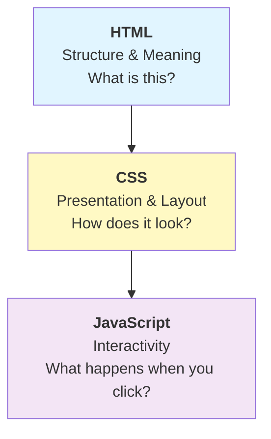
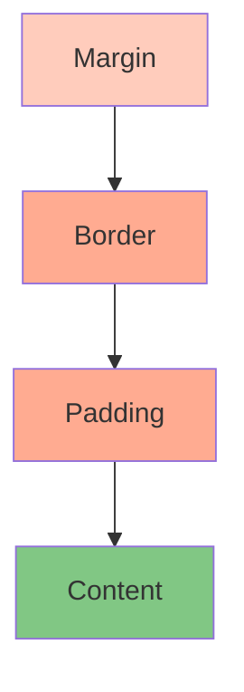
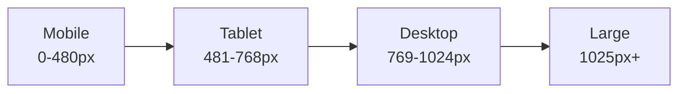
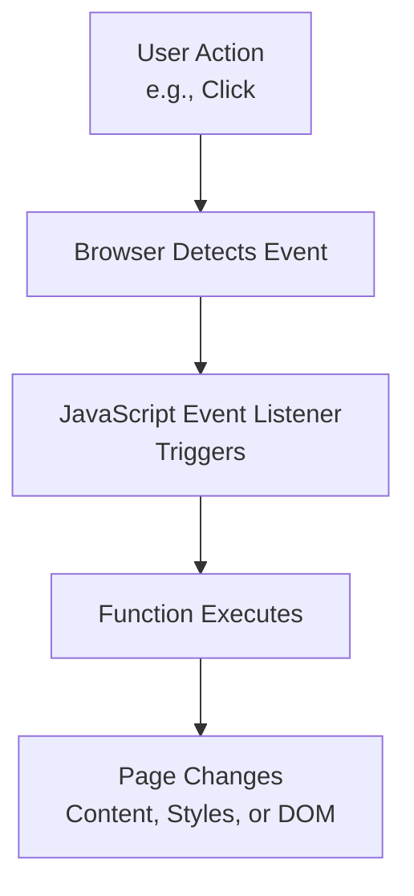

# Full-Stack Website Development – Unit Course Notes

**Course:** 12DGT  
**Year Level:** Year 12 (Level 7 – NCEA Level 2)  
**Unit / Module:** 03_Full_Stack_Website_Project  
**Aligned Standard(s):** AS91893 – Full-Stack Website Project  
**Lesson Context:** Integration of design and front-end development leading to summative assessment  
**Estimated Time:** ~8 weeks (2 weeks prep + 6 weeks assessment)

---

## 1. Purpose of These Notes

These notes exist to:
- explain HTML, CSS, and JavaScript fundamentals for web development
- connect design decisions to code implementation
- support iterative development and testing
- reinforce responsive design and accessibility

These notes are **not** a substitute for hands-on coding practice or debugging.

---

## 2. Key Concepts (Overview)

This section lists the **non-negotiable ideas** students must understand by the end of this unit:

- **HTML is semantic structure.** HTML tags describe *what* content is (heading, paragraph, button), not *how* it looks.
- **CSS is visual presentation.** CSS controls colors, fonts, spacing, and layout without changing the HTML.
- **JavaScript is interactivity.** JavaScript responds to user actions (clicks, input) and changes the page dynamically.
- **Separation of concerns** – Keep HTML, CSS, and JavaScript separate. Each has one job.
- **Responsive design requires planning.** Mobile-first thinking shapes HTML structure and CSS media queries from the start.
- **Accessibility must be coded.** HTML tags, alt text, color contrast, and keyboard navigation are accessibility foundations.
- **The browser renders top-to-bottom and left-to-right** by default. Understanding layout requires understanding how browsers interpret CSS.
- **Testing across devices and browsers is mandatory.** What works on your computer might break on mobile or in a different browser.

> If students cannot explain these ideas AND implement them in working code, they have not mastered the topic.

---

## 3. Core Explanation

### HTML: Semantic Markup

**HTML** (HyperText Markup Language) provides structure and meaning to content using tags.

**Key principle:** HTML describes *what* content is, not *how* it looks.

```html
<!-- WRONG: Using presentation tags -->
<b>Contact Us</b>  <!-- Bold, but no meaning -->

<!-- RIGHT: Using semantic tags -->
<h1>Contact Us</h1>  <!-- This is a heading; semantic meaning is clear -->
```

**Common semantic tags:**

| Tag | Meaning | Example |
|-----|---------|---------|
| `<h1>–<h6>` | Headings (h1 most important) | `<h1>Page Title</h1>` |
| `<p>` | Paragraph | `<p>This is a paragraph.</p>` |
| `<nav>` | Navigation menu | `<nav><a>Home</a> <a>About</a></nav>` |
| `<header>` | Header of page or section | `<header>Site name and logo</header>` |
| `<main>` | Main content (only one per page) | `<main>Primary content</main>` |
| `<article>` | Self-contained content | `<article>Blog post</article>` |
| `<section>` | Thematic group of content | `<section>Product Features</section>` |
| `<footer>` | Footer of page or section | `<footer>Copyright info</footer>` |
| `<button>` | Interactive button | `<button>Click me</button>` |
| `` | Image with required alt text | `` |
| `<a>` | Link | `<a href="page.html">Go to page</a>` |
| `<ul>` / `<li>` | Unordered list | `<ul><li>Item 1</li></ul>` |
| `<form>` | User input form | `<form>...</form>` |
| `<input>`, `<textarea>` | Form fields | `<input type="text">` |

**Why semantic HTML matters:**
- **Accessibility:** Screen readers understand `<h1>` as a heading; they don't understand `<div class="big bold">`.
- **SEO:** Search engines understand semantic tags better
- **Readability:** Your code is easier to understand and maintain
- **Styling:** CSS can target semantic tags more easily

**What goes wrong:** Students use `<div>` for everything instead of semantic tags. The page works, but it's not accessible.

---

### CSS: Styling and Layout

**CSS** (Cascading Style Sheets) controls the visual presentation of HTML—colors, fonts, spacing, and layout.

**Key principle:** CSS should not change the HTML structure. HTML stays the same; CSS changes how it looks.

**Box Model:** Every HTML element is a rectangular box with four layers:

```
┌─────────────────────────┐
│      margin             │  (space outside border)
│  ┌─────────────────────┐│
│  │  border             ││  (outline)
│  │  ┌─────────────────┐││
│  │  │ padding         │││  (space inside border)
│  │  │ ┌─────────────┐ │││
│  │  │ │   content   │ │││  (text, images, etc.)
│  │  │ └─────────────┘ │││
│  │  └─────────────────┘││
│  └─────────────────────┘│
└─────────────────────────┘
```

**Example:**
```css
p {
    margin: 20px;      /* Space outside */
    padding: 10px;     /* Space inside */
    border: 1px solid black;
    color: #333;       /* Text color */
    font-size: 16px;
}
```

**Common CSS properties:**

| Property | Purpose | Example |
|----------|---------|---------|
| `color` | Text color | `color: blue;` |
| `background-color` | Background color | `background-color: #f0f0f0;` |
| `font-family` | Font choice | `font-family: Arial, sans-serif;` |
| `font-size` | Text size | `font-size: 16px;` |
| `margin` | Space outside | `margin: 20px;` |
| `padding` | Space inside | `padding: 10px;` |
| `display` | Layout mode (block, inline, flex, grid) | `display: flex;` |
| `width` | Element width | `width: 100%;` |
| `height` | Element height | `height: 200px;` |
| `border` | Border line | `border: 1px solid black;` |

**Responsive Design with Media Queries:**

Media queries allow different styles for different screen sizes:

```css
/* Default (mobile-first) */
body {
    font-size: 14px;
}

nav {
    display: block;  /* Full menu on mobile */
}

/* Tablets and larger */
@media (min-width: 768px) {
    body {
        font-size: 16px;
    }
    
    nav {
        display: flex;  /* Side-by-side on tablet */
    }
}

/* Desktops */
@media (min-width: 1024px) {
    body {
        max-width: 1200px;
        margin: 0 auto;  /* Center content */
    }
}
```

**Flexbox for Layout:**

Flexbox makes it easy to align and distribute elements:

```css
.container {
    display: flex;
    justify-content: space-between;  /* Space elements evenly */
    align-items: center;             /* Vertically center */
    gap: 20px;                       /* Space between items */
}
```

**What goes wrong:** Students hardcode pixel sizes instead of using relative sizing (percentages, em). This breaks responsive design.

---

### JavaScript: Interactivity and Dynamic Content

**JavaScript** makes websites interactive. It responds to user actions and changes the page dynamically.

**Common uses:**
- Validate form input before submission
- Change page content when buttons are clicked
- Hide/show elements
- Animate elements
- Fetch data from a server

**Basic DOM Manipulation:**

DOM = Document Object Model. JavaScript uses the DOM to access and modify HTML.

```javascript
// Select an element
const button = document.getElementById("myButton");

// Add an event listener (respond to clicks)
button.addEventListener("click", function() {
    console.log("Button clicked!");
    
    // Change HTML content
    document.getElementById("message").textContent = "Hello, User!";
    
    // Change CSS styles
    document.getElementById("message").style.color = "red";
});
```

**Form Validation:**

```javascript
function validateForm() {
    const email = document.getElementById("email").value;
    
    if (email === "") {
        alert("Email is required");
        return false;  // Prevent form submission
    }
    
    if (!email.includes("@")) {
        alert("Email must contain @");
        return false;
    }
    
    return true;  // Allow form submission
}
```

**Toggle Visibility:**

```javascript
const toggle = document.getElementById("toggleButton");
const content = document.getElementById("content");

toggle.addEventListener("click", function() {
    // If visible, hide it; if hidden, show it
    if (content.style.display === "none") {
        content.style.display = "block";
    } else {
        content.style.display = "none";
    }
});
```

**What goes wrong:** Students make lots of changes to the page without saving state. Refreshing the page loses all changes.

---

### Connecting Design to Code

**The design-to-code workflow:**

1. **Design** creates a visual mockup in Figma or similar
2. **Developer** analyzes the design and decides on HTML structure
3. **Developer** implements HTML (semantic markup)
4. **Developer** styles with CSS (colors, fonts, layout from design)
5. **Developer** adds JavaScript for interactivity

**Example: Converting a design to code**

**Design mockup shows:**
- Header with site name and navigation menu
- Main content area with article
- Sidebar with related links
- Footer with copyright

**HTML structure:**
```html
<header>
    <h1>Site Name</h1>
    <nav>
        <a>Home</a>
        <a>About</a>
        <a>Contact</a>
    </nav>
</header>

<main>
    <article>
        <h2>Article Title</h2>
        <p>Article content...</p>
    </article>
</main>

<aside>
    <h3>Related Links</h3>
    <ul>
        <li><a>Link 1</a></li>
        <li><a>Link 2</a></li>
    </ul>
</aside>

<footer>
    <p>&copy; 2026 My Site</p>
</footer>
```

**CSS (mobile-first responsive):**
```css
/* Mobile: single column */
body {
    font-family: Arial, sans-serif;
    margin: 0;
    padding: 10px;
}

main, aside {
    width: 100%;
}

/* Tablet and up: two columns */
@media (min-width: 768px) {
    body {
        display: flex;
        flex-wrap: wrap;
    }
    
    main {
        width: 70%;
    }
    
    aside {
        width: 30%;
    }
}
```

---

### Accessibility in Code

**Accessible HTML:**
- Use semantic tags (`<h1>`, `<nav>`, `<main>`)
- Include alt text on all images: ``
- Use `<label>` with form inputs: `<label for="email">Email:</label> <input id="email">`
- Ensure heading hierarchy is correct (h1 → h2 → h3, not h1 → h3)

**Accessible CSS:**
- Sufficient color contrast (4.5:1 ratio)
- Text size at least 14-16px
- Readable fonts (sans-serif)
- Focus indicators on buttons (so keyboard users know what's selected)

```css
button:focus {
    outline: 2px solid blue;  /* Show when keyboard user tabs to button */
}
```

**Keyboard Navigation:**
- All interactive elements must be reachable via Tab key
- Ensure links and buttons are keyboard-accessible

**What goes wrong:** Students ignore accessibility. Pages work for them but fail for users with disabilities.

---

### Testing and Debugging

**Cross-browser testing:** Test your website in multiple browsers (Chrome, Firefox, Safari, Edge) and on multiple devices (mobile, tablet, desktop).

**Browser Developer Tools:**
- Right-click → "Inspect" to see HTML and CSS
- Check the Console for JavaScript errors
- Use the Mobile Device Emulator to test responsive design

**Testing checklist:**
- [ ] All links work
- [ ] All forms submit and validate
- [ ] Images load and display correctly
- [ ] Text is readable (color contrast, font size)
- [ ] Page works on mobile and desktop
- [ ] No console errors
- [ ] Keyboard navigation works (Tab key)

**What goes wrong:** Students test only on their own computer, then discover bugs on mobile or in a different browser.

---

## 4. Diagrams and Visual Models

### Web Stack: HTML, CSS, JavaScript



### Box Model



### Responsive Breakpoints



### JavaScript Event Flow



---

## 5. Worked Examples (Conceptual, Not Procedural)

### Example 1: Converting a Design to Responsive HTML/CSS

**Design shows:**
- Header with centered logo (200px wide)
- Two-column layout: Article (70% width) and Sidebar (30% width)
- On mobile, stacks to single column

**HTML:**
```html
<header>
    
</header>

<div class="container">
    <main>
        <article>...</article>
    </main>
    
    <aside>
        <h3>Sidebar</h3>
        <p>Content...</p>
    </aside>
</div>

<footer>
    <p>&copy; 2026</p>
</footer>
```

**CSS (mobile-first):**
```css
/* Mobile: single column */
body {
    font-family: Arial, sans-serif;
    margin: 0;
}

header {
    text-align: center;
    padding: 20px;
}

header img {
    max-width: 200px;
    width: 100%;
}

.container {
    display: flex;
    flex-direction: column;
    gap: 20px;
    padding: 20px;
}

main, aside {
    width: 100%;
}

/* Tablet and up: two columns */
@media (min-width: 768px) {
    .container {
        flex-direction: row;
    }
    
    main {
        width: 70%;
    }
    
    aside {
        width: 30%;
    }
}
```

**Why this works:**
- Mobile-first approach: default is single column
- Flexbox makes layout flexible
- Media query adapts to larger screens
- Responsive image (`max-width: 100%`) scales on mobile

---

### Example 2: Adding JavaScript Interactivity

**Design shows:** "Show More" button that toggles additional content.

**HTML:**
```html
<article>
    <h2>Article Title</h2>
    <p>First paragraph...</p>
    
    <div id="hidden-content" style="display: none;">
        <p>Hidden paragraph 1...</p>
        <p>Hidden paragraph 2...</p>
    </div>
    
    <button id="toggle-btn">Show More</button>
</article>
```

**JavaScript:**
```javascript
const btn = document.getElementById("toggle-btn");
const content = document.getElementById("hidden-content");

btn.addEventListener("click", function() {
    // Toggle visibility
    if (content.style.display === "none") {
        content.style.display = "block";
        btn.textContent = "Show Less";
    } else {
        content.style.display = "none";
        btn.textContent = "Show More";
    }
});
```

**Why this works:**
- Event listener responds to click
- JavaScript changes display style (shows/hides content)
- Button text updates to reflect state ("Show More" ↔ "Show Less")
- No page refresh needed; all happens in the browser

---

### Example 3: Form Validation

**Design shows:** Email signup form that validates before submission.

**HTML:**
```html
<form onsubmit="return validateForm()">
    <label for="email">Email:</label>
    <input type="email" id="email" required>
    
    <label for="name">Name:</label>
    <input type="text" id="name" required>
    
    <button type="submit">Sign Up</button>
</form>
```

**JavaScript:**
```javascript
function validateForm() {
    const email = document.getElementById("email").value;
    const name = document.getElementById("name").value;
    
    // Check if fields are empty
    if (email === "" || name === "") {
        alert("All fields are required");
        return false;
    }
    
    // Check if email contains @
    if (!email.includes("@")) {
        alert("Please enter a valid email");
        return false;
    }
    
    // Check if name is at least 2 characters
    if (name.length < 2) {
        alert("Name must be at least 2 characters");
        return false;
    }
    
    // All checks passed; allow submission
    alert("Form submitted!");
    return true;
}
```

**Why this works:**
- Validation happens before form submission
- User gets clear feedback if something is wrong
- Return `false` prevents form from submitting if validation fails
- Multiple validation rules catch different errors

---

## 6. Common Misconceptions and Pitfalls

### Misconception 1: "HTML is not important; I should focus on CSS and JavaScript"

**Incorrect thinking:** HTML is just a container; the interesting stuff is styling and interactivity.

**Why it's wrong:** HTML provides the foundation. Bad HTML makes CSS and JavaScript harder. Accessible, semantic HTML is essential.

**Correct understanding:** HTML is the structure. CSS is decoration. JavaScript is behavior. All three matter; start with good HTML.

---

### Misconception 2: "CSS pixels always look the same on different devices"

**Incorrect thinking:** 16px font is 16px everywhere.

**Why it's wrong:** Pixel density varies. A mobile phone has more pixels per inch (DPI) than a desktop monitor. What looks right on desktop is tiny on mobile.

**Correct understanding:** Use responsive design (media queries) and test on actual devices. What works on your computer might not work on mobile.

---

### Misconception 3: "Inline styles (style attribute) are easier; I don't need a separate CSS file"

**Incorrect thinking:** `<p style="color: red;">` is fine.

**Why it's wrong:** Inline styles are hard to maintain. If you want to change all paragraph colors, you edit each style attribute separately. A CSS file changes all at once.

**Correct understanding:** Keep HTML and CSS separate. Styles go in a `<style>` tag or external `.css` file.

---

### Misconception 4: "JavaScript makes everything interactive; I should use it everywhere"

**Incorrect thinking:** More JavaScript = better website.

**Why it's wrong:** JavaScript adds complexity and can break. Sometimes CSS or plain HTML is better.

**Correct understanding:** Use the right tool for the job. CSS for styling, HTML for structure, JavaScript only for real interactivity (not just hover effects).

---

### Misconception 5: "My website works on my computer, so it's done"

**Incorrect thinking:** If it works for me, it's ready.

**Why it's wrong:** Your computer is one test environment. Mobile, tablets, different browsers, and different screen sizes all need testing.

**Correct understanding:** Test on multiple devices and browsers. Use the browser's mobile emulator to test mobile views.

---

### Misconception 6: "Color contrast doesn't matter; it looks good to me"

**Incorrect thinking:** I can read it, so it's fine.

**Why it's wrong:** Not everyone sees colors the same. Users with low vision or color blindness might not see low-contrast text.

**Correct understanding:** Check contrast ratios. Aim for 4.5:1 minimum for normal text. Use tools like WebAIM Color Contrast Checker.

---

## 7. Assessment Relevance

This unit directly prepares you for **AS91893 – Full-Stack Website Project**, which requires:

- **Design documentation** (wireframes and user research from Unit 2)
- **Semantic HTML** that accurately represents the design structure
- **Responsive CSS** that works on mobile, tablet, and desktop
- **JavaScript interactivity** that enhances user experience
- **Accessibility compliance** (WCAG AA standards)
- **Testing evidence** (browser compatibility, responsive testing, accessibility audit)
- **Code documentation** (comments explaining key logic, README file)
- **Reflection** on what worked, what was difficult, and what would improve the project

**What you'll be asked to do:**
- Convert your UX design to HTML, CSS, and JavaScript
- Ensure the website works on multiple devices and browsers
- Implement interactive features (forms, buttons, toggles, etc.)
- Verify accessibility (color contrast, alt text, keyboard navigation)
- Test thoroughly and fix bugs
- Document your code with comments and a README

**Why this matters in industry:**
- Front-end developers need to translate design into code
- Responsive design is mandatory; mobile traffic is 60%+ of web traffic
- Accessibility is legally required in many jurisdictions
- Testing prevents bugs that reach users
- Code documentation helps teammates understand and maintain your code

---

## 8. External Resources (Optional but Recommended)

### Video Resources

- **HTML Basics** – Codecademy – [YouTube](https://www.youtube.com/watch?v=UB3IVzvrWV0) – Clear intro to semantic HTML and structure
- **CSS Flexbox Tutorial** – Wes Bos – [YouTube](https://www.youtube.com/watch?v=FTlczfMIBUU) – Visual explanation of flexbox for layouts
- **CSS Grid Tutorial** – Wes Bos – [YouTube](https://www.youtube.com/watch?v=t6CBTwAycUQ) – Alternative layout method (more advanced)
- **Responsive Web Design** – Traversy Media – [YouTube](https://www.youtube.com/watch?v=srvUrASNj0s) – Mobile-first design and media queries
- **JavaScript DOM Manipulation** – Traversy Media – [YouTube](https://www.youtube.com/watch?v=y17RuWkWdn8) – How to select and modify HTML with JavaScript
- **Web Accessibility for Everyone** – Deque University – [YouTube](https://www.youtube.com/watch?v=9pwSwqn3Fhw) – Making websites accessible
- **Chrome DevTools Tutorial** – Google Chrome – [YouTube](https://www.youtube.com/watch?v=x4IZ2dQnJjk) – Inspecting and debugging web pages

### Interactive Learning Tools

- **CodePen** – https://codepen.io – Share and explore HTML/CSS/JavaScript projects; great for learning
- **Replit** – https://replit.com – Write and run code in your browser
- **W3Schools** – https://www.w3schools.com – Interactive tutorials for HTML, CSS, JavaScript
- **MDN Web Docs (Mozilla)** – https://developer.mozilla.org – Comprehensive reference for web technologies

### Testing and Validation Tools

- **Chrome DevTools** – Built into Google Chrome; press F12 to open
- **WAVE Accessibility Checker** – https://wave.webaim.org – Check accessibility
- **Color Contrast Checker** – https://www.tpgi.com/color-contrast-checker/
- **Google PageSpeed Insights** – https://pagespeed.web.dev – Performance and optimization recommendations
- **BrowserStack** – https://www.browserstack.com – Test on real devices and browsers (free trial available)

### Design-to-Code Resources

- **How to Convert Designs to Code** – Figma – [Blog](https://www.figma.com/blog/design-to-code/) – Best practices for handing off designs
- **HTML/CSS Best Practices** – Google Web Fundamentals – https://developers.google.com/web/fundamentals

---

## 9. Key Vocabulary

Students are expected to understand and use this terminology accurately:

- **HTML:** HyperText Markup Language; provides structure and semantic meaning to web content.
- **Semantic HTML:** HTML tags that describe the meaning of content (e.g., `<header>`, `<nav>`, `<article>`), not just layout.
- **CSS:** Cascading Style Sheets; controls visual presentation (colors, fonts, layout).
- **JavaScript:** A programming language that makes web pages interactive.
- **DOM (Document Object Model):** The browser's representation of an HTML document; JavaScript uses it to access and modify elements.
- **Responsive Design:** A design approach where websites adapt to different screen sizes.
- **Mobile-first:** Designing for mobile devices first, then expanding to larger screens.
- **Media Query:** CSS code that applies different styles based on screen size or other conditions.
- **Flexbox:** A CSS layout mode that makes it easy to align and distribute elements.
- **Grid:** A CSS layout mode for creating two-dimensional layouts.
- **Box Model:** The representation of an HTML element as a box with margin, border, padding, and content.
- **Margin:** Space outside an element's border.
- **Padding:** Space inside an element's border, around the content.
- **Border:** A line around an element.
- **Event Listener:** JavaScript code that responds to user actions (clicks, input, etc.).
- **Event Handler:** The function that runs when an event occurs.
- **Accessibility:** Design that works for users with disabilities (vision, hearing, motor, cognitive).
- **WCAG:** Web Content Accessibility Guidelines; international standards for web accessibility.
- **Alt Text:** Text description of an image; read by screen readers for blind users.
- **Color Contrast:** The difference in brightness between text and background; required for readability.
- **Keyboard Navigation:** Using the Tab key and Enter key to navigate and interact with a website (important for accessibility).
- **Cross-browser Testing:** Testing a website in multiple browsers (Chrome, Firefox, Safari, Edge).
- **Responsive Testing:** Testing a website on multiple devices and screen sizes.
- **Debugging:** Finding and fixing errors in code using browser tools or print statements.
- **Version Control:** Tracking changes to code over time (e.g., Git).
- **Console:** A browser tool where JavaScript errors and log messages appear.

---

*End of Full-Stack Website Development – Unit Course Notes*
