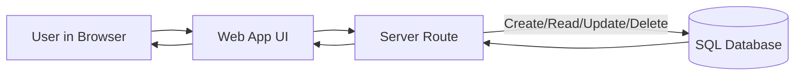

# SQL Basics and CRUD – Topic Course Notes

**Course:** 12DGT  
**Year Level:** Year 12 (Level 7 - NCEA Level 2)  
**Unit / Module:** 03_Full_Stack_Website_Project  
**Aligned Standard(s):** AS91893 – Full-Stack Website Project  
**Lesson Context:** Introduction to databases for full-stack projects  
**Estimated Time:** 1-2 lessons

---

## 1. Purpose of These Notes


These notes exist to:
- introduce what SQL is and why full-stack projects use databases
- explain the difference between data in memory and data stored long-term
- show practical CRUD operations students will use in web apps
- reinforce safe habits like filtering data and avoiding accidental mass updates

These notes are **not** a substitute for building and testing SQL queries in class.

---

## 2. Key Concepts (Overview)


This section lists the **non-negotiable ideas** students must understand by the end of this topic:

- A **database** stores data persistently so it is still there after the app closes.
- **SQL** (Structured Query Language) is the language used to ask the database for data or change data.
- Data is organized into **tables** (like spreadsheets), made of rows and columns.
- **CRUD** stands for Create, Read, Update, Delete; these are the four core database actions.
- Queries without conditions can change or delete far more data than intended.
- Good database design uses clear table names, clear column names, and meaningful IDs.

> If students cannot explain when to use each CRUD action, they have not mastered this topic.

---

## 3. Core Explanation


### Why SQL Matters in Full-Stack Development

Front-end code (HTML/CSS/JavaScript) controls what users see and do. A database controls what information is remembered over time.

Example: In a task planner app, users expect their tasks to still exist tomorrow. That only works if tasks are stored in a database.

SQL is the language your server uses to interact with that database.

---

### Tables, Rows, and Columns

A table stores one type of thing. For example, a `tasks` table might have:

| column | meaning | example |
|---|---|---|
| `id` | unique identifier | `1` |
| `title` | task name | `Finish wireframe` |
| `status` | current state | `in_progress` |
| `due_date` | when it is due | `2026-03-30` |

Each row is one task. Each column is one property of that task.

---

### CRUD Overview

| CRUD action | SQL command | what it does |
|---|---|---|
| Create | `INSERT` | adds a new row |
| Read | `SELECT` | gets data from a table |
| Update | `UPDATE` | changes existing rows |
| Delete | `DELETE` | removes rows |

The rest of this note introduces each one with a simple example.

---

## 4. Diagrams and Visual Models


### CRUD in a Full-Stack Flow



This flow shows that SQL usually runs on the server side, not directly in front-end code.

---

## 5. Worked Examples (Conceptual, Not Procedural)


Assume this table already exists:

```sql
CREATE TABLE tasks (
    id INTEGER PRIMARY KEY,
    title TEXT NOT NULL,
    status TEXT NOT NULL,
    due_date DATE
);
```

### Create (INSERT)

Add a new task:

```sql
INSERT INTO tasks (title, status, due_date)
VALUES ('Finish wireframe', 'todo', '2026-03-30');
```

Why this works: You name the table, choose the columns, then provide values in the same order.

### Read (SELECT)

Get all tasks that are not finished:

```sql
SELECT id, title, due_date
FROM tasks
WHERE status != 'done';
```

Why this works: `SELECT` chooses columns, `FROM` chooses table, and `WHERE` filters rows.

### Update (UPDATE)

Mark one specific task as done:

```sql
UPDATE tasks
SET status = 'done'
WHERE id = 1;
```

Why this works: `SET` defines the change, and `WHERE id = 1` targets one row.

### Delete (DELETE)

Remove one specific task:

```sql
DELETE FROM tasks
WHERE id = 1;
```

Why this works: The `WHERE` condition prevents deleting every row.

---

## 6. Common Misconceptions and Pitfalls


### Misconception 1: "SELECT returns data in a fixed order by default"

Incorrect thinking: "Rows will always come back in the same order."

Why this is wrong: Databases can return rows in any order unless you specify one.

Correct understanding: Use `ORDER BY` when order matters.

### Misconception 2: "UPDATE is safe even without WHERE"

Incorrect thinking: "If I forget `WHERE`, it will probably update one row."

Why this is wrong: Without `WHERE`, every row in the table is updated.

Correct understanding: Write the `WHERE` condition first, then write `SET`.

### Misconception 3: "DELETE only deletes one row"

Incorrect thinking: "DELETE is like removing one selected item in a UI."

Why this is wrong: SQL follows your query exactly. No `WHERE` means delete all rows.

Correct understanding: Always check your filter before running `DELETE`.

---

## 7. Assessment Relevance


This topic supports your full-stack assessment by helping you:
- explain how your app stores and retrieves persistent data
- justify your database operations in plain language
- avoid high-impact data errors during development (especially unsafe updates/deletes)

In assessment conversations, you may be asked to explain:
- why a particular query uses `WHERE`
- how your app performs each CRUD operation
- what data is stored in each table and why

---

## 8. External Resources (Optional but Recommended)


### Video Resources
- **SQL in 100 Seconds** - Fireship - https://www.youtube.com/watch?v=zsjvFFKOm3c

### Additional Reading / Tools
- **SQLBolt (interactive SQL practice)** - https://sqlbolt.com/
- **W3Schools SQL Tutorial** - https://www.w3schools.com/sql/

Only use external examples as learning supports. Your assessment explanations must still be your own understanding.

---

## 9. Key Vocabulary


- **Database:** An organized system for storing data so it can be saved and retrieved later.
- **Table:** A structured collection of related data, arranged in rows and columns.
- **Row (record):** One complete item in a table.
- **Column (field):** One property of each row.
- **Primary key:** A unique identifier for each row (often an `id`).
- **SQL:** Structured Query Language, used to query and modify relational databases.
- **CRUD:** The four core data operations: Create, Read, Update, Delete.
- **Query:** A SQL instruction sent to the database.
- **WHERE clause:** A condition used to limit which rows are read or changed.
- **Persistent data:** Data that remains saved after the app closes.

Students are expected to use this vocabulary accurately when explaining database decisions.