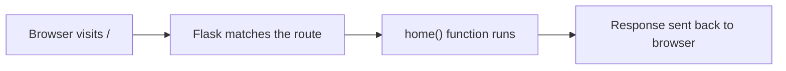

# Flask Made Easy – Part 1: Setup

**Course:** 12DGT  
**Year Level:** Year 12 (Level 7 – NCEA Level 2)  
**Unit / Module:** 03_Full_Stack_Website_Project  
**Aligned Standard(s):** AS91893 – Full-Stack Website Project  
**Series:** Flask Made Easy (4 parts) — Part 1 of 4  
**Estimated Time:** 1 lesson (~60 min)  
**Video:** [Flask Made Easy Part 1: Set up](https://www.youtube.com/watch?v=_Ci9sOih_20)

---

## 1. Purpose of This Tutorial

By the end of this tutorial you will have:

- a working Flask "Hello World" application running locally
- your project pushed to a GitHub repository
- confirmed that version control (committing and syncing) works correctly

This tutorial is the foundation for everything that follows. If your Flask app does not run and your GitHub repo does not exist by the end of this lesson, you cannot progress.

> **Note:** These notes accompany the video tutorial. Watch the video, then use these notes as a step-by-step reference while you work.

---

## 2. What You Need Before You Start

- **Visual Studio Code** installed
- **Python 3** installed (check the version shown in the VS Code status bar at the bottom right)
- **A GitHub account** — your code will be stored here throughout the project
- **Internet access**

If Python is not working, raise your hand before continuing.

---

## 3. Step-by-Step: Setting Up Flask

### Step 1 — Create Your Project Folder

Create a new, **empty folder** on your computer for this project. Give it a sensible name (e.g. `flask-project` or a name related to your topic).

Open that folder in VS Code: **File → Open Folder**.

### Step 2 — Check Python is Working

Create a file called `test.py` and add:

```python
print("Hello, World!")
```

Run it using the Run button (▶) or the terminal. You should see `Hello, World!` in the terminal output. Check the Python version in the bottom-right corner of VS Code — make sure it is **Python 3.10 or newer**.

Once confirmed, **delete** `test.py`. It was just a sanity check.

### Step 3 — Install Flask

Open the VS Code terminal (**Terminal → New Terminal**) and run:

```bash
pip install flask
```

If Flask is already installed, pip will tell you. Either way, you are ready to continue.

> **Why Flask?** Flask is a lightweight Python framework that handles routing, requests, and responses for a web server. Without it, you would have to write all of that yourself.


### Step 4 — Create `app.py`

Create a new file called `app.py`. This is your main application file. Type the following carefully:

```python
from flask import Flask

app = Flask(__name__)

# Home route
@app.route('/')
def home():
    return 'Hello, World!'

if __name__ == '__main__':
    app.run(debug=True)
```

**What each line does:**

| Line | Meaning |
|------|---------|
| `from flask import Flask` | Import the Flask class from the flask library |
| `app = Flask(__name__)` | Create the Flask application instance |
| `@app.route('/')` | A **decorator** that maps the URL `/` to the function below it |
| `def home():` | The function that runs when someone visits that URL |
| `return 'Hello, World!'` | The text sent back to the browser |
| `app.run(debug=True)` | Start the server; `debug=True` means changes reload automatically |

### Step 5 — Run the App


Run `app.py` using the Run button or terminal. You will see output like this in the terminal:

```
 * Running on http://127.0.0.1:5000
```

Hold **Ctrl** and click that link. Your browser should open and display `Hello, World!`.


**You now have a running Flask web server.**

---

## 4. Understanding Routes

A **route** maps a URL to a Python function. Every page in your web application will be its own route.



Right now you only have one route — the home page (`/`). You will add more routes in later tutorials.

---

## 5. Step-by-Step: Setting Up GitHub

Version control is **not optional** on this project. Every change you make must be committed to GitHub. This protects your work and creates a record of your progress.

### Step 1 — Sign In to GitHub in VS Code

Check the bottom-left corner of VS Code for your GitHub account. If you are not signed in, click there and follow the prompts to sign in.

### Step 2 — Publish to GitHub

Click the **Source Control** tab on the left sidebar (the branching icon). Click **Publish to GitHub**.

- Follow any authorisation prompts
- Choose **Public repository**
- Change the repository name if you want
- Click **OK** to publish

### Step 3 — Verify on GitHub

Open your browser and navigate to your GitHub account. You should see your new repository with `app.py` inside it. If you can see the file and the code matches what is on your computer, everything is working.


### Step 4 — Practice Committing

Make a small change to `app.py` — for example, change the return text to something different.

Then in the Source Control tab:

1. Click the **refresh** icon if your changes do not appear
2. Click **Stage All Changes** (the + icon next to "Changes")
3. Type a short, descriptive **commit message** (e.g. `update home route message`)
4. Click **Commit**
5. Click **Sync Changes** to push to GitHub

Refresh your GitHub repo in the browser — your change should be visible.

> **Commit messages matter.** A vague message like "stuff" is useless. Write something that tells you (and anyone reading) what actually changed. You will thank yourself later.

---

## 6. The Commit Habit

Every time you finish a meaningful piece of work in this project, you **commit and sync**. Think of it like saving your game at a checkpoint.

A good commit message is:
- short (under 72 characters)
- in the present tense: `add home route`, not `added home route`
- specific: `add database connection helper` not `update code`

---

## 7. Common Issues

| Problem | Likely cause | Fix |
|---------|-------------|-----|
| `ModuleNotFoundError: No module named 'flask'` | Flask not installed | Run `pip install flask` in the terminal |
| `Address already in use` | Another Flask instance is running | Close other terminals or restart VS Code |
| Browser shows "This site can't be reached" | Server is not running | Run `app.py` first |
| Changes on GitHub do not appear | Forgot to sync | Click **Sync Changes** in Source Control |

---

## 8. Checkpoint

Before moving to Part 2, confirm all of the following:

- [ ] `app.py` exists in your project folder
- [ ] Running `app.py` starts a server and `Hello, World!` appears in the browser
- [ ] Your project is published to a public GitHub repository
- [ ] You have made at least one commit and synced it to GitHub
- [ ] You can see your commit history in GitHub

If any of these are not done, fix them now. Part 2 builds directly on this.

---

## 9. Key Vocabulary

- **Flask:** A lightweight Python web framework for building web applications.
- **Route:** A mapping between a URL and a Python function.
- **Decorator:** A Python syntax (`@app.route(...)`) that wraps a function with additional behaviour.
- **Debug mode:** Running Flask with `debug=True` so the server restarts automatically when you save changes.
- **Repository (repo):** A folder tracked by Git; stores your code and its full change history.
- **Commit:** A saved snapshot of your code at a point in time.
- **Sync / Push:** Uploading your local commits to GitHub so they are stored remotely.
- **localhost:** Your own computer acting as a web server; accessed via `http://127.0.0.1:5000`.

---

*End of Flask Made Easy — Part 1: Setup*
