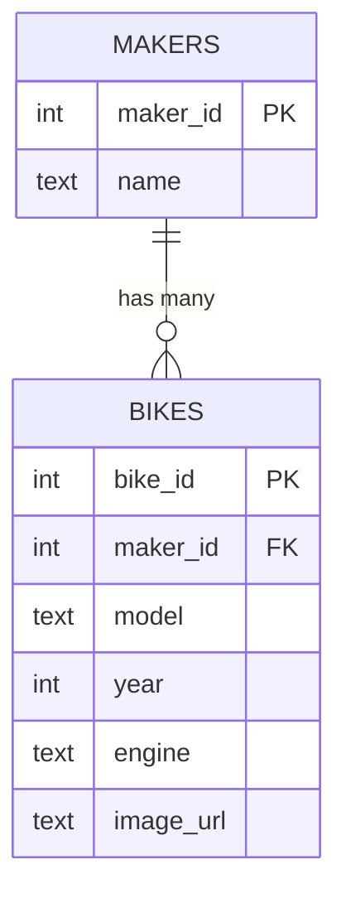

# Flask Made Easy – Part 2: Design and Build the Database

**Course:** 12DGT  
**Year Level:** Year 12 (Level 7 – NCEA Level 2)  
**Unit / Module:** 03_Full_Stack_Website_Project  
**Aligned Standard(s):** AS91893 – Full-Stack Website Project  
**Series:** Flask Made Easy (4 parts) — Part 2 of 4  
**Estimated Time:** 1–2 lessons (~60–90 min)  
**Video:** [Flask Made Easy Part 2: Design and Build the Database](https://www.youtube.com/watch?v=MZmgbDzT_ZQ)

---

## 1. Purpose of This Tutorial

By the end of this tutorial you will have:

- an Entity Relationship Diagram (ERD) designed for your database
- a working SQLite database file inside your project
- tables created with correct data types, primary keys, and a foreign key
- sample data inserted and verified with SQL queries
- a saved queries file committed to GitHub

> **Prerequisite:** Part 1 must be complete. Your Flask project must exist and be connected to GitHub.

---

## 2. Step 1 — Design Your Database (ERD)

Before writing a single line of code, design your data structure. This saves time and prevents mistakes.

Use **LucidChart** (lucidchart.com) to draw an ERD:

1. Create a new blank document
2. Search for "ERD" in the template search
3. Choose the **Crow's Foot ERD** template
4. Delete the placeholder tables and design your own

### What to include in your ERD

Use the three-field table style: **Key | Field Name | Data Type**

Your database must have **at least two tables** connected by a **one-to-many relationship**.

**Example — Motorbike database:**

```
MAKERS
+----+----------+------+
| PK | maker_id | INT  |
|    | name     | TEXT |
+----+----------+------+

BIKES
+----+----------+------+
| PK | bike_id  | INT  |
| FK | maker_id | INT  |  → references MAKERS.maker_id
|    | model    | TEXT |
|    | year     | INT  |
|    | engine   | TEXT |
|    | image_url| TEXT |
+----+----------+------+
```


> **Choose your own topic.** It does not have to be motorbikes. Pick something you are interested in — films, games, sports teams, recipes — as long as it has a natural one-to-many relationship.

### What makes a good one-to-many relationship?

One **maker** can have many **bikes** — but each bike belongs to exactly one maker. This is a one-to-many relationship and it is the most common pattern in databases.



**Keep it simple.** Real databases are complex. Yours only needs a few fields per table. You can always add more later.

---

## 3. Step 2 — Install the SQLite 3 Editor Extension

You will manage your database directly inside VS Code using the **SQLite 3 Editor** extension.

1. Open the **Extensions** tab in VS Code (Ctrl+Shift+X)
2. Search for `SQLite3 Editor`
3. Install the one by **YY0931** (look for the spinning feather icon)

This extension lets you create tables, insert data, and run queries without leaving VS Code. It is a simpler alternative to SQLite Studio.

---

## 4. Step 3 — Create the Database File

In your project folder, create a new file called `database.db`.

Because you have the SQLite 3 Editor extension installed, VS Code will offer you a visual editor when you open this file.

> **Naming matters.** Call it `database.db` now. You will reference this exact filename in your Python code later.

---

## 5. Step 4 — Create Your Tables

### Creating the first table (e.g. `makers`)

In the SQLite 3 Editor, click **Create Table**. Add your columns one by one.

**For the primary key column (`maker_id`):**
- Type: `INTEGER`
- Check: **Primary Key**, **Auto Increment**, **Unique**, **Not Null**

All four settings are required for the primary key to work correctly. If you miss one, the table will not behave as expected.

**For the name column:**
- Type: `TEXT`
- No other settings needed

Click **Commit** when done. The table disappears from view — this is normal. It is saved.


### Creating the second table (e.g. `bikes`)

In the SQLite 3 Editor panel (usually at the bottom), find the **Tables** section and drag it up to make it visible. Click the option to create a new table.

**For `bike_id` (primary key):** Same settings as above — INTEGER, Primary Key, Auto Increment, Unique, Not Null.

**For `maker_id` (foreign key):** This is slightly different:
- Type: `INTEGER`
- Set **References** to: `makers` → `maker_id`

This creates the link between the two tables.

Add the rest of your columns with appropriate data types.

Click **Commit** when done.

### SQLite data types

| Data Type | Use for |
|-----------|---------|
| `INTEGER` | Whole numbers (IDs, years, counts) |
| `TEXT` | Strings, names, URLs, descriptions |
| `REAL` | Decimal numbers (prices, ratings) |
| `BLOB` | Binary data (images stored as files) |

---

## 6. Step 5 — Insert Sample Data

You need actual data in your database so you can test queries and eventually display it on your website.

### Insert via the editor

Click on the `makers` table in the editor. You can click cells to add values directly. Add 3–4 rows (e.g. Yamaha, Suzuki, Kawasaki, Honda). Click **Commit** after each row.

### Verify the foreign key works

Open your `bikes` table in the editor. Click on the `maker_id` column for a new row. If your tables are linked correctly, you will see a **dropdown** showing the existing makers. This confirms the relationship is working.

### Use SQL INSERT statements for the main table

Rather than clicking each cell individually, use the **Query Editor** (look for the query editor tab in the SQLite 3 Editor). This is faster for inserting multiple rows.

Write an `INSERT` statement:

```sql
INSERT INTO bikes (maker_id, model, year, engine, image_url)
VALUES (1, 'MT-03', 2023, '321cc parallel twin', '');
```

Run it, then check the table to confirm the row was added.


> **Tip:** Use an AI tool (ChatGPT, Gemini) to generate a batch of INSERT statements for your data. Give it your table schema and ask for 8–10 rows. Paste the result into the query editor and run them one at a time.

After inserting rows, check the `maker_id` values are correct. If they are missing or wrong, you can update them manually in the editor and commit.

---

## 7. Step 6 — Write and Save Test Queries

Before moving on, write SQL queries to verify your data is correct. Save these queries — you will reuse them later when connecting Flask to the database.

Create a new file in your project called `queries.sql`. Write and test each of the following types of queries:

```sql
-- Get all records from your main table
SELECT * FROM bikes;

-- Get records with a JOIN (combining data from both tables)
SELECT bikes.bike_id, makers.name, bikes.model, bikes.year
FROM bikes
JOIN makers ON bikes.maker_id = makers.maker_id;

-- Get a single record by ID
SELECT * FROM bikes WHERE bike_id = 1;

-- Get all records for a specific maker
SELECT * FROM bikes WHERE maker_id = 2;
```


Run each query in the Query Editor and check the results are what you expect. If results look wrong, fix your data now — it is much easier to do before Flask is involved.

> **Reference:** Use [W3Schools SQL](https://www.w3schools.com/sql/) if you need to revise SQL syntax. SQL knowledge from earlier in the course applies directly here.

When VS Code asks if you want to save `queries.sql`, save it in your project folder.

---

## 8. Checking Data Integrity

Before committing, run these checks:

- [ ] Every row in `bikes` has a valid `maker_id` that exists in `makers`
- [ ] No required fields (model, year, etc.) are empty
- [ ] Your JOIN query returns the expected combined data
- [ ] You have at least 6–8 rows in your main table

**What goes wrong:** Students insert data with missing foreign keys, then wonder why their JOIN queries return nothing. Check your data now.

---

## 9. Step 7 — Commit to GitHub

You have done significant work. Commit it now.

In the Source Control tab:

1. Stage all changes
2. Write a meaningful commit message: `add database with makers and bikes tables`
3. Commit and Sync

Your `database.db` and `queries.sql` files should now appear in your GitHub repository.

---

## 10. Common Issues

| Problem | Likely cause | Fix |
|---------|-------------|-----|
| Table seems to disappear after creating | Normal — click Commit, then look in Tables panel | Drag up the Tables panel to see your tables |
| Dropdown does not appear for foreign key field | Tables not linked correctly | Check the References setting on the FK column |
| Query editor loses connection | Extension timeout | Click reconnect at the top of the query editor |
| JOIN returns no results | maker_id values are wrong or missing | Update the FK values in the editor and commit |
| INSERT fails | Wrong column names or data types | Compare your SQL to your table schema |

---

## 11. Checkpoint

Before moving to Part 3, confirm all of the following:

- [ ] You have an ERD showing at least two tables with a one-to-many relationship
- [ ] `database.db` exists in your project folder with both tables created
- [ ] You have at least 6–8 rows of sample data in your main table
- [ ] The foreign key relationship is working (dropdown appears in editor)
- [ ] `queries.sql` contains tested SELECT and JOIN queries
- [ ] Everything is committed and synced to GitHub

---

## 12. Key Vocabulary

- **ERD (Entity Relationship Diagram):** A diagram showing database tables, their fields, and how they are related.
- **Entity:** A table in the database — represents a category of data (e.g. Bikes, Makers).
- **Primary Key (PK):** A unique identifier for each row in a table. Usually an auto-incrementing integer.
- **Foreign Key (FK):** A column in one table that references the primary key of another table. Creates the relationship.
- **One-to-Many:** A relationship where one record in table A can relate to many records in table B (e.g. one maker has many bikes).
- **Auto Increment:** SQLite automatically assigns the next available integer when a new row is inserted.
- **Data Type:** The kind of data a column holds — INTEGER, TEXT, REAL, etc.
- **SQLite:** A lightweight, file-based SQL database. No separate server needed — the entire database is a single `.db` file.
- **Query:** A SQL statement that retrieves, inserts, updates, or deletes data.
- **JOIN:** A SQL clause that combines rows from two tables based on a related column.
- **Data Integrity:** Ensuring the data in the database is accurate, complete, and consistent.

---

*End of Flask Made Easy — Part 2: Design and Build the Database*
