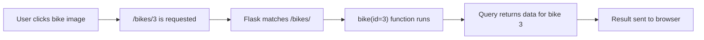

# Flask Made Easy – Part 3: Connect and Query

**Course:** 12DGT  
**Year Level:** Year 12 (Level 7 – NCEA Level 2)  
**Unit / Module:** 03_Full_Stack_Website_Project  
**Aligned Standard(s):** AS91893 – Full-Stack Website Project  
**Series:** Flask Made Easy (4 parts) — Part 3 of 4  
**Estimated Time:** 1–2 lessons (~60–90 min)  
**Video:** [Flask Made Easy Part 3: Connect and Query](https://www.youtube.com/watch?v=u1hAoc8swzc)

---

## 1. Purpose of This Tutorial

By the end of this tutorial you will have:

- Flask connected to your SQLite database
- a reusable `query_db()` helper function that simplifies all database queries
- a home route that retrieves and displays data from the database
- a dynamic route that shows a single record based on a URL parameter
- all changes committed to GitHub

> **Prerequisite:** Parts 1 and 2 must be complete. Your `database.db` must contain tables with data, and `queries.sql` must have tested queries.

---

## 2. How Flask Connects to SQLite

Flask does not come with a built-in database layer — you connect to SQLite using Python's built-in `sqlite3` module. The [Flask QuickStart documentation](https://flask.palletsprojects.com/en/latest/quickstart/) covers this pattern in the "Using SQLite 3 with Flask" section.


The approach used in this tutorial:

1. Define a constant for the database file path
2. Write a `get_db()` function that opens the connection (or reuses one that is already open)
3. Write a `query_db()` helper function that runs any SQL query and returns results
4. Use Flask's teardown mechanism to close the connection automatically when the app stops

This pattern avoids opening and closing the database connection for every single query, which would be slow and error-prone.

---

## 3. Step 1 — Update Your Imports

At the top of `app.py`, update the import line to include `g` and `sqlite3`:

```python
import sqlite3
from flask import Flask, g
```

`g` is a Flask object that stores data **for the duration of a single request**. It is used here to hold the database connection so it can be reused within the same request without opening a new one each time.

---

## 4. Step 2 — Add the Database Path Constant

Below your imports, and before `app = Flask(__name__)`, add:

```python
DATABASE = 'database.db'
```

This is a **relative path** — it points to `database.db` in the same folder as `app.py`. Make sure both files are in the same project folder.

> **Common mistake:** Students put the full absolute path (e.g. `C:/Users/...`) here. If you move the project or run it on another computer, it breaks. Use the relative path.

---

## 5. Step 3 — Add the Database Helper Functions

After you create `app`, add these two functions. You do not need to write them from scratch — they come from the Flask documentation. Copy them carefully:

```python
def get_db():
    db = getattr(g, '_database', None)
    if db is None:
        db = g._database = sqlite3.connect(DATABASE)
    return db

@app.teardown_appcontext
def close_connection(exception):
    db = getattr(g, '_database', None)
    if db is not None:
        db.close()
```

**What these do:**

| Function | Purpose |
|----------|---------|
| `get_db()` | Returns the database connection. Creates one if it does not exist yet for this request. |
| `close_connection()` | Automatically closes the database when the request ends (or the app shuts down). |

The `@app.teardown_appcontext` decorator tells Flask to run `close_connection()` automatically. You never have to call it yourself.


---

## 6. Step 4 — Add the `query_db()` Helper

Below the two functions above, add:

```python
def query_db(query, args=(), one=False):
    cur = get_db().execute(query, args)
    rv = cur.fetchall()
    cur.close()
    return (rv[0] if rv else None) if one else rv
```

This single function handles all your database queries. You call it like this:

```python
# Get ALL rows
results = query_db('SELECT * FROM bikes')

# Get ONE row (returns a tuple, not a list)
result = query_db('SELECT * FROM bikes WHERE bike_id = ?', (1,), one=True)

# Get rows matching a parameter (passed in from a route)
result = query_db('SELECT * FROM bikes WHERE bike_id = ?', (bike_id,), one=True)
```

**Parameters explained:**

| Parameter | Default | Meaning |
|-----------|---------|---------|
| `query` | (required) | The SQL statement to run |
| `args` | `()` | A tuple of values to safely insert into `?` placeholders |
| `one` | `False` | If `True`, return a single row instead of a list |

> **Why use `?` placeholders?** Never put variables directly into SQL strings using f-strings or concatenation. That creates a **SQL injection vulnerability**. The `?` placeholder approach is safe — SQLite handles the escaping for you.

---

## 7. Step 5 — Test the Connection

Before building proper routes, test that the connection works. Temporarily update your home route:

```python
@app.route('/')
def home():
    results = query_db('SELECT * FROM bikes')
    return str(results)
```

Run `app.py` and open the browser. You should see a list of tuples — one tuple per row in your database. It will look something like:

```
[(1, 1, 'MT-03', 2023, '321cc parallel twin', ''), (2, 1, 'R1', ...)]
```


If you see data, the connection is working. If you see an empty list `[]`, your table has no data — go back to Part 2.

---

## 8. Step 6 — Refine the Home Route Query

The home page should not return every column from every table. You only need the data required to display each item in a grid — for example, the ID, maker name, model, and image URL.

First, go to your `queries.sql` file and write and test the exact query you need:

```sql
SELECT bikes.bike_id, makers.name, bikes.model, bikes.image_url
FROM bikes
JOIN makers ON bikes.maker_id = makers.maker_id;
```

Run it in the query editor and confirm you get the right columns back. **Only once you are happy with the query** should you paste it into `app.py`.

Update your home route:

```python
@app.route('/')
def home():
    sql = """
        SELECT bikes.bike_id, makers.name, bikes.model, bikes.image_url
        FROM bikes
        JOIN makers ON bikes.maker_id = makers.maker_id
    """
    results = query_db(sql)
    return str(results)
```

> **Use triple quotes** (`"""`) for multi-line SQL strings. This keeps your query readable and allows you to format it across multiple lines.

Refresh the browser and confirm you are getting back only the columns you need.

---

## 9. Step 7 — Create a Dynamic Route

A **dynamic route** is a URL that contains a variable — for example, `/bikes/3` shows the bike with ID 3, and `/bikes/7` shows the bike with ID 7.

This is what makes a web application different from a static website.



Add this new route to `app.py`:

```python
@app.route('/bikes/<int:id>')
def bike(id):
    sql = """
        SELECT bikes.bike_id, makers.name, bikes.model,
               bikes.year, bikes.engine, bikes.image_url
        FROM bikes
        JOIN makers ON bikes.maker_id = makers.maker_id
        WHERE bikes.bike_id = ?
    """
    result = query_db(sql, (id,), one=True)
    return str(result)
```

**Key points:**

- `<int:id>` in the route URL tells Flask to capture whatever integer appears there and pass it to the function as `id`
- `(id,)` is a tuple containing that ID — the trailing comma is essential; without it, Python does not treat it as a tuple
- `one=True` means `query_db()` returns a single tuple (one row) rather than a list


### Test the dynamic route

Run the app. In the browser, navigate to `http://127.0.0.1:5000/bikes/1`, then try `/bikes/2`, `/bikes/3`. Each should return different data from your database.

> **If the query editor loses connection** while you are testing queries in `queries.sql`, click the reconnect button at the top of the editor.

---

## 10. Your `app.py` So Far

At this point, your full `app.py` should look like this:

```python
import sqlite3
from flask import Flask, g

DATABASE = 'database.db'

app = Flask(__name__)

def get_db():
    db = getattr(g, '_database', None)
    if db is None:
        db = g._database = sqlite3.connect(DATABASE)
    return db

@app.teardown_appcontext
def close_connection(exception):
    db = getattr(g, '_database', None)
    if db is not None:
        db.close()

def query_db(query, args=(), one=False):
    cur = get_db().execute(query, args)
    rv = cur.fetchall()
    cur.close()
    return (rv[0] if rv else None) if one else rv

@app.route('/')
def home():
    sql = """
        SELECT bikes.bike_id, makers.name, bikes.model, bikes.image_url
        FROM bikes
        JOIN makers ON bikes.maker_id = makers.maker_id
    """
    results = query_db(sql)
    return str(results)

@app.route('/bikes/<int:id>')
def bike(id):
    sql = """
        SELECT bikes.bike_id, makers.name, bikes.model,
               bikes.year, bikes.engine, bikes.image_url
        FROM bikes
        JOIN makers ON bikes.maker_id = makers.maker_id
        WHERE bikes.bike_id = ?
    """
    result = query_db(sql, (id,), one=True)
    return str(result)

if __name__ == '__main__':
    app.run(debug=True)
```

Adapt the SQL queries to match your own table and column names.

---

## 11. Common Issues

| Problem | Likely cause | Fix |
|---------|-------------|-----|
| `sqlite3.OperationalError: no such table` | Wrong table name or database not found | Check `DATABASE` path and that `database.db` is in the same folder |
| Empty list `[]` returned | No data in the table | Go back to Part 2 and add data |
| `None` returned from `query_db()` | `one=True` but no row matched | Check your ID value and that the row exists |
| `OperationalError: no such column` | Typo in column name | Compare your SQL to your table schema |
| Dynamic route returns the same data every time | Not passing `id` correctly | Check `(id,)` includes the trailing comma |

---

## 12. Step 8 — Commit to GitHub

Stage and commit all changes:

- Message: `connect flask to sqlite and add dynamic bike route`

Both `app.py` and `queries.sql` should show as changed. Commit and sync.

---

## 13. Checkpoint

Before moving to Part 4, confirm all of the following:

- [ ] `app.py` imports `sqlite3` and `g`
- [ ] `DATABASE`, `get_db()`, `close_connection()`, and `query_db()` are all present
- [ ] The home route (`/`) returns a list of rows from the database
- [ ] The dynamic route (`/bikes/<int:id>`) returns a single row matching the URL parameter
- [ ] Testing different IDs in the URL returns different data
- [ ] All changes committed and synced to GitHub

---

## 14. Key Vocabulary

- **`sqlite3`:** Python's built-in library for working with SQLite databases.
- **`g`:** A Flask object for storing data per request. Used here to hold the database connection.
- **Connection:** An open link between your Python code and the database file.
- **`get_db()`:** A helper function that returns the current database connection (creating one if needed).
- **Teardown:** Flask runs teardown functions automatically after each request — used here to close the database connection.
- **`query_db()`:** A reusable helper function that runs a SQL query and returns results.
- **Placeholder (`?`):** A safe way to pass variables into SQL queries without risk of SQL injection.
- **SQL Injection:** A security vulnerability where malicious SQL is inserted through user input. Using `?` placeholders prevents this.
- **Dynamic Route:** A Flask route that captures a variable from the URL (e.g. `/bikes/<int:id>`).
- **Route Parameter:** The variable captured from the URL and passed into the route function (e.g. `id`).
- **`one=True`:** An argument to `query_db()` that returns a single tuple instead of a list of tuples.
- **Tuple:** An immutable ordered sequence in Python. SQLite returns each row as a tuple.

---

*End of Flask Made Easy — Part 3: Connect and Query*
