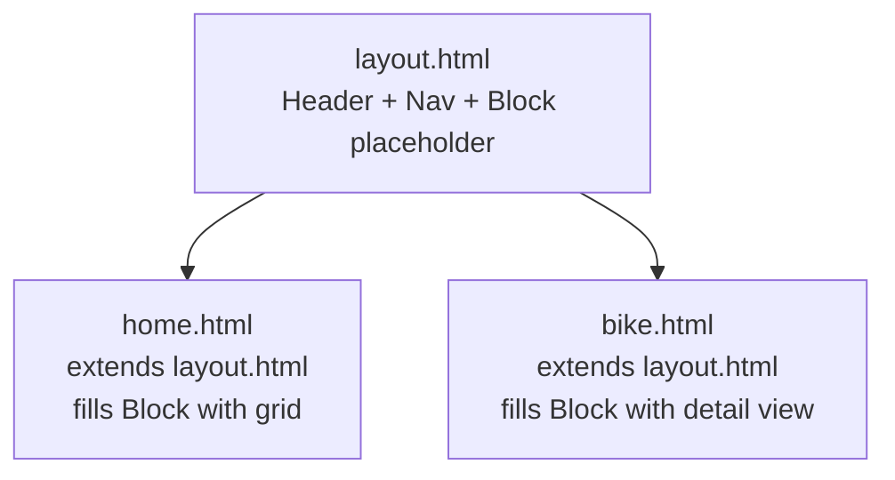

# Flask Made Easy – Part 4: Front End

**Course:** 12DGT  
**Year Level:** Year 12 (Level 7 – NCEA Level 2)  
**Unit / Module:** 03_Full_Stack_Website_Project  
**Aligned Standard(s):** AS91893 – Full-Stack Website Project  
**Series:** Flask Made Easy (4 parts) — Part 4 of 4  
**Estimated Time:** 2 lessons (~90–120 min)  
**Video:** [Flask Made Easy Part 4: Front End](https://www.youtube.com/watch?v=Tb3ucK_OKso)

---

## 1. Purpose of This Tutorial

By the end of this tutorial you will have:

- a wireframe design for both pages of your application
- image URLs added to your database records
- a shared `layout.html` base template with a header and navigation bar
- a home page (`home.html`) displaying all records in a responsive grid
- a detail page (`bike.html`) showing a single record with image and information
- CSS styling using W3.CSS and a custom Google Font
- a complete, working Flask web application committed to GitHub

> **Prerequisite:** Parts 1–3 must be complete. Your Flask app must be returning database data through both routes.

---

## 2. Step 1 — Design Before You Code

Before writing any HTML, sketch a rough wireframe for your two pages. It does not have to be detailed — a pencil sketch or a quick diagram is enough. What matters is that you have thought about:

- What the header and navigation will look like (shared across pages)
- How the home page will display multiple items (e.g. a grid)
- What the detail page will show for a single item (e.g. image + info)

**Example wireframe concept:**

```
┌────────────────────────────────────────────────┐
│  HEADER: Site Title                            │  ← shared
│  NAV: Home                                     │  ← shared
├────────────────────────────────────────────────┤
│  HOME PAGE                                     │
│  ┌──────┐  ┌──────┐  ┌──────┐                 │
│  │ img  │  │ img  │  │ img  │                 │  ← 3-column grid
│  │ name │  │ name │  │ name │                 │
│  └──────┘  └──────┘  └──────┘                 │
└────────────────────────────────────────────────┘

┌────────────────────────────────────────────────┐
│  HEADER: Site Title                            │
│  NAV: Home                                     │
├──────────────────┬─────────────────────────────┤
│  Image           │  Name, Year, Engine...      │  ← 2-column layout
│                  │                             │
└──────────────────┴─────────────────────────────┘
```

Also decide on:
- **Colour scheme** — try [coolors.co](https://coolors.co) to generate a palette
- **Font** — browse [Google Fonts](https://fonts.google.com) and pick one you like


> **Keeping design simple is a skill.** A clean black-and-white layout with one accent colour and one good font looks more professional than something over-complicated. You can always refine later.

---

## 3. Step 2 — Add Image URLs to Your Database

Your records probably have an empty `image_url` column right now. You need to fill these in.

### Option A: Use image URLs from the web

1. Search for an image of your item
2. Right-click the image → **Copy image address**
3. Open your `database.db` in the SQLite 3 Editor
4. Find the row and paste the URL into the `image_url` column
5. Click **Commit**

Repeat for each record.

> **Copyright:** If you are using images from web searches for educational, non-commercial purposes, this is generally considered fair use. Use images from different sources rather than one site to reduce risk. Do not publish to a public-facing production site without checking image licences.


> **Consistency matters:** Try to find images that are approximately the same aspect ratio (e.g. all landscape, similar proportions). Mismatched image ratios will make your grid look messy.

### Option B: Store images locally

Create a folder called `static` inside your project folder, and inside that a folder called `images`. Save your image files there.

Reference them in your database like this:

```
/static/images/my-image.png
```

This approach gives you full control over the images, but requires you to download and crop them yourself.

---

## 4. Step 3 — Create the Flask Folder Structure

Flask expects templates and static files to be in specific folders.

Inside your project folder, create:

```
your-project/
├── app.py
├── database.db
├── queries.sql
├── templates/         ← HTML template files go here
│   └── layout.html
└── static/            ← CSS and images go here
    └── style.css
```

Create the `templates` and `static` folders now, along with empty `layout.html` and `style.css` files inside them.

---

## 5. Step 4 — Create `layout.html` (Base Template)

`layout.html` is the parent template. Every other page will **extend** from it. This means the header and navbar only need to be written once.

Open `templates/layout.html` and write:

```html
<!DOCTYPE html>
<html lang="en">
<head>
    <meta charset="UTF-8">
    <meta name="viewport" content="width=device-width, initial-scale=1.0">
    <title>My Flask App</title>

    <!-- Google Font (replace 'Righteous' with your chosen font) -->
    <link rel="preconnect" href="https://fonts.googleapis.com">
    <link href="https://fonts.googleapis.com/css2?family=Righteous&display=swap" rel="stylesheet">

    <!-- W3.CSS framework -->
    <link rel="stylesheet" href="https://www.w3schools.com/w3css/4/w3.css">

    <!-- Your custom CSS (must come after W3.CSS to override it) -->
    <link rel="stylesheet" href="{{ url_for('static', filename='style.css') }}">
</head>
<body class="w3-container">

    <!-- Shared header -->
    <div class="w3-container w3-padding">
        <h1>Cool Bikes</h1>
    </div>

    <!-- Shared navigation bar -->
    <div class="w3-bar w3-blue-grey">
        <a href="/" class="w3-bar-item w3-button">Home</a>
    </div>

    <!-- Page-specific content goes here -->
    
    

</body>
</html>
```

**Key points:**

| Part | Explanation |
|------|-------------|
| `url_for('static', filename='style.css')` | Flask's way of linking to files in the `static` folder. Do not use a plain relative path. |
| W3.CSS link | A lightweight CSS framework that provides ready-made classes for layout, cards, and nav bars |
| Google Fonts link | Loads your chosen font from Google's servers |
| `` | A Jinja2 placeholder. Child templates fill this block with their own content. |

> **Why `url_for`?** Flask generates the correct file path automatically, regardless of where your app is running. A plain relative path like `../static/style.css` can break depending on the route.

> **Order of stylesheets matters.** W3.CSS must come before your custom CSS. Your CSS overrides W3.CSS — if it loads first, W3.CSS will overwrite your changes.

---

## 6. Step 5 — Add Your Font to `style.css`

Open `static/style.css` and apply the font:

```css
body, h1, h2, h3, p {
    font-family: 'Righteous', sans-serif;
}

img {
    width: 100%;
}
```

Replace `'Righteous'` with your chosen font name (copy it exactly from Google Fonts). The `img` rule ensures images fill their container, which is important for the grid layout.

---

## 7. Step 6 — Test the Layout


Before building the home page, confirm that `layout.html` renders. Update your home route in `app.py` to render it:

```python
from flask import Flask, g, render_template
```

```python
@app.route('/')
def home():
    sql = """
        SELECT bikes.bike_id, makers.name, bikes.model, bikes.image_url
        FROM bikes
        JOIN makers ON bikes.maker_id = makers.maker_id
    """
    results = query_db(sql)
    return render_template('layout.html', results=results)
```

Run the app and check the browser. You should see your header and navbar. If the font does not appear, check the order of your stylesheet links.

---

## 8. Step 7 — Create `home.html`

Create `templates/home.html`:

```html




<div class="three-column">
    
    <a href="{{ url_for('bike', id=bike[0]) }}">
        <div class="w3-card-4">
            <h3>{{ bike[1] }} {{ bike[2] }}</h3>
            
        </div>
    </a>
    
</div>


```

**What each part does:**

| Part | Explanation |
|------|-------------|
| `` | Inherits the layout. Everything in `` replaces the block in the parent. |
| `` | Jinja2 for loop — runs once for each row returned by the query. |
| `bike[0]`, `bike[1]`, `bike[2]`, `bike[3]` | Index into the tuple. The order matches the columns in your SELECT statement. |
| `url_for('bike', id=bike[0])` | Generates the correct URL for the dynamic route (e.g. `/bikes/3`). |
| `w3-card-4` | A W3.CSS class that adds a card-style shadow and border. |

### Identify your column indices

Check your SELECT statement:

```sql
SELECT bikes.bike_id, makers.name, bikes.model, bikes.image_url
```

| Index | Value |
|-------|-------|
| `[0]` | `bike_id` |
| `[1]` | `makers.name` |
| `[2]` | `bikes.model` |
| `[3]` | `bikes.image_url` |

Adjust the indices to match your own query columns.

### Add the grid CSS

In `style.css`, add:

```css
.three-column {
    display: grid;
    grid-template-columns: 1fr 1fr 1fr;
    gap: 20px;
    padding: 20px;
}
```

### Update the home route to render `home.html`

```python
@app.route('/')
def home():
    sql = """
        SELECT bikes.bike_id, makers.name, bikes.model, bikes.image_url
        FROM bikes
        JOIN makers ON bikes.maker_id = makers.maker_id
    """
    results = query_db(sql)
    return render_template('home.html', results=results)
```

Refresh the browser. You should see all your records displayed as a grid of cards with images and names.


---

## 9. Step 8 — Create `bike.html`

Create `templates/bike.html`:

```html




<div class="two-column">
    <div>
        
    </div>
    <div class="info">
        <h2>{{ bike[1] }} {{ bike[2] }}</h2>
        <h3>Year: {{ bike[3] }}</h3>
        <h3>Engine: {{ bike[4] }}</h3>
    </div>
</div>


```

Add the grid CSS in `style.css`:

```css
.two-column {
    display: grid;
    grid-template-columns: 1fr 1fr;
    gap: 20px;
    padding: 20px;
}
```

### Update the bike route to render `bike.html`

```python
@app.route('/bikes/<int:id>')
def bike(id):
    sql = """
        SELECT bikes.bike_id, makers.name, bikes.model,
               bikes.year, bikes.engine, bikes.image_url
        FROM bikes
        JOIN makers ON bikes.maker_id = makers.maker_id
        WHERE bikes.bike_id = ?
    """
    result = query_db(sql, (id,), one=True)
    return render_template('bike.html', bike=result)
```

Note: the data is sent to the template as `bike=result` — inside the template, `bike` refers to the single row tuple.

Check your column indices match your query:

| Index | Value |
|-------|-------|
| `[0]` | `bike_id` |
| `[1]` | `makers.name` |
| `[2]` | `bikes.model` |
| `[3]` | `bikes.year` |
| `[4]` | `bikes.engine` |
| `[5]` | `bikes.image_url` |

---

## 10. Test the Complete Application

1. Reload the home page — all cards should appear with images
2. Click a card — you should go to the correct detail page for that item
3. Use the browser back button and click a different card — it should show different data
4. Try navigating directly to `/bikes/1`, `/bikes/2`, `/bikes/3` in the URL bar

If all of these work, your application is functionally complete.

---

## 11. How Template Inheritance Works



`layout.html` defines the shared structure. Child templates (`home.html`, `bike.html`) fill in the `` section with their own content. The header and nav are written once and shared across all pages automatically.

---

## 12. How Jinja2 Templating Works

Jinja2 is Flask's templating language. It lets you embed Python-like logic inside HTML files.

| Syntax | Purpose | Example |
|--------|---------|---------|
| `{{ value }}` | Output a value | `{{ bike[2] }}` → displays model name |
| `` | Loop | `` |
| `` | End a loop | Required after every `for` loop |
| `` | Inherit from a parent template | `` |
| `` | Define a replaceable section | `` |
| `` | End a block | Required after every block |
| `url_for('function', param=value)` | Generate a URL | `url_for('bike', id=bike[0])` |

---

## 13. Common Issues

| Problem | Likely cause | Fix |
|---------|-------------|-----|
| CSS not loading | Wrong path or stylesheet order | Use `url_for('static', ...)` and check link order |
| Font not appearing | Stylesheet order wrong | W3.CSS before Google Fonts before your CSS |
| Images not displaying | Wrong URL in database or broken link | Check image URLs in your database |
| All cards link to the same bike | `bike[0]` is wrong index | Check your SELECT column order |
| Grid is one column | CSS class name mismatch | Check class name in HTML matches `.three-column` in CSS |
| Detail page shows wrong data | Wrong column index in template | Count columns from your SELECT statement starting at 0 |
| `TemplateNotFound` error | Wrong filename or not in `templates/` folder | Check spelling and location of HTML files |

---

## 14. Step 9 — Commit Everything to GitHub

Stage and commit all your changes. You will have changes in:

- `app.py`
- `templates/layout.html`
- `templates/home.html`
- `templates/bike.html`
- `static/style.css`
- `database.db` (updated image URLs)

Commit message: `add templates and complete front end`

---

## 15. What Could Be Added Next

This is a working but minimal application. Possible improvements include:

- **Filter by category** — add a nav link for each maker that shows only their records
- **Search** — a form that filters records by a keyword
- **Better image handling** — download images and store in `static/images/` for consistent aspect ratios
- **More pages** — an About page, a contact form
- **Better styling** — a hero image on the home page, hover effects on cards, a consistent colour scheme applied throughout
- **Accessibility** — check colour contrast, add proper `alt` text to all images, test keyboard navigation

---

## 16. Checkpoint

Before considering this project complete:

- [ ] `templates/` folder contains `layout.html`, `home.html`, and `bike.html`
- [ ] `static/style.css` contains the grid styles and font
- [ ] Home page shows all records as a grid of clickable cards
- [ ] Clicking a card navigates to the correct detail page
- [ ] Detail page shows the image and key information for that record
- [ ] All database records have image URLs
- [ ] Everything committed and synced to GitHub

---

## 17. Key Vocabulary

- **Template:** An HTML file with Jinja2 placeholders that Flask fills with real data before sending to the browser.
- **`render_template()`:** A Flask function that loads a template, fills in the data, and returns the HTML response.
- **Template Inheritance:** A pattern where a parent template defines shared structure, and child templates fill in the content sections.
- **``:** Jinja2 syntax for inheriting from a parent template.
- **``:** A named section in a template that can be overridden by child templates.
- **Jinja2:** The templating language used by Flask. Allows loops, conditions, and variable output inside HTML.
- **`{{ }}`:** Jinja2 syntax for outputting a variable value into HTML.
- **``:** Jinja2 syntax for control structures (for loops, if statements, extends, blocks).
- **`url_for()`:** A Flask/Jinja2 function that generates URLs for routes or static files. Safer and more reliable than hardcoding paths.
- **W3.CSS:** A lightweight CSS framework from W3Schools that provides utility classes for layout, cards, and navigation.
- **CSS Grid:** A CSS layout system for creating two-dimensional grids. Used here for the 3-column card layout and 2-column detail layout.
- **`static/` folder:** Where Flask expects to find CSS, JavaScript, and image files.
- **`templates/` folder:** Where Flask looks for HTML template files.
- **Tuple indexing:** Accessing a specific value in a tuple using its position (`bike[0]`, `bike[1]`, etc.).

---

*End of Flask Made Easy — Part 4: Front End*
