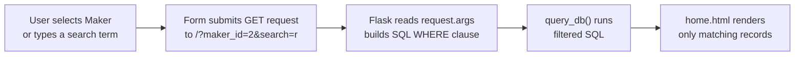

# Flask Made Easy – Part 5: Filtering and Search

**Course:** 12DGT  
**Year Level:** Year 12 (Level 7 – NCEA Level 2)  
**Unit / Module:** 03_Full_Stack_Website_Project  
**Aligned Standard(s):** AS91893 – Full-Stack Website Project  
**Series:** Flask Made Easy (5 parts) — Part 5 of 5  
**Estimated Time:** 1–2 lessons (~60–90 min)

---

## 1. Purpose of This Tutorial

By the end of this tutorial you will have:

- a **maker dropdown** on the home page that filters the grid to show only bikes from a selected maker
- a **model search bar** that filters results by keyword
- both filters working simultaneously — selecting a maker AND searching a term narrows results together
- a clean filter bar styled with W3.CSS

> **Prerequisite:** Parts 1–4 must be complete. Your app must be rendering `home.html` with a working grid of records from the database.

---

## 2. What We Are Building

Right now your home page shows every record every time. That works fine with 8–10 records, but real applications need filtering and search.

By the end of this tutorial, your URL bar will look like this when a filter is applied:

```
http://127.0.0.1:5000/?maker_id=2
http://127.0.0.1:5000/?search=ninja
http://127.0.0.1:5000/?maker_id=3&search=r
```

Flask reads these **query parameters** from the URL using the `request` object. Your SQL query then uses them as filters.



---

## 3. Step 1 — Update Your Import

You need `request` from Flask to read the query parameters from the URL. Update the import line at the top of `app.py`:

```python
from flask import Flask, g, render_template, request
```

`request` is a Flask object that represents the current HTTP request. `request.args` is a dictionary of any query parameters attached to the URL (everything after the `?`).

---

## 4. Step 2 — Update the Home Route

Replace your existing home route with this:

```python
@app.route('/')
def home():
    # Get all makers to populate the dropdown
    makers = query_db('SELECT maker_id, name FROM makers ORDER BY name')

    # Read filter values from the URL query string
    maker_id = request.args.get('maker_id', '')
    search   = request.args.get('search', '')

    # Build the WHERE clause dynamically based on what filters are active
    conditions = []
    args = []

    if maker_id:
        conditions.append('bikes.maker_id = ?')
        args.append(maker_id)

    if search:
        conditions.append('bikes.model LIKE ?')
        args.append(f'%{search}%')

    where_clause = ('WHERE ' + ' AND '.join(conditions)) if conditions else ''

    sql = f"""
        SELECT bikes.bike_id, makers.name, bikes.model, bikes.image_url
        FROM bikes
        JOIN makers ON bikes.maker_id = makers.maker_id
        {where_clause}
    """
    results = query_db(sql, tuple(args))

    return render_template('home.html',
                           results=results,
                           makers=makers,
                           selected_maker=maker_id,
                           search=search)
```

### What each new part does

| Part | Explanation |
|------|-------------|
| `makers = query_db(...)` | Fetches all makers from the database to populate the dropdown |
| `request.args.get('maker_id', '')` | Reads the `maker_id` param from the URL; returns `''` if not present |
| `request.args.get('search', '')` | Reads the `search` param; returns `''` if not present |
| `conditions` / `args` | Lists that grow based on which filters are active |
| `WHERE ... AND ...` | Built dynamically — only includes clauses for active filters |
| `f'%{search}%'` | The `%` wildcards make `LIKE` match anywhere in the string |
| `tuple(args)` | Converts the list to a tuple for `query_db()` |
| `selected_maker=maker_id` | Passes the current filter value back to the template so the dropdown shows the right selection |

### Why this approach is safe

The `WHERE` clause structure is built from fixed strings that you control — no user input is ever inserted directly into the SQL. The actual user values (`maker_id` and `search`) are always passed as `?` placeholders via the `args` tuple. This prevents SQL injection.

> **What goes wrong:** Students sometimes build SQL like `f"WHERE maker_id = {maker_id}"`. This is a SQL injection vulnerability — never do it. Always use `?` placeholders.

---

## 5. Step 3 — Update `home.html`

Add a filter bar above your grid. Open `templates/home.html` and add the form **inside** the ``, before the `.three-column` div:

```html




<!-- Filter bar -->
<form method="get" action="/" class="filter-bar">

    <select name="maker_id" onchange="this.form.submit()">
        <option value="">All Makers</option>
        
        <option value="{{ maker[0] }}"
            selected>
            {{ maker[1] }}
        </option>
        
    </select>

    <input type="text"
           name="search"
           placeholder="Search models..."
           value="{{ search }}">

    <button type="submit">Search</button>

    
    <a href="/" class="clear-link">Clear filters</a>
    

</form>

<!-- Results grid -->
<div class="three-column">
    
    <a href="{{ url_for('bike', id=bike[0]) }}">
        <div class="w3-card-4">
            <h3>{{ bike[1] }} {{ bike[2] }}</h3>
            
        </div>
    </a>
    
</div>


<p class="no-results">No results found. <a href="/">Clear filters</a></p>



```

### Key template details

| Part | Explanation |
|------|-------------|
| `method="get"` | Filters are submitted as URL query parameters — the URL updates so it is shareable and bookmarkable |
| `onchange="this.form.submit()"` | The dropdown submits automatically when the user picks a maker — no button click required |
| `maker[0]\|string` | Converts the integer `maker_id` to a string for comparison — Jinja2 needs matching types |
| `value="{{ search }}"` | Keeps the search term visible in the input after the form submits |
| `` | Only shows the "Clear filters" link when a filter is actually active |
| `` | Shows a message when no records match |

---

## 6. Step 4 — Add Filter Bar CSS

Open `static/style.css` and add:

```css
.filter-bar {
    display: flex;
    align-items: center;
    gap: 10px;
    padding: 15px 20px;
    background-color: #eceff1;
    flex-wrap: wrap;
}

.filter-bar select,
.filter-bar input[type="text"] {
    padding: 8px 12px;
    font-size: 15px;
    border: 1px solid #ccc;
    border-radius: 4px;
    font-family: inherit;
}

.filter-bar button {
    padding: 8px 18px;
    background-color: #37474f;
    color: white;
    border: none;
    border-radius: 4px;
    cursor: pointer;
    font-family: inherit;
    font-size: 15px;
}

.filter-bar button:hover {
    background-color: #546e7a;
}

.clear-link {
    color: #546e7a;
    font-size: 14px;
    text-decoration: underline;
}

.no-results {
    padding: 40px;
    text-align: center;
    color: #666;
    font-size: 18px;
}
```

Adjust the colours to match your existing colour scheme.

---

## 7. Step 5 — Test the Dropdown Filter

Run the app and open the home page. You should see a filter bar above the grid.

**Test the dropdown:**
1. Select a maker from the dropdown — the page should reload automatically and show only bikes from that maker
2. Check the URL — it should show `?maker_id=2` (or whichever maker you selected)
3. Select "All Makers" — all records should reappear
4. Copy the filtered URL and open it in a new tab — the same filtered results should load (this is why `GET` is used, not `POST`)

**What to check:**
- [ ] The dropdown shows all makers from your database
- [ ] The selected maker stays highlighted after the page reloads
- [ ] Filtering actually reduces the number of cards shown
- [ ] Selecting "All Makers" shows everything again

> **If the dropdown shows no makers:** Check that your `makers` table has data and that you are passing `makers=makers` in `render_template()`.

---

## 8. Step 6 — Test the Keyword Search

**Test the search input:**
1. Type part of a model name (e.g. `MT`) and click Search
2. Only records whose model contains `MT` should appear
3. Try an uppercase and lowercase version — check whether your results differ
4. Try a search term that matches nothing — the "No results found" message should appear
5. Clear the search field and click Search — all records should reappear

**Test both filters together:**
1. Select a maker from the dropdown and type a search term
2. The URL should show both: `?maker_id=2&search=mt`
3. Results should match BOTH conditions simultaneously

**Case sensitivity:** SQLite's `LIKE` is case-insensitive for ASCII characters by default, so `ninja` and `NINJA` should return the same results. However, this varies with accented characters.

---

## 9. How the Dynamic WHERE Clause Works

Understanding the query-building logic is important — you will use this pattern often.

**Example 1: No filters active**
```
conditions = []
args       = []
where_clause = ''          # empty string

SQL:  SELECT ... FROM bikes JOIN makers ...
      (no WHERE clause — returns everything)
```

**Example 2: Maker filter only**
```
conditions = ['bikes.maker_id = ?']
args       = ['2']
where_clause = 'WHERE bikes.maker_id = ?'

SQL:  SELECT ... FROM bikes JOIN makers ...
      WHERE bikes.maker_id = ?
args: ('2',)
```

**Example 3: Search only**
```
conditions = ['bikes.model LIKE ?']
args       = ['%ninja%']
where_clause = 'WHERE bikes.model LIKE ?'

SQL:  SELECT ... FROM bikes JOIN makers ...
      WHERE bikes.model LIKE ?
args: ('%ninja%',)
```

**Example 4: Both filters active**
```
conditions = ['bikes.maker_id = ?', 'bikes.model LIKE ?']
args       = ['3', '%r%']
where_clause = 'WHERE bikes.maker_id = ? AND bikes.model LIKE ?'

SQL:  SELECT ... FROM bikes JOIN makers ...
      WHERE bikes.maker_id = ? AND bikes.model LIKE ?
args: ('3', '%r%')
```

The `AND` is produced automatically by `' AND '.join(conditions)`. Adding a third filter later (e.g. year range) would just mean appending to `conditions` and `args` — the rest of the code does not change.

---

## 10. Your Complete Updated `app.py`

```python
import sqlite3
from flask import Flask, g, render_template, request

DATABASE = 'database.db'

app = Flask(__name__)

def get_db():
    db = getattr(g, '_database', None)
    if db is None:
        db = g._database = sqlite3.connect(DATABASE)
    return db

@app.teardown_appcontext
def close_connection(exception):
    db = getattr(g, '_database', None)
    if db is not None:
        db.close()

def query_db(query, args=(), one=False):
    cur = get_db().execute(query, args)
    rv = cur.fetchall()
    cur.close()
    return (rv[0] if rv else None) if one else rv

@app.route('/')
def home():
    makers = query_db('SELECT maker_id, name FROM makers ORDER BY name')

    maker_id = request.args.get('maker_id', '')
    search   = request.args.get('search', '')

    conditions = []
    args = []

    if maker_id:
        conditions.append('bikes.maker_id = ?')
        args.append(maker_id)

    if search:
        conditions.append('bikes.model LIKE ?')
        args.append(f'%{search}%')

    where_clause = ('WHERE ' + ' AND '.join(conditions)) if conditions else ''

    sql = f"""
        SELECT bikes.bike_id, makers.name, bikes.model, bikes.image_url
        FROM bikes
        JOIN makers ON bikes.maker_id = makers.maker_id
        {where_clause}
    """
    results = query_db(sql, tuple(args))

    return render_template('home.html',
                           results=results,
                           makers=makers,
                           selected_maker=maker_id,
                           search=search)

@app.route('/bikes/<int:id>')
def bike(id):
    sql = """
        SELECT bikes.bike_id, makers.name, bikes.model,
               bikes.year, bikes.engine, bikes.image_url
        FROM bikes
        JOIN makers ON bikes.maker_id = makers.maker_id
        WHERE bikes.bike_id = ?
    """
    result = query_db(sql, (id,), one=True)
    return render_template('bike.html', bike=result)

if __name__ == '__main__':
    app.run(debug=True)
```

---

## 11. Common Issues

| Problem | Likely cause | Fix |
|---------|-------------|-----|
| Dropdown shows no makers | `makers` not passed to template, or makers table is empty | Check `render_template()` call and database contents |
| Selected maker resets after page loads | `selected_maker` not passed to template, or type mismatch in `\|string` comparison | Ensure `selected_maker=maker_id` is in `render_template()` |
| Search returns no results for valid terms | `LIKE` query missing `%` wildcards | Check `f'%{search}%'` in the `args.append()` line |
| Both filters don't narrow results together | `AND` logic broken — check `conditions` list is built correctly | Print `where_clause` and `args` to the terminal temporarily to debug |
| "No results" message never appears | `` block missing or wrong indentation | Check the block is inside `` and not inside the for loop |
| URL shows `?maker_id=&search=` even with no filters | Empty string values being submitted | This is normal — the server handles empty strings correctly with the `if maker_id:` check |

---

## 12. Extensions to Try

If you finish early, try adding one of these:

**Sort order** — add a `<select>` that lets the user sort by year, model name, or maker:
```python
sort = request.args.get('sort', 'bikes.bike_id')
# Add ORDER BY {sort} to the SQL (use an allowlist — never pass sort directly from user input)
```

**Year range filter** — two number inputs (`year_from`, `year_to`) that add `bikes.year BETWEEN ? AND ?` to the conditions list.

**Results count** — display "Showing 4 of 10 results" above the grid using `{{ results|length }}` and a total count query.

---

## 13. Checkpoint

Before considering this complete:

- [ ] The dropdown lists all makers from the database
- [ ] Selecting a maker filters the grid to that maker only
- [ ] The selected maker is still shown in the dropdown after filtering
- [ ] The search input filters results by model keyword
- [ ] Both filters work simultaneously
- [ ] The "No results" message appears when nothing matches
- [ ] The "Clear filters" link resets both filters
- [ ] The filtered URL can be copied and shared (results are the same when reopened)
- [ ] Everything committed and synced to GitHub

---

## 14. Key Vocabulary

- **Query parameter:** A key-value pair appended to a URL after `?`, used to pass data to the server without a form submission changing the page. Example: `/?maker_id=2&search=ninja`.
- **`request.args`:** A Flask dictionary-like object containing all query parameters from the current URL.
- **`request.args.get(key, default)`:** Safely reads a query parameter; returns `default` if the key is not present (avoids a `KeyError`).
- **GET request:** An HTTP request that sends data as URL query parameters. Appropriate for filters and searches because the URL is bookmarkable and shareable.
- **POST request:** An HTTP request that sends data in the request body, not the URL. Used for forms that change data (login, creating records). Not appropriate here.
- **`LIKE`:** A SQL operator for pattern matching. `%` matches any sequence of characters. `bikes.model LIKE '%ninja%'` matches any model containing "ninja".
- **Wildcard (`%`):** The SQL character that matches any number of characters in a `LIKE` expression.
- **Dynamic WHERE clause:** A query-building pattern where the `WHERE` conditions are assembled at runtime based on which filters are active, rather than being hardcoded.
- **SQL injection:** A security attack where malicious SQL is inserted via user input. Prevented by always using `?` placeholders rather than string formatting to insert user values into queries.
- **`onchange="this.form.submit()"`:** A JavaScript attribute that submits the form automatically when the dropdown value changes, without the user needing to click a button.
- **`|string` (Jinja2 filter):** Converts a value to a string inside a Jinja2 template expression. Needed here because `maker[0]` is an integer but `selected_maker` is a string from `request.args`.
- **Allowlist:** A list of permitted values used to validate user input. When allowing user-controlled sort fields in SQL, always check the value is in an allowlist before using it — never pass it directly into a query.

---

*End of Flask Made Easy — Part 5: Filtering and Search*
