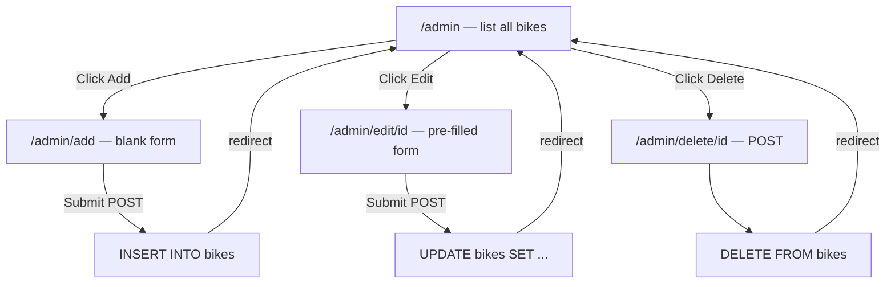

# Flask Made Easy – Part 6: Admin CRUD

**Course:** 12DGT  
**Year Level:** Year 12 (Level 7 – NCEA Level 2)  
**Unit / Module:** 03_Full_Stack_Website_Project  
**Aligned Standard(s):** AS91893 – Full-Stack Website Project  
**Series:** Flask Made Easy (6 parts) — Part 6 of 6  
**Estimated Time:** 2–3 lessons (~90–135 min)

---

## 1. Purpose of This Tutorial

By the end of this tutorial you will have:

- a hidden **admin page** (not linked in the navigation) that lets you manage bikes directly in the browser
- **Retrieve** — a table listing all bikes with edit and delete buttons
- **Create** — a form to add a new bike to the database
- **Update** — a pre-filled form to edit an existing bike's details
- **Delete** — a button that removes a bike from the database after confirmation
- the **Post-Redirect-Get** pattern so the browser does not re-submit data on refresh

> **Prerequisite:** Parts 1–5 must be complete. Your app must have a working home page with filtering and search.

---

## 2. What We Are Building

The four CRUD operations map directly onto four SQL statements:

| Operation | SQL | HTTP method | Route |
|-----------|-----|-------------|-------|
| **R**etrieve (list) | `SELECT` | GET | `/admin` |
| **C**reate | `INSERT INTO` | POST | `/admin/add` |
| **U**pdate | `UPDATE ... SET` | POST | `/admin/edit/<id>` |
| **D**elete | `DELETE FROM` | POST | `/admin/delete/<id>` |

The admin page is accessed by typing `/admin` directly into the browser's address bar. It is not linked from the navigation — this is a simple way to keep it away from regular users. (A real application would use login authentication; that is beyond this tutorial's scope.)



---

## 3. Step 1 — Add a `write_db()` Helper

Your existing `query_db()` function runs `SELECT` queries and returns rows. For `INSERT`, `UPDATE`, and `DELETE` you also need to **commit** the change — otherwise SQLite will discard it when the connection closes.

Add this function directly below `query_db()` in `app.py`:

```python
def write_db(query, args=()):
    db = get_db()
    db.execute(query, args)
    db.commit()
```

### Why commit is needed

When you call `sqlite3.connect()`, SQLite opens a **transaction** automatically. `SELECT` queries just read data — no transaction needs to be saved. But `INSERT`, `UPDATE`, and `DELETE` change data, so you must call `commit()` to make the change permanent. If you forget, the change exists only in memory and disappears when the request ends.

| Function | Used for | Calls `commit()`? |
|----------|----------|-------------------|
| `query_db()` | `SELECT` — reading data | No |
| `write_db()` | `INSERT`, `UPDATE`, `DELETE` — changing data | Yes |

---

## 4. Step 2 — Update Your Imports

`redirect` is needed to send the browser to a different URL after a form submission. Add it to your import line:

```python
from flask import Flask, g, render_template, request, redirect, url_for
```

---

## 5. Step 3 — Retrieve: The Admin List Page

Add this route to `app.py`. It retrieves all bikes with their maker name and renders a table:

```python
@app.route('/admin')
def admin():
    sql = """
        SELECT bikes.bike_id, makers.name, bikes.model,
               bikes.year, bikes.engine, bikes.image_url
        FROM bikes
        JOIN makers ON bikes.maker_id = makers.maker_id
        ORDER BY makers.name, bikes.model
    """
    bikes = query_db(sql)
    return render_template('admin.html', bikes=bikes)
```

Now create `templates/admin.html`:

```html




<div class="w3-container" style="padding: 20px;">

    <h2>Admin — Manage Bikes</h2>
    <a href="{{ url_for('admin_add') }}" class="w3-button w3-dark-grey" style="margin-bottom: 20px;">
        + Add New Bike
    </a>

    <table class="w3-table w3-bordered w3-striped">
        <thead class="w3-dark-grey">
            <tr>
                <th>ID</th>
                <th>Maker</th>
                <th>Model</th>
                <th>Year</th>
                <th>Engine</th>
                <th>Image URL</th>
                <th>Actions</th>
            </tr>
        </thead>
        <tbody>
            
            <tr>
                <td>{{ bike[0] }}</td>
                <td>{{ bike[1] }}</td>
                <td>{{ bike[2] }}</td>
                <td>{{ bike[3] }}</td>
                <td>{{ bike[4] }}</td>
                <td class="truncate">{{ bike[5] }}</td>
                <td>
                    <a href="{{ url_for('admin_edit', id=bike[0]) }}"
                       class="w3-button w3-small w3-blue">Edit</a>

                    <form method="post"
                          action="{{ url_for('admin_delete', id=bike[0]) }}"
                          style="display:inline;"
                          onsubmit="return confirm('Delete {{ bike[1] }} {{ bike[2] }}?')">
                        <button type="submit" class="w3-button w3-small w3-red">Delete</button>
                    </form>
                </td>
            </tr>
            
        </tbody>
    </table>

</div>


```

Add this CSS to `static/style.css` to stop long image URLs breaking the table layout:

```css
.truncate {
    max-width: 200px;
    overflow: hidden;
    text-overflow: ellipsis;
    white-space: nowrap;
}
```

**Test it:** Run the app and go to `http://127.0.0.1:5000/admin`. You should see a table listing all your bikes.

---

## 6. Step 4 — Create: Add a New Bike

This operation needs **two routes** using the same URL:

- `GET /admin/add` — displays the blank form
- `POST /admin/add` — receives the submitted form data, inserts into the database, and redirects

```python
@app.route('/admin/add', methods=['GET', 'POST'])
def admin_add():
    makers = query_db('SELECT maker_id, name FROM makers ORDER BY name')

    if request.method == 'POST':
        maker_id  = request.form['maker_id']
        model     = request.form['model']
        year      = request.form['year']
        engine    = request.form['engine']
        image_url = request.form['image_url']

        write_db(
            'INSERT INTO bikes (maker_id, model, year, engine, image_url) VALUES (?, ?, ?, ?, ?)',
            (maker_id, model, year, engine, image_url)
        )
        return redirect(url_for('admin'))

    return render_template('admin_form.html',
                           title='Add New Bike',
                           bike=None,
                           makers=makers)
```

### Understanding `methods=['GET', 'POST']`

By default, Flask routes only accept `GET` requests. Adding `methods=['GET', 'POST']` tells Flask this route should also handle `POST` requests (form submissions). Inside the function, `request.method` tells you which type of request arrived:

- `GET` → the user navigated to the URL → show the empty form
- `POST` → the user submitted the form → read the data and save it

### Understanding `request.form`

`request.form` is a dictionary containing the data the user typed into the form. The keys match the `name` attributes on your `<input>` and `<select>` elements. For example, `request.form['model']` gives you whatever the user typed in `<input name="model">`.

Compare this with Part 5 where you used `request.args` — that reads from the URL query string (`?maker_id=2`). `request.form` reads from the POST request body, which is not visible in the URL.

### Understanding Post-Redirect-Get

After saving data, the route does `return redirect(url_for('admin'))` instead of rendering a template directly. This is the **Post-Redirect-Get** pattern:

```
Browser sends POST /admin/add  →  Flask inserts record  →  Flask sends redirect to /admin
Browser follows redirect with GET /admin  →  Flask shows updated list
```

Without the redirect, if the user presses the browser's refresh button, it would re-submit the POST and insert a duplicate record. The redirect prevents this because the browser's last request becomes a harmless `GET`.

---

## 7. Step 5 — The Shared Form Template

Both Add and Edit use the same HTML form. Create `templates/admin_form.html`:

```html




<div class="w3-container" style="padding: 20px; max-width: 600px;">

    <h2>{{ title }}</h2>

    <form method="post">

        <label>Maker</label>
        <select name="maker_id" class="w3-select w3-border" style="margin-bottom: 12px;" required>
            <option value="">-- Select a Maker --</option>
            
            <option value="{{ maker[0] }}"
                selected>
                {{ maker[1] }}
            </option>
            
        </select>

        <label>Model</label>
        <input class="w3-input w3-border" style="margin-bottom: 12px;"
               type="text" name="model" required
               value="{{ bike[2] if bike else '' }}">

        <label>Year</label>
        <input class="w3-input w3-border" style="margin-bottom: 12px;"
               type="number" name="year" min="1900" max="2100"
               value="{{ bike[3] if bike else '' }}">

        <label>Engine</label>
        <input class="w3-input w3-border" style="margin-bottom: 12px;"
               type="text" name="engine"
               value="{{ bike[4] if bike else '' }}">

        <label>Image URL</label>
        <input class="w3-input w3-border" style="margin-bottom: 20px;"
               type="url" name="image_url"
               value="{{ bike[5] if bike else '' }}">

        <button type="submit" class="w3-button w3-dark-grey">Save</button>
        <a href="{{ url_for('admin') }}" class="w3-button w3-light-grey">Cancel</a>

    </form>

</div>


```

### How the shared template works

The template receives `bike=None` when adding, and `bike=<row>` when editing. Every input uses the conditional expression `bike[x] if bike else ''`:

- If `bike` is `None` (adding), the field is blank
- If `bike` is a row (editing), the field is pre-filled with the existing value

The maker dropdown uses `selected` to highlight the bike's current maker. `bike[6]` is the `maker_id` from the SELECT query you will write in the next step.

---

## 8. Step 6 — Update: Edit an Existing Bike

Again, two routes on the same URL — one to show the form pre-filled, one to save the changes:

```python
@app.route('/admin/edit/<int:id>', methods=['GET', 'POST'])
def admin_edit(id):
    makers = query_db('SELECT maker_id, name FROM makers ORDER BY name')

    if request.method == 'POST':
        maker_id  = request.form['maker_id']
        model     = request.form['model']
        year      = request.form['year']
        engine    = request.form['engine']
        image_url = request.form['image_url']

        write_db(
            '''UPDATE bikes
               SET maker_id=?, model=?, year=?, engine=?, image_url=?
               WHERE bike_id=?''',
            (maker_id, model, year, engine, image_url, id)
        )
        return redirect(url_for('admin'))

    # GET: fetch the existing record to pre-fill the form
    bike = query_db(
        '''SELECT bike_id, makers.name, model, year, engine, image_url, bikes.maker_id
           FROM bikes
           JOIN makers ON bikes.maker_id = makers.maker_id
           WHERE bike_id = ?''',
        (id,), one=True
    )
    return render_template('admin_form.html',
                           title='Edit Bike',
                           bike=bike,
                           makers=makers)
```

### Column index reference for the edit query

| Index | Column | Used for |
|-------|--------|----------|
| `bike[0]` | `bike_id` | Not shown in form (used in route URL) |
| `bike[1]` | `makers.name` | Not used (just for reference) |
| `bike[2]` | `model` | Pre-fills the Model input |
| `bike[3]` | `year` | Pre-fills the Year input |
| `bike[4]` | `engine` | Pre-fills the Engine input |
| `bike[5]` | `image_url` | Pre-fills the Image URL input |
| `bike[6]` | `bikes.maker_id` | Selects the correct maker in the dropdown |

Notice that `maker_id` is fetched as `bike[6]` and used in the template's `selected` check. It must be selected explicitly because `JOIN` gives you the maker's *name* in `bike[1]`, not the ID.

### Why the `id` goes last in the UPDATE args

SQL processes the `?` placeholders left to right, in the order they appear in the query. In the `UPDATE` statement, `WHERE bike_id=?` comes last, so `id` must be the last element in the args tuple — `(maker_id, model, year, engine, image_url, id)`. Getting this order wrong is a common mistake that silently corrupts the wrong record.

---

## 9. Step 7 — Delete: Remove a Bike

Delete only needs a `POST` route — there is no form to display. The confirmation happens in JavaScript in the browser, via the `onsubmit="return confirm(...)"` you added to `admin.html` in Step 3.

```python
@app.route('/admin/delete/<int:id>', methods=['POST'])
def admin_delete(id):
    write_db('DELETE FROM bikes WHERE bike_id = ?', (id,))
    return redirect(url_for('admin'))
```

### Why delete uses POST, not GET

It might seem simpler to use a plain `<a href="/admin/delete/3">Delete</a>` link, but that would be a `GET` request. `GET` requests must be **safe** — they should never change data, because browsers, search engines, and link-preview tools may follow them automatically without the user intending to. Always use `POST` for operations that delete or modify data.

The delete button in `admin.html` is wrapped in a `<form method="post">` for exactly this reason.

---

## 10. Your Complete Updated `app.py`

```python
import sqlite3
from flask import Flask, g, render_template, request, redirect, url_for

DATABASE = 'database.db'

app = Flask(__name__)


# --- Database helpers ---

def get_db():
    db = getattr(g, '_database', None)
    if db is None:
        db = g._database = sqlite3.connect(DATABASE)
    return db

@app.teardown_appcontext
def close_connection(exception):
    db = getattr(g, '_database', None)
    if db is not None:
        db.close()

def query_db(query, args=(), one=False):
    cur = get_db().execute(query, args)
    rv = cur.fetchall()
    cur.close()
    return (rv[0] if rv else None) if one else rv

def write_db(query, args=()):
    db = get_db()
    db.execute(query, args)
    db.commit()


# --- Public routes ---

@app.route('/')
def home():
    makers = query_db('SELECT maker_id, name FROM makers ORDER BY name')
    maker_id = request.args.get('maker_id', '')
    search   = request.args.get('search', '')

    conditions = []
    args = []

    if maker_id:
        conditions.append('bikes.maker_id = ?')
        args.append(maker_id)

    if search:
        conditions.append('bikes.model LIKE ?')
        args.append(f'%{search}%')

    where_clause = ('WHERE ' + ' AND '.join(conditions)) if conditions else ''

    sql = f"""
        SELECT bikes.bike_id, makers.name, bikes.model, bikes.image_url
        FROM bikes
        JOIN makers ON bikes.maker_id = makers.maker_id
        {where_clause}
    """
    results = query_db(sql, tuple(args))

    return render_template('home.html',
                           results=results,
                           makers=makers,
                           selected_maker=maker_id,
                           search=search)

@app.route('/bikes/<int:id>')
def bike(id):
    sql = """
        SELECT bikes.bike_id, makers.name, bikes.model,
               bikes.year, bikes.engine, bikes.image_url
        FROM bikes
        JOIN makers ON bikes.maker_id = makers.maker_id
        WHERE bikes.bike_id = ?
    """
    result = query_db(sql, (id,), one=True)
    return render_template('bike.html', bike=result)


# --- Admin routes ---

@app.route('/admin')
def admin():
    sql = """
        SELECT bikes.bike_id, makers.name, bikes.model,
               bikes.year, bikes.engine, bikes.image_url
        FROM bikes
        JOIN makers ON bikes.maker_id = makers.maker_id
        ORDER BY makers.name, bikes.model
    """
    bikes = query_db(sql)
    return render_template('admin.html', bikes=bikes)

@app.route('/admin/add', methods=['GET', 'POST'])
def admin_add():
    makers = query_db('SELECT maker_id, name FROM makers ORDER BY name')

    if request.method == 'POST':
        write_db(
            'INSERT INTO bikes (maker_id, model, year, engine, image_url) VALUES (?, ?, ?, ?, ?)',
            (request.form['maker_id'], request.form['model'],
             request.form['year'],    request.form['engine'],
             request.form['image_url'])
        )
        return redirect(url_for('admin'))

    return render_template('admin_form.html',
                           title='Add New Bike',
                           bike=None,
                           makers=makers)

@app.route('/admin/edit/<int:id>', methods=['GET', 'POST'])
def admin_edit(id):
    makers = query_db('SELECT maker_id, name FROM makers ORDER BY name')

    if request.method == 'POST':
        write_db(
            '''UPDATE bikes
               SET maker_id=?, model=?, year=?, engine=?, image_url=?
               WHERE bike_id=?''',
            (request.form['maker_id'], request.form['model'],
             request.form['year'],     request.form['engine'],
             request.form['image_url'], id)
        )
        return redirect(url_for('admin'))

    bike = query_db(
        '''SELECT bike_id, makers.name, model, year, engine, image_url, bikes.maker_id
           FROM bikes
           JOIN makers ON bikes.maker_id = makers.maker_id
           WHERE bike_id = ?''',
        (id,), one=True
    )
    return render_template('admin_form.html',
                           title='Edit Bike',
                           bike=bike,
                           makers=makers)

@app.route('/admin/delete/<int:id>', methods=['POST'])
def admin_delete(id):
    write_db('DELETE FROM bikes WHERE bike_id = ?', (id,))
    return redirect(url_for('admin'))


if __name__ == '__main__':
    app.run(debug=True)
```

---

## 11. Testing Each Operation

### Test Retrieve
- [ ] Go to `http://127.0.0.1:5000/admin`
- [ ] All bikes appear in the table with their maker name
- [ ] Edit and Delete buttons appear on each row

### Test Create
- [ ] Click **+ Add New Bike**
- [ ] Fill in the form and click Save
- [ ] You are redirected back to `/admin` and the new bike appears in the table
- [ ] Check the record in the SQLite3 Editor to confirm it was saved correctly
- [ ] Press the browser's Back button and then Refresh — no duplicate is created

### Test Update
- [ ] Click **Edit** on any bike
- [ ] Confirm all fields are pre-filled with the existing data
- [ ] Change one field and click Save
- [ ] You are redirected to `/admin` and the change is visible in the table
- [ ] Confirm the change in the SQLite3 Editor

### Test Delete
- [ ] Click **Delete** on any bike
- [ ] A confirmation box asks "Delete [Maker] [Model]?"
- [ ] Click **Cancel** — nothing happens
- [ ] Click **Delete** again, then click **OK** — the row is removed from the table
- [ ] Confirm the record is gone in the SQLite3 Editor

---

## 12. Common Issues

| Problem | Likely cause | Fix |
|---------|-------------|-----|
| `write_db is not defined` | Function added in wrong place or typo in name | Check it is defined after `query_db()` and before any routes |
| Form data not saving | `commit()` missing — `query_db()` used instead of `write_db()` | Ensure INSERT/UPDATE/DELETE routes call `write_db()` |
| `Method Not Allowed` error | Route is missing `methods=['GET', 'POST']` | Add `methods=['GET', 'POST']` to the `@app.route` decorator |
| Pressing Refresh re-submits the form | `redirect()` not called after POST | Ensure every POST handler ends with `return redirect(url_for('admin'))` |
| Edit form fields are blank | `bike=None` passed instead of the fetched record | Check the GET branch of `admin_edit` fetches and passes `bike` |
| Wrong record updated | Args in wrong order in UPDATE query | The `id` must be last in the args tuple to match `WHERE bike_id=?` |
| Dropdown not pre-selected on edit | `bike[6]` (maker_id) not fetched, or type mismatch | Ensure `bikes.maker_id` is selected as the last column in the edit query |
| Delete does nothing | Delete route only accepts `POST` but link was used (GET) | Delete must use a `<form method="post">`, not an `<a href>` link |
| `confirm()` dialog does not appear | JS `onsubmit` syntax error | Check `onsubmit="return confirm('...')"` — the `return` is essential |

---

## 13. Why No Authentication?

A real admin page would require users to log in before they can add, edit, or delete records. Flask has extensions (like **Flask-Login**) for this, but implementing authentication properly is beyond the scope of this project.

For now, the admin page is "hidden" by not being linked in the navigation. This is **not** real security — anyone who knows the URL can access it. If you deploy this app publicly, you should add authentication before the admin routes.

This is worth noting in any project documentation or presentation: acknowledging the limitation and naming the solution demonstrates understanding even if it is not implemented.

---

## 14. Extensions to Try

**Validate the year** — before calling `write_db`, check that `year` is a valid 4-digit integer. If not, re-render the form with an error message instead of saving.

**Flash messages** — Flask has a `flash()` function that lets you display a one-time success message after a redirect. Research `flash()` and `get_flashed_messages()` to show "Bike added successfully" after a create or update.

**Manage makers** — add `/admin/makers` with its own list, add, edit, and delete routes for the `makers` table. This is the same pattern repeated for a second table.

**Protect with a password** — use `session` from Flask and a hardcoded password to add a simple login page at `/admin/login`. Redirect all admin routes to login if the session is not set.

---

## 15. Checkpoint

Before considering this complete:

- [ ] `write_db()` is defined and used for all INSERT, UPDATE, and DELETE operations
- [ ] `redirect` and `url_for` are imported at the top of `app.py`
- [ ] `/admin` lists all bikes in a table
- [ ] `/admin/add` (GET) shows a blank form; (POST) saves the record and redirects
- [ ] `/admin/edit/<id>` (GET) shows a pre-filled form; (POST) updates the record and redirects
- [ ] `/admin/delete/<id>` (POST only) deletes the record and redirects
- [ ] Pressing Refresh after a form submission does not create duplicate records
- [ ] The admin link does not appear in the site's navigation
- [ ] All changes committed and pushed to GitHub

---

## 16. Key Vocabulary

- **CRUD:** The four fundamental database operations — Create, Read, Update, Delete — that map to INSERT, SELECT, UPDATE, and DELETE in SQL.
- **`request.form`:** A Flask dictionary-like object containing data submitted via a POST form. Keys match the `name` attributes on form elements.
- **`request.args`:** A Flask dictionary-like object containing URL query parameters (from GET requests). Used in Part 5 for filtering.
- **`commit()`:** A SQLite method that permanently saves changes made by INSERT, UPDATE, or DELETE. Without it, changes exist only in memory and are lost when the connection closes.
- **POST:** An HTTP method used to submit form data that changes the database. The data is in the request body, not the URL.
- **GET:** An HTTP method used to retrieve data. Safe — it should never change anything. Query parameters appear in the URL.
- **Post-Redirect-Get (PRG):** A pattern where a POST handler saves data, then redirects to a GET route. Prevents duplicate submissions if the user refreshes the page after submitting a form.
- **`redirect(url)`:** A Flask function that sends the browser to a different URL with a 302 response.
- **`url_for('function_name')`:** A Flask function that generates the URL for a given route function. Safer than hardcoding strings like `'/admin'` because it updates automatically if you change the route path.
- **`methods=['GET', 'POST']`:** An argument to `@app.route()` that specifies which HTTP methods the route will accept. By default, only GET is accepted.
- **`request.method`:** A Flask attribute that tells you whether the current request is `'GET'`, `'POST'`, or another method. Used to decide whether to show a form or process its submission.
- **`one=True`:** An argument to `query_db()` that returns a single row instead of a list of rows. Used when you know exactly one result is expected (e.g. fetching a bike by its primary key).
- **Flash message:** A one-time message stored in the session that is displayed on the next page load and then cleared. Used to confirm actions like "Record saved successfully."
- **Authentication:** Verifying who a user is before granting access to restricted pages. Not implemented in this tutorial but necessary for any public-facing admin page.

---

*End of Flask Made Easy — Part 6: Admin CRUD*
