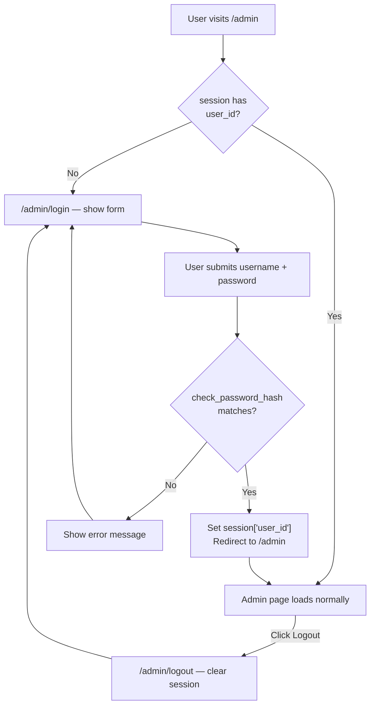

# Flask Made Easy – Part 7: Authentication

**Course:** 12DGT  
**Year Level:** Year 12 (Level 7 – NCEA Level 2)  
**Unit / Module:** 03_Full_Stack_Website_Project  
**Aligned Standard(s):** AS91893 – Full-Stack Website Project  
**Series:** Flask Made Easy (7 parts) — Part 7 of 7  
**Estimated Time:** 2–3 lessons (~90–135 min)

---

## 1. Purpose of This Tutorial

By the end of this tutorial you will have:

- a `users` table in your database storing usernames and **hashed** passwords
- a `/admin/login` page that checks credentials against the database
- a `/admin/logout` route that clears the session
- all admin routes **protected** so that unauthenticated users are redirected to the login page
- a reusable `login_required` decorator that keeps the protection logic in one place

> **Prerequisite:** Part 6 must be complete. Your admin CRUD routes must be working.

---

## 2. The Problem With Plain-Text Passwords

If you stored passwords as plain text in your database, a single data breach would expose every user's password immediately. Hashing solves this.

A **hash** is a one-way transformation: given a password, the function always produces the same hash — but you cannot reverse a hash back to the original password. When a user logs in, you hash what they typed and compare it to the stored hash. If the hashes match, the password is correct.

```
Registration:   "mypassword"  →  generate_password_hash()  →  "pbkdf2:sha256:600000$..."  (stored)

Login attempt:  "mypassword"  →  check_password_hash(stored, "mypassword")  →  True
Login attempt:  "wrongpass"   →  check_password_hash(stored, "wrongpass")   →  False
```

The hashing library used here is **Werkzeug**, which is already installed as part of Flask — no extra packages needed.

---

## 3. What We Are Building



---

## 4. Step 1 — Create the `users` Table

Open the **SQLite3 Editor** in VS Code, select your `database.db`, and run this in the query editor:

```sql
CREATE TABLE users (
    user_id       INTEGER PRIMARY KEY AUTOINCREMENT,
    username      TEXT NOT NULL UNIQUE,
    password_hash TEXT NOT NULL
);
```

Do **not** add a password column — you will never store plain-text passwords. Only the hash goes in.

---

## 5. Step 2 — Seed Your First User

You need to create at least one user record before you can log in. Because the password must be hashed, you cannot just type it into the SQLite editor. Instead, run this one-off Python script from the terminal:

Create a file called `seed_user.py` in your project folder:

```python
import sqlite3
from werkzeug.security import generate_password_hash

username = 'admin'
password = 'changeme'          # change this to whatever you want

db = sqlite3.connect('database.db')
db.execute(
    'INSERT INTO users (username, password_hash) VALUES (?, ?)',
    (username, generate_password_hash(password))
)
db.commit()
db.close()
print(f'User "{username}" created successfully.')
```

Run it once from the terminal:

```
python seed_user.py
```

Check the `users` table in the SQLite3 Editor. You should see one row with a `password_hash` that starts with `pbkdf2:sha256:...` — that is the hashed version of your password. The plain-text password is not stored anywhere.

> **After running it once, delete `seed_user.py` or add it to `.gitignore`.** You do not want it committed to GitHub because running it again would try to insert a duplicate username and cause an error (the `UNIQUE` constraint would prevent it, but it is cleaner to remove the file).

---

## 6. Step 3 — Update Your Imports

At the top of `app.py`, update the imports to add `session` from Flask and the two Werkzeug functions:

```python
import sqlite3
from functools import wraps
from flask import Flask, g, render_template, request, redirect, url_for, session
from werkzeug.security import generate_password_hash, check_password_hash
```

`functools.wraps` is part of Python's standard library — it is needed for the decorator you will write in Step 5.

---

## 7. Step 4 — Set a Secret Key

Flask uses the `secret_key` to cryptographically sign the session cookie. Without it, sessions will not work. Add this line directly after `app = Flask(__name__)`:

```python
app.secret_key = 'change-this-to-something-random-before-deploying'
```

### About the secret key

The secret key should be a long, unpredictable string. For development, any string works. For a deployed application, you would generate a proper random key and store it in an environment variable — not hardcoded in source code. You can generate a good key with Python:

```python
import secrets
print(secrets.token_hex(32))
# outputs something like: a3f9b2e1c7d4...
```

If the secret key changes, all existing sessions are invalidated and logged-out users will need to log in again. If someone learns your secret key, they can forge session cookies and bypass authentication entirely — keep it private.

---

## 8. Step 5 — Write the `login_required` Decorator

A **decorator** is a function that wraps another function to add behaviour before or after it runs. You will write one that checks whether the user is logged in and redirects to the login page if not.

Add this below your `write_db()` function:

```python
def login_required(f):
    @wraps(f)
    def decorated(*args, **kwargs):
        if 'user_id' not in session:
            return redirect(url_for('admin_login'))
        return f(*args, **kwargs)
    return decorated
```

### How it works

When you put `@login_required` above a route function, Python replaces that function with `decorated`. Every time that route is called, `decorated` runs first:

1. It checks whether `'user_id'` is in the session (i.e. whether the user is logged in)
2. If not — redirect to the login page
3. If yes — run the original route function normally (`f(*args, **kwargs)`)

`@wraps(f)` copies the original function's name and documentation across to `decorated`. Without it, Flask's internal routing can get confused because all your decorated routes would appear to have the same function name (`decorated`).

---

## 9. Step 6 — Add the Login and Logout Routes

```python
@app.route('/admin/login', methods=['GET', 'POST'])
def admin_login():
    # If already logged in, go straight to admin
    if 'user_id' in session:
        return redirect(url_for('admin'))

    error = None
    if request.method == 'POST':
        username = request.form['username']
        password = request.form['password']

        user = query_db(
            'SELECT user_id, password_hash FROM users WHERE username = ?',
            (username,), one=True
        )

        if user and check_password_hash(user[1], password):
            session['user_id'] = user[0]
            return redirect(url_for('admin'))
        else:
            error = 'Invalid username or password.'

    return render_template('admin_login.html', error=error)


@app.route('/admin/logout')
def admin_logout():
    session.pop('user_id', None)
    return redirect(url_for('admin_login'))
```

### What each part does

| Part | Explanation |
|------|-------------|
| `if 'user_id' in session` (top of login) | Skips the login page if already logged in — avoids showing the form to someone who just hit Back |
| `query_db(..., one=True)` | Fetches the matching user row, or `None` if the username does not exist |
| `user and check_password_hash(user[1], password)` | Short-circuit: if `user` is `None` (unknown username), `check_password_hash` is never called. If `user` exists, compare the submitted password against the stored hash |
| `session['user_id'] = user[0]` | Stores the user's ID in the session cookie — this is what `login_required` checks later |
| `session.pop('user_id', None)` | Removes `user_id` from the session. The `None` default means no error if it was not there |

### Why the same error message for both wrong username and wrong password

The error says "Invalid username or password" rather than "Username not found" or "Wrong password". This is intentional — telling an attacker which part was wrong helps them confirm whether a username exists. Using one message for both cases is a deliberate security practice.

---

## 10. Step 7 — Protect the Admin Routes

Add `@login_required` to every admin route. The decorator goes directly below `@app.route(...)`:

```python
@app.route('/admin')
@login_required
def admin():
    ...

@app.route('/admin/add', methods=['GET', 'POST'])
@login_required
def admin_add():
    ...

@app.route('/admin/edit/<int:id>', methods=['GET', 'POST'])
@login_required
def admin_edit(id):
    ...

@app.route('/admin/delete/<int:id>', methods=['POST'])
@login_required
def admin_delete(id):
    ...
```

The order matters: `@app.route` must come first (outermost), then `@login_required` directly below it.

Add a logout link to `admin.html` so the user can sign out. Inside your ``, add this somewhere visible — the top of the page is a good place:

```html
<div style="text-align: right; padding: 10px 20px; background: #37474f;">
    <a href="{{ url_for('admin_logout') }}" style="color: white; text-decoration: none;">
        Log out
    </a>
</div>
```

---

## 11. Step 8 — Create `admin_login.html`

Create `templates/admin_login.html`:

```html




<div class="w3-container" style="max-width: 400px; margin: 60px auto;">

    <h2>Admin Login</h2>

    
    <div class="w3-panel w3-red">
        <p>{{ error }}</p>
    </div>
    

    <form method="post">

        <label>Username</label>
        <input class="w3-input w3-border" style="margin-bottom: 12px;"
               type="text" name="username" required autofocus>

        <label>Password</label>
        <input class="w3-input w3-border" style="margin-bottom: 20px;"
               type="password" name="password" required>

        <button type="submit" class="w3-button w3-dark-grey w3-block">
            Log in
        </button>

    </form>

</div>


```

Note `type="password"` on the password input — this masks the characters as the user types and prevents the browser from including the value if the page is cached.

---

## 12. Testing Authentication

**Test the login page:**
- [ ] Go to `http://127.0.0.1:5000/admin` without logging in — you should be redirected to `/admin/login`
- [ ] Submit an incorrect password — the error message appears, you stay on the login page
- [ ] Submit the correct username and password — you are redirected to `/admin`
- [ ] The admin table loads normally

**Test session persistence:**
- [ ] While logged in, open a new tab and go to `http://127.0.0.1:5000/admin` — you should still be logged in (the session cookie is shared across tabs)
- [ ] Click **Log out** — you are redirected to the login page
- [ ] Try going to `http://127.0.0.1:5000/admin` again — you are redirected to login

**Test all protected routes:**
- [ ] While logged out, try to visit `http://127.0.0.1:5000/admin/add` directly — redirected to login
- [ ] Try `http://127.0.0.1:5000/admin/edit/1` — redirected to login
- [ ] Try sending a POST request to `/admin/delete/1` — redirected to login (nothing deleted)

---

## 13. Your Complete Updated `app.py`

```python
import sqlite3
from functools import wraps
from flask import Flask, g, render_template, request, redirect, url_for, session
from werkzeug.security import generate_password_hash, check_password_hash

DATABASE = 'database.db'

app = Flask(__name__)
app.secret_key = 'change-this-to-something-random-before-deploying'


# --- Database helpers ---

def get_db():
    db = getattr(g, '_database', None)
    if db is None:
        db = g._database = sqlite3.connect(DATABASE)
    return db

@app.teardown_appcontext
def close_connection(exception):
    db = getattr(g, '_database', None)
    if db is not None:
        db.close()

def query_db(query, args=(), one=False):
    cur = get_db().execute(query, args)
    rv = cur.fetchall()
    cur.close()
    return (rv[0] if rv else None) if one else rv

def write_db(query, args=()):
    db = get_db()
    db.execute(query, args)
    db.commit()


# --- Auth helper ---

def login_required(f):
    @wraps(f)
    def decorated(*args, **kwargs):
        if 'user_id' not in session:
            return redirect(url_for('admin_login'))
        return f(*args, **kwargs)
    return decorated


# --- Public routes ---

@app.route('/')
def home():
    makers = query_db('SELECT maker_id, name FROM makers ORDER BY name')
    maker_id = request.args.get('maker_id', '')
    search   = request.args.get('search', '')

    conditions = []
    args = []

    if maker_id:
        conditions.append('bikes.maker_id = ?')
        args.append(maker_id)

    if search:
        conditions.append('bikes.model LIKE ?')
        args.append(f'%{search}%')

    where_clause = ('WHERE ' + ' AND '.join(conditions)) if conditions else ''

    sql = f"""
        SELECT bikes.bike_id, makers.name, bikes.model, bikes.image_url
        FROM bikes
        JOIN makers ON bikes.maker_id = makers.maker_id
        {where_clause}
    """
    results = query_db(sql, tuple(args))

    return render_template('home.html',
                           results=results,
                           makers=makers,
                           selected_maker=maker_id,
                           search=search)

@app.route('/bikes/<int:id>')
def bike(id):
    sql = """
        SELECT bikes.bike_id, makers.name, bikes.model,
               bikes.year, bikes.engine, bikes.image_url
        FROM bikes
        JOIN makers ON bikes.maker_id = makers.maker_id
        WHERE bikes.bike_id = ?
    """
    result = query_db(sql, (id,), one=True)
    return render_template('bike.html', bike=result)


# --- Auth routes ---

@app.route('/admin/login', methods=['GET', 'POST'])
def admin_login():
    if 'user_id' in session:
        return redirect(url_for('admin'))

    error = None
    if request.method == 'POST':
        username = request.form['username']
        password = request.form['password']

        user = query_db(
            'SELECT user_id, password_hash FROM users WHERE username = ?',
            (username,), one=True
        )

        if user and check_password_hash(user[1], password):
            session['user_id'] = user[0]
            return redirect(url_for('admin'))
        else:
            error = 'Invalid username or password.'

    return render_template('admin_login.html', error=error)

@app.route('/admin/logout')
def admin_logout():
    session.pop('user_id', None)
    return redirect(url_for('admin_login'))


# --- Admin routes (protected) ---

@app.route('/admin')
@login_required
def admin():
    sql = """
        SELECT bikes.bike_id, makers.name, bikes.model,
               bikes.year, bikes.engine, bikes.image_url
        FROM bikes
        JOIN makers ON bikes.maker_id = makers.maker_id
        ORDER BY makers.name, bikes.model
    """
    bikes = query_db(sql)
    return render_template('admin.html', bikes=bikes)

@app.route('/admin/add', methods=['GET', 'POST'])
@login_required
def admin_add():
    makers = query_db('SELECT maker_id, name FROM makers ORDER BY name')

    if request.method == 'POST':
        write_db(
            'INSERT INTO bikes (maker_id, model, year, engine, image_url) VALUES (?, ?, ?, ?, ?)',
            (request.form['maker_id'], request.form['model'],
             request.form['year'],    request.form['engine'],
             request.form['image_url'])
        )
        return redirect(url_for('admin'))

    return render_template('admin_form.html',
                           title='Add New Bike',
                           bike=None,
                           makers=makers)

@app.route('/admin/edit/<int:id>', methods=['GET', 'POST'])
@login_required
def admin_edit(id):
    makers = query_db('SELECT maker_id, name FROM makers ORDER BY name')

    if request.method == 'POST':
        write_db(
            '''UPDATE bikes
               SET maker_id=?, model=?, year=?, engine=?, image_url=?
               WHERE bike_id=?''',
            (request.form['maker_id'], request.form['model'],
             request.form['year'],     request.form['engine'],
             request.form['image_url'], id)
        )
        return redirect(url_for('admin'))

    bike = query_db(
        '''SELECT bike_id, makers.name, model, year, engine, image_url, bikes.maker_id
           FROM bikes
           JOIN makers ON bikes.maker_id = makers.maker_id
           WHERE bike_id = ?''',
        (id,), one=True
    )
    return render_template('admin_form.html',
                           title='Edit Bike',
                           bike=bike,
                           makers=makers)

@app.route('/admin/delete/<int:id>', methods=['POST'])
@login_required
def admin_delete(id):
    write_db('DELETE FROM bikes WHERE bike_id = ?', (id,))
    return redirect(url_for('admin'))


if __name__ == '__main__':
    app.run(debug=True)
```

---

## 14. Common Issues

| Problem | Likely cause | Fix |
|---------|-------------|-----|
| `RuntimeError: The session is unavailable because no secret key was set` | `app.secret_key` not set | Add `app.secret_key = '...'` immediately after `app = Flask(__name__)` |
| Login form submits but nothing happens — stays on login page | Password check returning `False` | Double-check you ran `seed_user.py` and it completed without error; confirm the `users` table has a row |
| `werkzeug.security` import error | Old version of Werkzeug | Run `pip install --upgrade werkzeug --break-system-packages` |
| Logging in works but admin redirects to login again immediately | Session cookie not being set — secret key may be changing between requests | Ensure `app.secret_key` is a fixed string, not regenerated each time |
| `@login_required` causes `AssertionError: view function mapping is overwriting an existing endpoint` | `@wraps(f)` missing from the decorator | Check `from functools import wraps` is imported and `@wraps(f)` is in the decorator |
| All admin routes redirect to login even after logging in | Decorator order wrong | `@app.route(...)` must be the outermost decorator (first line), `@login_required` directly below it |
| `session.pop` raises a `KeyError` | `None` default missing | Use `session.pop('user_id', None)` not `session.pop('user_id')` |
| Visiting `/admin/login` while logged in still shows the login page | Missing early-return check at top of `admin_login` | Add `if 'user_id' in session: return redirect(url_for('admin'))` at the start of the login route |

---

## 15. How the Session Cookie Works

When Flask sets `session['user_id'] = user[0]`, it does not store the data on the server. Instead, it packs the data into a **cookie** that is signed (not encrypted) with your `secret_key` and sent to the browser. On every subsequent request, the browser sends the cookie back, Flask verifies the signature, and reads the data.

This means:

- **The data in the cookie is readable** by the user (it is base64-encoded, not encrypted). Never put sensitive data like passwords in the session.
- **The signature prevents tampering** — the user cannot change their `user_id` to someone else's without the secret key, because the signature would no longer match.
- **Clearing the session** just removes the cookie from the browser — there is nothing to delete server-side.

---

## 16. Extensions to Try

**Change password** — add a `/admin/change-password` route that accepts the current password, verifies it with `check_password_hash`, then saves a new hash with `generate_password_hash`. Never allow a password change without verifying the current one first.

**Multiple admin users** — the `users` table already supports multiple rows. Add an `/admin/users` page (protected, of course) that lets you add and remove admin accounts. Think carefully: who can create the first admin if the page requires authentication to access it?

**Session timeout** — set `app.permanent_session_lifetime` and `session.permanent = True` on login to automatically expire the session after a set time. Research `datetime.timedelta` for this.

**Remember me** — add a checkbox on the login form. If ticked, set the session to permanent (long-lived cookie). If not ticked, the session expires when the browser closes.

---

## 17. Checkpoint

Before considering this complete:

- [ ] `users` table created in the database with `user_id`, `username`, `password_hash` columns
- [ ] `seed_user.py` ran successfully and created at least one user
- [ ] `seed_user.py` deleted or added to `.gitignore`
- [ ] `app.secret_key` is set
- [ ] `session`, `generate_password_hash`, `check_password_hash`, `wraps` are all imported
- [ ] `login_required` decorator is defined and uses `@wraps(f)`
- [ ] All four admin routes have `@login_required` applied
- [ ] Visiting `/admin` while logged out redirects to `/admin/login`
- [ ] Correct credentials log you in and redirect to `/admin`
- [ ] Incorrect credentials show an error message and stay on the login page
- [ ] Log out clears the session and redirects to the login page
- [ ] All changes committed and pushed to GitHub

---

## 18. Key Vocabulary

- **Hash / Hashing:** A one-way mathematical function that converts input (like a password) into a fixed-length string. You cannot reverse a hash to get the original input. Used so that even if the database is stolen, passwords are not exposed directly.
- **`generate_password_hash(password)`:** A Werkzeug function that hashes a plain-text password using PBKDF2-SHA256 with a random salt. Returns a string like `pbkdf2:sha256:600000$...`.
- **`check_password_hash(stored_hash, submitted_password)`:** A Werkzeug function that hashes the submitted password and compares it to the stored hash. Returns `True` if they match, `False` otherwise.
- **Werkzeug:** A Python library that Flask is built on top of. Provides utilities including password hashing, request/response handling, and routing. Already installed when you install Flask.
- **Session:** A Flask object (`session`) that stores data across multiple requests from the same user. Implemented as a signed cookie sent to the browser.
- **Session cookie:** A small piece of data stored in the browser that Flask signs with the `secret_key`. Sent with every request so Flask can identify the logged-in user.
- **`secret_key`:** A private string used to sign the session cookie. Must be kept secret — if exposed, an attacker can forge session data.
- **Decorator:** A Python function that wraps another function to add behaviour before or after it runs. `@login_required` is a decorator that adds an authentication check before each admin route.
- **`@wraps(f)`:** A decorator from `functools` that copies the wrapped function's name and metadata to the wrapper. Required when writing decorators for Flask routes so that Flask's routing does not get confused.
- **Post-Redirect-Get (PRG):** A pattern used after form submissions: save the data, then redirect to a GET route. Prevents duplicate submissions on page refresh. (Covered in Part 6 — also applies to the login route.)
- **Short-circuit evaluation:** Python evaluates `and` expressions left to right and stops as soon as the result is known. `user and check_password_hash(...)` — if `user` is `None` (falsy), Python skips `check_password_hash` entirely, avoiding an error.
- **Salt:** A random value added to the input before hashing, so two identical passwords produce different hashes. `generate_password_hash` handles this automatically — you do not need to manage it yourself.
- **PBKDF2-SHA256:** The hashing algorithm Werkzeug uses by default. It is deliberately slow (600,000 iterations) to make brute-force attacks impractical. This is by design — password hashing is supposed to be slow.

---

*End of Flask Made Easy — Part 7: Authentication*
