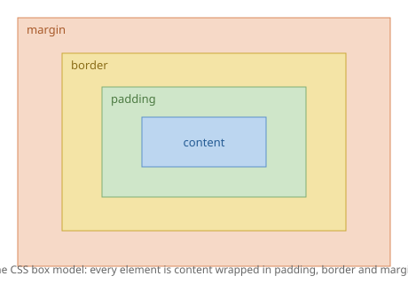

# HTML Foundations

You have met HTML before, so this is a quick reset rather than starting from zero.

Two things matter in this note: **using the right tags**, and **the box model**. Everything in Notes 02, 03 and 04 assumes you understand both. If you skip this, layout will feel like guesswork later.

## Key words

| Word | What it means |
|---|---|
| **Element** | One thing in your HTML, like `<p>` or `<nav>`. |
| **Semantic** | A tag whose *name* describes what it is. `<nav>` is semantic; `<div>` is not. |
| **Box model** | The rule that every element is a box made of content, padding, border and margin. |
| **Padding** | Space *inside* the box, between the content and the edge. |
| **Margin** | Space *outside* the box, pushing other things away. |
| **Screen reader** | Software that reads a page aloud for people who can't see it. |

## Copy this first

This is a complete, valid HTML page. Save it as `index.html`, open it in your browser, and edit it as you read the rest of this note.

```html
<!DOCTYPE html>
<html lang="en">
<head>
  <meta charset="UTF-8">
  <meta name="viewport" content="width=device-width, initial-scale=1">
  <title>My Page</title>
  <link rel="stylesheet" href="style.css">
</head>
<body>

  <header>
    <h1>My Site</h1>
    <nav>
      <a href="/">Home</a>
      <a href="/about">About</a>
    </nav>
  </header>

  <main>
    <article>
      <h2>First post</h2>
      <p>Some words go here.</p>
    </article>
  </main>

  <footer>
    <p>Made by me, 2026.</p>
  </footer>

</body>
</html>
```

Everything above `<body>` is setup. Everything inside `<body>` is what people see.

## Part 1 — Use tags that mean something

Every HTML element draws a box on the page. But the *name* of the tag also carries meaning, and a CSS class can't do that.

These tags describe what a region **is**:

| Tag | What it is |
|---|---|
| `<header>` | The top of the page or of a section. |
| `<nav>` | A set of navigation links. |
| `<main>` | The main content. One per page. |
| `<section>` | A grouped chunk of content. |
| `<article>` | A self-contained item — a post, a product, a card. |
| `<aside>` | Side content, like a sidebar. |
| `<footer>` | The bottom of the page or of a section. |

### Why this matters — three real reasons

**1. People using screen readers rely on it.**
A screen reader can jump straight to "the navigation" or "the main content" — but only if you used `<nav>` and `<main>`. If your page is nothing but `<div>` tags, there is nothing to jump to.

**2. Your Flask templates stay readable.**
When you come back to a file in three weeks, `<nav>` tells you what it is instantly. `<div class="nv2">` does not.

**3. You write fewer classes.**
If the tag already means "navigation", you don't need a class to say so.

### The rule to remember

> Use `<div>` and `<span>` **only** when no meaningful tag fits.

They mean "this is just a box, with no meaning". Sometimes that's exactly what you want. Often it isn't.

## Part 2 — The box model

Every element is a box. That box has four layers, from the inside out.



| Layer | What it is |
|---|---|
| **content** | The text or image itself. |
| **padding** | Space inside the border. The background colour reaches into here. |
| **border** | The edge of the box. |
| **margin** | Space outside the border, pushing neighbours away. Always see-through. |

Get this wrong and every layout you write will fight you.

### One line that fixes a lot of pain

Put this at the very top of every stylesheet you write:

```css
*, *::before, *::after {
  box-sizing: border-box;
}
```

**Why?** By default, `width: 300px` sets the width of the *content only*. Then padding and border get added on top — so your "300px" box is actually 340px wide, and your layout breaks.

`border-box` changes that so `width: 300px` means **the whole box is 300px**, padding and border included. That is how everyone assumes it works anyway.

Set it once. Never think about it again.

### See it for yourself

Paste this into `style.css` and look at the two boxes in your browser.

> **Important:** for this demo only, do **not** add the `*` rule above yet — it would fix both boxes and you'd see no difference. Try the demo first, then add the global rule and watch the first box snap to 200px.

```css
.demo {
  width: 200px;
  padding: 20px;
  border: 5px solid black;
  background: lightblue;
}

.demo-fixed {
  box-sizing: border-box;   /* the fix */
}
```

```html
<div class="demo">I am wider than 200px</div>
<div class="demo demo-fixed">I am exactly 200px</div>
```

Measure them. The first one is 250px wide. That's the problem `border-box` solves.

## Your turn

Build a single page using **no CSS at all**. Just HTML.

It needs:

- A `<header>` containing a `<nav>` with three links
- A `<main>` containing two `<article>` elements, each with a heading and a paragraph
- A `<footer>`

**Why no CSS?** Because a well-structured page should already make sense before you style it. If it reads correctly with no styling, your HTML is right. If it doesn't, no amount of CSS will fix it.

This is exactly the skeleton your Flask project will use later.

## Check yourself

- [ ] I can name six semantic tags and say what each is for.
- [ ] I know when it's OK to use a `<div>`.
- [ ] I can list the four layers of the box model in order.
- [ ] I know the difference between padding and margin.
- [ ] I know what `box-sizing: border-box` does and why I want it.
- [ ] I have built a page with correct structure and no CSS.

## Where to get help

- [MDN — HTML basics](https://developer.mozilla.org/en-US/docs/Learn/Getting_started_with_the_web/HTML_basics) — start here if you're rusty.
- [MDN — Document and website structure](https://developer.mozilla.org/en-US/docs/Learn/HTML/Introduction_to_HTML/Document_and_website_structure) — all the semantic tags explained.
- [web.dev — Learn HTML](https://web.dev/learn/html) — free course, modern and thorough.
- [MDN — The box model](https://developer.mozilla.org/en-US/docs/Learn/CSS/Building_blocks/The_box_model) — with diagrams you can play with.
- Video: [Kevin Powell's channel](https://www.youtube.com/@KevinPowell) — search "box model" for several clear walkthroughs.
