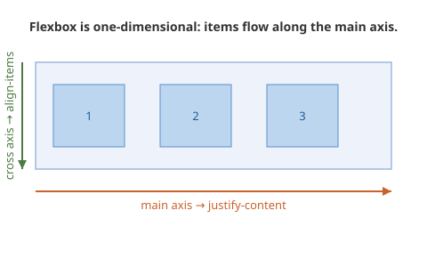

# Flexbox Layout

Flexbox is a **one-dimensional** layout system: it distributes items along a single axis. That makes it the right tool for nav bars, toolbars, button rows, and the internals of a component (an icon next to a label, a card's header row). It is *not* the tool for whole-page layout — that is Grid's job (Note 03).

Keep the distinction crisp, because "when do I use which" is the question students actually get stuck on. **Flexbox = one direction at a time. Grid = rows and columns together.**

## The mental model: main axis and cross axis



You turn a container into a flex container with `display: flex`. Its direct children become flex items and line up along the **main axis**. The **cross axis** runs perpendicular to it.

- `justify-content` positions items along the **main axis** (the direction they flow).
- `align-items` positions items along the **cross axis** (perpendicular).
- `flex-direction` decides which axis is the main one — `row` (default, horizontal) or `column` (vertical). Switching this swaps what `justify-content` and `align-items` control, which trips everyone up once.

## The properties that do 90% of the work

```css
.container {
  display: flex;
  justify-content: space-between; /* along the main axis */
  align-items: center;            /* along the cross axis */
  gap: 1rem;                       /* space between items — use this, not margins */
}
```

`gap` is the modern way to space flex items. Do not reach for margins on the children; `gap` handles spacing cleanly and does not add stray space at the ends.

## Intrinsic responsiveness lives here

This is the point where "responsive" starts, *inside* the layout — not in a later module.

```css
.container {
  display: flex;
  flex-wrap: wrap;   /* items drop to a new line instead of overflowing */
  gap: 1rem;
}
```

Add `flex-wrap: wrap` and a `flex` value on the children, and the layout adapts to width with no media query at all:

```css
.card {
  flex: 1 1 250px;   /* grow, shrink, ideal width 250px */
}
```

Read `flex: 1 1 250px` as "aim for 250px, but grow to fill space and shrink if you must." On a wide screen you get several columns; on a phone they stack. That is responsive behaviour that emerged from the layout itself.

## Build a nav bar (the exercise that teaches Flexbox)

Do not teach Flexbox in the abstract and then "apply it to a nav bar." Build the nav bar; that *is* the lesson.

```html
<nav class="site-nav">
  <a class="logo" href="/">MySite</a>
  <ul class="links">
    <li><a href="/">Home</a></li>
    <li><a href="/about">About</a></li>
    <li><a href="/contact">Contact</a></li>
  </ul>
</nav>
```

```css
.site-nav {
  display: flex;
  justify-content: space-between;
  align-items: center;
  padding: 1rem;
}
.links {
  display: flex;
  gap: 1.5rem;
  list-style: none;
}
```

This is directly reusable: it becomes the nav in the Flask project's `base.html` template.

## Warm-up game

[**Flexbox Froggy**](https://flexboxfroggy.com/) — 24 short levels teaching `justify-content`, `align-items`, `flex-direction`, and ordering. Ideal as the first ten minutes of the Flexbox session.

## Resources

- Video: [Kevin Powell — Learn flexbox the easy way](https://www.youtube.com/watch?v=u044iM9xsWU) (34 min, the definitive beginner walkthrough).
- Video: [Kevin Powell — Flexbox vs. Grid: which to use](https://www.youtube.com/watch?v=ESAXStllfcw).
- Video: [Kevin Powell — Flexbox design patterns](https://www.youtube.com/watch?v=vQAvjof1oe4) — real layout patterns students can copy.
- Interactive: [Josh Comeau — An Interactive Guide to Flexbox](https://www.joshwcomeau.com/css/interactive-guide-to-flexbox/) — free, and the best conceptual explainer online.
- Reference: [CSS-Tricks — A Complete Guide to Flexbox](https://css-tricks.com/snippets/css/a-guide-to-flexbox/) — the cheat sheet everyone keeps open.
- Reference: [MDN — Flexbox](https://developer.mozilla.org/en-US/docs/Web/CSS/CSS_flexible_box_layout/Basic_concepts_of_flexbox)
- Game: [Flexbox Froggy](https://flexboxfroggy.com/)
