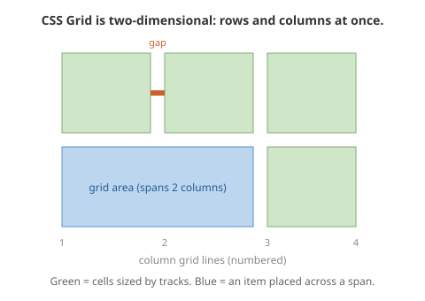

# CSS Grid Layout

Grid arranges things in **rows and columns at the same time**. That makes it the tool for:

- the overall shape of a page (header, sidebar, main, footer)
- a gallery of similar things (a wall of cards, a photo grid)

In Note 02 you learned to push boxes along one line. Grid is the step up: you draw a plan, and then put boxes into it.

## Key words

| Word | What it means |
|---|---|
| **Grid container** | The parent element you put `display: grid` on. |
| **Track** | One column or one row that you defined. |
| **Grid line** | The numbered edge between tracks. Line 1 is the far left / top. |
| **Cell** | One square where a column and a row cross. |
| **Area** | A block of cells that one item spans across. |
| **`fr`** | "Fraction" — a unit meaning "a share of the space that's left". |
| **`gap`** | Space between tracks. Same idea as in Flexbox. |

## Copy this first

Three equal columns with a gap. Paste it, then change the `3` and the `1rem`.

```html
<div class="gallery">
  <div class="card">One</div>
  <div class="card">Two</div>
  <div class="card">Three</div>
  <div class="card">Four</div>
  <div class="card">Five</div>
  <div class="card">Six</div>
</div>
```

```css
.gallery {
  display: grid;
  grid-template-columns: repeat(3, 1fr);  /* three equal columns */
  gap: 1rem;
}

.card {
  padding: 1rem;
  background: lightblue;
}
```

## Part 1 — The mental model



You define the **columns** (and sometimes the rows). The browser fills them with your items, in order, left to right and top to bottom.

## Part 2 — The `fr` unit

`fr` means "one share of the space that's left over".

```css
grid-template-columns: 1fr 1fr 1fr;   /* three equal columns */
grid-template-columns: 2fr 1fr;       /* first column twice as wide as second */
grid-template-columns: 200px 1fr;     /* fixed sidebar, main fills the rest */
```

That last one is very common: a fixed-width sidebar, and the main content taking whatever is left.

`repeat(3, 1fr)` is just a shortcut for `1fr 1fr 1fr`. Use it when you have a lot of columns.

## Part 3 — Making an item bigger

To make one item take up more than one cell:

```css
.featured {
  grid-column: span 2;   /* this item is two columns wide */
}
```

You can do the same with rows: `grid-row: span 2`.

## Part 4 — The single most useful pattern in this unit

Learn this one. You will use it in your project.

```css
.gallery {
  display: grid;
  grid-template-columns: repeat(auto-fit, minmax(250px, 1fr));
  gap: 1rem;
}
```

**In plain words:** "Fit in as many columns as you can. Each one must be at least 250px wide. Share out any spare space equally."

What that does:

| Screen | Result |
|---|---|
| Wide laptop | Four or five columns |
| Tablet | Two or three columns |
| Phone | One column |

**You wrote no media queries.** The browser counted the columns for you.

Why it matters for your project: this is exactly how you'll display a list of records from the database. Flask hands you 20 rows, you loop them into cards, and this one line makes the gallery work on every device.

Breaking down the pieces:

- `auto-fit` — "work out how many columns fit"
- `minmax(250px, 1fr)` — "each column: never smaller than 250px, otherwise share the space"

## Part 5 — Laying out a whole page with named areas

For the overall page shape, you can literally draw the layout in text:

```css
.page {
  display: grid;
  grid-template-columns: 200px 1fr;
  grid-template-areas:
    "header  header"
    "sidebar main"
    "footer  footer";
  gap: 1rem;
}

header { grid-area: header; }
nav    { grid-area: sidebar; }
main   { grid-area: main; }
footer { grid-area: footer; }
```

Look at the `grid-template-areas` block. It's a **picture of your page**, made of words. The header spans both columns. The sidebar and main sit side by side. The footer spans both again.

You can read the layout at a glance, six weeks later, without running it. That's worth a lot — especially when this goes into a shared `base.html` file that your whole site uses.

## Part 6 — Flexbox or Grid? The decision rule

| What you're laying out | Use |
|---|---|
| Things along one line — nav bar, button row, tag list | **Flexbox** |
| A structure of rows and columns — whole page, card gallery | **Grid** |

And the thing people don't expect: **you use both, together, all the time.** A Grid page, where each card inside it uses Flexbox to line up its own contents. That's normal and correct, not a mistake.

## Warm-up game

[**Grid Garden**](https://cssgridgarden.com/) — 28 levels. You water carrots using `grid-template-columns` and placement properties.

Play it at the start of the Grid lesson, same as Flexbox Froggy.

## Your turn

1. Build the six-card gallery from "Copy this first". Change `repeat(3, 1fr)` to `repeat(4, 1fr)` and then `2fr 1fr 1fr`. Watch each change.
2. Give one card `grid-column: span 2` and see it take two slots.
3. Replace your columns with `repeat(auto-fit, minmax(250px, 1fr))`. Now drag your browser window narrow and wide. Count the columns changing.
4. Build the named-areas page layout. Change the order of the words in `grid-template-areas` and see the page rearrange.

## Check yourself

- [ ] I can say when to use Grid instead of Flexbox.
- [ ] I know what `1fr` means.
- [ ] I can write three equal columns two different ways.
- [ ] I can explain `repeat(auto-fit, minmax(250px, 1fr))` in my own words.
- [ ] I know why that line is responsive without a media query.
- [ ] I can read a `grid-template-areas` block and describe the page it makes.
- [ ] I understand that Grid and Flexbox are used together, not instead of each other.

## Where to get help

- Video: [Kevin Powell — Learn CSS Grid the easy way](https://www.youtube.com/watch?v=rg7Fvvl3taU) (37 min).
- Video: [Kevin Powell — Flexbox vs. Grid](https://www.youtube.com/watch?v=ESAXStllfcw) — if the decision rule still feels fuzzy.
- Interactive: [Josh Comeau — Interactive Guide to CSS Grid](https://www.joshwcomeau.com/css/interactive-guide-to-grid/) — free, drag things around.
- Cheat sheet: [CSS-Tricks — A Complete Guide to Grid](https://css-tricks.com/snippets/css/complete-guide-grid/).
- Reference: [MDN — Grid layout basics](https://developer.mozilla.org/en-US/docs/Web/CSS/CSS_grid_layout/Basic_concepts_of_grid_layout).
- Game: [Grid Garden](https://cssgridgarden.com/).
