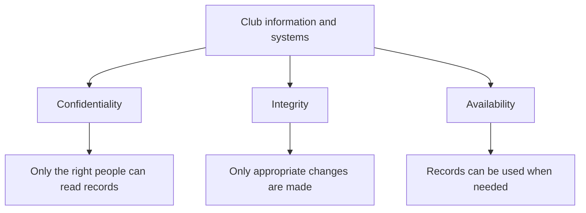

import { ArticleShell, Kicker, Headline, Dek, Byline, Hero, Lede, Callout, KeyTerms, CheckWork, Roadmap, UnitLinks } from '@site/src/components/ArticleKit';

<ArticleShell>

<Kicker>Computer Science · Security Unit · Session 1 of 8</Kicker>

<Headline>Every security decision is a trade-off. Here's how to make a good one.</Headline>

<Dek>Meet the 80-member robotics club that shares one password, lets anyone edit the books, and keeps its only copy of everything on a laptop that sometimes goes home in a backpack. Its problems are this session's way into the CIA triad — and into the risk framework you'll use for the rest of the unit.</Dek>

<Byline>
  <strong>Session time:</strong> 60 minutes
  ·
  <strong>Homework:</strong> none this week
  ·
  Keep your answers for Session 8
</Byline>

<Hero
  src="/img/12DGT/computer-security/hero-01-security-goals-and-risk.jpg"
  alt="An open combination lock resting, unlocked, on a computer keyboard."
  caption="An unlocked combination lock: convenient for whoever left it that way — and for anyone else who finds it. Photo: Sasun Bughdaryan / Unsplash"
/>

<Lede>

**Goal:** identify what needs protecting, and explain — in a sentence a stranger could follow — why a particular risk actually matters.

| Task | Minutes |
|---|---:|
| Baseline questions | 5 |
| Read the notes and diagram | 15 |
| Core video and viewing question | 10 |
| Case-study activity | 20 |
| Check answers and complete exit question | 10 |

</Lede>

<Callout kind="diagnostic">

Before you read on, write one sentence answering each of these: What is computer security? Is security only about stopping hackers? Why might a school need backups? You'll compare these against your own explanations in Session 8 — so answer honestly, not for marks.

</Callout>

<Callout kind="case">

**The Harbour School Robotics Club** has 80 members, two student treasurers and a teacher supervisor. It stores contact details and payment records, and its laptop is sometimes taken home. Right now, everyone shares one password, everyone can edit the records, and the only copy of everything lives on that one laptop. Over the rest of this unit, your job is to improve that arrangement — without making the club impossible to actually run.

</Callout>

## 1. Three things security is actually protecting

Computer security protects information and systems from harm — deliberate attacks, honest mistakes, and equipment that simply fails. A useful framework is **confidentiality, integrity and availability**, usually shortened to the **CIA triad**.

| Goal | Meaning | A failure in the robotics club |
|---|---|---|
| Confidentiality | Information is accessible only to authorised people | Someone publishes members' private contact details |
| Integrity | Data is accurate and protected against improper alteration | A member changes a payment from unpaid to paid |
| Availability | Authorised users can use the information or service when needed | The laptop fails just before the club needs its records |

One incident can hit several goals at once. Ransomware might make the records unavailable, while the same attackers quietly copy the personal data behind them. Restoring the records afterwards helps availability — it does nothing to undo the disclosure.

Security is not the same as maximum restriction. Locking everyone out of the records would protect them from misuse, and would also stop the club from working. Good decisions balance protection against legitimate access — they don't just maximise one at the expense of the other.

*Reading the diagram: all three branches matter at once. They're different questions to ask about the same system, not steps carried out in sequence.*

## 2. Assets, threats, vulnerabilities and controls

An **asset** is something valuable: data, a device, an account or a service. A **threat** is a possible source or cause of harm. A **vulnerability** is a weakness that makes harm possible, or more likely. A **control** reduces the likelihood or impact of that harm.

<Callout kind="example">

The club laptop is an **asset**. Theft is a **threat**. Leaving it unattended in an unlocked room is a **vulnerability**. Locked storage reduces the *chance* of theft; disk encryption reduces the chance that a thief can actually *read* its data once stolen. Two controls, addressing two different parts of the same risk.

</Callout>

<Callout kind="pitfall">

"The risk is hackers" explains nothing. Say what could happen, to which asset, and what the consequence would be — a marker (and a real security team) needs all three.

</Callout>

## 3. Deciding which risk comes first

Weigh both **likelihood** and **impact**. A frequent minor inconvenience may call for a different response than a rare event that would wipe out every record the club has. Simple low/medium/high ratings help organise that reasoning — they're judgements, not precise probabilities, and you should treat them that way.

**Residual risk** is what's left over after your controls are applied. A locked cupboard can still be broken into. A backup can still be too old to help. A strong answer names what its chosen protection *doesn't* solve — that's usually the difference between a pass and a merit-level response.

## Watch

<Callout kind="watch">

**Core (required):** [What is the CIA Triad? — IBM Technology](https://www.youtube.com/watch?v=kPPFNrlN3zo). Watch up to 7 minutes, then use the rest of the 10-minute window to answer: *which security goal matters most when a member's home address is leaked, and why?*

**Optional extension:** [Cybersecurity: Crash Course Computer Science #31](https://www.youtube.com/watch?v=bPVaOlJ6ln0). Pull out one example of a protection and one example of a threat — you'll meet both again in later sessions.

</Callout>

## Activity — Diagnose the club

<Callout kind="activity">

The club has a shared password, every member can edit payment records, and there's no separate backup.

1. List three assets.
2. Build a table with five columns: threat, vulnerability, likely consequence, security goal, and suggested control — three rows minimum.
3. Choose your first improvement and justify it in 60–90 words, using likelihood **and** impact.
4. A member says, *"We trust everyone, so we don't need permissions."* Explain what that overlooks about accidental harm.

</Callout>

<CheckWork>

Reasonable assets: contact data, payment records, the laptop itself. Solid rows include unauthorised access via the shared credential; incorrect changes via excessive editing permissions; and loss of the only copy after device failure. Individual accounts, restricted editing, and a recoverable separate backup are all defensible controls.

There's no single compulsory first priority. Protecting the only copy is defensible — losing it could halt the club's administration entirely. Restricting access to personal information is equally defensible if the current exposure is substantial. What matters is that your choice is *linked to the facts*, not asserted on its own.

Trust doesn't stop a member from accidentally overwriting a column, or losing a device down the back of a car seat.

</CheckWork>

<Callout kind="exit">

Explain the difference between a threat and a vulnerability, using a **new** example of your own. A successful answer names a possible cause of harm, and the separate weakness it could exploit.

</Callout>

<KeyTerms terms={['asset', 'threat', 'vulnerability', 'control', 'risk', 'residual risk', 'confidentiality', 'integrity', 'availability']} />

<Roadmap length={8} current={1} />

<UnitLinks>

[**Unit** · Computer Security](README.mdx)

[**Next session** · Malware and social engineering →](02-malware-and-social-engineering.mdx)

</UnitLinks>

</ArticleShell>
