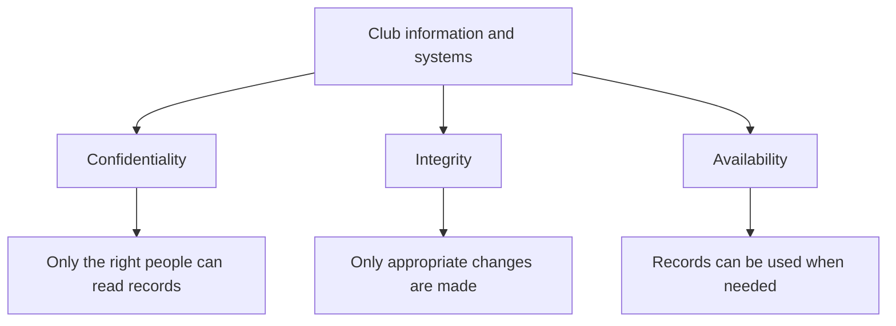

# Session 1 — Security goals and risk

[Course index](README.mdx) · [Next session](02-malware-and-social-engineering.mdx)

**Time:** 60 minutes. **Goal:** Identify what needs protecting and explain why a particular risk matters.

## Your route through the hour

| Task | Minutes |
|---|---:|
| Baseline questions | 5 |
| Read the notes and diagram | 15 |
| Core video and viewing question | 10 |
| Case-study activity | 20 |
| Check answers and complete exit question | 10 |

## Before you start

Write a sentence answering each question: What is computer security? Is security only about stopping hackers? Why might a school need backups? Keep these initial answers for Session 8.

## 1. Three security goals

Computer security protects information and systems from harm, including deliberate attacks, mistakes and equipment failures. A useful framework is **confidentiality, integrity and availability**, often called the CIA triad.

| Goal | Meaning | A failure in the robotics club |
|---|---|---|
| Confidentiality | Information is accessible only to authorised people | Someone publishes members' private contact details |
| Integrity | Data is accurate and protected against improper alteration | A member changes a payment from unpaid to paid |
| Availability | Authorised users can use the information or service when needed | The laptop fails just before the club needs its records |

One incident can affect several goals. Ransomware may make records unavailable, while the same attackers may also copy personal data. Restoring the records would help availability but would not undo the disclosure.

Security is not simply maximum restriction. Preventing everyone from opening the records would protect them from some misuse but would stop the club working. Good decisions balance protection with legitimate access.

**Read the diagram:** All three branches matter. They are different questions to ask about the same system, rather than steps carried out in sequence.

## 2. Assets, threats, vulnerabilities and controls

An **asset** is something valuable: data, a device, an account or a service. A **threat** is a possible source or cause of harm. A **vulnerability** is a weakness that makes harm possible or more likely. A **control** reduces the likelihood or impact of that harm.

**Worked example:** The club laptop is an asset. Theft is a threat. Leaving it unattended in an unlocked room is a vulnerability. Locked storage reduces the chance of theft; disk encryption reduces the chance that a thief can read its data. These controls address different parts of the risk.

Avoid vague answers such as “the risk is hackers”. Explain what could happen to which asset and what the consequence would be.

## 3. Deciding which risk comes first

Consider both **likelihood** and **impact**. A frequent minor inconvenience may need a different response from a rare event that would destroy all records. Simple low/medium/high ratings can help organise reasoning, but they are judgements, not precise probabilities.

**Residual risk** is the risk remaining after controls are applied. A locked cupboard can still be broken into. A backup may still be too old. A strong answer acknowledges what its chosen protection does not solve.

## YouTube viewing

1. **Core:** [What is the CIA Triad — IBM Technology](https://www.youtube.com/watch?v=kPPFNrlN3zo). Use up to 7 minutes for viewing and the remainder of the 10-minute window to answer: Which security goal matters most when a member's address is leaked, and why?
2. **Optional overview:** [Cybersecurity: Crash Course Computer Science #31 — CrashCourse](https://www.youtube.com/watch?v=bPVaOlJ6ln0). Identify one example of a protection and one example of a threat. This introduces concepts developed in later sessions.

## Activity — Diagnose the club

The club has a shared password, all members can edit payment records, and there is no separate backup.

1. List three assets.
2. Make a table with three rows: threat, vulnerability, likely consequence, security goal and suggested control.
3. Choose your first improvement and justify it in 60–90 words using likelihood and impact.
4. A member says, “We trust everyone, so we do not need permissions.” Explain why this overlooks accidental harm.

## Check your work

Possible assets are contact data, payment records and the laptop. Suitable rows include unauthorised access through shared credentials; incorrect changes through excessive editing permissions; and loss of the only copy after device failure. Individual accounts, restricted editing and recoverable separate backups are reasonable controls.

There is no single compulsory first priority. For example, protecting the only copy is defensible because losing it could halt administration. Restricting access to personal information is also defensible if current exposure is substantial. You must link your choice to the facts.

Trust does not prevent a member from accidentally overwriting a column or losing a device.

**Exit question:** Explain the difference between a threat and a vulnerability using a new example. A successful answer names a possible cause of harm and the separate weakness it could exploit.

**Key terms:** asset, threat, vulnerability, control, risk, residual risk, confidentiality, integrity, availability.
