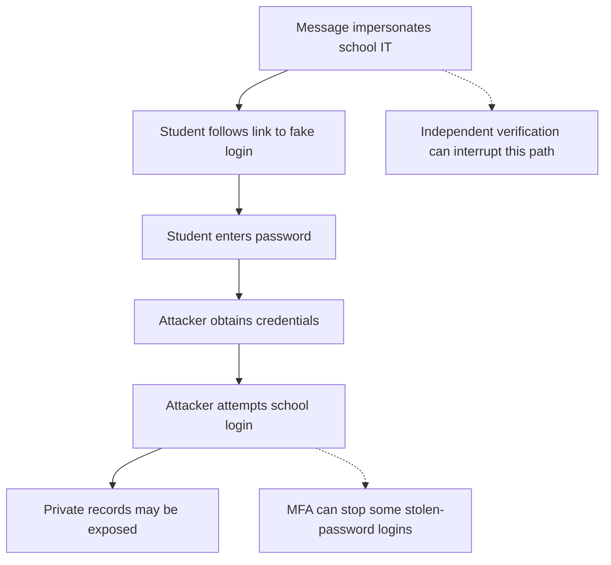

import { ArticleShell, Kicker, Headline, Dek, Byline, Hero, Lede, Callout, KeyTerms, CheckWork, Roadmap, UnitLinks } from '@site/src/components/ArticleKit';

<ArticleShell>

<Kicker>Computer Science · Security Unit · Session 2 of 8</Kicker>

<Headline>Most attacks don't break the system. They talk someone into opening the door.</Headline>

<Dek>A fictional message lands in a student inbox: the school storage closes in 30 minutes, sign in now, don't bother contacting IT. Nothing here needs a single line of code — it needs 30 seconds of urgency. This session pulls apart what malware actually is, and traces exactly how a message like that turns into a stolen password.</Dek>

<Byline>
  <strong>Session time:</strong> 60 minutes
  ·
  <strong>Homework:</strong> none this week
  ·
  Builds on Session 1's risk framework
</Byline>

<Hero
  src="/img/12DGT/computer-security/hero-02-malware-and-social-engineering.jpg"
  alt="A red padlock resting on a computer keyboard."
  caption="Malware and phishing both aim at the same lock — one picks it with code, the other just asks you for the key. Photo: FlyD / Unsplash"
/>

<Lede>

**Goal:** explain *how* an attack works, rather than simply naming it.

| Task | Minutes |
|---|---:|
| Recall the CIA triad | 5 |
| Read notes and worked example | 15 |
| Core video and question | 10 |
| Investigate the fictional message | 20 |
| Self-check and exit question | 10 |

</Lede>

## 1. Malware is an umbrella term

**Malware** means malicious software. Different labels describe how it spreads, how it disguises itself, or what harm it actually causes.

| Type | Defining feature | Possible effect |
|---|---|---|
| Virus | Attaches to a host file or program; runs and spreads when infected material is executed | Changes or damages files |
| Worm | Replicates and spreads between systems without attaching to a host file | Disrupts services or delivers another malicious payload |
| Trojan | Pretends to be legitimate software | Installs hidden remote access or steals data |
| Ransomware | Extorts a victim, commonly by encrypting files or blocking access | Makes records unavailable; may accompany data theft |
| Spyware | Secretly collects information | Reveals browsing activity or credentials |

These categories overlap constantly. A fake "useful" program can be a Trojan that installs spyware. Not every piece of malware is a virus, and not every infection needs someone to open an attachment.

## 2. Social engineering targets decisions, not code

**Social engineering** manipulates a person into an unsafe action. **Phishing** commonly uses deceptive emails or messages to obtain information, deliver malware, or persuade someone to transfer money. A version aimed at one specific, researched target is often called **spear phishing**.

Attackers lean on urgency, fear, curiosity or authority — not technical skill. A message can carry a real name, flawless grammar and copied branding, and still be fake. Those features prove nothing. Equally, an unusual message is a reason to verify, not proof that an attack has already happened.

*Reading the diagram: this is one possible route, not a guaranteed outcome. Account permissions and authentication controls decide what the attacker can actually do once they have a password.*

## 3. What separates a weak answer from a strong one

<Callout kind="example">

**Weak:** "Phishing hacks the student and steals data."

**Stronger:** "An attacker sends a message pretending to be school IT and links to a copied login page. If the student submits credentials, the attacker can try them on the genuine service. If that login succeeds and the account can read club records, the attacker can copy members' details — compromising confidentiality."

Notice the causal chain and its conditions. Opening a message isn't the same as giving away a password; clicking a link doesn't always mean an account is compromised. Say what has to go right, for the attacker, at each step.

</Callout>

## 4. Responding to a suspicious message

Never use the message's own contact details to check whether it's genuine — that's asking the attacker to vouch for themselves. Instead, open a previously known school portal independently, or contact the school through a channel you already trust. Report suspicious messages through school procedures. If information has already been entered somewhere, tell school IT immediately so the account can be secured and investigated.

## Watch

<Callout kind="watch">

**Core (required):** [What is Phishing — IBM Technology](https://www.youtube.com/watch?v=gWGhUdHItto). Watch up to 7 minutes, then identify the action an attacker wants a victim to take, and a safe way to verify the request.

**Optional extension:** [What is Malware? Let's Hear the Hacker's Viewpoint — IBM Technology](https://www.youtube.com/watch?v=mqzP7gJDM2s). Watch conceptually — don't reproduce any demonstrations. Explain how apparently useful software could still cause harm.

</Callout>

## Activity — A fictional school message

<Callout kind="activity">

> Your school storage closes in 30 minutes. Sign in at school-storage-check.example to keep your work. Do not contact IT because that will delay verification.

The address is fictional — there's no need to visit it.

1. Identify three warning signs and explain why each deserves checking.
2. Describe a possible route from this message to disclosure of contact details.
3. Suggest two controls at different points in that route.
4. Classify each case: a fake game secretly records keystrokes; malicious code attaches to a document; software independently spreads to other vulnerable devices.
5. Write 80–120 words explaining how ransomware could affect two security goals at once.

</Callout>

<CheckWork>

The urgent deadline, the unfamiliar destination, and the instruction not to verify are all warning signs. Safe verification can prevent credential submission; MFA may prevent a later login; least privilege limits which records are exposed even if an account is compromised.

The fake game is both a Trojan (it pretends to be legitimate) and spyware (it secretly collects information). The attached malicious code is a virus if it infects host material and replicates through it. Independent replication between systems, with no host file, describes a worm.

Ransomware commonly harms availability by blocking access. If records are also copied and leaked, confidentiality is harmed too — describe that as a separate action, rather than assuming encryption itself leaks information.

</CheckWork>

<Callout kind="exit">

Is phishing a type of virus? Explain. It's a deceptive attack *method* that may go on to deliver malware — it is not itself a virus.

</Callout>

<KeyTerms terms={['malware', 'virus', 'worm', 'Trojan', 'ransomware', 'spyware', 'social engineering', 'phishing', 'spear phishing']} />

<Roadmap length={8} current={2} />

<UnitLinks>

[**Previous session** · Security goals and risk](01-security-goals-and-risk.mdx)

[**Unit** · Computer Security](README.mdx)

[**Next session** · Accounts and access control →](03-accounts-and-access-control.mdx)

</UnitLinks>

</ArticleShell>
